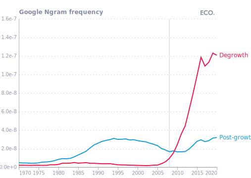
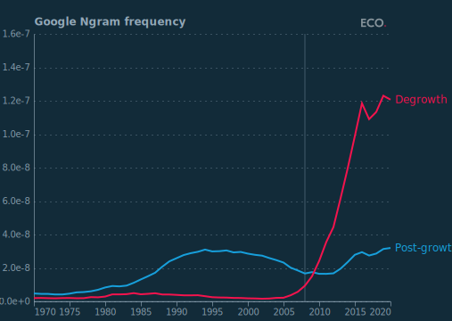
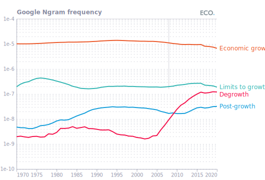
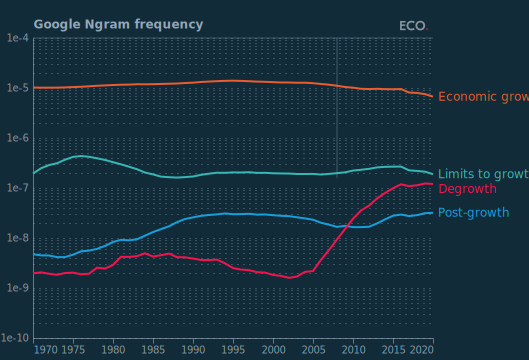
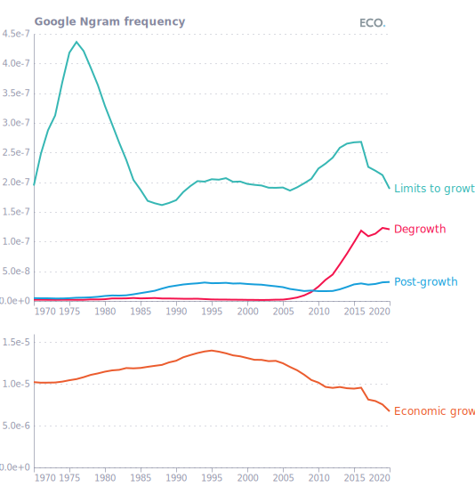

## Figure 1  

Data: [`csv`](data/fig1_ngram.csv)  
GitHub: [fig1_ngram](https://github.com/EconomicsObservatory/ECOvisualisations/tree/main/articles/degrowth-is-there-any-consensus-on-whether-it-might-be-a-good-idea)  

### Light theme  

Versions with data locally embedded into the `Vega-lite` specification file: [`png`](visualisation/fig1_ngram_local.png) [`svg`](visualisation/fig1_ngram_local.svg) [`json`](visualisation/fig1_ngram_local.json)   
 (**Default**) Versions with data loaded from `GitHub`: [`png`](visualisation/fig1_ngram.png) [`svg`](visualisation/fig1_ngram.svg) [`json`](visualisation/fig1_ngram.json)  
Versions (no ECO branding) with data locally embedded into the `Vega-lite` specification file: [`png`](visualisation/fig1_ngram_local_no_branding.png) [`svg`](visualisation/fig1_ngram_local_no_branding.svg) [`json`](visualisation/fig1_ngram_local_no_branding.json)   
Versions (no ECO branding) with data loaded from `GitHub`: [`png`](visualisation/fig1_ngram_no_branding.png) [`svg`](visualisation/fig1_ngram_no_branding.svg) [`json`](visualisation/fig1_ngram_no_branding.json)   

### Dark theme  

Versions with data locally embedded into the `Vega-lite` specification file: [`png`](visualisation/fig1_ngram_local_dark.png) [`svg`](visualisation/fig1_ngram_local_dark.svg) [`json`](visualisation/fig1_ngram_local_dark.json)   
 Versions with data loaded from `GitHub`: [`png`](visualisation/fig1_ngram_dark.png) [`svg`](visualisation/fig1_ngram_dark.svg) [`json`](visualisation/fig1_ngram_dark.json)  
Versions (no ECO branding) with data locally embedded into the `Vega-lite` specification file: [`png`](visualisation/fig1_ngram_local_no_branding_dark.png) [`svg`](visualisation/fig1_ngram_local_no_branding_dark.svg) [`json`](visualisation/fig1_ngram_local_no_branding_dark.json)   
Versions (no ECO branding) with data loaded from `GitHub`: [`png`](visualisation/fig1_ngram_no_branding_dark.png) [`svg`](visualisation/fig1_ngram_no_branding_dark.svg) [`json`](visualisation/fig1_ngram_no_branding_dark.json)   

  

## Figure 2  

Data: [`csv`](data/fig2_ltg.csv)  
GitHub: [fig2_ltg](https://github.com/EconomicsObservatory/ECOvisualisations/tree/main/articles/degrowth-is-there-any-consensus-on-whether-it-might-be-a-good-idea)  

### Light theme  

Versions with data locally embedded into the `Vega-lite` specification file: [`png`](visualisation/fig2_ltg_local.png) [`svg`](visualisation/fig2_ltg_local.svg) [`json`](visualisation/fig2_ltg_local.json)   
 (**Default**) Versions with data loaded from `GitHub`: [`png`](visualisation/fig2_ltg.png) [`svg`](visualisation/fig2_ltg.svg) [`json`](visualisation/fig2_ltg.json)  
Versions (no ECO branding) with data locally embedded into the `Vega-lite` specification file: [`png`](visualisation/fig2_ltg_local_no_branding.png) [`svg`](visualisation/fig2_ltg_local_no_branding.svg) [`json`](visualisation/fig2_ltg_local_no_branding.json)   
Versions (no ECO branding) with data loaded from `GitHub`: [`png`](visualisation/fig2_ltg_no_branding.png) [`svg`](visualisation/fig2_ltg_no_branding.svg) [`json`](visualisation/fig2_ltg_no_branding.json)   

### Dark theme  

Versions with data locally embedded into the `Vega-lite` specification file: [`png`](visualisation/fig2_ltg_local_dark.png) [`svg`](visualisation/fig2_ltg_local_dark.svg) [`json`](visualisation/fig2_ltg_local_dark.json)   
 Versions with data loaded from `GitHub`: [`png`](visualisation/fig2_ltg_dark.png) [`svg`](visualisation/fig2_ltg_dark.svg) [`json`](visualisation/fig2_ltg_dark.json)  
Versions (no ECO branding) with data locally embedded into the `Vega-lite` specification file: [`png`](visualisation/fig2_ltg_local_no_branding_dark.png) [`svg`](visualisation/fig2_ltg_local_no_branding_dark.svg) [`json`](visualisation/fig2_ltg_local_no_branding_dark.json)   
Versions (no ECO branding) with data loaded from `GitHub`: [`png`](visualisation/fig2_ltg_no_branding_dark.png) [`svg`](visualisation/fig2_ltg_no_branding_dark.svg) [`json`](visualisation/fig2_ltg_no_branding_dark.json)   

  

## Figure 2  

Data: [`csv`](data/fig2_alternative.csv)  
GitHub: [fig2_alternative](https://github.com/EconomicsObservatory/ECOvisualisations/tree/main/articles/degrowth-is-there-any-consensus-on-whether-it-might-be-a-good-idea)  

### Light theme  

Versions with data locally embedded into the `Vega-lite` specification file: [`png`](visualisation/fig2_alternative_local.png) [`svg`](visualisation/fig2_alternative_local.svg) [`json`](visualisation/fig2_alternative_local.json)   
 (**Default**) Versions with data loaded from `GitHub`: [`png`](visualisation/fig2_alternative.png) [`svg`](visualisation/fig2_alternative.svg) [`json`](visualisation/fig2_alternative.json)  
Versions (no ECO branding) with data locally embedded into the `Vega-lite` specification file: [`png`](visualisation/fig2_alternative_local_no_branding.png) [`svg`](visualisation/fig2_alternative_local_no_branding.svg) [`json`](visualisation/fig2_alternative_local_no_branding.json)   
Versions (no ECO branding) with data loaded from `GitHub`: [`png`](visualisation/fig2_alternative_no_branding.png) [`svg`](visualisation/fig2_alternative_no_branding.svg) [`json`](visualisation/fig2_alternative_no_branding.json)   

### Dark theme  

Versions with data locally embedded into the `Vega-lite` specification file: [`png`](visualisation/fig2_alternative_local_dark.png) [`svg`](visualisation/fig2_alternative_local_dark.svg) [`json`](visualisation/fig2_alternative_local_dark.json)   
 Versions with data loaded from `GitHub`: [`png`](visualisation/fig2_alternative_dark.png) [`svg`](visualisation/fig2_alternative_dark.svg) [`json`](visualisation/fig2_alternative_dark.json)  
Versions (no ECO branding) with data locally embedded into the `Vega-lite` specification file: [`png`](visualisation/fig2_alternative_local_no_branding_dark.png) [`svg`](visualisation/fig2_alternative_local_no_branding_dark.svg) [`json`](visualisation/fig2_alternative_local_no_branding_dark.json)   
Versions (no ECO branding) with data loaded from `GitHub`: [`png`](visualisation/fig2_alternative_no_branding_dark.png) [`svg`](visualisation/fig2_alternative_no_branding_dark.svg) [`json`](visualisation/fig2_alternative_no_branding_dark.json)   

  

