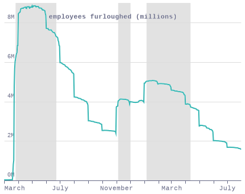
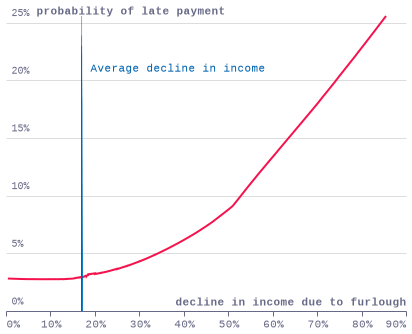

### fig1_furloughed_local

### fig2_default_local

### fig2_default_local

### fig2_default_local

### fig2_default_local

### fig2_default_local

### fig2_default_local

### fig2_default_local

### fig2_default_local

### fig2_default_local

### fig2_default_local

### fig2_default_local

### fig2_default_local

### fig2_default_local

### fig2_default_local

### fig2_default_local

### fig2_default_local

### fig2_default_local

### fig2_default_local

### fig2_default_local

### fig2_default_local

### fig2_default_local

### fig2_default_local

### fig2_default_local

### fig2_default_local

### fig2_default_local

### fig2_default_local

### fig2_default_local

### fig2_default_local

### fig2_default_local

### fig2_default_local

