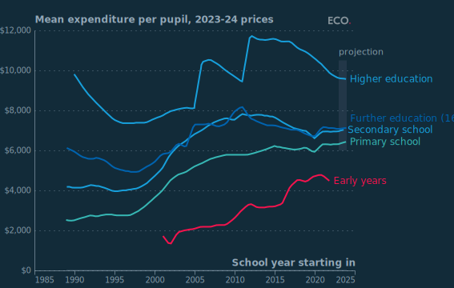

## Figure 1  

Data: [`csv`](data/fig1_edu.csv)  
GitHub: [fig1_edu](https://github.com/EconomicsObservatory/ECOvisualisations/tree/main/articles/how-can-education-and-skills-policy-in-england-boost-productivity)  

### Light theme  

Versions with data locally embedded into the `Vega-lite` specification file: [`png`](visualisation/fig1_edu_local.png) [`svg`](visualisation/fig1_edu_local.svg) [`json`](visualisation/fig1_edu_local.json)   
 (**Default**) Versions with data loaded from `GitHub`: [`png`](visualisation/fig1_edu.png) [`svg`](visualisation/fig1_edu.svg) [`json`](visualisation/fig1_edu.json)  
Versions (no ECO branding) with data locally embedded into the `Vega-lite` specification file: [`png`](visualisation/fig1_edu_local_no_branding.png) [`svg`](visualisation/fig1_edu_local_no_branding.svg) [`json`](visualisation/fig1_edu_local_no_branding.json)   
Versions (no ECO branding) with data loaded from `GitHub`: [`png`](visualisation/fig1_edu_no_branding.png) [`svg`](visualisation/fig1_edu_no_branding.svg) [`json`](visualisation/fig1_edu_no_branding.json)   

### Dark theme  

Versions with data locally embedded into the `Vega-lite` specification file: [`png`](visualisation/fig1_edu_local_dark.png) [`svg`](visualisation/fig1_edu_local_dark.svg) [`json`](visualisation/fig1_edu_local_dark.json)   
 Versions with data loaded from `GitHub`: [`png`](visualisation/fig1_edu_dark.png) [`svg`](visualisation/fig1_edu_dark.svg) [`json`](visualisation/fig1_edu_dark.json)  
Versions (no ECO branding) with data locally embedded into the `Vega-lite` specification file: [`png`](visualisation/fig1_edu_local_no_branding_dark.png) [`svg`](visualisation/fig1_edu_local_no_branding_dark.svg) [`json`](visualisation/fig1_edu_local_no_branding_dark.json)   
Versions (no ECO branding) with data loaded from `GitHub`: [`png`](visualisation/fig1_edu_no_branding_dark.png) [`svg`](visualisation/fig1_edu_no_branding_dark.svg) [`json`](visualisation/fig1_edu_no_branding_dark.json)   

  

