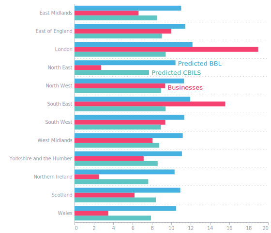
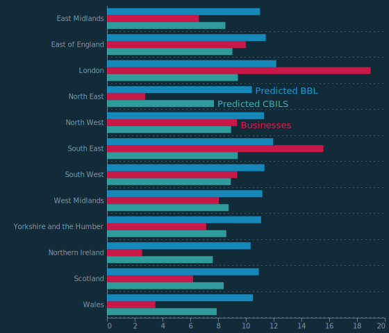
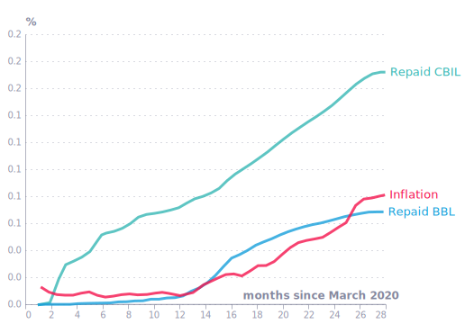
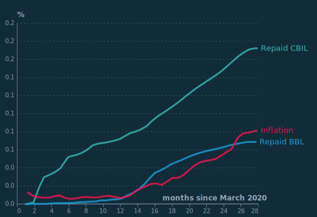
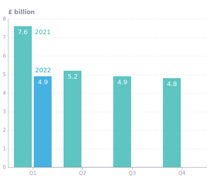
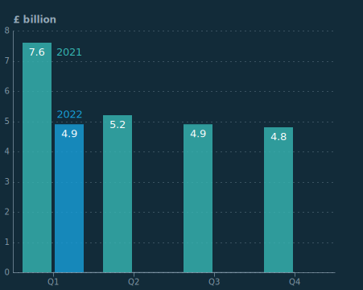
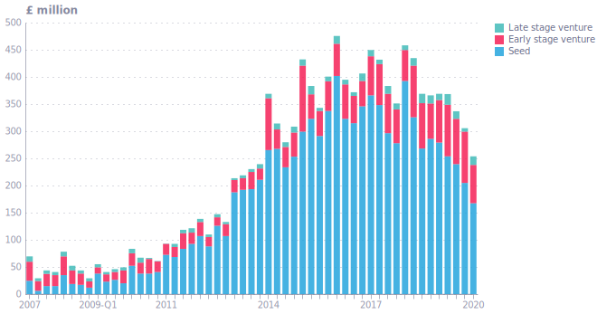
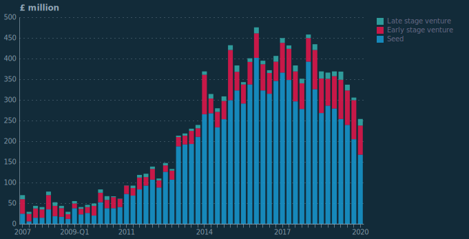

## Figure 1  

Data: [`csv`](data/fig1_loan.csv)  
GitHub: [fig1_loan](https://github.com/EconomicsObservatory/ECOvisualisations/tree/main/articles/how-did-uk-small-and-medium-sized-enterprises-manage-during-the-pandemic)  

### Light theme  

Versions with data locally embedded into the `Vega-lite` specification file: [`png`](visualisation/fig1_loan_local.png) [`svg`](visualisation/fig1_loan_local.svg) [`json`](visualisation/fig1_loan_local.json)   
 (**Default**) Versions with data loaded from `GitHub`: [`png`](visualisation/fig1_loan.png) [`svg`](visualisation/fig1_loan.svg) [`json`](visualisation/fig1_loan.json)  
Versions (no ECO branding) with data locally embedded into the `Vega-lite` specification file: [`png`](visualisation/fig1_loan_local_no_branding.png) [`svg`](visualisation/fig1_loan_local_no_branding.svg) [`json`](visualisation/fig1_loan_local_no_branding.json)   
Versions (no ECO branding) with data loaded from `GitHub`: [`png`](visualisation/fig1_loan_no_branding.png) [`svg`](visualisation/fig1_loan_no_branding.svg) [`json`](visualisation/fig1_loan_no_branding.json)   

### Dark theme  

Versions with data locally embedded into the `Vega-lite` specification file: [`png`](visualisation/fig1_loan_local_dark.png) [`svg`](visualisation/fig1_loan_local_dark.svg) [`json`](visualisation/fig1_loan_local_dark.json)   
 Versions with data loaded from `GitHub`: [`png`](visualisation/fig1_loan_dark.png) [`svg`](visualisation/fig1_loan_dark.svg) [`json`](visualisation/fig1_loan_dark.json)  
Versions (no ECO branding) with data locally embedded into the `Vega-lite` specification file: [`png`](visualisation/fig1_loan_local_no_branding_dark.png) [`svg`](visualisation/fig1_loan_local_no_branding_dark.svg) [`json`](visualisation/fig1_loan_local_no_branding_dark.json)   
Versions (no ECO branding) with data loaded from `GitHub`: [`png`](visualisation/fig1_loan_no_branding_dark.png) [`svg`](visualisation/fig1_loan_no_branding_dark.svg) [`json`](visualisation/fig1_loan_no_branding_dark.json)   

  

## Figure 2  

Data: [`csv`](data/fig2_infl.csv)  
GitHub: [fig2_infl](https://github.com/EconomicsObservatory/ECOvisualisations/tree/main/articles/how-did-uk-small-and-medium-sized-enterprises-manage-during-the-pandemic)  

### Light theme  

Versions with data locally embedded into the `Vega-lite` specification file: [`png`](visualisation/fig2_infl_local.png) [`svg`](visualisation/fig2_infl_local.svg) [`json`](visualisation/fig2_infl_local.json)   
 (**Default**) Versions with data loaded from `GitHub`: [`png`](visualisation/fig2_infl.png) [`svg`](visualisation/fig2_infl.svg) [`json`](visualisation/fig2_infl.json)  
Versions (no ECO branding) with data locally embedded into the `Vega-lite` specification file: [`png`](visualisation/fig2_infl_local_no_branding.png) [`svg`](visualisation/fig2_infl_local_no_branding.svg) [`json`](visualisation/fig2_infl_local_no_branding.json)   
Versions (no ECO branding) with data loaded from `GitHub`: [`png`](visualisation/fig2_infl_no_branding.png) [`svg`](visualisation/fig2_infl_no_branding.svg) [`json`](visualisation/fig2_infl_no_branding.json)   

### Dark theme  

Versions with data locally embedded into the `Vega-lite` specification file: [`png`](visualisation/fig2_infl_local_dark.png) [`svg`](visualisation/fig2_infl_local_dark.svg) [`json`](visualisation/fig2_infl_local_dark.json)   
 Versions with data loaded from `GitHub`: [`png`](visualisation/fig2_infl_dark.png) [`svg`](visualisation/fig2_infl_dark.svg) [`json`](visualisation/fig2_infl_dark.json)  
Versions (no ECO branding) with data locally embedded into the `Vega-lite` specification file: [`png`](visualisation/fig2_infl_local_no_branding_dark.png) [`svg`](visualisation/fig2_infl_local_no_branding_dark.svg) [`json`](visualisation/fig2_infl_local_no_branding_dark.json)   
Versions (no ECO branding) with data loaded from `GitHub`: [`png`](visualisation/fig2_infl_no_branding_dark.png) [`svg`](visualisation/fig2_infl_no_branding_dark.svg) [`json`](visualisation/fig2_infl_no_branding_dark.json)   

  

## Figure 3  

Data: [`csv`](data/fig3_lending.csv)  
GitHub: [fig3_lending](https://github.com/EconomicsObservatory/ECOvisualisations/tree/main/articles/how-did-uk-small-and-medium-sized-enterprises-manage-during-the-pandemic)  

### Light theme  

Versions with data locally embedded into the `Vega-lite` specification file: [`png`](visualisation/fig3_lending_local.png) [`svg`](visualisation/fig3_lending_local.svg) [`json`](visualisation/fig3_lending_local.json)   
 (**Default**) Versions with data loaded from `GitHub`: [`png`](visualisation/fig3_lending.png) [`svg`](visualisation/fig3_lending.svg) [`json`](visualisation/fig3_lending.json)  
Versions (no ECO branding) with data locally embedded into the `Vega-lite` specification file: [`png`](visualisation/fig3_lending_local_no_branding.png) [`svg`](visualisation/fig3_lending_local_no_branding.svg) [`json`](visualisation/fig3_lending_local_no_branding.json)   
Versions (no ECO branding) with data loaded from `GitHub`: [`png`](visualisation/fig3_lending_no_branding.png) [`svg`](visualisation/fig3_lending_no_branding.svg) [`json`](visualisation/fig3_lending_no_branding.json)   

### Dark theme  

Versions with data locally embedded into the `Vega-lite` specification file: [`png`](visualisation/fig3_lending_local_dark.png) [`svg`](visualisation/fig3_lending_local_dark.svg) [`json`](visualisation/fig3_lending_local_dark.json)   
 Versions with data loaded from `GitHub`: [`png`](visualisation/fig3_lending_dark.png) [`svg`](visualisation/fig3_lending_dark.svg) [`json`](visualisation/fig3_lending_dark.json)  
Versions (no ECO branding) with data locally embedded into the `Vega-lite` specification file: [`png`](visualisation/fig3_lending_local_no_branding_dark.png) [`svg`](visualisation/fig3_lending_local_no_branding_dark.svg) [`json`](visualisation/fig3_lending_local_no_branding_dark.json)   
Versions (no ECO branding) with data loaded from `GitHub`: [`png`](visualisation/fig3_lending_no_branding_dark.png) [`svg`](visualisation/fig3_lending_no_branding_dark.svg) [`json`](visualisation/fig3_lending_no_branding_dark.json)   

  

## Figure 4  

Data: [`csv`](data/fig4_venture.csv)  
GitHub: [fig4_venture](https://github.com/EconomicsObservatory/ECOvisualisations/tree/main/articles/how-did-uk-small-and-medium-sized-enterprises-manage-during-the-pandemic)  

### Light theme  

Versions with data locally embedded into the `Vega-lite` specification file: [`png`](visualisation/fig4_venture_local.png) [`svg`](visualisation/fig4_venture_local.svg) [`json`](visualisation/fig4_venture_local.json)   
 (**Default**) Versions with data loaded from `GitHub`: [`png`](visualisation/fig4_venture.png) [`svg`](visualisation/fig4_venture.svg) [`json`](visualisation/fig4_venture.json)  
Versions (no ECO branding) with data locally embedded into the `Vega-lite` specification file: [`png`](visualisation/fig4_venture_local_no_branding.png) [`svg`](visualisation/fig4_venture_local_no_branding.svg) [`json`](visualisation/fig4_venture_local_no_branding.json)   
Versions (no ECO branding) with data loaded from `GitHub`: [`png`](visualisation/fig4_venture_no_branding.png) [`svg`](visualisation/fig4_venture_no_branding.svg) [`json`](visualisation/fig4_venture_no_branding.json)   

### Dark theme  

Versions with data locally embedded into the `Vega-lite` specification file: [`png`](visualisation/fig4_venture_local_dark.png) [`svg`](visualisation/fig4_venture_local_dark.svg) [`json`](visualisation/fig4_venture_local_dark.json)   
 Versions with data loaded from `GitHub`: [`png`](visualisation/fig4_venture_dark.png) [`svg`](visualisation/fig4_venture_dark.svg) [`json`](visualisation/fig4_venture_dark.json)  
Versions (no ECO branding) with data locally embedded into the `Vega-lite` specification file: [`png`](visualisation/fig4_venture_local_no_branding_dark.png) [`svg`](visualisation/fig4_venture_local_no_branding_dark.svg) [`json`](visualisation/fig4_venture_local_no_branding_dark.json)   
Versions (no ECO branding) with data loaded from `GitHub`: [`png`](visualisation/fig4_venture_no_branding_dark.png) [`svg`](visualisation/fig4_venture_no_branding_dark.svg) [`json`](visualisation/fig4_venture_no_branding_dark.json)   

  

