## Figure 1  

Data: [`csv`](data/fig1_temp_local.csv)  
GitHub: [fig1_temp_local](https://github.com/EconomicsObservatory/ECOvisualisations/tree/main/articles/how-do-greening-prosperity-stripes-help-measure-progress-towards-net-zero)  

### Light theme  

Versions with data locally embedded into the `Vega-lite` specification file: [`png`](visualisation/fig1_temp_local_local.png) [`svg`](visualisation/fig1_temp_local_local.svg) [`json`](visualisation/fig1_temp_local_local.json)   
 (**Default**) Versions with data loaded from `GitHub`: [`png`](visualisation/fig1_temp_local.png) [`svg`](visualisation/fig1_temp_local.svg) [`json`](visualisation/fig1_temp_local.json)  
Versions (no ECO branding) with data locally embedded into the `Vega-lite` specification file: [`png`](visualisation/fig1_temp_local_local_no_branding.png) [`svg`](visualisation/fig1_temp_local_local_no_branding.svg) [`json`](visualisation/fig1_temp_local_local_no_branding.json)   
Versions (no ECO branding) with data loaded from `GitHub`: [`png`](visualisation/fig1_temp_local_no_branding.png) [`svg`](visualisation/fig1_temp_local_no_branding.svg) [`json`](visualisation/fig1_temp_local_no_branding.json)   

### Dark theme  

Versions with data locally embedded into the `Vega-lite` specification file: [`png`](visualisation/fig1_temp_local_local_dark.png) [`svg`](visualisation/fig1_temp_local_local_dark.svg) [`json`](visualisation/fig1_temp_local_local_dark.json)   
 Versions with data loaded from `GitHub`: [`png`](visualisation/fig1_temp_local_dark.png) [`svg`](visualisation/fig1_temp_local_dark.svg) [`json`](visualisation/fig1_temp_local_dark.json)  
Versions (no ECO branding) with data locally embedded into the `Vega-lite` specification file: [`png`](visualisation/fig1_temp_local_local_no_branding_dark.png) [`svg`](visualisation/fig1_temp_local_local_no_branding_dark.svg) [`json`](visualisation/fig1_temp_local_local_no_branding_dark.json)   
Versions (no ECO branding) with data loaded from `GitHub`: [`png`](visualisation/fig1_temp_local_no_branding_dark.png) [`svg`](visualisation/fig1_temp_local_no_branding_dark.svg) [`json`](visualisation/fig1_temp_local_no_branding_dark.json)   

  

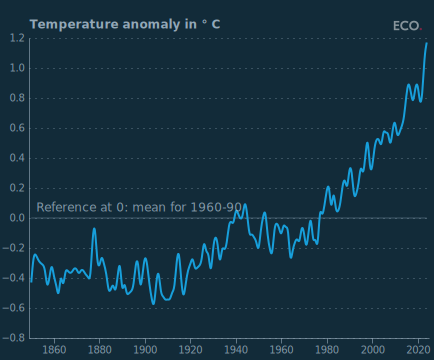

## Figure 2  

Data: [`csv`](data/fig2_stripes_local.csv)  
GitHub: [fig2_stripes_local](https://github.com/EconomicsObservatory/ECOvisualisations/tree/main/articles/how-do-greening-prosperity-stripes-help-measure-progress-towards-net-zero)  

### Light theme  

Versions with data locally embedded into the `Vega-lite` specification file: [`png`](visualisation/fig2_stripes_local_local.png) [`svg`](visualisation/fig2_stripes_local_local.svg) [`json`](visualisation/fig2_stripes_local_local.json)   
 (**Default**) Versions with data loaded from `GitHub`: [`png`](visualisation/fig2_stripes_local.png) [`svg`](visualisation/fig2_stripes_local.svg) [`json`](visualisation/fig2_stripes_local.json)  
Versions (no ECO branding) with data locally embedded into the `Vega-lite` specification file: [`png`](visualisation/fig2_stripes_local_local_no_branding.png) [`svg`](visualisation/fig2_stripes_local_local_no_branding.svg) [`json`](visualisation/fig2_stripes_local_local_no_branding.json)   
Versions (no ECO branding) with data loaded from `GitHub`: [`png`](visualisation/fig2_stripes_local_no_branding.png) [`svg`](visualisation/fig2_stripes_local_no_branding.svg) [`json`](visualisation/fig2_stripes_local_no_branding.json)   

### Dark theme  

Versions with data locally embedded into the `Vega-lite` specification file: [`png`](visualisation/fig2_stripes_local_local_dark.png) [`svg`](visualisation/fig2_stripes_local_local_dark.svg) [`json`](visualisation/fig2_stripes_local_local_dark.json)   
 Versions with data loaded from `GitHub`: [`png`](visualisation/fig2_stripes_local_dark.png) [`svg`](visualisation/fig2_stripes_local_dark.svg) [`json`](visualisation/fig2_stripes_local_dark.json)  
Versions (no ECO branding) with data locally embedded into the `Vega-lite` specification file: [`png`](visualisation/fig2_stripes_local_local_no_branding_dark.png) [`svg`](visualisation/fig2_stripes_local_local_no_branding_dark.svg) [`json`](visualisation/fig2_stripes_local_local_no_branding_dark.json)   
Versions (no ECO branding) with data loaded from `GitHub`: [`png`](visualisation/fig2_stripes_local_no_branding_dark.png) [`svg`](visualisation/fig2_stripes_local_no_branding_dark.svg) [`json`](visualisation/fig2_stripes_local_no_branding_dark.json)   

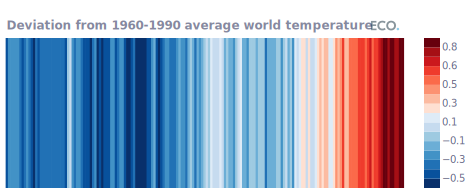

  

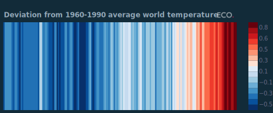

## Figure 3  

Data: [`csv`](data/fig3_gdp_local.csv)  
GitHub: [fig3_gdp_local](https://github.com/EconomicsObservatory/ECOvisualisations/tree/main/articles/how-do-greening-prosperity-stripes-help-measure-progress-towards-net-zero)  

### Light theme  

Versions with data locally embedded into the `Vega-lite` specification file: [`png`](visualisation/fig3_gdp_local_local.png) [`svg`](visualisation/fig3_gdp_local_local.svg) [`json`](visualisation/fig3_gdp_local_local.json)   
 (**Default**) Versions with data loaded from `GitHub`: [`png`](visualisation/fig3_gdp_local.png) [`svg`](visualisation/fig3_gdp_local.svg) [`json`](visualisation/fig3_gdp_local.json)  
Versions (no ECO branding) with data locally embedded into the `Vega-lite` specification file: [`png`](visualisation/fig3_gdp_local_local_no_branding.png) [`svg`](visualisation/fig3_gdp_local_local_no_branding.svg) [`json`](visualisation/fig3_gdp_local_local_no_branding.json)   
Versions (no ECO branding) with data loaded from `GitHub`: [`png`](visualisation/fig3_gdp_local_no_branding.png) [`svg`](visualisation/fig3_gdp_local_no_branding.svg) [`json`](visualisation/fig3_gdp_local_no_branding.json)   

### Dark theme  

Versions with data locally embedded into the `Vega-lite` specification file: [`png`](visualisation/fig3_gdp_local_local_dark.png) [`svg`](visualisation/fig3_gdp_local_local_dark.svg) [`json`](visualisation/fig3_gdp_local_local_dark.json)   
 Versions with data loaded from `GitHub`: [`png`](visualisation/fig3_gdp_local_dark.png) [`svg`](visualisation/fig3_gdp_local_dark.svg) [`json`](visualisation/fig3_gdp_local_dark.json)  
Versions (no ECO branding) with data locally embedded into the `Vega-lite` specification file: [`png`](visualisation/fig3_gdp_local_local_no_branding_dark.png) [`svg`](visualisation/fig3_gdp_local_local_no_branding_dark.svg) [`json`](visualisation/fig3_gdp_local_local_no_branding_dark.json)   
Versions (no ECO branding) with data loaded from `GitHub`: [`png`](visualisation/fig3_gdp_local_no_branding_dark.png) [`svg`](visualisation/fig3_gdp_local_no_branding_dark.svg) [`json`](visualisation/fig3_gdp_local_no_branding_dark.json)   

  

## Figure 4  

Data: [`csv`](data/fig4_co2_local.csv)  
GitHub: [fig4_co2_local](https://github.com/EconomicsObservatory/ECOvisualisations/tree/main/articles/how-do-greening-prosperity-stripes-help-measure-progress-towards-net-zero)  

### Light theme  

Versions with data locally embedded into the `Vega-lite` specification file: [`png`](visualisation/fig4_co2_local_local.png) [`svg`](visualisation/fig4_co2_local_local.svg) [`json`](visualisation/fig4_co2_local_local.json)   
 (**Default**) Versions with data loaded from `GitHub`: [`png`](visualisation/fig4_co2_local.png) [`svg`](visualisation/fig4_co2_local.svg) [`json`](visualisation/fig4_co2_local.json)  
Versions (no ECO branding) with data locally embedded into the `Vega-lite` specification file: [`png`](visualisation/fig4_co2_local_local_no_branding.png) [`svg`](visualisation/fig4_co2_local_local_no_branding.svg) [`json`](visualisation/fig4_co2_local_local_no_branding.json)   
Versions (no ECO branding) with data loaded from `GitHub`: [`png`](visualisation/fig4_co2_local_no_branding.png) [`svg`](visualisation/fig4_co2_local_no_branding.svg) [`json`](visualisation/fig4_co2_local_no_branding.json)   

### Dark theme  

Versions with data locally embedded into the `Vega-lite` specification file: [`png`](visualisation/fig4_co2_local_local_dark.png) [`svg`](visualisation/fig4_co2_local_local_dark.svg) [`json`](visualisation/fig4_co2_local_local_dark.json)   
 Versions with data loaded from `GitHub`: [`png`](visualisation/fig4_co2_local_dark.png) [`svg`](visualisation/fig4_co2_local_dark.svg) [`json`](visualisation/fig4_co2_local_dark.json)  
Versions (no ECO branding) with data locally embedded into the `Vega-lite` specification file: [`png`](visualisation/fig4_co2_local_local_no_branding_dark.png) [`svg`](visualisation/fig4_co2_local_local_no_branding_dark.svg) [`json`](visualisation/fig4_co2_local_local_no_branding_dark.json)   
Versions (no ECO branding) with data loaded from `GitHub`: [`png`](visualisation/fig4_co2_local_no_branding_dark.png) [`svg`](visualisation/fig4_co2_local_no_branding_dark.svg) [`json`](visualisation/fig4_co2_local_no_branding_dark.json)   

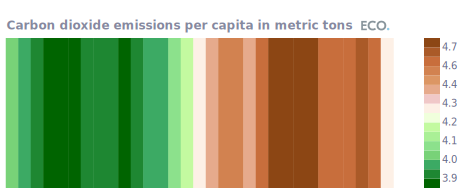

  

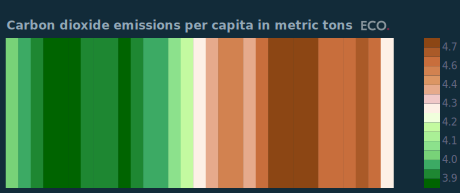

## Figure 5  

Data: [`csv`](data/fig5_gpr_local.csv)  
GitHub: [fig5_gpr_local](https://github.com/EconomicsObservatory/ECOvisualisations/tree/main/articles/how-do-greening-prosperity-stripes-help-measure-progress-towards-net-zero)  

### Light theme  

Versions with data locally embedded into the `Vega-lite` specification file: [`png`](visualisation/fig5_gpr_local_local.png) [`svg`](visualisation/fig5_gpr_local_local.svg) [`json`](visualisation/fig5_gpr_local_local.json)   
 (**Default**) Versions with data loaded from `GitHub`: [`png`](visualisation/fig5_gpr_local.png) [`svg`](visualisation/fig5_gpr_local.svg) [`json`](visualisation/fig5_gpr_local.json)  
Versions (no ECO branding) with data locally embedded into the `Vega-lite` specification file: [`png`](visualisation/fig5_gpr_local_local_no_branding.png) [`svg`](visualisation/fig5_gpr_local_local_no_branding.svg) [`json`](visualisation/fig5_gpr_local_local_no_branding.json)   
Versions (no ECO branding) with data loaded from `GitHub`: [`png`](visualisation/fig5_gpr_local_no_branding.png) [`svg`](visualisation/fig5_gpr_local_no_branding.svg) [`json`](visualisation/fig5_gpr_local_no_branding.json)   

### Dark theme  

Versions with data locally embedded into the `Vega-lite` specification file: [`png`](visualisation/fig5_gpr_local_local_dark.png) [`svg`](visualisation/fig5_gpr_local_local_dark.svg) [`json`](visualisation/fig5_gpr_local_local_dark.json)   
 Versions with data loaded from `GitHub`: [`png`](visualisation/fig5_gpr_local_dark.png) [`svg`](visualisation/fig5_gpr_local_dark.svg) [`json`](visualisation/fig5_gpr_local_dark.json)  
Versions (no ECO branding) with data locally embedded into the `Vega-lite` specification file: [`png`](visualisation/fig5_gpr_local_local_no_branding_dark.png) [`svg`](visualisation/fig5_gpr_local_local_no_branding_dark.svg) [`json`](visualisation/fig5_gpr_local_local_no_branding_dark.json)   
Versions (no ECO branding) with data loaded from `GitHub`: [`png`](visualisation/fig5_gpr_local_no_branding_dark.png) [`svg`](visualisation/fig5_gpr_local_no_branding_dark.svg) [`json`](visualisation/fig5_gpr_local_no_branding_dark.json)   

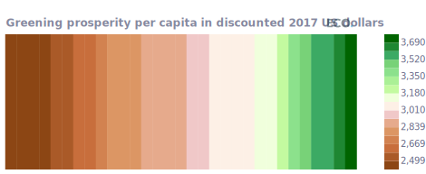

  

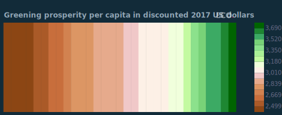

## Figure 6a  

Data: [`csv`](data/fig6a_gdp_world_local.csv)  
GitHub: [fig6a_gdp_world_local](https://github.com/EconomicsObservatory/ECOvisualisations/tree/main/articles/how-do-greening-prosperity-stripes-help-measure-progress-towards-net-zero)  

### Light theme  

Versions with data locally embedded into the `Vega-lite` specification file: [`png`](visualisation/fig6a_gdp_world_local_local.png) [`svg`](visualisation/fig6a_gdp_world_local_local.svg) [`json`](visualisation/fig6a_gdp_world_local_local.json)   
 (**Default**) Versions with data loaded from `GitHub`: [`png`](visualisation/fig6a_gdp_world_local.png) [`svg`](visualisation/fig6a_gdp_world_local.svg) [`json`](visualisation/fig6a_gdp_world_local.json)  
Versions (no ECO branding) with data locally embedded into the `Vega-lite` specification file: [`png`](visualisation/fig6a_gdp_world_local_local_no_branding.png) [`svg`](visualisation/fig6a_gdp_world_local_local_no_branding.svg) [`json`](visualisation/fig6a_gdp_world_local_local_no_branding.json)   
Versions (no ECO branding) with data loaded from `GitHub`: [`png`](visualisation/fig6a_gdp_world_local_no_branding.png) [`svg`](visualisation/fig6a_gdp_world_local_no_branding.svg) [`json`](visualisation/fig6a_gdp_world_local_no_branding.json)   

### Dark theme  

Versions with data locally embedded into the `Vega-lite` specification file: [`png`](visualisation/fig6a_gdp_world_local_local_dark.png) [`svg`](visualisation/fig6a_gdp_world_local_local_dark.svg) [`json`](visualisation/fig6a_gdp_world_local_local_dark.json)   
 Versions with data loaded from `GitHub`: [`png`](visualisation/fig6a_gdp_world_local_dark.png) [`svg`](visualisation/fig6a_gdp_world_local_dark.svg) [`json`](visualisation/fig6a_gdp_world_local_dark.json)  
Versions (no ECO branding) with data locally embedded into the `Vega-lite` specification file: [`png`](visualisation/fig6a_gdp_world_local_local_no_branding_dark.png) [`svg`](visualisation/fig6a_gdp_world_local_local_no_branding_dark.svg) [`json`](visualisation/fig6a_gdp_world_local_local_no_branding_dark.json)   
Versions (no ECO branding) with data loaded from `GitHub`: [`png`](visualisation/fig6a_gdp_world_local_no_branding_dark.png) [`svg`](visualisation/fig6a_gdp_world_local_no_branding_dark.svg) [`json`](visualisation/fig6a_gdp_world_local_no_branding_dark.json)   

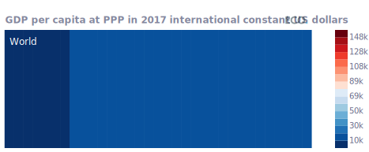

  

## Figure 6b  

Data: [`csv`](data/fig6b_gdp_ch_local.csv)  
GitHub: [fig6b_gdp_ch_local](https://github.com/EconomicsObservatory/ECOvisualisations/tree/main/articles/how-do-greening-prosperity-stripes-help-measure-progress-towards-net-zero)  

### Light theme  

Versions with data locally embedded into the `Vega-lite` specification file: [`png`](visualisation/fig6b_gdp_ch_local_local.png) [`svg`](visualisation/fig6b_gdp_ch_local_local.svg) [`json`](visualisation/fig6b_gdp_ch_local_local.json)   
 (**Default**) Versions with data loaded from `GitHub`: [`png`](visualisation/fig6b_gdp_ch_local.png) [`svg`](visualisation/fig6b_gdp_ch_local.svg) [`json`](visualisation/fig6b_gdp_ch_local.json)  
Versions (no ECO branding) with data locally embedded into the `Vega-lite` specification file: [`png`](visualisation/fig6b_gdp_ch_local_local_no_branding.png) [`svg`](visualisation/fig6b_gdp_ch_local_local_no_branding.svg) [`json`](visualisation/fig6b_gdp_ch_local_local_no_branding.json)   
Versions (no ECO branding) with data loaded from `GitHub`: [`png`](visualisation/fig6b_gdp_ch_local_no_branding.png) [`svg`](visualisation/fig6b_gdp_ch_local_no_branding.svg) [`json`](visualisation/fig6b_gdp_ch_local_no_branding.json)   

### Dark theme  

Versions with data locally embedded into the `Vega-lite` specification file: [`png`](visualisation/fig6b_gdp_ch_local_local_dark.png) [`svg`](visualisation/fig6b_gdp_ch_local_local_dark.svg) [`json`](visualisation/fig6b_gdp_ch_local_local_dark.json)   
 Versions with data loaded from `GitHub`: [`png`](visualisation/fig6b_gdp_ch_local_dark.png) [`svg`](visualisation/fig6b_gdp_ch_local_dark.svg) [`json`](visualisation/fig6b_gdp_ch_local_dark.json)  
Versions (no ECO branding) with data locally embedded into the `Vega-lite` specification file: [`png`](visualisation/fig6b_gdp_ch_local_local_no_branding_dark.png) [`svg`](visualisation/fig6b_gdp_ch_local_local_no_branding_dark.svg) [`json`](visualisation/fig6b_gdp_ch_local_local_no_branding_dark.json)   
Versions (no ECO branding) with data loaded from `GitHub`: [`png`](visualisation/fig6b_gdp_ch_local_no_branding_dark.png) [`svg`](visualisation/fig6b_gdp_ch_local_no_branding_dark.svg) [`json`](visualisation/fig6b_gdp_ch_local_no_branding_dark.json)   

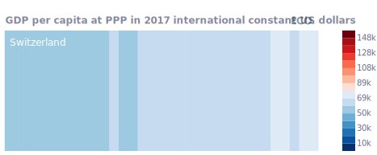

  

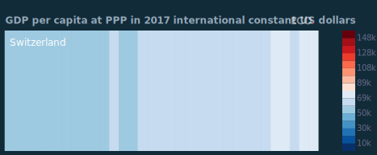

## Figure 6b  

Data: [`csv`](data/fig6b_gdp_mz_local.csv)  
GitHub: [fig6b_gdp_mz_local](https://github.com/EconomicsObservatory/ECOvisualisations/tree/main/articles/how-do-greening-prosperity-stripes-help-measure-progress-towards-net-zero)  

### Light theme  

Versions with data locally embedded into the `Vega-lite` specification file: [`png`](visualisation/fig6b_gdp_mz_local_local.png) [`svg`](visualisation/fig6b_gdp_mz_local_local.svg) [`json`](visualisation/fig6b_gdp_mz_local_local.json)   
 (**Default**) Versions with data loaded from `GitHub`: [`png`](visualisation/fig6b_gdp_mz_local.png) [`svg`](visualisation/fig6b_gdp_mz_local.svg) [`json`](visualisation/fig6b_gdp_mz_local.json)  
Versions (no ECO branding) with data locally embedded into the `Vega-lite` specification file: [`png`](visualisation/fig6b_gdp_mz_local_local_no_branding.png) [`svg`](visualisation/fig6b_gdp_mz_local_local_no_branding.svg) [`json`](visualisation/fig6b_gdp_mz_local_local_no_branding.json)   
Versions (no ECO branding) with data loaded from `GitHub`: [`png`](visualisation/fig6b_gdp_mz_local_no_branding.png) [`svg`](visualisation/fig6b_gdp_mz_local_no_branding.svg) [`json`](visualisation/fig6b_gdp_mz_local_no_branding.json)   

### Dark theme  

Versions with data locally embedded into the `Vega-lite` specification file: [`png`](visualisation/fig6b_gdp_mz_local_local_dark.png) [`svg`](visualisation/fig6b_gdp_mz_local_local_dark.svg) [`json`](visualisation/fig6b_gdp_mz_local_local_dark.json)   
 Versions with data loaded from `GitHub`: [`png`](visualisation/fig6b_gdp_mz_local_dark.png) [`svg`](visualisation/fig6b_gdp_mz_local_dark.svg) [`json`](visualisation/fig6b_gdp_mz_local_dark.json)  
Versions (no ECO branding) with data locally embedded into the `Vega-lite` specification file: [`png`](visualisation/fig6b_gdp_mz_local_local_no_branding_dark.png) [`svg`](visualisation/fig6b_gdp_mz_local_local_no_branding_dark.svg) [`json`](visualisation/fig6b_gdp_mz_local_local_no_branding_dark.json)   
Versions (no ECO branding) with data loaded from `GitHub`: [`png`](visualisation/fig6b_gdp_mz_local_no_branding_dark.png) [`svg`](visualisation/fig6b_gdp_mz_local_no_branding_dark.svg) [`json`](visualisation/fig6b_gdp_mz_local_no_branding_dark.json)   

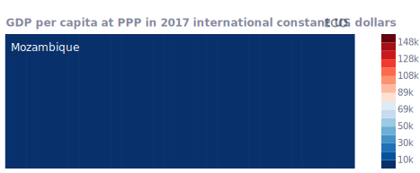

  

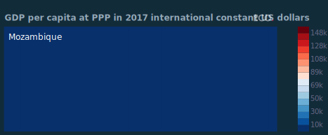

## Figure 7  

Data: [`csv`](data/fig7_co2_world_local.csv)  
GitHub: [fig7_co2_world_local](https://github.com/EconomicsObservatory/ECOvisualisations/tree/main/articles/how-do-greening-prosperity-stripes-help-measure-progress-towards-net-zero)  

### Light theme  

Versions with data locally embedded into the `Vega-lite` specification file: [`png`](visualisation/fig7_co2_world_local_local.png) [`svg`](visualisation/fig7_co2_world_local_local.svg) [`json`](visualisation/fig7_co2_world_local_local.json)   
 (**Default**) Versions with data loaded from `GitHub`: [`png`](visualisation/fig7_co2_world_local.png) [`svg`](visualisation/fig7_co2_world_local.svg) [`json`](visualisation/fig7_co2_world_local.json)  
Versions (no ECO branding) with data locally embedded into the `Vega-lite` specification file: [`png`](visualisation/fig7_co2_world_local_local_no_branding.png) [`svg`](visualisation/fig7_co2_world_local_local_no_branding.svg) [`json`](visualisation/fig7_co2_world_local_local_no_branding.json)   
Versions (no ECO branding) with data loaded from `GitHub`: [`png`](visualisation/fig7_co2_world_local_no_branding.png) [`svg`](visualisation/fig7_co2_world_local_no_branding.svg) [`json`](visualisation/fig7_co2_world_local_no_branding.json)   

### Dark theme  

Versions with data locally embedded into the `Vega-lite` specification file: [`png`](visualisation/fig7_co2_world_local_local_dark.png) [`svg`](visualisation/fig7_co2_world_local_local_dark.svg) [`json`](visualisation/fig7_co2_world_local_local_dark.json)   
 Versions with data loaded from `GitHub`: [`png`](visualisation/fig7_co2_world_local_dark.png) [`svg`](visualisation/fig7_co2_world_local_dark.svg) [`json`](visualisation/fig7_co2_world_local_dark.json)  
Versions (no ECO branding) with data locally embedded into the `Vega-lite` specification file: [`png`](visualisation/fig7_co2_world_local_local_no_branding_dark.png) [`svg`](visualisation/fig7_co2_world_local_local_no_branding_dark.svg) [`json`](visualisation/fig7_co2_world_local_local_no_branding_dark.json)   
Versions (no ECO branding) with data loaded from `GitHub`: [`png`](visualisation/fig7_co2_world_local_no_branding_dark.png) [`svg`](visualisation/fig7_co2_world_local_no_branding_dark.svg) [`json`](visualisation/fig7_co2_world_local_no_branding_dark.json)   

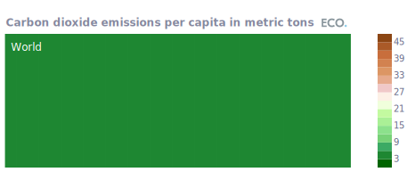

  

## Figure 7b  

Data: [`csv`](data/fig7b_co2_ch_local.csv)  
GitHub: [fig7b_co2_ch_local](https://github.com/EconomicsObservatory/ECOvisualisations/tree/main/articles/how-do-greening-prosperity-stripes-help-measure-progress-towards-net-zero)  

### Light theme  

Versions with data locally embedded into the `Vega-lite` specification file: [`png`](visualisation/fig7b_co2_ch_local_local.png) [`svg`](visualisation/fig7b_co2_ch_local_local.svg) [`json`](visualisation/fig7b_co2_ch_local_local.json)   
 (**Default**) Versions with data loaded from `GitHub`: [`png`](visualisation/fig7b_co2_ch_local.png) [`svg`](visualisation/fig7b_co2_ch_local.svg) [`json`](visualisation/fig7b_co2_ch_local.json)  
Versions (no ECO branding) with data locally embedded into the `Vega-lite` specification file: [`png`](visualisation/fig7b_co2_ch_local_local_no_branding.png) [`svg`](visualisation/fig7b_co2_ch_local_local_no_branding.svg) [`json`](visualisation/fig7b_co2_ch_local_local_no_branding.json)   
Versions (no ECO branding) with data loaded from `GitHub`: [`png`](visualisation/fig7b_co2_ch_local_no_branding.png) [`svg`](visualisation/fig7b_co2_ch_local_no_branding.svg) [`json`](visualisation/fig7b_co2_ch_local_no_branding.json)   

### Dark theme  

Versions with data locally embedded into the `Vega-lite` specification file: [`png`](visualisation/fig7b_co2_ch_local_local_dark.png) [`svg`](visualisation/fig7b_co2_ch_local_local_dark.svg) [`json`](visualisation/fig7b_co2_ch_local_local_dark.json)   
 Versions with data loaded from `GitHub`: [`png`](visualisation/fig7b_co2_ch_local_dark.png) [`svg`](visualisation/fig7b_co2_ch_local_dark.svg) [`json`](visualisation/fig7b_co2_ch_local_dark.json)  
Versions (no ECO branding) with data locally embedded into the `Vega-lite` specification file: [`png`](visualisation/fig7b_co2_ch_local_local_no_branding_dark.png) [`svg`](visualisation/fig7b_co2_ch_local_local_no_branding_dark.svg) [`json`](visualisation/fig7b_co2_ch_local_local_no_branding_dark.json)   
Versions (no ECO branding) with data loaded from `GitHub`: [`png`](visualisation/fig7b_co2_ch_local_no_branding_dark.png) [`svg`](visualisation/fig7b_co2_ch_local_no_branding_dark.svg) [`json`](visualisation/fig7b_co2_ch_local_no_branding_dark.json)   

  

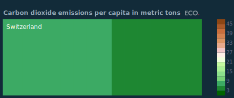

## Figure 7c  

Data: [`csv`](data/fig7c_co2_mz_local.csv)  
GitHub: [fig7c_co2_mz_local](https://github.com/EconomicsObservatory/ECOvisualisations/tree/main/articles/how-do-greening-prosperity-stripes-help-measure-progress-towards-net-zero)  

### Light theme  

Versions with data locally embedded into the `Vega-lite` specification file: [`png`](visualisation/fig7c_co2_mz_local_local.png) [`svg`](visualisation/fig7c_co2_mz_local_local.svg) [`json`](visualisation/fig7c_co2_mz_local_local.json)   
 (**Default**) Versions with data loaded from `GitHub`: [`png`](visualisation/fig7c_co2_mz_local.png) [`svg`](visualisation/fig7c_co2_mz_local.svg) [`json`](visualisation/fig7c_co2_mz_local.json)  
Versions (no ECO branding) with data locally embedded into the `Vega-lite` specification file: [`png`](visualisation/fig7c_co2_mz_local_local_no_branding.png) [`svg`](visualisation/fig7c_co2_mz_local_local_no_branding.svg) [`json`](visualisation/fig7c_co2_mz_local_local_no_branding.json)   
Versions (no ECO branding) with data loaded from `GitHub`: [`png`](visualisation/fig7c_co2_mz_local_no_branding.png) [`svg`](visualisation/fig7c_co2_mz_local_no_branding.svg) [`json`](visualisation/fig7c_co2_mz_local_no_branding.json)   

### Dark theme  

Versions with data locally embedded into the `Vega-lite` specification file: [`png`](visualisation/fig7c_co2_mz_local_local_dark.png) [`svg`](visualisation/fig7c_co2_mz_local_local_dark.svg) [`json`](visualisation/fig7c_co2_mz_local_local_dark.json)   
 Versions with data loaded from `GitHub`: [`png`](visualisation/fig7c_co2_mz_local_dark.png) [`svg`](visualisation/fig7c_co2_mz_local_dark.svg) [`json`](visualisation/fig7c_co2_mz_local_dark.json)  
Versions (no ECO branding) with data locally embedded into the `Vega-lite` specification file: [`png`](visualisation/fig7c_co2_mz_local_local_no_branding_dark.png) [`svg`](visualisation/fig7c_co2_mz_local_local_no_branding_dark.svg) [`json`](visualisation/fig7c_co2_mz_local_local_no_branding_dark.json)   
Versions (no ECO branding) with data loaded from `GitHub`: [`png`](visualisation/fig7c_co2_mz_local_no_branding_dark.png) [`svg`](visualisation/fig7c_co2_mz_local_no_branding_dark.svg) [`json`](visualisation/fig7c_co2_mz_local_no_branding_dark.json)   

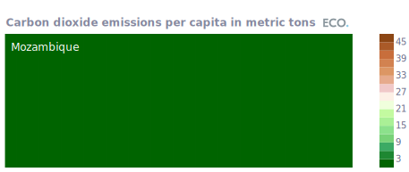

  

## Figure 8a  

Data: [`csv`](data/fig8a_gpr_world_local.csv)  
GitHub: [fig8a_gpr_world_local](https://github.com/EconomicsObservatory/ECOvisualisations/tree/main/articles/how-do-greening-prosperity-stripes-help-measure-progress-towards-net-zero)  

### Light theme  

Versions with data locally embedded into the `Vega-lite` specification file: [`png`](visualisation/fig8a_gpr_world_local_local.png) [`svg`](visualisation/fig8a_gpr_world_local_local.svg) [`json`](visualisation/fig8a_gpr_world_local_local.json)   
 (**Default**) Versions with data loaded from `GitHub`: [`png`](visualisation/fig8a_gpr_world_local.png) [`svg`](visualisation/fig8a_gpr_world_local.svg) [`json`](visualisation/fig8a_gpr_world_local.json)  
Versions (no ECO branding) with data locally embedded into the `Vega-lite` specification file: [`png`](visualisation/fig8a_gpr_world_local_local_no_branding.png) [`svg`](visualisation/fig8a_gpr_world_local_local_no_branding.svg) [`json`](visualisation/fig8a_gpr_world_local_local_no_branding.json)   
Versions (no ECO branding) with data loaded from `GitHub`: [`png`](visualisation/fig8a_gpr_world_local_no_branding.png) [`svg`](visualisation/fig8a_gpr_world_local_no_branding.svg) [`json`](visualisation/fig8a_gpr_world_local_no_branding.json)   

### Dark theme  

Versions with data locally embedded into the `Vega-lite` specification file: [`png`](visualisation/fig8a_gpr_world_local_local_dark.png) [`svg`](visualisation/fig8a_gpr_world_local_local_dark.svg) [`json`](visualisation/fig8a_gpr_world_local_local_dark.json)   
 Versions with data loaded from `GitHub`: [`png`](visualisation/fig8a_gpr_world_local_dark.png) [`svg`](visualisation/fig8a_gpr_world_local_dark.svg) [`json`](visualisation/fig8a_gpr_world_local_dark.json)  
Versions (no ECO branding) with data locally embedded into the `Vega-lite` specification file: [`png`](visualisation/fig8a_gpr_world_local_local_no_branding_dark.png) [`svg`](visualisation/fig8a_gpr_world_local_local_no_branding_dark.svg) [`json`](visualisation/fig8a_gpr_world_local_local_no_branding_dark.json)   
Versions (no ECO branding) with data loaded from `GitHub`: [`png`](visualisation/fig8a_gpr_world_local_no_branding_dark.png) [`svg`](visualisation/fig8a_gpr_world_local_no_branding_dark.svg) [`json`](visualisation/fig8a_gpr_world_local_no_branding_dark.json)   

  

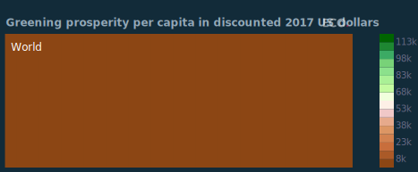

## Figure 8b  

Data: [`csv`](data/fig8b_gpr_ch_local.csv)  
GitHub: [fig8b_gpr_ch_local](https://github.com/EconomicsObservatory/ECOvisualisations/tree/main/articles/how-do-greening-prosperity-stripes-help-measure-progress-towards-net-zero)  

### Light theme  

Versions with data locally embedded into the `Vega-lite` specification file: [`png`](visualisation/fig8b_gpr_ch_local_local.png) [`svg`](visualisation/fig8b_gpr_ch_local_local.svg) [`json`](visualisation/fig8b_gpr_ch_local_local.json)   
 (**Default**) Versions with data loaded from `GitHub`: [`png`](visualisation/fig8b_gpr_ch_local.png) [`svg`](visualisation/fig8b_gpr_ch_local.svg) [`json`](visualisation/fig8b_gpr_ch_local.json)  
Versions (no ECO branding) with data locally embedded into the `Vega-lite` specification file: [`png`](visualisation/fig8b_gpr_ch_local_local_no_branding.png) [`svg`](visualisation/fig8b_gpr_ch_local_local_no_branding.svg) [`json`](visualisation/fig8b_gpr_ch_local_local_no_branding.json)   
Versions (no ECO branding) with data loaded from `GitHub`: [`png`](visualisation/fig8b_gpr_ch_local_no_branding.png) [`svg`](visualisation/fig8b_gpr_ch_local_no_branding.svg) [`json`](visualisation/fig8b_gpr_ch_local_no_branding.json)   

### Dark theme  

Versions with data locally embedded into the `Vega-lite` specification file: [`png`](visualisation/fig8b_gpr_ch_local_local_dark.png) [`svg`](visualisation/fig8b_gpr_ch_local_local_dark.svg) [`json`](visualisation/fig8b_gpr_ch_local_local_dark.json)   
 Versions with data loaded from `GitHub`: [`png`](visualisation/fig8b_gpr_ch_local_dark.png) [`svg`](visualisation/fig8b_gpr_ch_local_dark.svg) [`json`](visualisation/fig8b_gpr_ch_local_dark.json)  
Versions (no ECO branding) with data locally embedded into the `Vega-lite` specification file: [`png`](visualisation/fig8b_gpr_ch_local_local_no_branding_dark.png) [`svg`](visualisation/fig8b_gpr_ch_local_local_no_branding_dark.svg) [`json`](visualisation/fig8b_gpr_ch_local_local_no_branding_dark.json)   
Versions (no ECO branding) with data loaded from `GitHub`: [`png`](visualisation/fig8b_gpr_ch_local_no_branding_dark.png) [`svg`](visualisation/fig8b_gpr_ch_local_no_branding_dark.svg) [`json`](visualisation/fig8b_gpr_ch_local_no_branding_dark.json)   

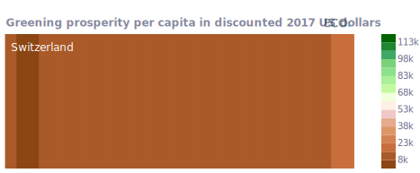

  

## Figure 8c  

Data: [`csv`](data/fig8c_gpr_mz_local.csv)  
GitHub: [fig8c_gpr_mz_local](https://github.com/EconomicsObservatory/ECOvisualisations/tree/main/articles/how-do-greening-prosperity-stripes-help-measure-progress-towards-net-zero)  

### Light theme  

Versions with data locally embedded into the `Vega-lite` specification file: [`png`](visualisation/fig8c_gpr_mz_local_local.png) [`svg`](visualisation/fig8c_gpr_mz_local_local.svg) [`json`](visualisation/fig8c_gpr_mz_local_local.json)   
 (**Default**) Versions with data loaded from `GitHub`: [`png`](visualisation/fig8c_gpr_mz_local.png) [`svg`](visualisation/fig8c_gpr_mz_local.svg) [`json`](visualisation/fig8c_gpr_mz_local.json)  
Versions (no ECO branding) with data locally embedded into the `Vega-lite` specification file: [`png`](visualisation/fig8c_gpr_mz_local_local_no_branding.png) [`svg`](visualisation/fig8c_gpr_mz_local_local_no_branding.svg) [`json`](visualisation/fig8c_gpr_mz_local_local_no_branding.json)   
Versions (no ECO branding) with data loaded from `GitHub`: [`png`](visualisation/fig8c_gpr_mz_local_no_branding.png) [`svg`](visualisation/fig8c_gpr_mz_local_no_branding.svg) [`json`](visualisation/fig8c_gpr_mz_local_no_branding.json)   

### Dark theme  

Versions with data locally embedded into the `Vega-lite` specification file: [`png`](visualisation/fig8c_gpr_mz_local_local_dark.png) [`svg`](visualisation/fig8c_gpr_mz_local_local_dark.svg) [`json`](visualisation/fig8c_gpr_mz_local_local_dark.json)   
 Versions with data loaded from `GitHub`: [`png`](visualisation/fig8c_gpr_mz_local_dark.png) [`svg`](visualisation/fig8c_gpr_mz_local_dark.svg) [`json`](visualisation/fig8c_gpr_mz_local_dark.json)  
Versions (no ECO branding) with data locally embedded into the `Vega-lite` specification file: [`png`](visualisation/fig8c_gpr_mz_local_local_no_branding_dark.png) [`svg`](visualisation/fig8c_gpr_mz_local_local_no_branding_dark.svg) [`json`](visualisation/fig8c_gpr_mz_local_local_no_branding_dark.json)   
Versions (no ECO branding) with data loaded from `GitHub`: [`png`](visualisation/fig8c_gpr_mz_local_no_branding_dark.png) [`svg`](visualisation/fig8c_gpr_mz_local_no_branding_dark.svg) [`json`](visualisation/fig8c_gpr_mz_local_no_branding_dark.json)   

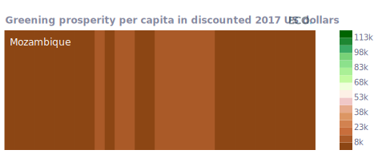

  

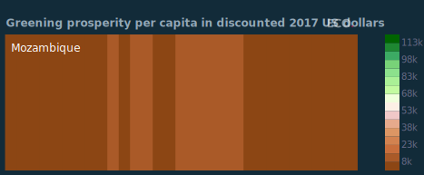

## Figure 9a  

Data: [`csv`](data/fig9a_gdp_map_local.csv)  
GitHub: [fig9a_gdp_map_local](https://github.com/EconomicsObservatory/ECOvisualisations/tree/main/articles/how-do-greening-prosperity-stripes-help-measure-progress-towards-net-zero)  

### Light theme  

Versions with data locally embedded into the `Vega-lite` specification file: [`png`](visualisation/fig9a_gdp_map_local_local.png) [`svg`](visualisation/fig9a_gdp_map_local_local.svg) [`json`](visualisation/fig9a_gdp_map_local_local.json)   
 (**Default**) Versions with data loaded from `GitHub`: [`png`](visualisation/fig9a_gdp_map_local.png) [`svg`](visualisation/fig9a_gdp_map_local.svg) [`json`](visualisation/fig9a_gdp_map_local.json)  
Versions (no ECO branding) with data locally embedded into the `Vega-lite` specification file: [`png`](visualisation/fig9a_gdp_map_local_local_no_branding.png) [`svg`](visualisation/fig9a_gdp_map_local_local_no_branding.svg) [`json`](visualisation/fig9a_gdp_map_local_local_no_branding.json)   
Versions (no ECO branding) with data loaded from `GitHub`: [`png`](visualisation/fig9a_gdp_map_local_no_branding.png) [`svg`](visualisation/fig9a_gdp_map_local_no_branding.svg) [`json`](visualisation/fig9a_gdp_map_local_no_branding.json)   

### Dark theme  

Versions with data locally embedded into the `Vega-lite` specification file: [`png`](visualisation/fig9a_gdp_map_local_local_dark.png) [`svg`](visualisation/fig9a_gdp_map_local_local_dark.svg) [`json`](visualisation/fig9a_gdp_map_local_local_dark.json)   
 Versions with data loaded from `GitHub`: [`png`](visualisation/fig9a_gdp_map_local_dark.png) [`svg`](visualisation/fig9a_gdp_map_local_dark.svg) [`json`](visualisation/fig9a_gdp_map_local_dark.json)  
Versions (no ECO branding) with data locally embedded into the `Vega-lite` specification file: [`png`](visualisation/fig9a_gdp_map_local_local_no_branding_dark.png) [`svg`](visualisation/fig9a_gdp_map_local_local_no_branding_dark.svg) [`json`](visualisation/fig9a_gdp_map_local_local_no_branding_dark.json)   
Versions (no ECO branding) with data loaded from `GitHub`: [`png`](visualisation/fig9a_gdp_map_local_no_branding_dark.png) [`svg`](visualisation/fig9a_gdp_map_local_no_branding_dark.svg) [`json`](visualisation/fig9a_gdp_map_local_no_branding_dark.json)   

  

## Figure 9b  

Data: [`csv`](data/fig9b_co2_map_local.csv)  
GitHub: [fig9b_co2_map_local](https://github.com/EconomicsObservatory/ECOvisualisations/tree/main/articles/how-do-greening-prosperity-stripes-help-measure-progress-towards-net-zero)  

### Light theme  

Versions with data locally embedded into the `Vega-lite` specification file: [`png`](visualisation/fig9b_co2_map_local_local.png) [`svg`](visualisation/fig9b_co2_map_local_local.svg) [`json`](visualisation/fig9b_co2_map_local_local.json)   
 (**Default**) Versions with data loaded from `GitHub`: [`png`](visualisation/fig9b_co2_map_local.png) [`svg`](visualisation/fig9b_co2_map_local.svg) [`json`](visualisation/fig9b_co2_map_local.json)  
Versions (no ECO branding) with data locally embedded into the `Vega-lite` specification file: [`png`](visualisation/fig9b_co2_map_local_local_no_branding.png) [`svg`](visualisation/fig9b_co2_map_local_local_no_branding.svg) [`json`](visualisation/fig9b_co2_map_local_local_no_branding.json)   
Versions (no ECO branding) with data loaded from `GitHub`: [`png`](visualisation/fig9b_co2_map_local_no_branding.png) [`svg`](visualisation/fig9b_co2_map_local_no_branding.svg) [`json`](visualisation/fig9b_co2_map_local_no_branding.json)   

### Dark theme  

Versions with data locally embedded into the `Vega-lite` specification file: [`png`](visualisation/fig9b_co2_map_local_local_dark.png) [`svg`](visualisation/fig9b_co2_map_local_local_dark.svg) [`json`](visualisation/fig9b_co2_map_local_local_dark.json)   
 Versions with data loaded from `GitHub`: [`png`](visualisation/fig9b_co2_map_local_dark.png) [`svg`](visualisation/fig9b_co2_map_local_dark.svg) [`json`](visualisation/fig9b_co2_map_local_dark.json)  
Versions (no ECO branding) with data locally embedded into the `Vega-lite` specification file: [`png`](visualisation/fig9b_co2_map_local_local_no_branding_dark.png) [`svg`](visualisation/fig9b_co2_map_local_local_no_branding_dark.svg) [`json`](visualisation/fig9b_co2_map_local_local_no_branding_dark.json)   
Versions (no ECO branding) with data loaded from `GitHub`: [`png`](visualisation/fig9b_co2_map_local_no_branding_dark.png) [`svg`](visualisation/fig9b_co2_map_local_no_branding_dark.svg) [`json`](visualisation/fig9b_co2_map_local_no_branding_dark.json)   

  

## Figure 9c  

Data: [`csv`](data/fig9c_gpr_map_local.csv)  
GitHub: [fig9c_gpr_map_local](https://github.com/EconomicsObservatory/ECOvisualisations/tree/main/articles/how-do-greening-prosperity-stripes-help-measure-progress-towards-net-zero)  

### Light theme  

Versions with data locally embedded into the `Vega-lite` specification file: [`png`](visualisation/fig9c_gpr_map_local_local.png) [`svg`](visualisation/fig9c_gpr_map_local_local.svg) [`json`](visualisation/fig9c_gpr_map_local_local.json)   
 (**Default**) Versions with data loaded from `GitHub`: [`png`](visualisation/fig9c_gpr_map_local.png) [`svg`](visualisation/fig9c_gpr_map_local.svg) [`json`](visualisation/fig9c_gpr_map_local.json)  
Versions (no ECO branding) with data locally embedded into the `Vega-lite` specification file: [`png`](visualisation/fig9c_gpr_map_local_local_no_branding.png) [`svg`](visualisation/fig9c_gpr_map_local_local_no_branding.svg) [`json`](visualisation/fig9c_gpr_map_local_local_no_branding.json)   
Versions (no ECO branding) with data loaded from `GitHub`: [`png`](visualisation/fig9c_gpr_map_local_no_branding.png) [`svg`](visualisation/fig9c_gpr_map_local_no_branding.svg) [`json`](visualisation/fig9c_gpr_map_local_no_branding.json)   

### Dark theme  

Versions with data locally embedded into the `Vega-lite` specification file: [`png`](visualisation/fig9c_gpr_map_local_local_dark.png) [`svg`](visualisation/fig9c_gpr_map_local_local_dark.svg) [`json`](visualisation/fig9c_gpr_map_local_local_dark.json)   
 Versions with data loaded from `GitHub`: [`png`](visualisation/fig9c_gpr_map_local_dark.png) [`svg`](visualisation/fig9c_gpr_map_local_dark.svg) [`json`](visualisation/fig9c_gpr_map_local_dark.json)  
Versions (no ECO branding) with data locally embedded into the `Vega-lite` specification file: [`png`](visualisation/fig9c_gpr_map_local_local_no_branding_dark.png) [`svg`](visualisation/fig9c_gpr_map_local_local_no_branding_dark.svg) [`json`](visualisation/fig9c_gpr_map_local_local_no_branding_dark.json)   
Versions (no ECO branding) with data loaded from `GitHub`: [`png`](visualisation/fig9c_gpr_map_local_no_branding_dark.png) [`svg`](visualisation/fig9c_gpr_map_local_no_branding_dark.svg) [`json`](visualisation/fig9c_gpr_map_local_no_branding_dark.json)   

  

