## Figure 1  

Data: [`csv`](data/fig1_temp.csv)  
GitHub: [fig1_temp](https://github.com/EconomicsObservatory/ECOvisualisations/tree/main/articles/how-do-greening-prosperity-stripes-help-measure-progress-towards-net-zero)  

### Light theme  

Versions with data locally embedded into the `Vega-lite` specification file: [`png`](visualisation/fig1_temp_local.png) [`svg`](visualisation/fig1_temp_local.svg) [`json`](visualisation/fig1_temp_local.json)   
 (**Default**) Versions with data loaded from `GitHub`: [`png`](visualisation/fig1_temp.png) [`svg`](visualisation/fig1_temp.svg) [`json`](visualisation/fig1_temp.json)  
Versions (no ECO branding) with data locally embedded into the `Vega-lite` specification file: [`png`](visualisation/fig1_temp_local_no_branding.png) [`svg`](visualisation/fig1_temp_local_no_branding.svg) [`json`](visualisation/fig1_temp_local_no_branding.json)   
Versions (no ECO branding) with data loaded from `GitHub`: [`png`](visualisation/fig1_temp_no_branding.png) [`svg`](visualisation/fig1_temp_no_branding.svg) [`json`](visualisation/fig1_temp_no_branding.json)   

### Dark theme  

Versions with data locally embedded into the `Vega-lite` specification file: [`png`](visualisation/fig1_temp_local_dark.png) [`svg`](visualisation/fig1_temp_local_dark.svg) [`json`](visualisation/fig1_temp_local_dark.json)   
 Versions with data loaded from `GitHub`: [`png`](visualisation/fig1_temp_dark.png) [`svg`](visualisation/fig1_temp_dark.svg) [`json`](visualisation/fig1_temp_dark.json)  
Versions (no ECO branding) with data locally embedded into the `Vega-lite` specification file: [`png`](visualisation/fig1_temp_local_no_branding_dark.png) [`svg`](visualisation/fig1_temp_local_no_branding_dark.svg) [`json`](visualisation/fig1_temp_local_no_branding_dark.json)   
Versions (no ECO branding) with data loaded from `GitHub`: [`png`](visualisation/fig1_temp_no_branding_dark.png) [`svg`](visualisation/fig1_temp_no_branding_dark.svg) [`json`](visualisation/fig1_temp_no_branding_dark.json)   

  

## Figure 2  

Data: [`csv`](data/fig2_stripes.csv)  
GitHub: [fig2_stripes](https://github.com/EconomicsObservatory/ECOvisualisations/tree/main/articles/how-do-greening-prosperity-stripes-help-measure-progress-towards-net-zero)  

### Light theme  

Versions with data locally embedded into the `Vega-lite` specification file: [`png`](visualisation/fig2_stripes_local.png) [`svg`](visualisation/fig2_stripes_local.svg) [`json`](visualisation/fig2_stripes_local.json)   
 (**Default**) Versions with data loaded from `GitHub`: [`png`](visualisation/fig2_stripes.png) [`svg`](visualisation/fig2_stripes.svg) [`json`](visualisation/fig2_stripes.json)  
Versions (no ECO branding) with data locally embedded into the `Vega-lite` specification file: [`png`](visualisation/fig2_stripes_local_no_branding.png) [`svg`](visualisation/fig2_stripes_local_no_branding.svg) [`json`](visualisation/fig2_stripes_local_no_branding.json)   
Versions (no ECO branding) with data loaded from `GitHub`: [`png`](visualisation/fig2_stripes_no_branding.png) [`svg`](visualisation/fig2_stripes_no_branding.svg) [`json`](visualisation/fig2_stripes_no_branding.json)   

### Dark theme  

Versions with data locally embedded into the `Vega-lite` specification file: [`png`](visualisation/fig2_stripes_local_dark.png) [`svg`](visualisation/fig2_stripes_local_dark.svg) [`json`](visualisation/fig2_stripes_local_dark.json)   
 Versions with data loaded from `GitHub`: [`png`](visualisation/fig2_stripes_dark.png) [`svg`](visualisation/fig2_stripes_dark.svg) [`json`](visualisation/fig2_stripes_dark.json)  
Versions (no ECO branding) with data locally embedded into the `Vega-lite` specification file: [`png`](visualisation/fig2_stripes_local_no_branding_dark.png) [`svg`](visualisation/fig2_stripes_local_no_branding_dark.svg) [`json`](visualisation/fig2_stripes_local_no_branding_dark.json)   
Versions (no ECO branding) with data loaded from `GitHub`: [`png`](visualisation/fig2_stripes_no_branding_dark.png) [`svg`](visualisation/fig2_stripes_no_branding_dark.svg) [`json`](visualisation/fig2_stripes_no_branding_dark.json)   

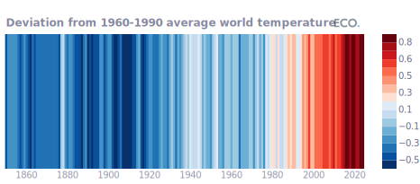

  

## Figure 3  

Data: [`csv`](data/fig3_gdp.csv)  
GitHub: [fig3_gdp](https://github.com/EconomicsObservatory/ECOvisualisations/tree/main/articles/how-do-greening-prosperity-stripes-help-measure-progress-towards-net-zero)  

### Light theme  

Versions with data locally embedded into the `Vega-lite` specification file: [`png`](visualisation/fig3_gdp_local.png) [`svg`](visualisation/fig3_gdp_local.svg) [`json`](visualisation/fig3_gdp_local.json)   
 (**Default**) Versions with data loaded from `GitHub`: [`png`](visualisation/fig3_gdp.png) [`svg`](visualisation/fig3_gdp.svg) [`json`](visualisation/fig3_gdp.json)  
Versions (no ECO branding) with data locally embedded into the `Vega-lite` specification file: [`png`](visualisation/fig3_gdp_local_no_branding.png) [`svg`](visualisation/fig3_gdp_local_no_branding.svg) [`json`](visualisation/fig3_gdp_local_no_branding.json)   
Versions (no ECO branding) with data loaded from `GitHub`: [`png`](visualisation/fig3_gdp_no_branding.png) [`svg`](visualisation/fig3_gdp_no_branding.svg) [`json`](visualisation/fig3_gdp_no_branding.json)   

### Dark theme  

Versions with data locally embedded into the `Vega-lite` specification file: [`png`](visualisation/fig3_gdp_local_dark.png) [`svg`](visualisation/fig3_gdp_local_dark.svg) [`json`](visualisation/fig3_gdp_local_dark.json)   
 Versions with data loaded from `GitHub`: [`png`](visualisation/fig3_gdp_dark.png) [`svg`](visualisation/fig3_gdp_dark.svg) [`json`](visualisation/fig3_gdp_dark.json)  
Versions (no ECO branding) with data locally embedded into the `Vega-lite` specification file: [`png`](visualisation/fig3_gdp_local_no_branding_dark.png) [`svg`](visualisation/fig3_gdp_local_no_branding_dark.svg) [`json`](visualisation/fig3_gdp_local_no_branding_dark.json)   
Versions (no ECO branding) with data loaded from `GitHub`: [`png`](visualisation/fig3_gdp_no_branding_dark.png) [`svg`](visualisation/fig3_gdp_no_branding_dark.svg) [`json`](visualisation/fig3_gdp_no_branding_dark.json)   

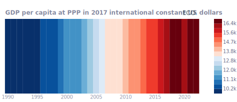

  

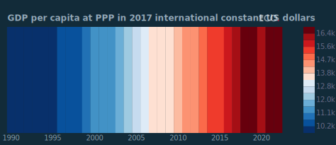

## Figure 4  

Data: [`csv`](data/fig4_co2.csv)  
GitHub: [fig4_co2](https://github.com/EconomicsObservatory/ECOvisualisations/tree/main/articles/how-do-greening-prosperity-stripes-help-measure-progress-towards-net-zero)  

### Light theme  

Versions with data locally embedded into the `Vega-lite` specification file: [`png`](visualisation/fig4_co2_local.png) [`svg`](visualisation/fig4_co2_local.svg) [`json`](visualisation/fig4_co2_local.json)   
 (**Default**) Versions with data loaded from `GitHub`: [`png`](visualisation/fig4_co2.png) [`svg`](visualisation/fig4_co2.svg) [`json`](visualisation/fig4_co2.json)  
Versions (no ECO branding) with data locally embedded into the `Vega-lite` specification file: [`png`](visualisation/fig4_co2_local_no_branding.png) [`svg`](visualisation/fig4_co2_local_no_branding.svg) [`json`](visualisation/fig4_co2_local_no_branding.json)   
Versions (no ECO branding) with data loaded from `GitHub`: [`png`](visualisation/fig4_co2_no_branding.png) [`svg`](visualisation/fig4_co2_no_branding.svg) [`json`](visualisation/fig4_co2_no_branding.json)   

### Dark theme  

Versions with data locally embedded into the `Vega-lite` specification file: [`png`](visualisation/fig4_co2_local_dark.png) [`svg`](visualisation/fig4_co2_local_dark.svg) [`json`](visualisation/fig4_co2_local_dark.json)   
 Versions with data loaded from `GitHub`: [`png`](visualisation/fig4_co2_dark.png) [`svg`](visualisation/fig4_co2_dark.svg) [`json`](visualisation/fig4_co2_dark.json)  
Versions (no ECO branding) with data locally embedded into the `Vega-lite` specification file: [`png`](visualisation/fig4_co2_local_no_branding_dark.png) [`svg`](visualisation/fig4_co2_local_no_branding_dark.svg) [`json`](visualisation/fig4_co2_local_no_branding_dark.json)   
Versions (no ECO branding) with data loaded from `GitHub`: [`png`](visualisation/fig4_co2_no_branding_dark.png) [`svg`](visualisation/fig4_co2_no_branding_dark.svg) [`json`](visualisation/fig4_co2_no_branding_dark.json)   

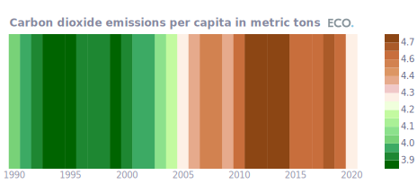

  

## Figure 5  

Data: [`csv`](data/fig5_gpr.csv)  
GitHub: [fig5_gpr](https://github.com/EconomicsObservatory/ECOvisualisations/tree/main/articles/how-do-greening-prosperity-stripes-help-measure-progress-towards-net-zero)  

### Light theme  

Versions with data locally embedded into the `Vega-lite` specification file: [`png`](visualisation/fig5_gpr_local.png) [`svg`](visualisation/fig5_gpr_local.svg) [`json`](visualisation/fig5_gpr_local.json)   
 (**Default**) Versions with data loaded from `GitHub`: [`png`](visualisation/fig5_gpr.png) [`svg`](visualisation/fig5_gpr.svg) [`json`](visualisation/fig5_gpr.json)  
Versions (no ECO branding) with data locally embedded into the `Vega-lite` specification file: [`png`](visualisation/fig5_gpr_local_no_branding.png) [`svg`](visualisation/fig5_gpr_local_no_branding.svg) [`json`](visualisation/fig5_gpr_local_no_branding.json)   
Versions (no ECO branding) with data loaded from `GitHub`: [`png`](visualisation/fig5_gpr_no_branding.png) [`svg`](visualisation/fig5_gpr_no_branding.svg) [`json`](visualisation/fig5_gpr_no_branding.json)   

### Dark theme  

Versions with data locally embedded into the `Vega-lite` specification file: [`png`](visualisation/fig5_gpr_local_dark.png) [`svg`](visualisation/fig5_gpr_local_dark.svg) [`json`](visualisation/fig5_gpr_local_dark.json)   
 Versions with data loaded from `GitHub`: [`png`](visualisation/fig5_gpr_dark.png) [`svg`](visualisation/fig5_gpr_dark.svg) [`json`](visualisation/fig5_gpr_dark.json)  
Versions (no ECO branding) with data locally embedded into the `Vega-lite` specification file: [`png`](visualisation/fig5_gpr_local_no_branding_dark.png) [`svg`](visualisation/fig5_gpr_local_no_branding_dark.svg) [`json`](visualisation/fig5_gpr_local_no_branding_dark.json)   
Versions (no ECO branding) with data loaded from `GitHub`: [`png`](visualisation/fig5_gpr_no_branding_dark.png) [`svg`](visualisation/fig5_gpr_no_branding_dark.svg) [`json`](visualisation/fig5_gpr_no_branding_dark.json)   

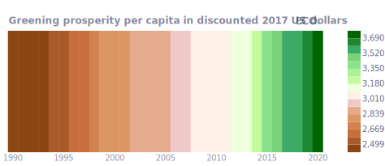

  

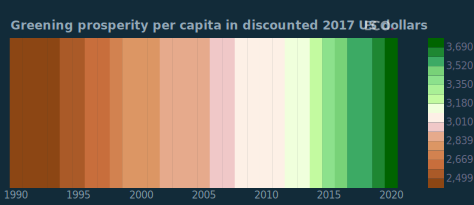

## Figure 6a  

Data: [`csv`](data/fig6a_gdp_world.csv)  
GitHub: [fig6a_gdp_world](https://github.com/EconomicsObservatory/ECOvisualisations/tree/main/articles/how-do-greening-prosperity-stripes-help-measure-progress-towards-net-zero)  

### Light theme  

Versions with data locally embedded into the `Vega-lite` specification file: [`png`](visualisation/fig6a_gdp_world_local.png) [`svg`](visualisation/fig6a_gdp_world_local.svg) [`json`](visualisation/fig6a_gdp_world_local.json)   
 (**Default**) Versions with data loaded from `GitHub`: [`png`](visualisation/fig6a_gdp_world.png) [`svg`](visualisation/fig6a_gdp_world.svg) [`json`](visualisation/fig6a_gdp_world.json)  
Versions (no ECO branding) with data locally embedded into the `Vega-lite` specification file: [`png`](visualisation/fig6a_gdp_world_local_no_branding.png) [`svg`](visualisation/fig6a_gdp_world_local_no_branding.svg) [`json`](visualisation/fig6a_gdp_world_local_no_branding.json)   
Versions (no ECO branding) with data loaded from `GitHub`: [`png`](visualisation/fig6a_gdp_world_no_branding.png) [`svg`](visualisation/fig6a_gdp_world_no_branding.svg) [`json`](visualisation/fig6a_gdp_world_no_branding.json)   

### Dark theme  

Versions with data locally embedded into the `Vega-lite` specification file: [`png`](visualisation/fig6a_gdp_world_local_dark.png) [`svg`](visualisation/fig6a_gdp_world_local_dark.svg) [`json`](visualisation/fig6a_gdp_world_local_dark.json)   
 Versions with data loaded from `GitHub`: [`png`](visualisation/fig6a_gdp_world_dark.png) [`svg`](visualisation/fig6a_gdp_world_dark.svg) [`json`](visualisation/fig6a_gdp_world_dark.json)  
Versions (no ECO branding) with data locally embedded into the `Vega-lite` specification file: [`png`](visualisation/fig6a_gdp_world_local_no_branding_dark.png) [`svg`](visualisation/fig6a_gdp_world_local_no_branding_dark.svg) [`json`](visualisation/fig6a_gdp_world_local_no_branding_dark.json)   
Versions (no ECO branding) with data loaded from `GitHub`: [`png`](visualisation/fig6a_gdp_world_no_branding_dark.png) [`svg`](visualisation/fig6a_gdp_world_no_branding_dark.svg) [`json`](visualisation/fig6a_gdp_world_no_branding_dark.json)   

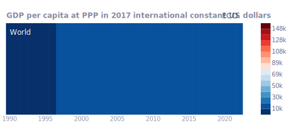

  

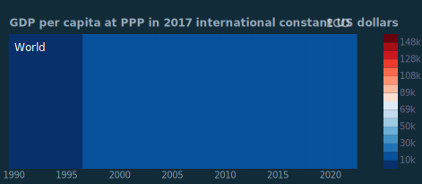

## Figure 6b  

Data: [`csv`](data/fig6b_gdp_ch.csv)  
GitHub: [fig6b_gdp_ch](https://github.com/EconomicsObservatory/ECOvisualisations/tree/main/articles/how-do-greening-prosperity-stripes-help-measure-progress-towards-net-zero)  

### Light theme  

Versions with data locally embedded into the `Vega-lite` specification file: [`png`](visualisation/fig6b_gdp_ch_local.png) [`svg`](visualisation/fig6b_gdp_ch_local.svg) [`json`](visualisation/fig6b_gdp_ch_local.json)   
 (**Default**) Versions with data loaded from `GitHub`: [`png`](visualisation/fig6b_gdp_ch.png) [`svg`](visualisation/fig6b_gdp_ch.svg) [`json`](visualisation/fig6b_gdp_ch.json)  
Versions (no ECO branding) with data locally embedded into the `Vega-lite` specification file: [`png`](visualisation/fig6b_gdp_ch_local_no_branding.png) [`svg`](visualisation/fig6b_gdp_ch_local_no_branding.svg) [`json`](visualisation/fig6b_gdp_ch_local_no_branding.json)   
Versions (no ECO branding) with data loaded from `GitHub`: [`png`](visualisation/fig6b_gdp_ch_no_branding.png) [`svg`](visualisation/fig6b_gdp_ch_no_branding.svg) [`json`](visualisation/fig6b_gdp_ch_no_branding.json)   

### Dark theme  

Versions with data locally embedded into the `Vega-lite` specification file: [`png`](visualisation/fig6b_gdp_ch_local_dark.png) [`svg`](visualisation/fig6b_gdp_ch_local_dark.svg) [`json`](visualisation/fig6b_gdp_ch_local_dark.json)   
 Versions with data loaded from `GitHub`: [`png`](visualisation/fig6b_gdp_ch_dark.png) [`svg`](visualisation/fig6b_gdp_ch_dark.svg) [`json`](visualisation/fig6b_gdp_ch_dark.json)  
Versions (no ECO branding) with data locally embedded into the `Vega-lite` specification file: [`png`](visualisation/fig6b_gdp_ch_local_no_branding_dark.png) [`svg`](visualisation/fig6b_gdp_ch_local_no_branding_dark.svg) [`json`](visualisation/fig6b_gdp_ch_local_no_branding_dark.json)   
Versions (no ECO branding) with data loaded from `GitHub`: [`png`](visualisation/fig6b_gdp_ch_no_branding_dark.png) [`svg`](visualisation/fig6b_gdp_ch_no_branding_dark.svg) [`json`](visualisation/fig6b_gdp_ch_no_branding_dark.json)   

  

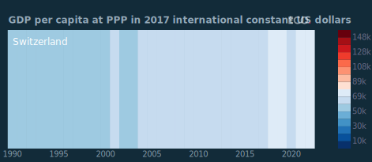

## Figure 6b  

Data: [`csv`](data/fig6b_gdp_mz.csv)  
GitHub: [fig6b_gdp_mz](https://github.com/EconomicsObservatory/ECOvisualisations/tree/main/articles/how-do-greening-prosperity-stripes-help-measure-progress-towards-net-zero)  

### Light theme  

Versions with data locally embedded into the `Vega-lite` specification file: [`png`](visualisation/fig6b_gdp_mz_local.png) [`svg`](visualisation/fig6b_gdp_mz_local.svg) [`json`](visualisation/fig6b_gdp_mz_local.json)   
 (**Default**) Versions with data loaded from `GitHub`: [`png`](visualisation/fig6b_gdp_mz.png) [`svg`](visualisation/fig6b_gdp_mz.svg) [`json`](visualisation/fig6b_gdp_mz.json)  
Versions (no ECO branding) with data locally embedded into the `Vega-lite` specification file: [`png`](visualisation/fig6b_gdp_mz_local_no_branding.png) [`svg`](visualisation/fig6b_gdp_mz_local_no_branding.svg) [`json`](visualisation/fig6b_gdp_mz_local_no_branding.json)   
Versions (no ECO branding) with data loaded from `GitHub`: [`png`](visualisation/fig6b_gdp_mz_no_branding.png) [`svg`](visualisation/fig6b_gdp_mz_no_branding.svg) [`json`](visualisation/fig6b_gdp_mz_no_branding.json)   

### Dark theme  

Versions with data locally embedded into the `Vega-lite` specification file: [`png`](visualisation/fig6b_gdp_mz_local_dark.png) [`svg`](visualisation/fig6b_gdp_mz_local_dark.svg) [`json`](visualisation/fig6b_gdp_mz_local_dark.json)   
 Versions with data loaded from `GitHub`: [`png`](visualisation/fig6b_gdp_mz_dark.png) [`svg`](visualisation/fig6b_gdp_mz_dark.svg) [`json`](visualisation/fig6b_gdp_mz_dark.json)  
Versions (no ECO branding) with data locally embedded into the `Vega-lite` specification file: [`png`](visualisation/fig6b_gdp_mz_local_no_branding_dark.png) [`svg`](visualisation/fig6b_gdp_mz_local_no_branding_dark.svg) [`json`](visualisation/fig6b_gdp_mz_local_no_branding_dark.json)   
Versions (no ECO branding) with data loaded from `GitHub`: [`png`](visualisation/fig6b_gdp_mz_no_branding_dark.png) [`svg`](visualisation/fig6b_gdp_mz_no_branding_dark.svg) [`json`](visualisation/fig6b_gdp_mz_no_branding_dark.json)   

  

## Figure 7  

Data: [`csv`](data/fig7_co2_world.csv)  
GitHub: [fig7_co2_world](https://github.com/EconomicsObservatory/ECOvisualisations/tree/main/articles/how-do-greening-prosperity-stripes-help-measure-progress-towards-net-zero)  

### Light theme  

Versions with data locally embedded into the `Vega-lite` specification file: [`png`](visualisation/fig7_co2_world_local.png) [`svg`](visualisation/fig7_co2_world_local.svg) [`json`](visualisation/fig7_co2_world_local.json)   
 (**Default**) Versions with data loaded from `GitHub`: [`png`](visualisation/fig7_co2_world.png) [`svg`](visualisation/fig7_co2_world.svg) [`json`](visualisation/fig7_co2_world.json)  
Versions (no ECO branding) with data locally embedded into the `Vega-lite` specification file: [`png`](visualisation/fig7_co2_world_local_no_branding.png) [`svg`](visualisation/fig7_co2_world_local_no_branding.svg) [`json`](visualisation/fig7_co2_world_local_no_branding.json)   
Versions (no ECO branding) with data loaded from `GitHub`: [`png`](visualisation/fig7_co2_world_no_branding.png) [`svg`](visualisation/fig7_co2_world_no_branding.svg) [`json`](visualisation/fig7_co2_world_no_branding.json)   

### Dark theme  

Versions with data locally embedded into the `Vega-lite` specification file: [`png`](visualisation/fig7_co2_world_local_dark.png) [`svg`](visualisation/fig7_co2_world_local_dark.svg) [`json`](visualisation/fig7_co2_world_local_dark.json)   
 Versions with data loaded from `GitHub`: [`png`](visualisation/fig7_co2_world_dark.png) [`svg`](visualisation/fig7_co2_world_dark.svg) [`json`](visualisation/fig7_co2_world_dark.json)  
Versions (no ECO branding) with data locally embedded into the `Vega-lite` specification file: [`png`](visualisation/fig7_co2_world_local_no_branding_dark.png) [`svg`](visualisation/fig7_co2_world_local_no_branding_dark.svg) [`json`](visualisation/fig7_co2_world_local_no_branding_dark.json)   
Versions (no ECO branding) with data loaded from `GitHub`: [`png`](visualisation/fig7_co2_world_no_branding_dark.png) [`svg`](visualisation/fig7_co2_world_no_branding_dark.svg) [`json`](visualisation/fig7_co2_world_no_branding_dark.json)   

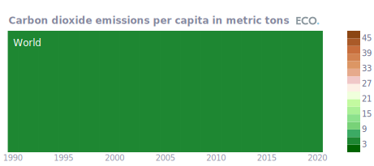

  

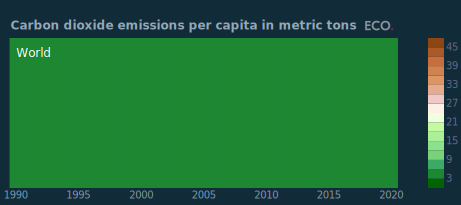

## Figure 7b  

Data: [`csv`](data/fig7b_co2_ch.csv)  
GitHub: [fig7b_co2_ch](https://github.com/EconomicsObservatory/ECOvisualisations/tree/main/articles/how-do-greening-prosperity-stripes-help-measure-progress-towards-net-zero)  

### Light theme  

Versions with data locally embedded into the `Vega-lite` specification file: [`png`](visualisation/fig7b_co2_ch_local.png) [`svg`](visualisation/fig7b_co2_ch_local.svg) [`json`](visualisation/fig7b_co2_ch_local.json)   
 (**Default**) Versions with data loaded from `GitHub`: [`png`](visualisation/fig7b_co2_ch.png) [`svg`](visualisation/fig7b_co2_ch.svg) [`json`](visualisation/fig7b_co2_ch.json)  
Versions (no ECO branding) with data locally embedded into the `Vega-lite` specification file: [`png`](visualisation/fig7b_co2_ch_local_no_branding.png) [`svg`](visualisation/fig7b_co2_ch_local_no_branding.svg) [`json`](visualisation/fig7b_co2_ch_local_no_branding.json)   
Versions (no ECO branding) with data loaded from `GitHub`: [`png`](visualisation/fig7b_co2_ch_no_branding.png) [`svg`](visualisation/fig7b_co2_ch_no_branding.svg) [`json`](visualisation/fig7b_co2_ch_no_branding.json)   

### Dark theme  

Versions with data locally embedded into the `Vega-lite` specification file: [`png`](visualisation/fig7b_co2_ch_local_dark.png) [`svg`](visualisation/fig7b_co2_ch_local_dark.svg) [`json`](visualisation/fig7b_co2_ch_local_dark.json)   
 Versions with data loaded from `GitHub`: [`png`](visualisation/fig7b_co2_ch_dark.png) [`svg`](visualisation/fig7b_co2_ch_dark.svg) [`json`](visualisation/fig7b_co2_ch_dark.json)  
Versions (no ECO branding) with data locally embedded into the `Vega-lite` specification file: [`png`](visualisation/fig7b_co2_ch_local_no_branding_dark.png) [`svg`](visualisation/fig7b_co2_ch_local_no_branding_dark.svg) [`json`](visualisation/fig7b_co2_ch_local_no_branding_dark.json)   
Versions (no ECO branding) with data loaded from `GitHub`: [`png`](visualisation/fig7b_co2_ch_no_branding_dark.png) [`svg`](visualisation/fig7b_co2_ch_no_branding_dark.svg) [`json`](visualisation/fig7b_co2_ch_no_branding_dark.json)   

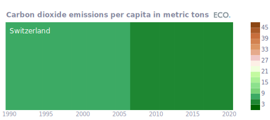

  

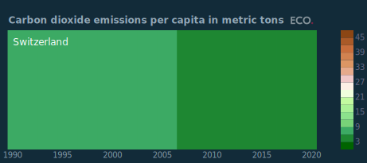

## Figure 7c  

Data: [`csv`](data/fig7c_co2_mz.csv)  
GitHub: [fig7c_co2_mz](https://github.com/EconomicsObservatory/ECOvisualisations/tree/main/articles/how-do-greening-prosperity-stripes-help-measure-progress-towards-net-zero)  

### Light theme  

Versions with data locally embedded into the `Vega-lite` specification file: [`png`](visualisation/fig7c_co2_mz_local.png) [`svg`](visualisation/fig7c_co2_mz_local.svg) [`json`](visualisation/fig7c_co2_mz_local.json)   
 (**Default**) Versions with data loaded from `GitHub`: [`png`](visualisation/fig7c_co2_mz.png) [`svg`](visualisation/fig7c_co2_mz.svg) [`json`](visualisation/fig7c_co2_mz.json)  
Versions (no ECO branding) with data locally embedded into the `Vega-lite` specification file: [`png`](visualisation/fig7c_co2_mz_local_no_branding.png) [`svg`](visualisation/fig7c_co2_mz_local_no_branding.svg) [`json`](visualisation/fig7c_co2_mz_local_no_branding.json)   
Versions (no ECO branding) with data loaded from `GitHub`: [`png`](visualisation/fig7c_co2_mz_no_branding.png) [`svg`](visualisation/fig7c_co2_mz_no_branding.svg) [`json`](visualisation/fig7c_co2_mz_no_branding.json)   

### Dark theme  

Versions with data locally embedded into the `Vega-lite` specification file: [`png`](visualisation/fig7c_co2_mz_local_dark.png) [`svg`](visualisation/fig7c_co2_mz_local_dark.svg) [`json`](visualisation/fig7c_co2_mz_local_dark.json)   
 Versions with data loaded from `GitHub`: [`png`](visualisation/fig7c_co2_mz_dark.png) [`svg`](visualisation/fig7c_co2_mz_dark.svg) [`json`](visualisation/fig7c_co2_mz_dark.json)  
Versions (no ECO branding) with data locally embedded into the `Vega-lite` specification file: [`png`](visualisation/fig7c_co2_mz_local_no_branding_dark.png) [`svg`](visualisation/fig7c_co2_mz_local_no_branding_dark.svg) [`json`](visualisation/fig7c_co2_mz_local_no_branding_dark.json)   
Versions (no ECO branding) with data loaded from `GitHub`: [`png`](visualisation/fig7c_co2_mz_no_branding_dark.png) [`svg`](visualisation/fig7c_co2_mz_no_branding_dark.svg) [`json`](visualisation/fig7c_co2_mz_no_branding_dark.json)   

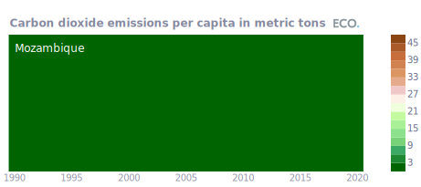

  

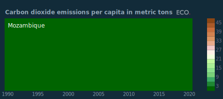

## Figure 8a  

Data: [`csv`](data/fig8a_gpr_world.csv)  
GitHub: [fig8a_gpr_world](https://github.com/EconomicsObservatory/ECOvisualisations/tree/main/articles/how-do-greening-prosperity-stripes-help-measure-progress-towards-net-zero)  

### Light theme  

Versions with data locally embedded into the `Vega-lite` specification file: [`png`](visualisation/fig8a_gpr_world_local.png) [`svg`](visualisation/fig8a_gpr_world_local.svg) [`json`](visualisation/fig8a_gpr_world_local.json)   
 (**Default**) Versions with data loaded from `GitHub`: [`png`](visualisation/fig8a_gpr_world.png) [`svg`](visualisation/fig8a_gpr_world.svg) [`json`](visualisation/fig8a_gpr_world.json)  
Versions (no ECO branding) with data locally embedded into the `Vega-lite` specification file: [`png`](visualisation/fig8a_gpr_world_local_no_branding.png) [`svg`](visualisation/fig8a_gpr_world_local_no_branding.svg) [`json`](visualisation/fig8a_gpr_world_local_no_branding.json)   
Versions (no ECO branding) with data loaded from `GitHub`: [`png`](visualisation/fig8a_gpr_world_no_branding.png) [`svg`](visualisation/fig8a_gpr_world_no_branding.svg) [`json`](visualisation/fig8a_gpr_world_no_branding.json)   

### Dark theme  

Versions with data locally embedded into the `Vega-lite` specification file: [`png`](visualisation/fig8a_gpr_world_local_dark.png) [`svg`](visualisation/fig8a_gpr_world_local_dark.svg) [`json`](visualisation/fig8a_gpr_world_local_dark.json)   
 Versions with data loaded from `GitHub`: [`png`](visualisation/fig8a_gpr_world_dark.png) [`svg`](visualisation/fig8a_gpr_world_dark.svg) [`json`](visualisation/fig8a_gpr_world_dark.json)  
Versions (no ECO branding) with data locally embedded into the `Vega-lite` specification file: [`png`](visualisation/fig8a_gpr_world_local_no_branding_dark.png) [`svg`](visualisation/fig8a_gpr_world_local_no_branding_dark.svg) [`json`](visualisation/fig8a_gpr_world_local_no_branding_dark.json)   
Versions (no ECO branding) with data loaded from `GitHub`: [`png`](visualisation/fig8a_gpr_world_no_branding_dark.png) [`svg`](visualisation/fig8a_gpr_world_no_branding_dark.svg) [`json`](visualisation/fig8a_gpr_world_no_branding_dark.json)   

  

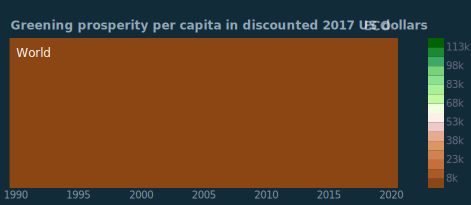

## Figure 8b  

Data: [`csv`](data/fig8b_gpr_ch.csv)  
GitHub: [fig8b_gpr_ch](https://github.com/EconomicsObservatory/ECOvisualisations/tree/main/articles/how-do-greening-prosperity-stripes-help-measure-progress-towards-net-zero)  

### Light theme  

Versions with data locally embedded into the `Vega-lite` specification file: [`png`](visualisation/fig8b_gpr_ch_local.png) [`svg`](visualisation/fig8b_gpr_ch_local.svg) [`json`](visualisation/fig8b_gpr_ch_local.json)   
 (**Default**) Versions with data loaded from `GitHub`: [`png`](visualisation/fig8b_gpr_ch.png) [`svg`](visualisation/fig8b_gpr_ch.svg) [`json`](visualisation/fig8b_gpr_ch.json)  
Versions (no ECO branding) with data locally embedded into the `Vega-lite` specification file: [`png`](visualisation/fig8b_gpr_ch_local_no_branding.png) [`svg`](visualisation/fig8b_gpr_ch_local_no_branding.svg) [`json`](visualisation/fig8b_gpr_ch_local_no_branding.json)   
Versions (no ECO branding) with data loaded from `GitHub`: [`png`](visualisation/fig8b_gpr_ch_no_branding.png) [`svg`](visualisation/fig8b_gpr_ch_no_branding.svg) [`json`](visualisation/fig8b_gpr_ch_no_branding.json)   

### Dark theme  

Versions with data locally embedded into the `Vega-lite` specification file: [`png`](visualisation/fig8b_gpr_ch_local_dark.png) [`svg`](visualisation/fig8b_gpr_ch_local_dark.svg) [`json`](visualisation/fig8b_gpr_ch_local_dark.json)   
 Versions with data loaded from `GitHub`: [`png`](visualisation/fig8b_gpr_ch_dark.png) [`svg`](visualisation/fig8b_gpr_ch_dark.svg) [`json`](visualisation/fig8b_gpr_ch_dark.json)  
Versions (no ECO branding) with data locally embedded into the `Vega-lite` specification file: [`png`](visualisation/fig8b_gpr_ch_local_no_branding_dark.png) [`svg`](visualisation/fig8b_gpr_ch_local_no_branding_dark.svg) [`json`](visualisation/fig8b_gpr_ch_local_no_branding_dark.json)   
Versions (no ECO branding) with data loaded from `GitHub`: [`png`](visualisation/fig8b_gpr_ch_no_branding_dark.png) [`svg`](visualisation/fig8b_gpr_ch_no_branding_dark.svg) [`json`](visualisation/fig8b_gpr_ch_no_branding_dark.json)   

  

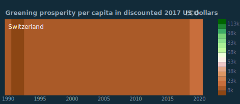

## Figure 8c  

Data: [`csv`](data/fig8c_gpr_mz.csv)  
GitHub: [fig8c_gpr_mz](https://github.com/EconomicsObservatory/ECOvisualisations/tree/main/articles/how-do-greening-prosperity-stripes-help-measure-progress-towards-net-zero)  

### Light theme  

Versions with data locally embedded into the `Vega-lite` specification file: [`png`](visualisation/fig8c_gpr_mz_local.png) [`svg`](visualisation/fig8c_gpr_mz_local.svg) [`json`](visualisation/fig8c_gpr_mz_local.json)   
 (**Default**) Versions with data loaded from `GitHub`: [`png`](visualisation/fig8c_gpr_mz.png) [`svg`](visualisation/fig8c_gpr_mz.svg) [`json`](visualisation/fig8c_gpr_mz.json)  
Versions (no ECO branding) with data locally embedded into the `Vega-lite` specification file: [`png`](visualisation/fig8c_gpr_mz_local_no_branding.png) [`svg`](visualisation/fig8c_gpr_mz_local_no_branding.svg) [`json`](visualisation/fig8c_gpr_mz_local_no_branding.json)   
Versions (no ECO branding) with data loaded from `GitHub`: [`png`](visualisation/fig8c_gpr_mz_no_branding.png) [`svg`](visualisation/fig8c_gpr_mz_no_branding.svg) [`json`](visualisation/fig8c_gpr_mz_no_branding.json)   

### Dark theme  

Versions with data locally embedded into the `Vega-lite` specification file: [`png`](visualisation/fig8c_gpr_mz_local_dark.png) [`svg`](visualisation/fig8c_gpr_mz_local_dark.svg) [`json`](visualisation/fig8c_gpr_mz_local_dark.json)   
 Versions with data loaded from `GitHub`: [`png`](visualisation/fig8c_gpr_mz_dark.png) [`svg`](visualisation/fig8c_gpr_mz_dark.svg) [`json`](visualisation/fig8c_gpr_mz_dark.json)  
Versions (no ECO branding) with data locally embedded into the `Vega-lite` specification file: [`png`](visualisation/fig8c_gpr_mz_local_no_branding_dark.png) [`svg`](visualisation/fig8c_gpr_mz_local_no_branding_dark.svg) [`json`](visualisation/fig8c_gpr_mz_local_no_branding_dark.json)   
Versions (no ECO branding) with data loaded from `GitHub`: [`png`](visualisation/fig8c_gpr_mz_no_branding_dark.png) [`svg`](visualisation/fig8c_gpr_mz_no_branding_dark.svg) [`json`](visualisation/fig8c_gpr_mz_no_branding_dark.json)   

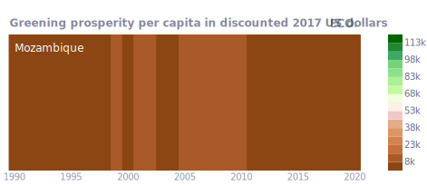

  

## Figure 9a  

Data: [`csv`](data/fig9a_gdp_map.csv)  
GitHub: [fig9a_gdp_map](https://github.com/EconomicsObservatory/ECOvisualisations/tree/main/articles/how-do-greening-prosperity-stripes-help-measure-progress-towards-net-zero)  

### Light theme  

Versions with data locally embedded into the `Vega-lite` specification file: [`png`](visualisation/fig9a_gdp_map_local.png) [`svg`](visualisation/fig9a_gdp_map_local.svg) [`json`](visualisation/fig9a_gdp_map_local.json)   
 (**Default**) Versions with data loaded from `GitHub`: [`png`](visualisation/fig9a_gdp_map.png) [`svg`](visualisation/fig9a_gdp_map.svg) [`json`](visualisation/fig9a_gdp_map.json)  
Versions (no ECO branding) with data locally embedded into the `Vega-lite` specification file: [`png`](visualisation/fig9a_gdp_map_local_no_branding.png) [`svg`](visualisation/fig9a_gdp_map_local_no_branding.svg) [`json`](visualisation/fig9a_gdp_map_local_no_branding.json)   
Versions (no ECO branding) with data loaded from `GitHub`: [`png`](visualisation/fig9a_gdp_map_no_branding.png) [`svg`](visualisation/fig9a_gdp_map_no_branding.svg) [`json`](visualisation/fig9a_gdp_map_no_branding.json)   

### Dark theme  

Versions with data locally embedded into the `Vega-lite` specification file: [`png`](visualisation/fig9a_gdp_map_local_dark.png) [`svg`](visualisation/fig9a_gdp_map_local_dark.svg) [`json`](visualisation/fig9a_gdp_map_local_dark.json)   
 Versions with data loaded from `GitHub`: [`png`](visualisation/fig9a_gdp_map_dark.png) [`svg`](visualisation/fig9a_gdp_map_dark.svg) [`json`](visualisation/fig9a_gdp_map_dark.json)  
Versions (no ECO branding) with data locally embedded into the `Vega-lite` specification file: [`png`](visualisation/fig9a_gdp_map_local_no_branding_dark.png) [`svg`](visualisation/fig9a_gdp_map_local_no_branding_dark.svg) [`json`](visualisation/fig9a_gdp_map_local_no_branding_dark.json)   
Versions (no ECO branding) with data loaded from `GitHub`: [`png`](visualisation/fig9a_gdp_map_no_branding_dark.png) [`svg`](visualisation/fig9a_gdp_map_no_branding_dark.svg) [`json`](visualisation/fig9a_gdp_map_no_branding_dark.json)   

  

## Figure 9b  

Data: [`csv`](data/fig9b_co2_map.csv)  
GitHub: [fig9b_co2_map](https://github.com/EconomicsObservatory/ECOvisualisations/tree/main/articles/how-do-greening-prosperity-stripes-help-measure-progress-towards-net-zero)  

### Light theme  

Versions with data locally embedded into the `Vega-lite` specification file: [`png`](visualisation/fig9b_co2_map_local.png) [`svg`](visualisation/fig9b_co2_map_local.svg) [`json`](visualisation/fig9b_co2_map_local.json)   
 (**Default**) Versions with data loaded from `GitHub`: [`png`](visualisation/fig9b_co2_map.png) [`svg`](visualisation/fig9b_co2_map.svg) [`json`](visualisation/fig9b_co2_map.json)  
Versions (no ECO branding) with data locally embedded into the `Vega-lite` specification file: [`png`](visualisation/fig9b_co2_map_local_no_branding.png) [`svg`](visualisation/fig9b_co2_map_local_no_branding.svg) [`json`](visualisation/fig9b_co2_map_local_no_branding.json)   
Versions (no ECO branding) with data loaded from `GitHub`: [`png`](visualisation/fig9b_co2_map_no_branding.png) [`svg`](visualisation/fig9b_co2_map_no_branding.svg) [`json`](visualisation/fig9b_co2_map_no_branding.json)   

### Dark theme  

Versions with data locally embedded into the `Vega-lite` specification file: [`png`](visualisation/fig9b_co2_map_local_dark.png) [`svg`](visualisation/fig9b_co2_map_local_dark.svg) [`json`](visualisation/fig9b_co2_map_local_dark.json)   
 Versions with data loaded from `GitHub`: [`png`](visualisation/fig9b_co2_map_dark.png) [`svg`](visualisation/fig9b_co2_map_dark.svg) [`json`](visualisation/fig9b_co2_map_dark.json)  
Versions (no ECO branding) with data locally embedded into the `Vega-lite` specification file: [`png`](visualisation/fig9b_co2_map_local_no_branding_dark.png) [`svg`](visualisation/fig9b_co2_map_local_no_branding_dark.svg) [`json`](visualisation/fig9b_co2_map_local_no_branding_dark.json)   
Versions (no ECO branding) with data loaded from `GitHub`: [`png`](visualisation/fig9b_co2_map_no_branding_dark.png) [`svg`](visualisation/fig9b_co2_map_no_branding_dark.svg) [`json`](visualisation/fig9b_co2_map_no_branding_dark.json)   

  

## Figure 9c  

Data: [`csv`](data/fig9c_gpr_map.csv)  
GitHub: [fig9c_gpr_map](https://github.com/EconomicsObservatory/ECOvisualisations/tree/main/articles/how-do-greening-prosperity-stripes-help-measure-progress-towards-net-zero)  

### Light theme  

Versions with data locally embedded into the `Vega-lite` specification file: [`png`](visualisation/fig9c_gpr_map_local.png) [`svg`](visualisation/fig9c_gpr_map_local.svg) [`json`](visualisation/fig9c_gpr_map_local.json)   
 (**Default**) Versions with data loaded from `GitHub`: [`png`](visualisation/fig9c_gpr_map.png) [`svg`](visualisation/fig9c_gpr_map.svg) [`json`](visualisation/fig9c_gpr_map.json)  
Versions (no ECO branding) with data locally embedded into the `Vega-lite` specification file: [`png`](visualisation/fig9c_gpr_map_local_no_branding.png) [`svg`](visualisation/fig9c_gpr_map_local_no_branding.svg) [`json`](visualisation/fig9c_gpr_map_local_no_branding.json)   
Versions (no ECO branding) with data loaded from `GitHub`: [`png`](visualisation/fig9c_gpr_map_no_branding.png) [`svg`](visualisation/fig9c_gpr_map_no_branding.svg) [`json`](visualisation/fig9c_gpr_map_no_branding.json)   

### Dark theme  

Versions with data locally embedded into the `Vega-lite` specification file: [`png`](visualisation/fig9c_gpr_map_local_dark.png) [`svg`](visualisation/fig9c_gpr_map_local_dark.svg) [`json`](visualisation/fig9c_gpr_map_local_dark.json)   
 Versions with data loaded from `GitHub`: [`png`](visualisation/fig9c_gpr_map_dark.png) [`svg`](visualisation/fig9c_gpr_map_dark.svg) [`json`](visualisation/fig9c_gpr_map_dark.json)  
Versions (no ECO branding) with data locally embedded into the `Vega-lite` specification file: [`png`](visualisation/fig9c_gpr_map_local_no_branding_dark.png) [`svg`](visualisation/fig9c_gpr_map_local_no_branding_dark.svg) [`json`](visualisation/fig9c_gpr_map_local_no_branding_dark.json)   
Versions (no ECO branding) with data loaded from `GitHub`: [`png`](visualisation/fig9c_gpr_map_no_branding_dark.png) [`svg`](visualisation/fig9c_gpr_map_no_branding_dark.svg) [`json`](visualisation/fig9c_gpr_map_no_branding_dark.json)   

  

