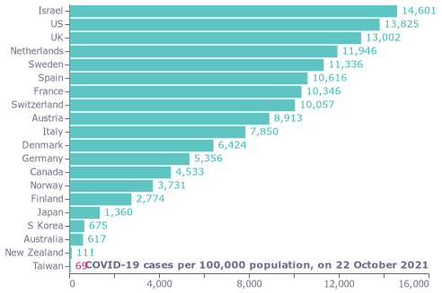
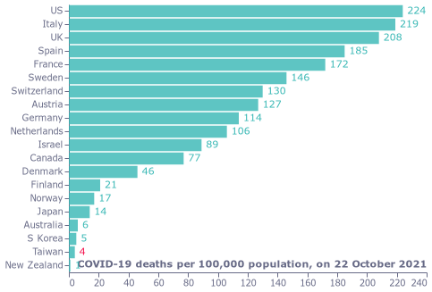
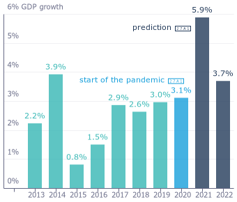
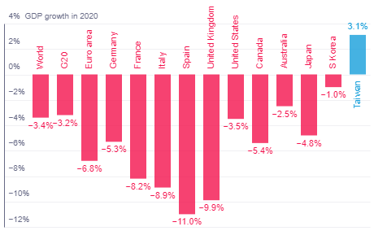
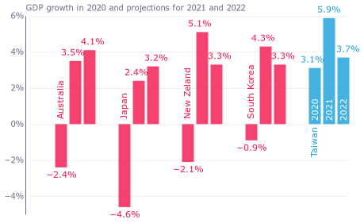
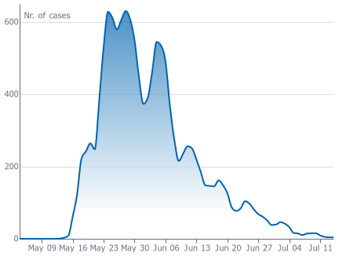
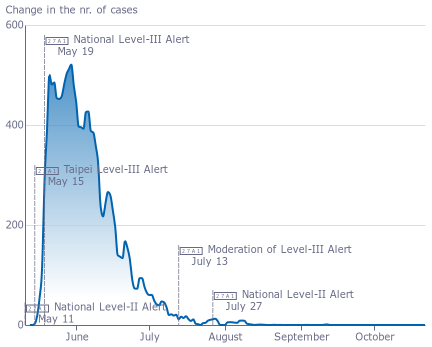

### fig1_cases_local

### fig2_deaths_local

### fig3_growth_local

### fig4_growth_world_local

### fig4_growth_world_local

### fig5_projections_local

### fig6_outbreak_local

### fig7_changes_local

