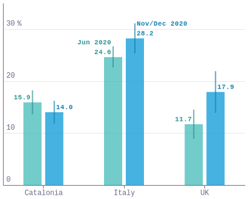
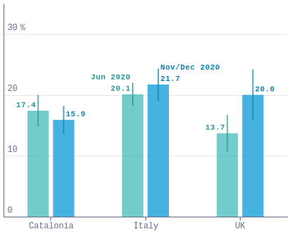
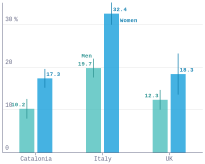
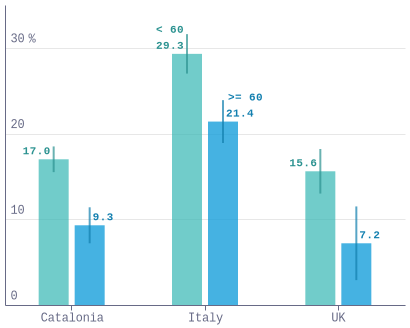
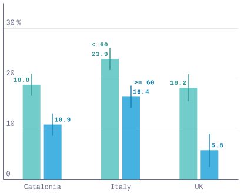
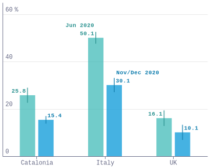
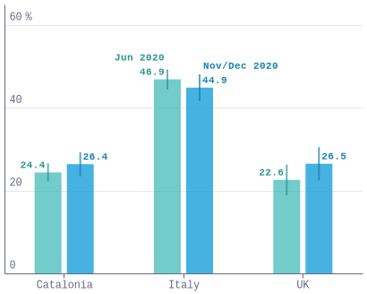
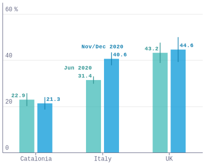

### fig1a_anxiety

### fig1b_depression

### fig2a_anxiety_sex

### fig2b_depression_sex

### fig2c_anxiety_age

### fig2d_depression_age

### fig3a_ppe

### fig3b_vulnerable

### fig3c_directly

### fig3d_death

