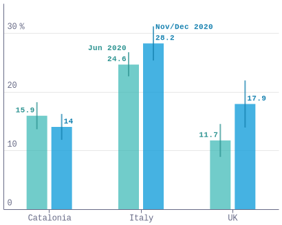
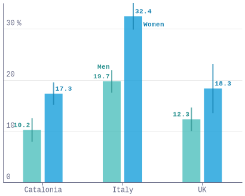
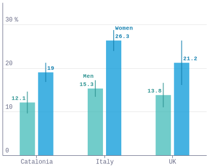
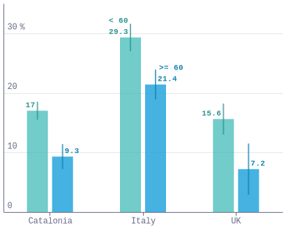
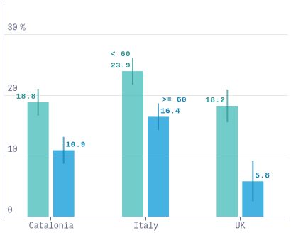
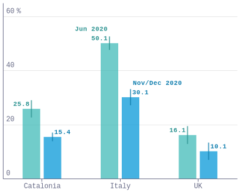
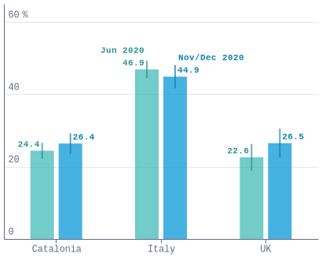
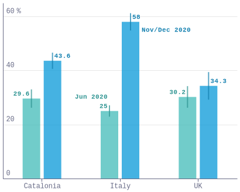
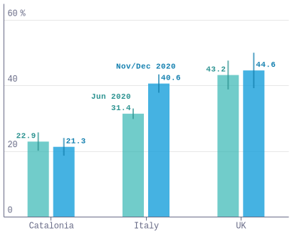

### fig1a_anxiety_local

### fig1b_depression_local

### fig2a_anxiety_sex_local

### fig2b_depression_sex_local

### fig2c_anxiety_age_local

### fig2d_depression_age_local

### fig3a_ppe_local

### fig3b_vulnerable_local

### fig3c_directly_local

### fig3d_death_local

