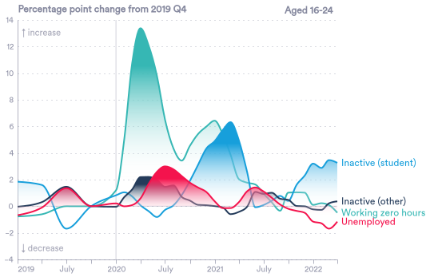
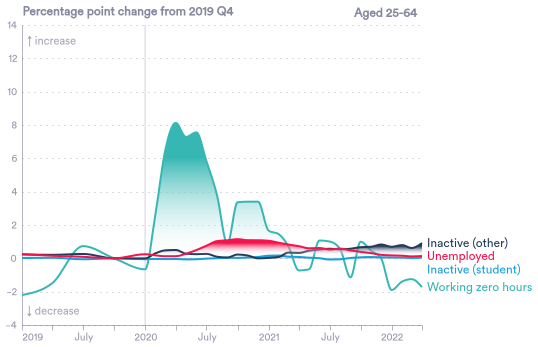
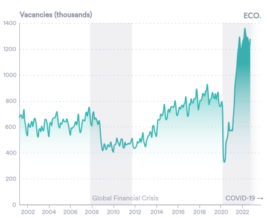
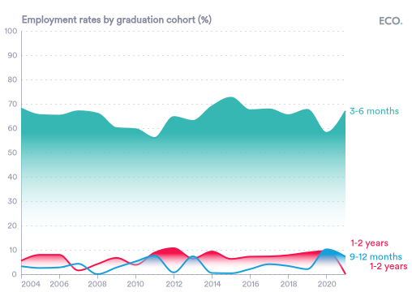

### Figure 1a  

Versions with data locally embedded into the `Vega-lite` specification file: [`png`](visualisation/fig1a_worklessness_local.png) [`svg`](visualisation/fig1a_worklessness_local.svg) [`json`](visualisation/fig1a_worklessness_local.json)   
Versions with data loaded from `GitHub`: [`png`](visualisation/fig1a_worklessness.png) [`svg`](visualisation/fig1a_worklessness.svg) [`json`](visualisation/fig1a_worklessness.json)   
Versions (no ECO branding) with data locally embedded into the `Vega-lite` specification file: [`png`](visualisation/fig1a_worklessness_local_no_branding.png) [`svg`](visualisation/fig1a_worklessness_local_no_branding.svg) [`json`](visualisation/fig1a_worklessness_local_no_branding.json)   
Versions (no ECO branding) with data loaded from `GitHub`: [`png`](visualisation/fig1a_worklessness_no_branding.png) [`svg`](visualisation/fig1a_worklessness_no_branding.svg) [`json`](visualisation/fig1a_worklessness_no_branding.json)   

Data: [`csv`](data/fig1a_worklessness.csv)  
GitHub: [fig1a_worklessness](https://github.com/EconomicsObservatory/ECOvisualisations/tree/main/articles/how-has-the-pandemic-affected-young-peoples-employment)  

### Figure 1b  

Versions with data locally embedded into the `Vega-lite` specification file: [`png`](visualisation/fig1b_worklessness25_local.png) [`svg`](visualisation/fig1b_worklessness25_local.svg) [`json`](visualisation/fig1b_worklessness25_local.json)   
Versions with data loaded from `GitHub`: [`png`](visualisation/fig1b_worklessness25.png) [`svg`](visualisation/fig1b_worklessness25.svg) [`json`](visualisation/fig1b_worklessness25.json)   
Versions (no ECO branding) with data locally embedded into the `Vega-lite` specification file: [`png`](visualisation/fig1b_worklessness25_local_no_branding.png) [`svg`](visualisation/fig1b_worklessness25_local_no_branding.svg) [`json`](visualisation/fig1b_worklessness25_local_no_branding.json)   
Versions (no ECO branding) with data loaded from `GitHub`: [`png`](visualisation/fig1b_worklessness25_no_branding.png) [`svg`](visualisation/fig1b_worklessness25_no_branding.svg) [`json`](visualisation/fig1b_worklessness25_no_branding.json)   

Data: [`csv`](data/fig1b_worklessness25.csv)  
GitHub: [fig1b_worklessness25](https://github.com/EconomicsObservatory/ECOvisualisations/tree/main/articles/how-has-the-pandemic-affected-young-peoples-employment)  

### Figure 2  

Versions with data locally embedded into the `Vega-lite` specification file: [`png`](visualisation/fig2_vacancies_local.png) [`svg`](visualisation/fig2_vacancies_local.svg) [`json`](visualisation/fig2_vacancies_local.json)   
Versions with data loaded from `GitHub`: [`png`](visualisation/fig2_vacancies.png) [`svg`](visualisation/fig2_vacancies.svg) [`json`](visualisation/fig2_vacancies.json)   
Versions (no ECO branding) with data locally embedded into the `Vega-lite` specification file: [`png`](visualisation/fig2_vacancies_local_no_branding.png) [`svg`](visualisation/fig2_vacancies_local_no_branding.svg) [`json`](visualisation/fig2_vacancies_local_no_branding.json)   
Versions (no ECO branding) with data loaded from `GitHub`: [`png`](visualisation/fig2_vacancies_no_branding.png) [`svg`](visualisation/fig2_vacancies_no_branding.svg) [`json`](visualisation/fig2_vacancies_no_branding.json)   

Data: [`csv`](data/fig2_vacancies.csv)  
GitHub: [fig2_vacancies](https://github.com/EconomicsObservatory/ECOvisualisations/tree/main/articles/how-has-the-pandemic-affected-young-peoples-employment)  

### Figure 3  

Versions with data locally embedded into the `Vega-lite` specification file: [`png`](visualisation/fig3_graduation_local.png) [`svg`](visualisation/fig3_graduation_local.svg) [`json`](visualisation/fig3_graduation_local.json)   
Versions with data loaded from `GitHub`: [`png`](visualisation/fig3_graduation.png) [`svg`](visualisation/fig3_graduation.svg) [`json`](visualisation/fig3_graduation.json)   
Versions (no ECO branding) with data locally embedded into the `Vega-lite` specification file: [`png`](visualisation/fig3_graduation_local_no_branding.png) [`svg`](visualisation/fig3_graduation_local_no_branding.svg) [`json`](visualisation/fig3_graduation_local_no_branding.json)   
Versions (no ECO branding) with data loaded from `GitHub`: [`png`](visualisation/fig3_graduation_no_branding.png) [`svg`](visualisation/fig3_graduation_no_branding.svg) [`json`](visualisation/fig3_graduation_no_branding.json)   

Data: [`csv`](data/fig3_graduation.csv)  
GitHub: [fig3_graduation](https://github.com/EconomicsObservatory/ECOvisualisations/tree/main/articles/how-has-the-pandemic-affected-young-peoples-employment)  

### Figure 4  

Versions with data locally embedded into the `Vega-lite` specification file: [`png`](visualisation/fig4_job_quality_local.png) [`svg`](visualisation/fig4_job_quality_local.svg) [`json`](visualisation/fig4_job_quality_local.json)   
Versions with data loaded from `GitHub`: [`png`](visualisation/fig4_job_quality.png) [`svg`](visualisation/fig4_job_quality.svg) [`json`](visualisation/fig4_job_quality.json)   
Versions (no ECO branding) with data locally embedded into the `Vega-lite` specification file: [`png`](visualisation/fig4_job_quality_local_no_branding.png) [`svg`](visualisation/fig4_job_quality_local_no_branding.svg) [`json`](visualisation/fig4_job_quality_local_no_branding.json)   
Versions (no ECO branding) with data loaded from `GitHub`: [`png`](visualisation/fig4_job_quality_no_branding.png) [`svg`](visualisation/fig4_job_quality_no_branding.svg) [`json`](visualisation/fig4_job_quality_no_branding.json)   

Data: [`csv`](data/fig4_job_quality.csv)  
GitHub: [fig4_job_quality](https://github.com/EconomicsObservatory/ECOvisualisations/tree/main/articles/how-has-the-pandemic-affected-young-peoples-employment)  

