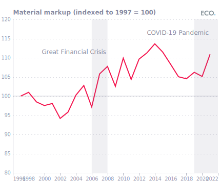
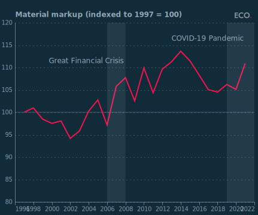
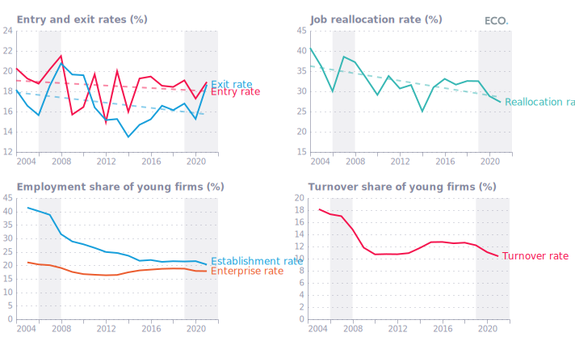
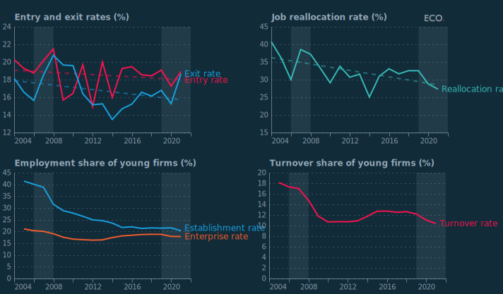
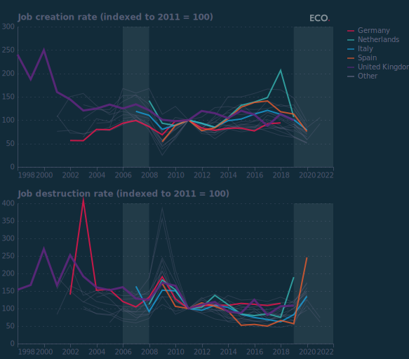

## Figure 1  

Data: [`csv`](data/fig1_markup.csv)  
GitHub: [fig1_markup](https://github.com/EconomicsObservatory/ECOvisualisations/tree/main/articles/how-is-competition-changing-across-the-uk-economy)  

### Light theme  

Versions with data locally embedded into the `Vega-lite` specification file: [`png`](visualisation/fig1_markup_local.png) [`svg`](visualisation/fig1_markup_local.svg) [`json`](visualisation/fig1_markup_local.json)   
 (**Default**) Versions with data loaded from `GitHub`: [`png`](visualisation/fig1_markup.png) [`svg`](visualisation/fig1_markup.svg) [`json`](visualisation/fig1_markup.json)  
Versions (no ECO branding) with data locally embedded into the `Vega-lite` specification file: [`png`](visualisation/fig1_markup_local_no_branding.png) [`svg`](visualisation/fig1_markup_local_no_branding.svg) [`json`](visualisation/fig1_markup_local_no_branding.json)   
Versions (no ECO branding) with data loaded from `GitHub`: [`png`](visualisation/fig1_markup_no_branding.png) [`svg`](visualisation/fig1_markup_no_branding.svg) [`json`](visualisation/fig1_markup_no_branding.json)   

### Dark theme  

Versions with data locally embedded into the `Vega-lite` specification file: [`png`](visualisation/fig1_markup_local_dark.png) [`svg`](visualisation/fig1_markup_local_dark.svg) [`json`](visualisation/fig1_markup_local_dark.json)   
 Versions with data loaded from `GitHub`: [`png`](visualisation/fig1_markup_dark.png) [`svg`](visualisation/fig1_markup_dark.svg) [`json`](visualisation/fig1_markup_dark.json)  
Versions (no ECO branding) with data locally embedded into the `Vega-lite` specification file: [`png`](visualisation/fig1_markup_local_no_branding_dark.png) [`svg`](visualisation/fig1_markup_local_no_branding_dark.svg) [`json`](visualisation/fig1_markup_local_no_branding_dark.json)   
Versions (no ECO branding) with data loaded from `GitHub`: [`png`](visualisation/fig1_markup_no_branding_dark.png) [`svg`](visualisation/fig1_markup_no_branding_dark.svg) [`json`](visualisation/fig1_markup_no_branding_dark.json)   

  

## Figure 2  

Data: [`csv`](data/fig2_empl.csv)  
GitHub: [fig2_empl](https://github.com/EconomicsObservatory/ECOvisualisations/tree/main/articles/how-is-competition-changing-across-the-uk-economy)  

### Light theme  

Versions with data locally embedded into the `Vega-lite` specification file: [`png`](visualisation/fig2_empl_local.png) [`svg`](visualisation/fig2_empl_local.svg) [`json`](visualisation/fig2_empl_local.json)   
 (**Default**) Versions with data loaded from `GitHub`: [`png`](visualisation/fig2_empl.png) [`svg`](visualisation/fig2_empl.svg) [`json`](visualisation/fig2_empl.json)  
Versions (no ECO branding) with data locally embedded into the `Vega-lite` specification file: [`png`](visualisation/fig2_empl_local_no_branding.png) [`svg`](visualisation/fig2_empl_local_no_branding.svg) [`json`](visualisation/fig2_empl_local_no_branding.json)   
Versions (no ECO branding) with data loaded from `GitHub`: [`png`](visualisation/fig2_empl_no_branding.png) [`svg`](visualisation/fig2_empl_no_branding.svg) [`json`](visualisation/fig2_empl_no_branding.json)   

### Dark theme  

Versions with data locally embedded into the `Vega-lite` specification file: [`png`](visualisation/fig2_empl_local_dark.png) [`svg`](visualisation/fig2_empl_local_dark.svg) [`json`](visualisation/fig2_empl_local_dark.json)   
 Versions with data loaded from `GitHub`: [`png`](visualisation/fig2_empl_dark.png) [`svg`](visualisation/fig2_empl_dark.svg) [`json`](visualisation/fig2_empl_dark.json)  
Versions (no ECO branding) with data locally embedded into the `Vega-lite` specification file: [`png`](visualisation/fig2_empl_local_no_branding_dark.png) [`svg`](visualisation/fig2_empl_local_no_branding_dark.svg) [`json`](visualisation/fig2_empl_local_no_branding_dark.json)   
Versions (no ECO branding) with data loaded from `GitHub`: [`png`](visualisation/fig2_empl_no_branding_dark.png) [`svg`](visualisation/fig2_empl_no_branding_dark.svg) [`json`](visualisation/fig2_empl_no_branding_dark.json)   

  

## Figure 3  

Data: [`csv`](data/fig3_job.csv)  
GitHub: [fig3_job](https://github.com/EconomicsObservatory/ECOvisualisations/tree/main/articles/how-is-competition-changing-across-the-uk-economy)  

### Light theme  

Versions with data locally embedded into the `Vega-lite` specification file: [`png`](visualisation/fig3_job_local.png) [`svg`](visualisation/fig3_job_local.svg) [`json`](visualisation/fig3_job_local.json)   
 (**Default**) Versions with data loaded from `GitHub`: [`png`](visualisation/fig3_job.png) [`svg`](visualisation/fig3_job.svg) [`json`](visualisation/fig3_job.json)  
Versions (no ECO branding) with data locally embedded into the `Vega-lite` specification file: [`png`](visualisation/fig3_job_local_no_branding.png) [`svg`](visualisation/fig3_job_local_no_branding.svg) [`json`](visualisation/fig3_job_local_no_branding.json)   
Versions (no ECO branding) with data loaded from `GitHub`: [`png`](visualisation/fig3_job_no_branding.png) [`svg`](visualisation/fig3_job_no_branding.svg) [`json`](visualisation/fig3_job_no_branding.json)   

### Dark theme  

Versions with data locally embedded into the `Vega-lite` specification file: [`png`](visualisation/fig3_job_local_dark.png) [`svg`](visualisation/fig3_job_local_dark.svg) [`json`](visualisation/fig3_job_local_dark.json)   
 Versions with data loaded from `GitHub`: [`png`](visualisation/fig3_job_dark.png) [`svg`](visualisation/fig3_job_dark.svg) [`json`](visualisation/fig3_job_dark.json)  
Versions (no ECO branding) with data locally embedded into the `Vega-lite` specification file: [`png`](visualisation/fig3_job_local_no_branding_dark.png) [`svg`](visualisation/fig3_job_local_no_branding_dark.svg) [`json`](visualisation/fig3_job_local_no_branding_dark.json)   
Versions (no ECO branding) with data loaded from `GitHub`: [`png`](visualisation/fig3_job_no_branding_dark.png) [`svg`](visualisation/fig3_job_no_branding_dark.svg) [`json`](visualisation/fig3_job_no_branding_dark.json)   

  

## Figure 3  

Data: [`csv`](data/fig3_job.csv)  
GitHub: [fig3_job](https://github.com/EconomicsObservatory/ECOvisualisations/tree/main/articles/how-is-competition-changing-across-the-uk-economy)  

### Light theme  

Versions with data locally embedded into the `Vega-lite` specification file: [`png`](visualisation/fig3_job_local.png) [`svg`](visualisation/fig3_job_local.svg) [`json`](visualisation/fig3_job_local.json)   
 (**Default**) Versions with data loaded from `GitHub`: [`png`](visualisation/fig3_job.png) [`svg`](visualisation/fig3_job.svg) [`json`](visualisation/fig3_job.json)  
Versions (no ECO branding) with data locally embedded into the `Vega-lite` specification file: [`png`](visualisation/fig3_job_local_no_branding.png) [`svg`](visualisation/fig3_job_local_no_branding.svg) [`json`](visualisation/fig3_job_local_no_branding.json)   
Versions (no ECO branding) with data loaded from `GitHub`: [`png`](visualisation/fig3_job_no_branding.png) [`svg`](visualisation/fig3_job_no_branding.svg) [`json`](visualisation/fig3_job_no_branding.json)   

### Dark theme  

Versions with data locally embedded into the `Vega-lite` specification file: [`png`](visualisation/fig3_job_local_dark.png) [`svg`](visualisation/fig3_job_local_dark.svg) [`json`](visualisation/fig3_job_local_dark.json)   
 Versions with data loaded from `GitHub`: [`png`](visualisation/fig3_job_dark.png) [`svg`](visualisation/fig3_job_dark.svg) [`json`](visualisation/fig3_job_dark.json)  
Versions (no ECO branding) with data locally embedded into the `Vega-lite` specification file: [`png`](visualisation/fig3_job_local_no_branding_dark.png) [`svg`](visualisation/fig3_job_local_no_branding_dark.svg) [`json`](visualisation/fig3_job_local_no_branding_dark.json)   
Versions (no ECO branding) with data loaded from `GitHub`: [`png`](visualisation/fig3_job_no_branding_dark.png) [`svg`](visualisation/fig3_job_no_branding_dark.svg) [`json`](visualisation/fig3_job_no_branding_dark.json)   

  

