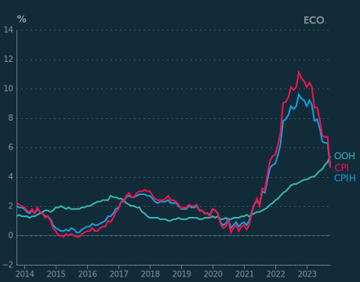
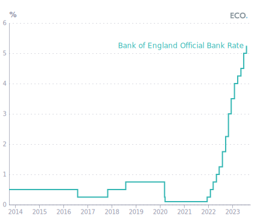
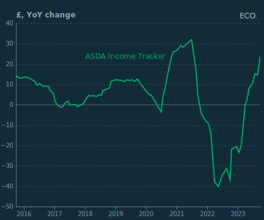
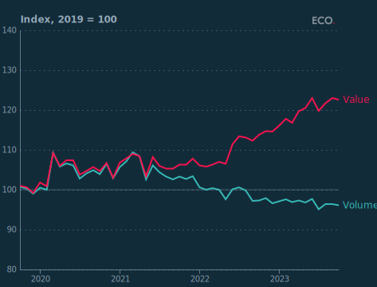

## Figure 1  

Data: [`csv`](data/fig1_cpi_local.csv)  
GitHub: [fig1_cpi_local](https://github.com/EconomicsObservatory/ECOvisualisations/tree/main/articles/how-is-consumer-spending-around-christmas-2023-likely-to-affect-retailers)  

### Light theme  

Versions with data locally embedded into the `Vega-lite` specification file: [`png`](visualisation/fig1_cpi_local_local.png) [`svg`](visualisation/fig1_cpi_local_local.svg) [`json`](visualisation/fig1_cpi_local_local.json)   
 (**Default**) Versions with data loaded from `GitHub`: [`png`](visualisation/fig1_cpi_local.png) [`svg`](visualisation/fig1_cpi_local.svg) [`json`](visualisation/fig1_cpi_local.json)  
Versions (no ECO branding) with data locally embedded into the `Vega-lite` specification file: [`png`](visualisation/fig1_cpi_local_local_no_branding.png) [`svg`](visualisation/fig1_cpi_local_local_no_branding.svg) [`json`](visualisation/fig1_cpi_local_local_no_branding.json)   
Versions (no ECO branding) with data loaded from `GitHub`: [`png`](visualisation/fig1_cpi_local_no_branding.png) [`svg`](visualisation/fig1_cpi_local_no_branding.svg) [`json`](visualisation/fig1_cpi_local_no_branding.json)   

### Dark theme  

Versions with data locally embedded into the `Vega-lite` specification file: [`png`](visualisation/fig1_cpi_local_local_dark.png) [`svg`](visualisation/fig1_cpi_local_local_dark.svg) [`json`](visualisation/fig1_cpi_local_local_dark.json)   
 Versions with data loaded from `GitHub`: [`png`](visualisation/fig1_cpi_local_dark.png) [`svg`](visualisation/fig1_cpi_local_dark.svg) [`json`](visualisation/fig1_cpi_local_dark.json)  
Versions (no ECO branding) with data locally embedded into the `Vega-lite` specification file: [`png`](visualisation/fig1_cpi_local_local_no_branding_dark.png) [`svg`](visualisation/fig1_cpi_local_local_no_branding_dark.svg) [`json`](visualisation/fig1_cpi_local_local_no_branding_dark.json)   
Versions (no ECO branding) with data loaded from `GitHub`: [`png`](visualisation/fig1_cpi_local_no_branding_dark.png) [`svg`](visualisation/fig1_cpi_local_no_branding_dark.svg) [`json`](visualisation/fig1_cpi_local_no_branding_dark.json)   

  

## Figure 2  

Data: [`csv`](data/fig2_boe_rate_local.csv)  
GitHub: [fig2_boe_rate_local](https://github.com/EconomicsObservatory/ECOvisualisations/tree/main/articles/how-is-consumer-spending-around-christmas-2023-likely-to-affect-retailers)  

### Light theme  

Versions with data locally embedded into the `Vega-lite` specification file: [`png`](visualisation/fig2_boe_rate_local_local.png) [`svg`](visualisation/fig2_boe_rate_local_local.svg) [`json`](visualisation/fig2_boe_rate_local_local.json)   
 (**Default**) Versions with data loaded from `GitHub`: [`png`](visualisation/fig2_boe_rate_local.png) [`svg`](visualisation/fig2_boe_rate_local.svg) [`json`](visualisation/fig2_boe_rate_local.json)  
Versions (no ECO branding) with data locally embedded into the `Vega-lite` specification file: [`png`](visualisation/fig2_boe_rate_local_local_no_branding.png) [`svg`](visualisation/fig2_boe_rate_local_local_no_branding.svg) [`json`](visualisation/fig2_boe_rate_local_local_no_branding.json)   
Versions (no ECO branding) with data loaded from `GitHub`: [`png`](visualisation/fig2_boe_rate_local_no_branding.png) [`svg`](visualisation/fig2_boe_rate_local_no_branding.svg) [`json`](visualisation/fig2_boe_rate_local_no_branding.json)   

### Dark theme  

Versions with data locally embedded into the `Vega-lite` specification file: [`png`](visualisation/fig2_boe_rate_local_local_dark.png) [`svg`](visualisation/fig2_boe_rate_local_local_dark.svg) [`json`](visualisation/fig2_boe_rate_local_local_dark.json)   
 Versions with data loaded from `GitHub`: [`png`](visualisation/fig2_boe_rate_local_dark.png) [`svg`](visualisation/fig2_boe_rate_local_dark.svg) [`json`](visualisation/fig2_boe_rate_local_dark.json)  
Versions (no ECO branding) with data locally embedded into the `Vega-lite` specification file: [`png`](visualisation/fig2_boe_rate_local_local_no_branding_dark.png) [`svg`](visualisation/fig2_boe_rate_local_local_no_branding_dark.svg) [`json`](visualisation/fig2_boe_rate_local_local_no_branding_dark.json)   
Versions (no ECO branding) with data loaded from `GitHub`: [`png`](visualisation/fig2_boe_rate_local_no_branding_dark.png) [`svg`](visualisation/fig2_boe_rate_local_no_branding_dark.svg) [`json`](visualisation/fig2_boe_rate_local_no_branding_dark.json)   

  

## Figure 3  

Data: [`csv`](data/fig3_pay_local.csv)  
GitHub: [fig3_pay_local](https://github.com/EconomicsObservatory/ECOvisualisations/tree/main/articles/how-is-consumer-spending-around-christmas-2023-likely-to-affect-retailers)  

### Light theme  

Versions with data locally embedded into the `Vega-lite` specification file: [`png`](visualisation/fig3_pay_local_local.png) [`svg`](visualisation/fig3_pay_local_local.svg) [`json`](visualisation/fig3_pay_local_local.json)   
 (**Default**) Versions with data loaded from `GitHub`: [`png`](visualisation/fig3_pay_local.png) [`svg`](visualisation/fig3_pay_local.svg) [`json`](visualisation/fig3_pay_local.json)  
Versions (no ECO branding) with data locally embedded into the `Vega-lite` specification file: [`png`](visualisation/fig3_pay_local_local_no_branding.png) [`svg`](visualisation/fig3_pay_local_local_no_branding.svg) [`json`](visualisation/fig3_pay_local_local_no_branding.json)   
Versions (no ECO branding) with data loaded from `GitHub`: [`png`](visualisation/fig3_pay_local_no_branding.png) [`svg`](visualisation/fig3_pay_local_no_branding.svg) [`json`](visualisation/fig3_pay_local_no_branding.json)   

### Dark theme  

Versions with data locally embedded into the `Vega-lite` specification file: [`png`](visualisation/fig3_pay_local_local_dark.png) [`svg`](visualisation/fig3_pay_local_local_dark.svg) [`json`](visualisation/fig3_pay_local_local_dark.json)   
 Versions with data loaded from `GitHub`: [`png`](visualisation/fig3_pay_local_dark.png) [`svg`](visualisation/fig3_pay_local_dark.svg) [`json`](visualisation/fig3_pay_local_dark.json)  
Versions (no ECO branding) with data locally embedded into the `Vega-lite` specification file: [`png`](visualisation/fig3_pay_local_local_no_branding_dark.png) [`svg`](visualisation/fig3_pay_local_local_no_branding_dark.svg) [`json`](visualisation/fig3_pay_local_local_no_branding_dark.json)   
Versions (no ECO branding) with data loaded from `GitHub`: [`png`](visualisation/fig3_pay_local_no_branding_dark.png) [`svg`](visualisation/fig3_pay_local_no_branding_dark.svg) [`json`](visualisation/fig3_pay_local_no_branding_dark.json)   

  

## Figure 4  

Data: [`csv`](data/fig4_asda_local.csv)  
GitHub: [fig4_asda_local](https://github.com/EconomicsObservatory/ECOvisualisations/tree/main/articles/how-is-consumer-spending-around-christmas-2023-likely-to-affect-retailers)  

### Light theme  

Versions with data locally embedded into the `Vega-lite` specification file: [`png`](visualisation/fig4_asda_local_local.png) [`svg`](visualisation/fig4_asda_local_local.svg) [`json`](visualisation/fig4_asda_local_local.json)   
 (**Default**) Versions with data loaded from `GitHub`: [`png`](visualisation/fig4_asda_local.png) [`svg`](visualisation/fig4_asda_local.svg) [`json`](visualisation/fig4_asda_local.json)  
Versions (no ECO branding) with data locally embedded into the `Vega-lite` specification file: [`png`](visualisation/fig4_asda_local_local_no_branding.png) [`svg`](visualisation/fig4_asda_local_local_no_branding.svg) [`json`](visualisation/fig4_asda_local_local_no_branding.json)   
Versions (no ECO branding) with data loaded from `GitHub`: [`png`](visualisation/fig4_asda_local_no_branding.png) [`svg`](visualisation/fig4_asda_local_no_branding.svg) [`json`](visualisation/fig4_asda_local_no_branding.json)   

### Dark theme  

Versions with data locally embedded into the `Vega-lite` specification file: [`png`](visualisation/fig4_asda_local_local_dark.png) [`svg`](visualisation/fig4_asda_local_local_dark.svg) [`json`](visualisation/fig4_asda_local_local_dark.json)   
 Versions with data loaded from `GitHub`: [`png`](visualisation/fig4_asda_local_dark.png) [`svg`](visualisation/fig4_asda_local_dark.svg) [`json`](visualisation/fig4_asda_local_dark.json)  
Versions (no ECO branding) with data locally embedded into the `Vega-lite` specification file: [`png`](visualisation/fig4_asda_local_local_no_branding_dark.png) [`svg`](visualisation/fig4_asda_local_local_no_branding_dark.svg) [`json`](visualisation/fig4_asda_local_local_no_branding_dark.json)   
Versions (no ECO branding) with data loaded from `GitHub`: [`png`](visualisation/fig4_asda_local_no_branding_dark.png) [`svg`](visualisation/fig4_asda_local_no_branding_dark.svg) [`json`](visualisation/fig4_asda_local_no_branding_dark.json)   

  

## Figure 5  

Data: [`csv`](data/fig5_quint_local.csv)  
GitHub: [fig5_quint_local](https://github.com/EconomicsObservatory/ECOvisualisations/tree/main/articles/how-is-consumer-spending-around-christmas-2023-likely-to-affect-retailers)  

### Light theme  

Versions with data locally embedded into the `Vega-lite` specification file: [`png`](visualisation/fig5_quint_local_local.png) [`svg`](visualisation/fig5_quint_local_local.svg) [`json`](visualisation/fig5_quint_local_local.json)   
 (**Default**) Versions with data loaded from `GitHub`: [`png`](visualisation/fig5_quint_local.png) [`svg`](visualisation/fig5_quint_local.svg) [`json`](visualisation/fig5_quint_local.json)  
Versions (no ECO branding) with data locally embedded into the `Vega-lite` specification file: [`png`](visualisation/fig5_quint_local_local_no_branding.png) [`svg`](visualisation/fig5_quint_local_local_no_branding.svg) [`json`](visualisation/fig5_quint_local_local_no_branding.json)   
Versions (no ECO branding) with data loaded from `GitHub`: [`png`](visualisation/fig5_quint_local_no_branding.png) [`svg`](visualisation/fig5_quint_local_no_branding.svg) [`json`](visualisation/fig5_quint_local_no_branding.json)   

### Dark theme  

Versions with data locally embedded into the `Vega-lite` specification file: [`png`](visualisation/fig5_quint_local_local_dark.png) [`svg`](visualisation/fig5_quint_local_local_dark.svg) [`json`](visualisation/fig5_quint_local_local_dark.json)   
 Versions with data loaded from `GitHub`: [`png`](visualisation/fig5_quint_local_dark.png) [`svg`](visualisation/fig5_quint_local_dark.svg) [`json`](visualisation/fig5_quint_local_dark.json)  
Versions (no ECO branding) with data locally embedded into the `Vega-lite` specification file: [`png`](visualisation/fig5_quint_local_local_no_branding_dark.png) [`svg`](visualisation/fig5_quint_local_local_no_branding_dark.svg) [`json`](visualisation/fig5_quint_local_local_no_branding_dark.json)   
Versions (no ECO branding) with data loaded from `GitHub`: [`png`](visualisation/fig5_quint_local_no_branding_dark.png) [`svg`](visualisation/fig5_quint_local_no_branding_dark.svg) [`json`](visualisation/fig5_quint_local_no_branding_dark.json)   

  

## Figure 6  

Data: [`csv`](data/fig6_food_local.csv)  
GitHub: [fig6_food_local](https://github.com/EconomicsObservatory/ECOvisualisations/tree/main/articles/how-is-consumer-spending-around-christmas-2023-likely-to-affect-retailers)  

### Light theme  

Versions with data locally embedded into the `Vega-lite` specification file: [`png`](visualisation/fig6_food_local_local.png) [`svg`](visualisation/fig6_food_local_local.svg) [`json`](visualisation/fig6_food_local_local.json)   
 (**Default**) Versions with data loaded from `GitHub`: [`png`](visualisation/fig6_food_local.png) [`svg`](visualisation/fig6_food_local.svg) [`json`](visualisation/fig6_food_local.json)  
Versions (no ECO branding) with data locally embedded into the `Vega-lite` specification file: [`png`](visualisation/fig6_food_local_local_no_branding.png) [`svg`](visualisation/fig6_food_local_local_no_branding.svg) [`json`](visualisation/fig6_food_local_local_no_branding.json)   
Versions (no ECO branding) with data loaded from `GitHub`: [`png`](visualisation/fig6_food_local_no_branding.png) [`svg`](visualisation/fig6_food_local_no_branding.svg) [`json`](visualisation/fig6_food_local_no_branding.json)   

### Dark theme  

Versions with data locally embedded into the `Vega-lite` specification file: [`png`](visualisation/fig6_food_local_local_dark.png) [`svg`](visualisation/fig6_food_local_local_dark.svg) [`json`](visualisation/fig6_food_local_local_dark.json)   
 Versions with data loaded from `GitHub`: [`png`](visualisation/fig6_food_local_dark.png) [`svg`](visualisation/fig6_food_local_dark.svg) [`json`](visualisation/fig6_food_local_dark.json)  
Versions (no ECO branding) with data locally embedded into the `Vega-lite` specification file: [`png`](visualisation/fig6_food_local_local_no_branding_dark.png) [`svg`](visualisation/fig6_food_local_local_no_branding_dark.svg) [`json`](visualisation/fig6_food_local_local_no_branding_dark.json)   
Versions (no ECO branding) with data loaded from `GitHub`: [`png`](visualisation/fig6_food_local_no_branding_dark.png) [`svg`](visualisation/fig6_food_local_no_branding_dark.svg) [`json`](visualisation/fig6_food_local_no_branding_dark.json)   

  

## Figure 7  

Data: [`csv`](data/fig7_gfk_local.csv)  
GitHub: [fig7_gfk_local](https://github.com/EconomicsObservatory/ECOvisualisations/tree/main/articles/how-is-consumer-spending-around-christmas-2023-likely-to-affect-retailers)  

### Light theme  

Versions with data locally embedded into the `Vega-lite` specification file: [`png`](visualisation/fig7_gfk_local_local.png) [`svg`](visualisation/fig7_gfk_local_local.svg) [`json`](visualisation/fig7_gfk_local_local.json)   
 (**Default**) Versions with data loaded from `GitHub`: [`png`](visualisation/fig7_gfk_local.png) [`svg`](visualisation/fig7_gfk_local.svg) [`json`](visualisation/fig7_gfk_local.json)  
Versions (no ECO branding) with data locally embedded into the `Vega-lite` specification file: [`png`](visualisation/fig7_gfk_local_local_no_branding.png) [`svg`](visualisation/fig7_gfk_local_local_no_branding.svg) [`json`](visualisation/fig7_gfk_local_local_no_branding.json)   
Versions (no ECO branding) with data loaded from `GitHub`: [`png`](visualisation/fig7_gfk_local_no_branding.png) [`svg`](visualisation/fig7_gfk_local_no_branding.svg) [`json`](visualisation/fig7_gfk_local_no_branding.json)   

### Dark theme  

Versions with data locally embedded into the `Vega-lite` specification file: [`png`](visualisation/fig7_gfk_local_local_dark.png) [`svg`](visualisation/fig7_gfk_local_local_dark.svg) [`json`](visualisation/fig7_gfk_local_local_dark.json)   
 Versions with data loaded from `GitHub`: [`png`](visualisation/fig7_gfk_local_dark.png) [`svg`](visualisation/fig7_gfk_local_dark.svg) [`json`](visualisation/fig7_gfk_local_dark.json)  
Versions (no ECO branding) with data locally embedded into the `Vega-lite` specification file: [`png`](visualisation/fig7_gfk_local_local_no_branding_dark.png) [`svg`](visualisation/fig7_gfk_local_local_no_branding_dark.svg) [`json`](visualisation/fig7_gfk_local_local_no_branding_dark.json)   
Versions (no ECO branding) with data loaded from `GitHub`: [`png`](visualisation/fig7_gfk_local_no_branding_dark.png) [`svg`](visualisation/fig7_gfk_local_no_branding_dark.svg) [`json`](visualisation/fig7_gfk_local_no_branding_dark.json)   

  

## Figure 8  

Data: [`csv`](data/fig8_gifts_local.csv)  
GitHub: [fig8_gifts_local](https://github.com/EconomicsObservatory/ECOvisualisations/tree/main/articles/how-is-consumer-spending-around-christmas-2023-likely-to-affect-retailers)  

### Light theme  

Versions with data locally embedded into the `Vega-lite` specification file: [`png`](visualisation/fig8_gifts_local_local.png) [`svg`](visualisation/fig8_gifts_local_local.svg) [`json`](visualisation/fig8_gifts_local_local.json)   
 (**Default**) Versions with data loaded from `GitHub`: [`png`](visualisation/fig8_gifts_local.png) [`svg`](visualisation/fig8_gifts_local.svg) [`json`](visualisation/fig8_gifts_local.json)  
Versions (no ECO branding) with data locally embedded into the `Vega-lite` specification file: [`png`](visualisation/fig8_gifts_local_local_no_branding.png) [`svg`](visualisation/fig8_gifts_local_local_no_branding.svg) [`json`](visualisation/fig8_gifts_local_local_no_branding.json)   
Versions (no ECO branding) with data loaded from `GitHub`: [`png`](visualisation/fig8_gifts_local_no_branding.png) [`svg`](visualisation/fig8_gifts_local_no_branding.svg) [`json`](visualisation/fig8_gifts_local_no_branding.json)   

### Dark theme  

Versions with data locally embedded into the `Vega-lite` specification file: [`png`](visualisation/fig8_gifts_local_local_dark.png) [`svg`](visualisation/fig8_gifts_local_local_dark.svg) [`json`](visualisation/fig8_gifts_local_local_dark.json)   
 Versions with data loaded from `GitHub`: [`png`](visualisation/fig8_gifts_local_dark.png) [`svg`](visualisation/fig8_gifts_local_dark.svg) [`json`](visualisation/fig8_gifts_local_dark.json)  
Versions (no ECO branding) with data locally embedded into the `Vega-lite` specification file: [`png`](visualisation/fig8_gifts_local_local_no_branding_dark.png) [`svg`](visualisation/fig8_gifts_local_local_no_branding_dark.svg) [`json`](visualisation/fig8_gifts_local_local_no_branding_dark.json)   
Versions (no ECO branding) with data loaded from `GitHub`: [`png`](visualisation/fig8_gifts_local_no_branding_dark.png) [`svg`](visualisation/fig8_gifts_local_no_branding_dark.svg) [`json`](visualisation/fig8_gifts_local_no_branding_dark.json)   

  

