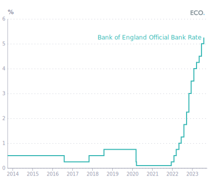
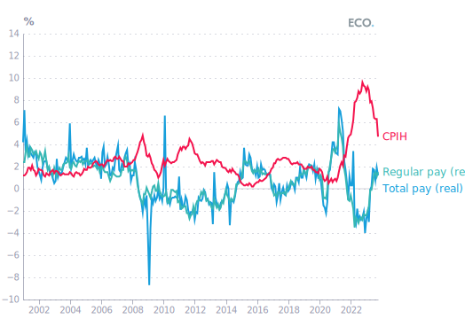
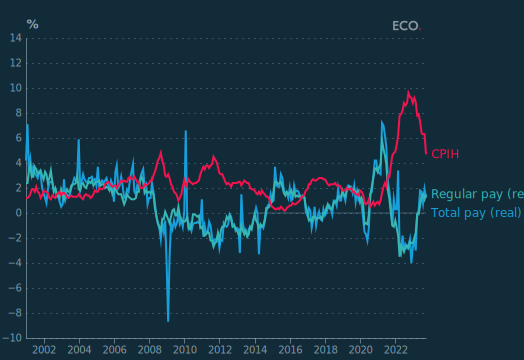
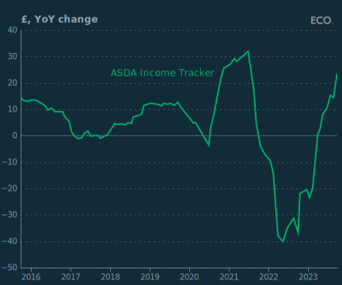
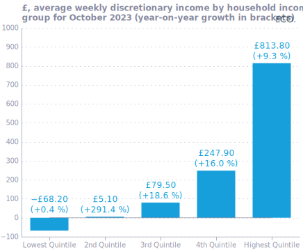
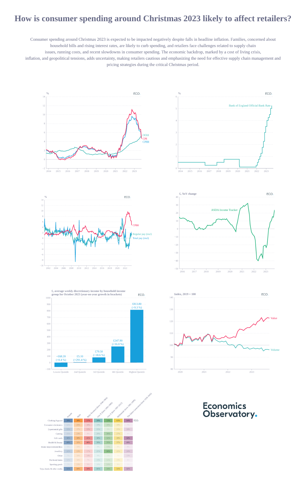

## Figure 1  

Data: [`csv`](data/fig1_cpi.csv)  
GitHub: [fig1_cpi](https://github.com/EconomicsObservatory/ECOvisualisations/tree/main/articles/how-is-consumer-spending-around-christmas-2023-likely-to-affect-retailers)  

### Light theme  

Versions with data locally embedded into the `Vega-lite` specification file: [`png`](visualisation/fig1_cpi_local.png) [`svg`](visualisation/fig1_cpi_local.svg) [`json`](visualisation/fig1_cpi_local.json)   
 (**Default**) Versions with data loaded from `GitHub`: [`png`](visualisation/fig1_cpi.png) [`svg`](visualisation/fig1_cpi.svg) [`json`](visualisation/fig1_cpi.json)  
Versions (no ECO branding) with data locally embedded into the `Vega-lite` specification file: [`png`](visualisation/fig1_cpi_local_no_branding.png) [`svg`](visualisation/fig1_cpi_local_no_branding.svg) [`json`](visualisation/fig1_cpi_local_no_branding.json)   
Versions (no ECO branding) with data loaded from `GitHub`: [`png`](visualisation/fig1_cpi_no_branding.png) [`svg`](visualisation/fig1_cpi_no_branding.svg) [`json`](visualisation/fig1_cpi_no_branding.json)   

### Dark theme  

Versions with data locally embedded into the `Vega-lite` specification file: [`png`](visualisation/fig1_cpi_local_dark.png) [`svg`](visualisation/fig1_cpi_local_dark.svg) [`json`](visualisation/fig1_cpi_local_dark.json)   
 Versions with data loaded from `GitHub`: [`png`](visualisation/fig1_cpi_dark.png) [`svg`](visualisation/fig1_cpi_dark.svg) [`json`](visualisation/fig1_cpi_dark.json)  
Versions (no ECO branding) with data locally embedded into the `Vega-lite` specification file: [`png`](visualisation/fig1_cpi_local_no_branding_dark.png) [`svg`](visualisation/fig1_cpi_local_no_branding_dark.svg) [`json`](visualisation/fig1_cpi_local_no_branding_dark.json)   
Versions (no ECO branding) with data loaded from `GitHub`: [`png`](visualisation/fig1_cpi_no_branding_dark.png) [`svg`](visualisation/fig1_cpi_no_branding_dark.svg) [`json`](visualisation/fig1_cpi_no_branding_dark.json)   

  

## Figure 2  

Data: [`csv`](data/fig2_boe_rate.csv)  
GitHub: [fig2_boe_rate](https://github.com/EconomicsObservatory/ECOvisualisations/tree/main/articles/how-is-consumer-spending-around-christmas-2023-likely-to-affect-retailers)  

### Light theme  

Versions with data locally embedded into the `Vega-lite` specification file: [`png`](visualisation/fig2_boe_rate_local.png) [`svg`](visualisation/fig2_boe_rate_local.svg) [`json`](visualisation/fig2_boe_rate_local.json)   
 (**Default**) Versions with data loaded from `GitHub`: [`png`](visualisation/fig2_boe_rate.png) [`svg`](visualisation/fig2_boe_rate.svg) [`json`](visualisation/fig2_boe_rate.json)  
Versions (no ECO branding) with data locally embedded into the `Vega-lite` specification file: [`png`](visualisation/fig2_boe_rate_local_no_branding.png) [`svg`](visualisation/fig2_boe_rate_local_no_branding.svg) [`json`](visualisation/fig2_boe_rate_local_no_branding.json)   
Versions (no ECO branding) with data loaded from `GitHub`: [`png`](visualisation/fig2_boe_rate_no_branding.png) [`svg`](visualisation/fig2_boe_rate_no_branding.svg) [`json`](visualisation/fig2_boe_rate_no_branding.json)   

### Dark theme  

Versions with data locally embedded into the `Vega-lite` specification file: [`png`](visualisation/fig2_boe_rate_local_dark.png) [`svg`](visualisation/fig2_boe_rate_local_dark.svg) [`json`](visualisation/fig2_boe_rate_local_dark.json)   
 Versions with data loaded from `GitHub`: [`png`](visualisation/fig2_boe_rate_dark.png) [`svg`](visualisation/fig2_boe_rate_dark.svg) [`json`](visualisation/fig2_boe_rate_dark.json)  
Versions (no ECO branding) with data locally embedded into the `Vega-lite` specification file: [`png`](visualisation/fig2_boe_rate_local_no_branding_dark.png) [`svg`](visualisation/fig2_boe_rate_local_no_branding_dark.svg) [`json`](visualisation/fig2_boe_rate_local_no_branding_dark.json)   
Versions (no ECO branding) with data loaded from `GitHub`: [`png`](visualisation/fig2_boe_rate_no_branding_dark.png) [`svg`](visualisation/fig2_boe_rate_no_branding_dark.svg) [`json`](visualisation/fig2_boe_rate_no_branding_dark.json)   

  

## Figure 3  

Data: [`csv`](data/fig3_pay.csv)  
GitHub: [fig3_pay](https://github.com/EconomicsObservatory/ECOvisualisations/tree/main/articles/how-is-consumer-spending-around-christmas-2023-likely-to-affect-retailers)  

### Light theme  

Versions with data locally embedded into the `Vega-lite` specification file: [`png`](visualisation/fig3_pay_local.png) [`svg`](visualisation/fig3_pay_local.svg) [`json`](visualisation/fig3_pay_local.json)   
 (**Default**) Versions with data loaded from `GitHub`: [`png`](visualisation/fig3_pay.png) [`svg`](visualisation/fig3_pay.svg) [`json`](visualisation/fig3_pay.json)  
Versions (no ECO branding) with data locally embedded into the `Vega-lite` specification file: [`png`](visualisation/fig3_pay_local_no_branding.png) [`svg`](visualisation/fig3_pay_local_no_branding.svg) [`json`](visualisation/fig3_pay_local_no_branding.json)   
Versions (no ECO branding) with data loaded from `GitHub`: [`png`](visualisation/fig3_pay_no_branding.png) [`svg`](visualisation/fig3_pay_no_branding.svg) [`json`](visualisation/fig3_pay_no_branding.json)   

### Dark theme  

Versions with data locally embedded into the `Vega-lite` specification file: [`png`](visualisation/fig3_pay_local_dark.png) [`svg`](visualisation/fig3_pay_local_dark.svg) [`json`](visualisation/fig3_pay_local_dark.json)   
 Versions with data loaded from `GitHub`: [`png`](visualisation/fig3_pay_dark.png) [`svg`](visualisation/fig3_pay_dark.svg) [`json`](visualisation/fig3_pay_dark.json)  
Versions (no ECO branding) with data locally embedded into the `Vega-lite` specification file: [`png`](visualisation/fig3_pay_local_no_branding_dark.png) [`svg`](visualisation/fig3_pay_local_no_branding_dark.svg) [`json`](visualisation/fig3_pay_local_no_branding_dark.json)   
Versions (no ECO branding) with data loaded from `GitHub`: [`png`](visualisation/fig3_pay_no_branding_dark.png) [`svg`](visualisation/fig3_pay_no_branding_dark.svg) [`json`](visualisation/fig3_pay_no_branding_dark.json)   

  

## Figure 4  

Data: [`csv`](data/fig4_asda.csv)  
GitHub: [fig4_asda](https://github.com/EconomicsObservatory/ECOvisualisations/tree/main/articles/how-is-consumer-spending-around-christmas-2023-likely-to-affect-retailers)  

### Light theme  

Versions with data locally embedded into the `Vega-lite` specification file: [`png`](visualisation/fig4_asda_local.png) [`svg`](visualisation/fig4_asda_local.svg) [`json`](visualisation/fig4_asda_local.json)   
 (**Default**) Versions with data loaded from `GitHub`: [`png`](visualisation/fig4_asda.png) [`svg`](visualisation/fig4_asda.svg) [`json`](visualisation/fig4_asda.json)  
Versions (no ECO branding) with data locally embedded into the `Vega-lite` specification file: [`png`](visualisation/fig4_asda_local_no_branding.png) [`svg`](visualisation/fig4_asda_local_no_branding.svg) [`json`](visualisation/fig4_asda_local_no_branding.json)   
Versions (no ECO branding) with data loaded from `GitHub`: [`png`](visualisation/fig4_asda_no_branding.png) [`svg`](visualisation/fig4_asda_no_branding.svg) [`json`](visualisation/fig4_asda_no_branding.json)   

### Dark theme  

Versions with data locally embedded into the `Vega-lite` specification file: [`png`](visualisation/fig4_asda_local_dark.png) [`svg`](visualisation/fig4_asda_local_dark.svg) [`json`](visualisation/fig4_asda_local_dark.json)   
 Versions with data loaded from `GitHub`: [`png`](visualisation/fig4_asda_dark.png) [`svg`](visualisation/fig4_asda_dark.svg) [`json`](visualisation/fig4_asda_dark.json)  
Versions (no ECO branding) with data locally embedded into the `Vega-lite` specification file: [`png`](visualisation/fig4_asda_local_no_branding_dark.png) [`svg`](visualisation/fig4_asda_local_no_branding_dark.svg) [`json`](visualisation/fig4_asda_local_no_branding_dark.json)   
Versions (no ECO branding) with data loaded from `GitHub`: [`png`](visualisation/fig4_asda_no_branding_dark.png) [`svg`](visualisation/fig4_asda_no_branding_dark.svg) [`json`](visualisation/fig4_asda_no_branding_dark.json)   

  

## Figure 5  

Data: [`csv`](data/fig5_quint.csv)  
GitHub: [fig5_quint](https://github.com/EconomicsObservatory/ECOvisualisations/tree/main/articles/how-is-consumer-spending-around-christmas-2023-likely-to-affect-retailers)  

### Light theme  

Versions with data locally embedded into the `Vega-lite` specification file: [`png`](visualisation/fig5_quint_local.png) [`svg`](visualisation/fig5_quint_local.svg) [`json`](visualisation/fig5_quint_local.json)   
 (**Default**) Versions with data loaded from `GitHub`: [`png`](visualisation/fig5_quint.png) [`svg`](visualisation/fig5_quint.svg) [`json`](visualisation/fig5_quint.json)  
Versions (no ECO branding) with data locally embedded into the `Vega-lite` specification file: [`png`](visualisation/fig5_quint_local_no_branding.png) [`svg`](visualisation/fig5_quint_local_no_branding.svg) [`json`](visualisation/fig5_quint_local_no_branding.json)   
Versions (no ECO branding) with data loaded from `GitHub`: [`png`](visualisation/fig5_quint_no_branding.png) [`svg`](visualisation/fig5_quint_no_branding.svg) [`json`](visualisation/fig5_quint_no_branding.json)   

### Dark theme  

Versions with data locally embedded into the `Vega-lite` specification file: [`png`](visualisation/fig5_quint_local_dark.png) [`svg`](visualisation/fig5_quint_local_dark.svg) [`json`](visualisation/fig5_quint_local_dark.json)   
 Versions with data loaded from `GitHub`: [`png`](visualisation/fig5_quint_dark.png) [`svg`](visualisation/fig5_quint_dark.svg) [`json`](visualisation/fig5_quint_dark.json)  
Versions (no ECO branding) with data locally embedded into the `Vega-lite` specification file: [`png`](visualisation/fig5_quint_local_no_branding_dark.png) [`svg`](visualisation/fig5_quint_local_no_branding_dark.svg) [`json`](visualisation/fig5_quint_local_no_branding_dark.json)   
Versions (no ECO branding) with data loaded from `GitHub`: [`png`](visualisation/fig5_quint_no_branding_dark.png) [`svg`](visualisation/fig5_quint_no_branding_dark.svg) [`json`](visualisation/fig5_quint_no_branding_dark.json)   

  

## Figure 6  

Data: [`csv`](data/fig6_food.csv)  
GitHub: [fig6_food](https://github.com/EconomicsObservatory/ECOvisualisations/tree/main/articles/how-is-consumer-spending-around-christmas-2023-likely-to-affect-retailers)  

### Light theme  

Versions with data locally embedded into the `Vega-lite` specification file: [`png`](visualisation/fig6_food_local.png) [`svg`](visualisation/fig6_food_local.svg) [`json`](visualisation/fig6_food_local.json)   
 (**Default**) Versions with data loaded from `GitHub`: [`png`](visualisation/fig6_food.png) [`svg`](visualisation/fig6_food.svg) [`json`](visualisation/fig6_food.json)  
Versions (no ECO branding) with data locally embedded into the `Vega-lite` specification file: [`png`](visualisation/fig6_food_local_no_branding.png) [`svg`](visualisation/fig6_food_local_no_branding.svg) [`json`](visualisation/fig6_food_local_no_branding.json)   
Versions (no ECO branding) with data loaded from `GitHub`: [`png`](visualisation/fig6_food_no_branding.png) [`svg`](visualisation/fig6_food_no_branding.svg) [`json`](visualisation/fig6_food_no_branding.json)   

### Dark theme  

Versions with data locally embedded into the `Vega-lite` specification file: [`png`](visualisation/fig6_food_local_dark.png) [`svg`](visualisation/fig6_food_local_dark.svg) [`json`](visualisation/fig6_food_local_dark.json)   
 Versions with data loaded from `GitHub`: [`png`](visualisation/fig6_food_dark.png) [`svg`](visualisation/fig6_food_dark.svg) [`json`](visualisation/fig6_food_dark.json)  
Versions (no ECO branding) with data locally embedded into the `Vega-lite` specification file: [`png`](visualisation/fig6_food_local_no_branding_dark.png) [`svg`](visualisation/fig6_food_local_no_branding_dark.svg) [`json`](visualisation/fig6_food_local_no_branding_dark.json)   
Versions (no ECO branding) with data loaded from `GitHub`: [`png`](visualisation/fig6_food_no_branding_dark.png) [`svg`](visualisation/fig6_food_no_branding_dark.svg) [`json`](visualisation/fig6_food_no_branding_dark.json)   

  

## Figure 6  

Data: [`csv`](data/fig6_gfk.csv)  
GitHub: [fig6_gfk](https://github.com/EconomicsObservatory/ECOvisualisations/tree/main/articles/how-is-consumer-spending-around-christmas-2023-likely-to-affect-retailers)  

### Light theme  

Versions with data locally embedded into the `Vega-lite` specification file: [`png`](visualisation/fig6_gfk_local.png) [`svg`](visualisation/fig6_gfk_local.svg) [`json`](visualisation/fig6_gfk_local.json)   
 (**Default**) Versions with data loaded from `GitHub`: [`png`](visualisation/fig6_gfk.png) [`svg`](visualisation/fig6_gfk.svg) [`json`](visualisation/fig6_gfk.json)  
Versions (no ECO branding) with data locally embedded into the `Vega-lite` specification file: [`png`](visualisation/fig6_gfk_local_no_branding.png) [`svg`](visualisation/fig6_gfk_local_no_branding.svg) [`json`](visualisation/fig6_gfk_local_no_branding.json)   
Versions (no ECO branding) with data loaded from `GitHub`: [`png`](visualisation/fig6_gfk_no_branding.png) [`svg`](visualisation/fig6_gfk_no_branding.svg) [`json`](visualisation/fig6_gfk_no_branding.json)   

### Dark theme  

Versions with data locally embedded into the `Vega-lite` specification file: [`png`](visualisation/fig6_gfk_local_dark.png) [`svg`](visualisation/fig6_gfk_local_dark.svg) [`json`](visualisation/fig6_gfk_local_dark.json)   
 Versions with data loaded from `GitHub`: [`png`](visualisation/fig6_gfk_dark.png) [`svg`](visualisation/fig6_gfk_dark.svg) [`json`](visualisation/fig6_gfk_dark.json)  
Versions (no ECO branding) with data locally embedded into the `Vega-lite` specification file: [`png`](visualisation/fig6_gfk_local_no_branding_dark.png) [`svg`](visualisation/fig6_gfk_local_no_branding_dark.svg) [`json`](visualisation/fig6_gfk_local_no_branding_dark.json)   
Versions (no ECO branding) with data loaded from `GitHub`: [`png`](visualisation/fig6_gfk_no_branding_dark.png) [`svg`](visualisation/fig6_gfk_no_branding_dark.svg) [`json`](visualisation/fig6_gfk_no_branding_dark.json)   

  

## Figure 8  

Data: [`csv`](data/fig8_gifts.csv)  
GitHub: [fig8_gifts](https://github.com/EconomicsObservatory/ECOvisualisations/tree/main/articles/how-is-consumer-spending-around-christmas-2023-likely-to-affect-retailers)  

### Light theme  

Versions with data locally embedded into the `Vega-lite` specification file: [`png`](visualisation/fig8_gifts_local.png) [`svg`](visualisation/fig8_gifts_local.svg) [`json`](visualisation/fig8_gifts_local.json)   
 (**Default**) Versions with data loaded from `GitHub`: [`png`](visualisation/fig8_gifts.png) [`svg`](visualisation/fig8_gifts.svg) [`json`](visualisation/fig8_gifts.json)  
Versions (no ECO branding) with data locally embedded into the `Vega-lite` specification file: [`png`](visualisation/fig8_gifts_local_no_branding.png) [`svg`](visualisation/fig8_gifts_local_no_branding.svg) [`json`](visualisation/fig8_gifts_local_no_branding.json)   
Versions (no ECO branding) with data loaded from `GitHub`: [`png`](visualisation/fig8_gifts_no_branding.png) [`svg`](visualisation/fig8_gifts_no_branding.svg) [`json`](visualisation/fig8_gifts_no_branding.json)   

### Dark theme  

Versions with data locally embedded into the `Vega-lite` specification file: [`png`](visualisation/fig8_gifts_local_dark.png) [`svg`](visualisation/fig8_gifts_local_dark.svg) [`json`](visualisation/fig8_gifts_local_dark.json)   
 Versions with data loaded from `GitHub`: [`png`](visualisation/fig8_gifts_dark.png) [`svg`](visualisation/fig8_gifts_dark.svg) [`json`](visualisation/fig8_gifts_dark.json)  
Versions (no ECO branding) with data locally embedded into the `Vega-lite` specification file: [`png`](visualisation/fig8_gifts_local_no_branding_dark.png) [`svg`](visualisation/fig8_gifts_local_no_branding_dark.svg) [`json`](visualisation/fig8_gifts_local_no_branding_dark.json)   
Versions (no ECO branding) with data loaded from `GitHub`: [`png`](visualisation/fig8_gifts_no_branding_dark.png) [`svg`](visualisation/fig8_gifts_no_branding_dark.svg) [`json`](visualisation/fig8_gifts_no_branding_dark.json)   

  

  

## Infographics  
Summary auto-generated using [ChatGPT](https://chat.openai.com/)    

### Light theme  

  

### Dark theme  

