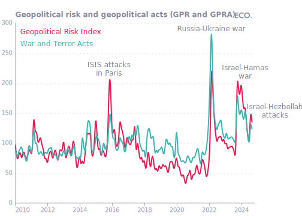
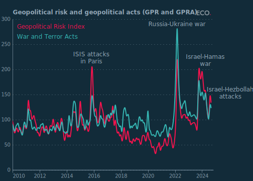
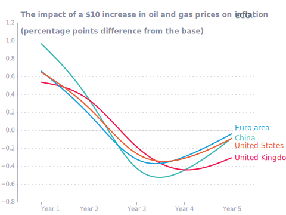
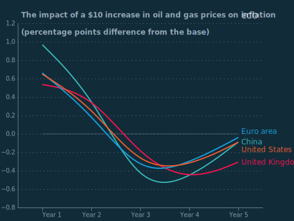
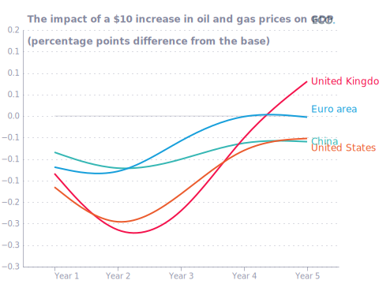
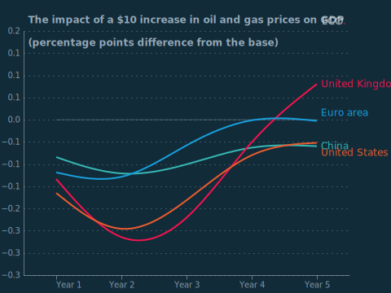
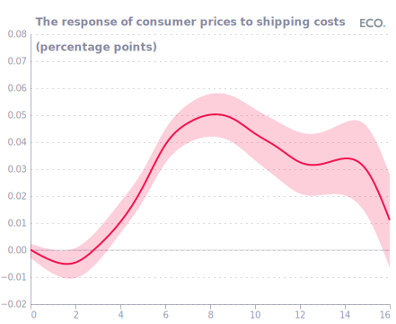
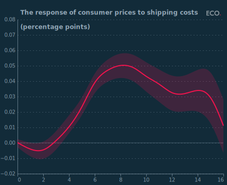

## Figure 1  

Data: [`csv`](data/fig1_gpra.csv)  
GitHub: [fig1_gpra](https://github.com/EconomicsObservatory/ECOvisualisations/tree/main/articles/how-might-a-wider-middle-east-conflict-affect-the-global-economy)  

### Light theme  

Versions with data locally embedded into the `Vega-lite` specification file: [`png`](visualisation/fig1_gpra_local.png) [`svg`](visualisation/fig1_gpra_local.svg) [`json`](visualisation/fig1_gpra_local.json)   
 (**Default**) Versions with data loaded from `GitHub`: [`png`](visualisation/fig1_gpra.png) [`svg`](visualisation/fig1_gpra.svg) [`json`](visualisation/fig1_gpra.json)  
Versions (no ECO branding) with data locally embedded into the `Vega-lite` specification file: [`png`](visualisation/fig1_gpra_local_no_branding.png) [`svg`](visualisation/fig1_gpra_local_no_branding.svg) [`json`](visualisation/fig1_gpra_local_no_branding.json)   
Versions (no ECO branding) with data loaded from `GitHub`: [`png`](visualisation/fig1_gpra_no_branding.png) [`svg`](visualisation/fig1_gpra_no_branding.svg) [`json`](visualisation/fig1_gpra_no_branding.json)   

### Dark theme  

Versions with data locally embedded into the `Vega-lite` specification file: [`png`](visualisation/fig1_gpra_local_dark.png) [`svg`](visualisation/fig1_gpra_local_dark.svg) [`json`](visualisation/fig1_gpra_local_dark.json)   
 Versions with data loaded from `GitHub`: [`png`](visualisation/fig1_gpra_dark.png) [`svg`](visualisation/fig1_gpra_dark.svg) [`json`](visualisation/fig1_gpra_dark.json)  
Versions (no ECO branding) with data locally embedded into the `Vega-lite` specification file: [`png`](visualisation/fig1_gpra_local_no_branding_dark.png) [`svg`](visualisation/fig1_gpra_local_no_branding_dark.svg) [`json`](visualisation/fig1_gpra_local_no_branding_dark.json)   
Versions (no ECO branding) with data loaded from `GitHub`: [`png`](visualisation/fig1_gpra_no_branding_dark.png) [`svg`](visualisation/fig1_gpra_no_branding_dark.svg) [`json`](visualisation/fig1_gpra_no_branding_dark.json)   

  

## Figure 2  

Data: [`csv`](data/fig2_infl.csv)  
GitHub: [fig2_infl](https://github.com/EconomicsObservatory/ECOvisualisations/tree/main/articles/how-might-a-wider-middle-east-conflict-affect-the-global-economy)  

### Light theme  

Versions with data locally embedded into the `Vega-lite` specification file: [`png`](visualisation/fig2_infl_local.png) [`svg`](visualisation/fig2_infl_local.svg) [`json`](visualisation/fig2_infl_local.json)   
 (**Default**) Versions with data loaded from `GitHub`: [`png`](visualisation/fig2_infl.png) [`svg`](visualisation/fig2_infl.svg) [`json`](visualisation/fig2_infl.json)  
Versions (no ECO branding) with data locally embedded into the `Vega-lite` specification file: [`png`](visualisation/fig2_infl_local_no_branding.png) [`svg`](visualisation/fig2_infl_local_no_branding.svg) [`json`](visualisation/fig2_infl_local_no_branding.json)   
Versions (no ECO branding) with data loaded from `GitHub`: [`png`](visualisation/fig2_infl_no_branding.png) [`svg`](visualisation/fig2_infl_no_branding.svg) [`json`](visualisation/fig2_infl_no_branding.json)   

### Dark theme  

Versions with data locally embedded into the `Vega-lite` specification file: [`png`](visualisation/fig2_infl_local_dark.png) [`svg`](visualisation/fig2_infl_local_dark.svg) [`json`](visualisation/fig2_infl_local_dark.json)   
 Versions with data loaded from `GitHub`: [`png`](visualisation/fig2_infl_dark.png) [`svg`](visualisation/fig2_infl_dark.svg) [`json`](visualisation/fig2_infl_dark.json)  
Versions (no ECO branding) with data locally embedded into the `Vega-lite` specification file: [`png`](visualisation/fig2_infl_local_no_branding_dark.png) [`svg`](visualisation/fig2_infl_local_no_branding_dark.svg) [`json`](visualisation/fig2_infl_local_no_branding_dark.json)   
Versions (no ECO branding) with data loaded from `GitHub`: [`png`](visualisation/fig2_infl_no_branding_dark.png) [`svg`](visualisation/fig2_infl_no_branding_dark.svg) [`json`](visualisation/fig2_infl_no_branding_dark.json)   

  

## Figure 3  

Data: [`csv`](data/fig3_gdp.csv)  
GitHub: [fig3_gdp](https://github.com/EconomicsObservatory/ECOvisualisations/tree/main/articles/how-might-a-wider-middle-east-conflict-affect-the-global-economy)  

### Light theme  

Versions with data locally embedded into the `Vega-lite` specification file: [`png`](visualisation/fig3_gdp_local.png) [`svg`](visualisation/fig3_gdp_local.svg) [`json`](visualisation/fig3_gdp_local.json)   
 (**Default**) Versions with data loaded from `GitHub`: [`png`](visualisation/fig3_gdp.png) [`svg`](visualisation/fig3_gdp.svg) [`json`](visualisation/fig3_gdp.json)  
Versions (no ECO branding) with data locally embedded into the `Vega-lite` specification file: [`png`](visualisation/fig3_gdp_local_no_branding.png) [`svg`](visualisation/fig3_gdp_local_no_branding.svg) [`json`](visualisation/fig3_gdp_local_no_branding.json)   
Versions (no ECO branding) with data loaded from `GitHub`: [`png`](visualisation/fig3_gdp_no_branding.png) [`svg`](visualisation/fig3_gdp_no_branding.svg) [`json`](visualisation/fig3_gdp_no_branding.json)   

### Dark theme  

Versions with data locally embedded into the `Vega-lite` specification file: [`png`](visualisation/fig3_gdp_local_dark.png) [`svg`](visualisation/fig3_gdp_local_dark.svg) [`json`](visualisation/fig3_gdp_local_dark.json)   
 Versions with data loaded from `GitHub`: [`png`](visualisation/fig3_gdp_dark.png) [`svg`](visualisation/fig3_gdp_dark.svg) [`json`](visualisation/fig3_gdp_dark.json)  
Versions (no ECO branding) with data locally embedded into the `Vega-lite` specification file: [`png`](visualisation/fig3_gdp_local_no_branding_dark.png) [`svg`](visualisation/fig3_gdp_local_no_branding_dark.svg) [`json`](visualisation/fig3_gdp_local_no_branding_dark.json)   
Versions (no ECO branding) with data loaded from `GitHub`: [`png`](visualisation/fig3_gdp_no_branding_dark.png) [`svg`](visualisation/fig3_gdp_no_branding_dark.svg) [`json`](visualisation/fig3_gdp_no_branding_dark.json)   

  

## Figure 4  

Data: [`csv`](data/fig4_shipping.csv)  
GitHub: [fig4_shipping](https://github.com/EconomicsObservatory/ECOvisualisations/tree/main/articles/how-might-a-wider-middle-east-conflict-affect-the-global-economy)  

### Light theme  

Versions with data locally embedded into the `Vega-lite` specification file: [`png`](visualisation/fig4_shipping_local.png) [`svg`](visualisation/fig4_shipping_local.svg) [`json`](visualisation/fig4_shipping_local.json)   
 (**Default**) Versions with data loaded from `GitHub`: [`png`](visualisation/fig4_shipping.png) [`svg`](visualisation/fig4_shipping.svg) [`json`](visualisation/fig4_shipping.json)  
Versions (no ECO branding) with data locally embedded into the `Vega-lite` specification file: [`png`](visualisation/fig4_shipping_local_no_branding.png) [`svg`](visualisation/fig4_shipping_local_no_branding.svg) [`json`](visualisation/fig4_shipping_local_no_branding.json)   
Versions (no ECO branding) with data loaded from `GitHub`: [`png`](visualisation/fig4_shipping_no_branding.png) [`svg`](visualisation/fig4_shipping_no_branding.svg) [`json`](visualisation/fig4_shipping_no_branding.json)   

### Dark theme  

Versions with data locally embedded into the `Vega-lite` specification file: [`png`](visualisation/fig4_shipping_local_dark.png) [`svg`](visualisation/fig4_shipping_local_dark.svg) [`json`](visualisation/fig4_shipping_local_dark.json)   
 Versions with data loaded from `GitHub`: [`png`](visualisation/fig4_shipping_dark.png) [`svg`](visualisation/fig4_shipping_dark.svg) [`json`](visualisation/fig4_shipping_dark.json)  
Versions (no ECO branding) with data locally embedded into the `Vega-lite` specification file: [`png`](visualisation/fig4_shipping_local_no_branding_dark.png) [`svg`](visualisation/fig4_shipping_local_no_branding_dark.svg) [`json`](visualisation/fig4_shipping_local_no_branding_dark.json)   
Versions (no ECO branding) with data loaded from `GitHub`: [`png`](visualisation/fig4_shipping_no_branding_dark.png) [`svg`](visualisation/fig4_shipping_no_branding_dark.svg) [`json`](visualisation/fig4_shipping_no_branding_dark.json)   

  

