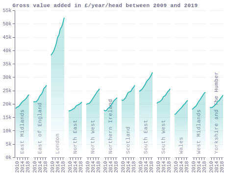
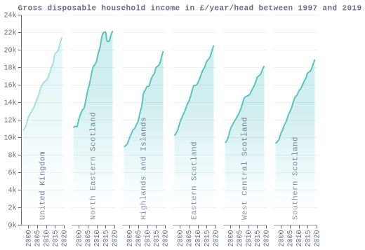
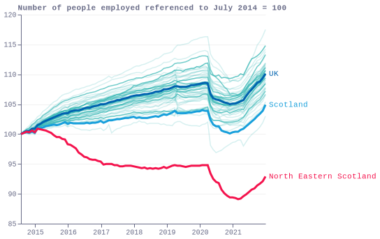

### fig1_gdp_per_head_local

### fig2_gdp_per_head_map
[Interactive map](https://economicsobservatory.github.io/ECOvisualisations/articles/levelling-up-what-might-it-mean-for-scotland/visualisation/fig2/)

### fig3a_simd_gla
[Interactive map](https://economicsobservatory.github.io/ECOvisualisations/articles/levelling-up-what-might-it-mean-for-scotland/visualisation/fig3/a.html)

### fig3b_simd_edi
[Interactive map](https://economicsobservatory.github.io/ECOvisualisations/articles/levelling-up-what-might-it-mean-for-scotland/visualisation/fig3/b.html)

### fig4_gdhi_per_head_local

### fig6_employment_local

### fig7_population_change
[Interactive map](https://economicsobservatory.github.io/ECOvisualisations/articles/levelling-up-what-might-it-mean-for-scotland/visualisation/fig7/)

