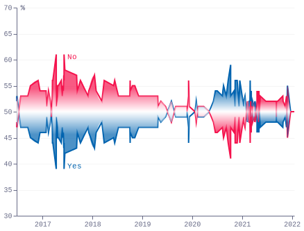
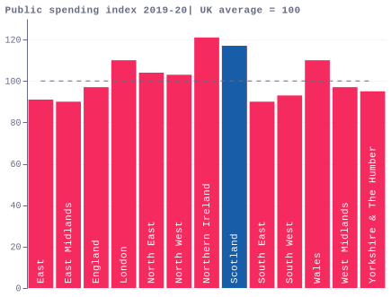
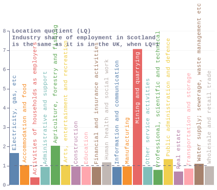

### fig1_2014_referendum
[Interactive map](https://economicsobservatory.github.io/ECOvisualisations/articles/scottish-independence-what-are-the-big-economic-questions/visualisation/fig1/)

### fig2_polls

### fig4_public_spending

### fig5_population_change
[Interactive map](https://economicsobservatory.github.io/ECOvisualisations/articles/scottish-independence-what-are-the-big-economic-questions/visualisation/fig5/)

### fig6a_industry_mix

