## Figure 1  

Data: [`csv`](data/fig1_prod_local.csv)  
GitHub: [fig1_prod_local](https://github.com/EconomicsObservatory/ECOvisualisations/tree/main/articles/the-phoenix-that-never-rises-whats-holding-back-pakistans-economy)  

### Light theme  

Versions with data locally embedded into the `Vega-lite` specification file: [`png`](visualisation/fig1_prod_local_local.png) [`svg`](visualisation/fig1_prod_local_local.svg) [`json`](visualisation/fig1_prod_local_local.json)   
 (**Default**) Versions with data loaded from `GitHub`: [`png`](visualisation/fig1_prod_local.png) [`svg`](visualisation/fig1_prod_local.svg) [`json`](visualisation/fig1_prod_local.json)  
Versions (no ECO branding) with data locally embedded into the `Vega-lite` specification file: [`png`](visualisation/fig1_prod_local_local_no_branding.png) [`svg`](visualisation/fig1_prod_local_local_no_branding.svg) [`json`](visualisation/fig1_prod_local_local_no_branding.json)   
Versions (no ECO branding) with data loaded from `GitHub`: [`png`](visualisation/fig1_prod_local_no_branding.png) [`svg`](visualisation/fig1_prod_local_no_branding.svg) [`json`](visualisation/fig1_prod_local_no_branding.json)   

### Dark theme  

Versions with data locally embedded into the `Vega-lite` specification file: [`png`](visualisation/fig1_prod_local_local_dark.png) [`svg`](visualisation/fig1_prod_local_local_dark.svg) [`json`](visualisation/fig1_prod_local_local_dark.json)   
 Versions with data loaded from `GitHub`: [`png`](visualisation/fig1_prod_local_dark.png) [`svg`](visualisation/fig1_prod_local_dark.svg) [`json`](visualisation/fig1_prod_local_dark.json)  
Versions (no ECO branding) with data locally embedded into the `Vega-lite` specification file: [`png`](visualisation/fig1_prod_local_local_no_branding_dark.png) [`svg`](visualisation/fig1_prod_local_local_no_branding_dark.svg) [`json`](visualisation/fig1_prod_local_local_no_branding_dark.json)   
Versions (no ECO branding) with data loaded from `GitHub`: [`png`](visualisation/fig1_prod_local_no_branding_dark.png) [`svg`](visualisation/fig1_prod_local_no_branding_dark.svg) [`json`](visualisation/fig1_prod_local_no_branding_dark.json)   

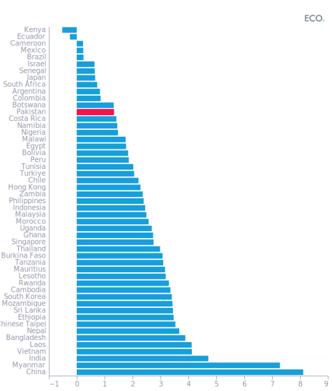

  

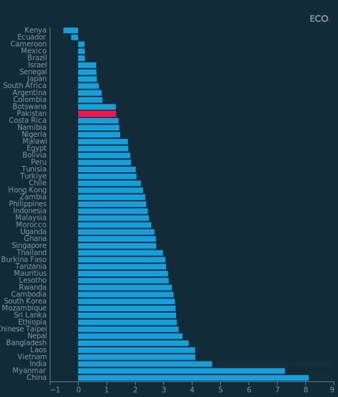

## Figure 2  

Data: [`csv`](data/fig2_ind_local.csv)  
GitHub: [fig2_ind_local](https://github.com/EconomicsObservatory/ECOvisualisations/tree/main/articles/the-phoenix-that-never-rises-whats-holding-back-pakistans-economy)  

### Light theme  

Versions with data locally embedded into the `Vega-lite` specification file: [`png`](visualisation/fig2_ind_local_local.png) [`svg`](visualisation/fig2_ind_local_local.svg) [`json`](visualisation/fig2_ind_local_local.json)   
 (**Default**) Versions with data loaded from `GitHub`: [`png`](visualisation/fig2_ind_local.png) [`svg`](visualisation/fig2_ind_local.svg) [`json`](visualisation/fig2_ind_local.json)  
Versions (no ECO branding) with data locally embedded into the `Vega-lite` specification file: [`png`](visualisation/fig2_ind_local_local_no_branding.png) [`svg`](visualisation/fig2_ind_local_local_no_branding.svg) [`json`](visualisation/fig2_ind_local_local_no_branding.json)   
Versions (no ECO branding) with data loaded from `GitHub`: [`png`](visualisation/fig2_ind_local_no_branding.png) [`svg`](visualisation/fig2_ind_local_no_branding.svg) [`json`](visualisation/fig2_ind_local_no_branding.json)   

### Dark theme  

Versions with data locally embedded into the `Vega-lite` specification file: [`png`](visualisation/fig2_ind_local_local_dark.png) [`svg`](visualisation/fig2_ind_local_local_dark.svg) [`json`](visualisation/fig2_ind_local_local_dark.json)   
 Versions with data loaded from `GitHub`: [`png`](visualisation/fig2_ind_local_dark.png) [`svg`](visualisation/fig2_ind_local_dark.svg) [`json`](visualisation/fig2_ind_local_dark.json)  
Versions (no ECO branding) with data locally embedded into the `Vega-lite` specification file: [`png`](visualisation/fig2_ind_local_local_no_branding_dark.png) [`svg`](visualisation/fig2_ind_local_local_no_branding_dark.svg) [`json`](visualisation/fig2_ind_local_local_no_branding_dark.json)   
Versions (no ECO branding) with data loaded from `GitHub`: [`png`](visualisation/fig2_ind_local_no_branding_dark.png) [`svg`](visualisation/fig2_ind_local_no_branding_dark.svg) [`json`](visualisation/fig2_ind_local_no_branding_dark.json)   

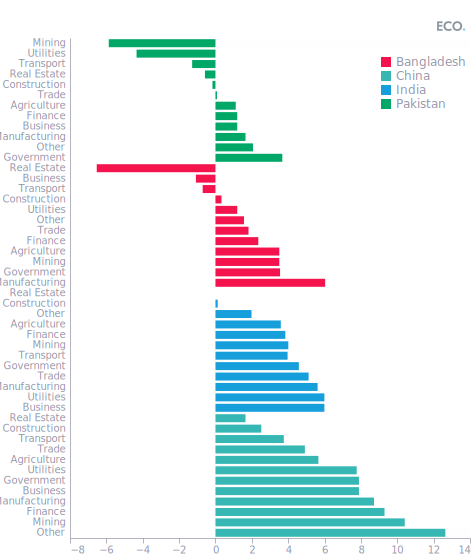

  

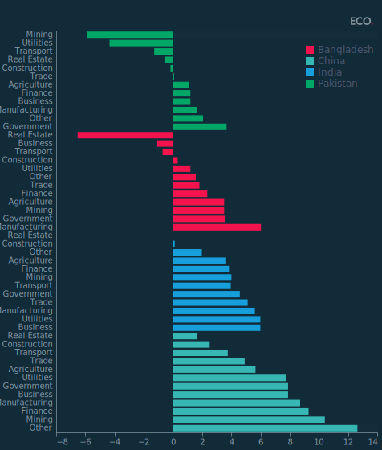

## Figure 3  

Data: [`csv`](data/fig3_trade_local.csv)  
GitHub: [fig3_trade_local](https://github.com/EconomicsObservatory/ECOvisualisations/tree/main/articles/the-phoenix-that-never-rises-whats-holding-back-pakistans-economy)  

### Light theme  

Versions with data locally embedded into the `Vega-lite` specification file: [`png`](visualisation/fig3_trade_local_local.png) [`svg`](visualisation/fig3_trade_local_local.svg) [`json`](visualisation/fig3_trade_local_local.json)   
 (**Default**) Versions with data loaded from `GitHub`: [`png`](visualisation/fig3_trade_local.png) [`svg`](visualisation/fig3_trade_local.svg) [`json`](visualisation/fig3_trade_local.json)  
Versions (no ECO branding) with data locally embedded into the `Vega-lite` specification file: [`png`](visualisation/fig3_trade_local_local_no_branding.png) [`svg`](visualisation/fig3_trade_local_local_no_branding.svg) [`json`](visualisation/fig3_trade_local_local_no_branding.json)   
Versions (no ECO branding) with data loaded from `GitHub`: [`png`](visualisation/fig3_trade_local_no_branding.png) [`svg`](visualisation/fig3_trade_local_no_branding.svg) [`json`](visualisation/fig3_trade_local_no_branding.json)   

### Dark theme  

Versions with data locally embedded into the `Vega-lite` specification file: [`png`](visualisation/fig3_trade_local_local_dark.png) [`svg`](visualisation/fig3_trade_local_local_dark.svg) [`json`](visualisation/fig3_trade_local_local_dark.json)   
 Versions with data loaded from `GitHub`: [`png`](visualisation/fig3_trade_local_dark.png) [`svg`](visualisation/fig3_trade_local_dark.svg) [`json`](visualisation/fig3_trade_local_dark.json)  
Versions (no ECO branding) with data locally embedded into the `Vega-lite` specification file: [`png`](visualisation/fig3_trade_local_local_no_branding_dark.png) [`svg`](visualisation/fig3_trade_local_local_no_branding_dark.svg) [`json`](visualisation/fig3_trade_local_local_no_branding_dark.json)   
Versions (no ECO branding) with data loaded from `GitHub`: [`png`](visualisation/fig3_trade_local_no_branding_dark.png) [`svg`](visualisation/fig3_trade_local_no_branding_dark.svg) [`json`](visualisation/fig3_trade_local_no_branding_dark.json)   

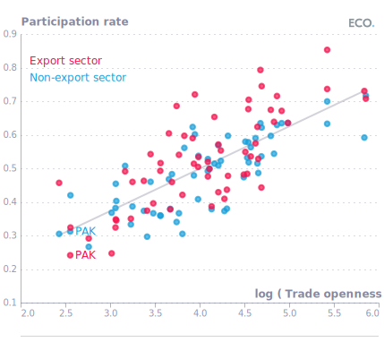

  

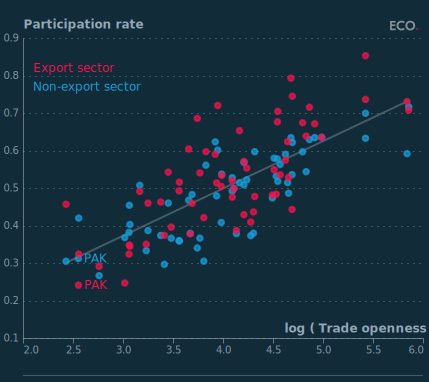

## Figure 4  

Data: [`csv`](data/fig4_debt_local.csv)  
GitHub: [fig4_debt_local](https://github.com/EconomicsObservatory/ECOvisualisations/tree/main/articles/the-phoenix-that-never-rises-whats-holding-back-pakistans-economy)  

### Light theme  

Versions with data locally embedded into the `Vega-lite` specification file: [`png`](visualisation/fig4_debt_local_local.png) [`svg`](visualisation/fig4_debt_local_local.svg) [`json`](visualisation/fig4_debt_local_local.json)   
 (**Default**) Versions with data loaded from `GitHub`: [`png`](visualisation/fig4_debt_local.png) [`svg`](visualisation/fig4_debt_local.svg) [`json`](visualisation/fig4_debt_local.json)  
Versions (no ECO branding) with data locally embedded into the `Vega-lite` specification file: [`png`](visualisation/fig4_debt_local_local_no_branding.png) [`svg`](visualisation/fig4_debt_local_local_no_branding.svg) [`json`](visualisation/fig4_debt_local_local_no_branding.json)   
Versions (no ECO branding) with data loaded from `GitHub`: [`png`](visualisation/fig4_debt_local_no_branding.png) [`svg`](visualisation/fig4_debt_local_no_branding.svg) [`json`](visualisation/fig4_debt_local_no_branding.json)   

### Dark theme  

Versions with data locally embedded into the `Vega-lite` specification file: [`png`](visualisation/fig4_debt_local_local_dark.png) [`svg`](visualisation/fig4_debt_local_local_dark.svg) [`json`](visualisation/fig4_debt_local_local_dark.json)   
 Versions with data loaded from `GitHub`: [`png`](visualisation/fig4_debt_local_dark.png) [`svg`](visualisation/fig4_debt_local_dark.svg) [`json`](visualisation/fig4_debt_local_dark.json)  
Versions (no ECO branding) with data locally embedded into the `Vega-lite` specification file: [`png`](visualisation/fig4_debt_local_local_no_branding_dark.png) [`svg`](visualisation/fig4_debt_local_local_no_branding_dark.svg) [`json`](visualisation/fig4_debt_local_local_no_branding_dark.json)   
Versions (no ECO branding) with data loaded from `GitHub`: [`png`](visualisation/fig4_debt_local_no_branding_dark.png) [`svg`](visualisation/fig4_debt_local_no_branding_dark.svg) [`json`](visualisation/fig4_debt_local_no_branding_dark.json)   

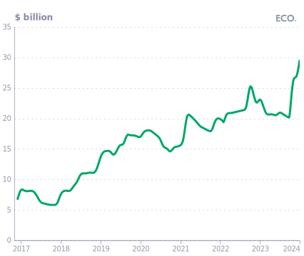

  

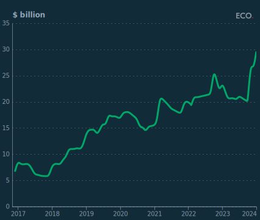

## Figure 5  

Data: [`csv`](data/fig5_elec_local.csv)  
GitHub: [fig5_elec_local](https://github.com/EconomicsObservatory/ECOvisualisations/tree/main/articles/the-phoenix-that-never-rises-whats-holding-back-pakistans-economy)  

### Light theme  

Versions with data locally embedded into the `Vega-lite` specification file: [`png`](visualisation/fig5_elec_local_local.png) [`svg`](visualisation/fig5_elec_local_local.svg) [`json`](visualisation/fig5_elec_local_local.json)   
 (**Default**) Versions with data loaded from `GitHub`: [`png`](visualisation/fig5_elec_local.png) [`svg`](visualisation/fig5_elec_local.svg) [`json`](visualisation/fig5_elec_local.json)  
Versions (no ECO branding) with data locally embedded into the `Vega-lite` specification file: [`png`](visualisation/fig5_elec_local_local_no_branding.png) [`svg`](visualisation/fig5_elec_local_local_no_branding.svg) [`json`](visualisation/fig5_elec_local_local_no_branding.json)   
Versions (no ECO branding) with data loaded from `GitHub`: [`png`](visualisation/fig5_elec_local_no_branding.png) [`svg`](visualisation/fig5_elec_local_no_branding.svg) [`json`](visualisation/fig5_elec_local_no_branding.json)   

### Dark theme  

Versions with data locally embedded into the `Vega-lite` specification file: [`png`](visualisation/fig5_elec_local_local_dark.png) [`svg`](visualisation/fig5_elec_local_local_dark.svg) [`json`](visualisation/fig5_elec_local_local_dark.json)   
 Versions with data loaded from `GitHub`: [`png`](visualisation/fig5_elec_local_dark.png) [`svg`](visualisation/fig5_elec_local_dark.svg) [`json`](visualisation/fig5_elec_local_dark.json)  
Versions (no ECO branding) with data locally embedded into the `Vega-lite` specification file: [`png`](visualisation/fig5_elec_local_local_no_branding_dark.png) [`svg`](visualisation/fig5_elec_local_local_no_branding_dark.svg) [`json`](visualisation/fig5_elec_local_local_no_branding_dark.json)   
Versions (no ECO branding) with data loaded from `GitHub`: [`png`](visualisation/fig5_elec_local_no_branding_dark.png) [`svg`](visualisation/fig5_elec_local_no_branding_dark.svg) [`json`](visualisation/fig5_elec_local_no_branding_dark.json)   

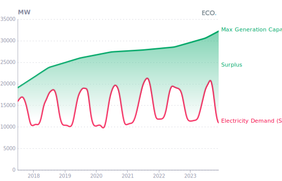

  

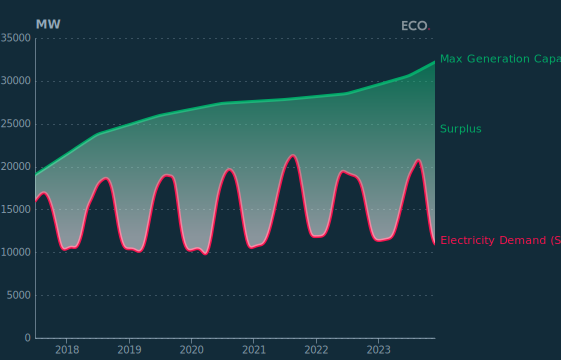

## Figure 6  

Data: [`csv`](data/fig6_lab_local.csv)  
GitHub: [fig6_lab_local](https://github.com/EconomicsObservatory/ECOvisualisations/tree/main/articles/the-phoenix-that-never-rises-whats-holding-back-pakistans-economy)  

### Light theme  

Versions with data locally embedded into the `Vega-lite` specification file: [`png`](visualisation/fig6_lab_local_local.png) [`svg`](visualisation/fig6_lab_local_local.svg) [`json`](visualisation/fig6_lab_local_local.json)   
 (**Default**) Versions with data loaded from `GitHub`: [`png`](visualisation/fig6_lab_local.png) [`svg`](visualisation/fig6_lab_local.svg) [`json`](visualisation/fig6_lab_local.json)  
Versions (no ECO branding) with data locally embedded into the `Vega-lite` specification file: [`png`](visualisation/fig6_lab_local_local_no_branding.png) [`svg`](visualisation/fig6_lab_local_local_no_branding.svg) [`json`](visualisation/fig6_lab_local_local_no_branding.json)   
Versions (no ECO branding) with data loaded from `GitHub`: [`png`](visualisation/fig6_lab_local_no_branding.png) [`svg`](visualisation/fig6_lab_local_no_branding.svg) [`json`](visualisation/fig6_lab_local_no_branding.json)   

### Dark theme  

Versions with data locally embedded into the `Vega-lite` specification file: [`png`](visualisation/fig6_lab_local_local_dark.png) [`svg`](visualisation/fig6_lab_local_local_dark.svg) [`json`](visualisation/fig6_lab_local_local_dark.json)   
 Versions with data loaded from `GitHub`: [`png`](visualisation/fig6_lab_local_dark.png) [`svg`](visualisation/fig6_lab_local_dark.svg) [`json`](visualisation/fig6_lab_local_dark.json)  
Versions (no ECO branding) with data locally embedded into the `Vega-lite` specification file: [`png`](visualisation/fig6_lab_local_local_no_branding_dark.png) [`svg`](visualisation/fig6_lab_local_local_no_branding_dark.svg) [`json`](visualisation/fig6_lab_local_local_no_branding_dark.json)   
Versions (no ECO branding) with data loaded from `GitHub`: [`png`](visualisation/fig6_lab_local_no_branding_dark.png) [`svg`](visualisation/fig6_lab_local_no_branding_dark.svg) [`json`](visualisation/fig6_lab_local_no_branding_dark.json)   

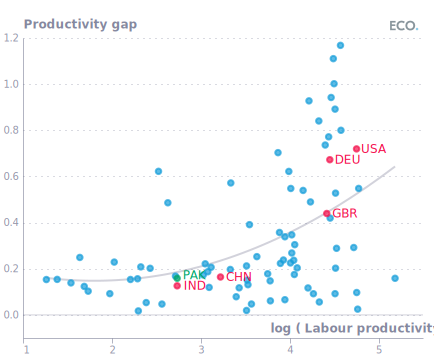

  

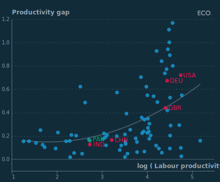

