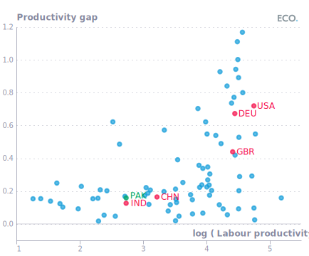
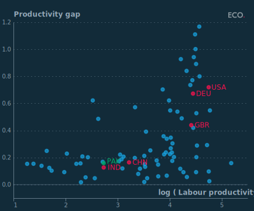

## Figure 1  

Data: [`csv`](data/fig1_prod.csv)  
GitHub: [fig1_prod](https://github.com/EconomicsObservatory/ECOvisualisations/tree/main/articles/the-phoenix-that-never-rises-whats-holding-back-pakistans-economy)  

### Light theme  

Versions with data locally embedded into the `Vega-lite` specification file: [`png`](visualisation/fig1_prod_local.png) [`svg`](visualisation/fig1_prod_local.svg) [`json`](visualisation/fig1_prod_local.json)   
 (**Default**) Versions with data loaded from `GitHub`: [`png`](visualisation/fig1_prod.png) [`svg`](visualisation/fig1_prod.svg) [`json`](visualisation/fig1_prod.json)  
Versions (no ECO branding) with data locally embedded into the `Vega-lite` specification file: [`png`](visualisation/fig1_prod_local_no_branding.png) [`svg`](visualisation/fig1_prod_local_no_branding.svg) [`json`](visualisation/fig1_prod_local_no_branding.json)   
Versions (no ECO branding) with data loaded from `GitHub`: [`png`](visualisation/fig1_prod_no_branding.png) [`svg`](visualisation/fig1_prod_no_branding.svg) [`json`](visualisation/fig1_prod_no_branding.json)   

### Dark theme  

Versions with data locally embedded into the `Vega-lite` specification file: [`png`](visualisation/fig1_prod_local_dark.png) [`svg`](visualisation/fig1_prod_local_dark.svg) [`json`](visualisation/fig1_prod_local_dark.json)   
 Versions with data loaded from `GitHub`: [`png`](visualisation/fig1_prod_dark.png) [`svg`](visualisation/fig1_prod_dark.svg) [`json`](visualisation/fig1_prod_dark.json)  
Versions (no ECO branding) with data locally embedded into the `Vega-lite` specification file: [`png`](visualisation/fig1_prod_local_no_branding_dark.png) [`svg`](visualisation/fig1_prod_local_no_branding_dark.svg) [`json`](visualisation/fig1_prod_local_no_branding_dark.json)   
Versions (no ECO branding) with data loaded from `GitHub`: [`png`](visualisation/fig1_prod_no_branding_dark.png) [`svg`](visualisation/fig1_prod_no_branding_dark.svg) [`json`](visualisation/fig1_prod_no_branding_dark.json)   

  

## Figure 2  

Data: [`csv`](data/fig2_ind.csv)  
GitHub: [fig2_ind](https://github.com/EconomicsObservatory/ECOvisualisations/tree/main/articles/the-phoenix-that-never-rises-whats-holding-back-pakistans-economy)  

### Light theme  

Versions with data locally embedded into the `Vega-lite` specification file: [`png`](visualisation/fig2_ind_local.png) [`svg`](visualisation/fig2_ind_local.svg) [`json`](visualisation/fig2_ind_local.json)   
 (**Default**) Versions with data loaded from `GitHub`: [`png`](visualisation/fig2_ind.png) [`svg`](visualisation/fig2_ind.svg) [`json`](visualisation/fig2_ind.json)  
Versions (no ECO branding) with data locally embedded into the `Vega-lite` specification file: [`png`](visualisation/fig2_ind_local_no_branding.png) [`svg`](visualisation/fig2_ind_local_no_branding.svg) [`json`](visualisation/fig2_ind_local_no_branding.json)   
Versions (no ECO branding) with data loaded from `GitHub`: [`png`](visualisation/fig2_ind_no_branding.png) [`svg`](visualisation/fig2_ind_no_branding.svg) [`json`](visualisation/fig2_ind_no_branding.json)   

### Dark theme  

Versions with data locally embedded into the `Vega-lite` specification file: [`png`](visualisation/fig2_ind_local_dark.png) [`svg`](visualisation/fig2_ind_local_dark.svg) [`json`](visualisation/fig2_ind_local_dark.json)   
 Versions with data loaded from `GitHub`: [`png`](visualisation/fig2_ind_dark.png) [`svg`](visualisation/fig2_ind_dark.svg) [`json`](visualisation/fig2_ind_dark.json)  
Versions (no ECO branding) with data locally embedded into the `Vega-lite` specification file: [`png`](visualisation/fig2_ind_local_no_branding_dark.png) [`svg`](visualisation/fig2_ind_local_no_branding_dark.svg) [`json`](visualisation/fig2_ind_local_no_branding_dark.json)   
Versions (no ECO branding) with data loaded from `GitHub`: [`png`](visualisation/fig2_ind_no_branding_dark.png) [`svg`](visualisation/fig2_ind_no_branding_dark.svg) [`json`](visualisation/fig2_ind_no_branding_dark.json)   

  

## Figure 3  

Data: [`csv`](data/fig3_trade.csv)  
GitHub: [fig3_trade](https://github.com/EconomicsObservatory/ECOvisualisations/tree/main/articles/the-phoenix-that-never-rises-whats-holding-back-pakistans-economy)  

### Light theme  

Versions with data locally embedded into the `Vega-lite` specification file: [`png`](visualisation/fig3_trade_local.png) [`svg`](visualisation/fig3_trade_local.svg) [`json`](visualisation/fig3_trade_local.json)   
 (**Default**) Versions with data loaded from `GitHub`: [`png`](visualisation/fig3_trade.png) [`svg`](visualisation/fig3_trade.svg) [`json`](visualisation/fig3_trade.json)  
Versions (no ECO branding) with data locally embedded into the `Vega-lite` specification file: [`png`](visualisation/fig3_trade_local_no_branding.png) [`svg`](visualisation/fig3_trade_local_no_branding.svg) [`json`](visualisation/fig3_trade_local_no_branding.json)   
Versions (no ECO branding) with data loaded from `GitHub`: [`png`](visualisation/fig3_trade_no_branding.png) [`svg`](visualisation/fig3_trade_no_branding.svg) [`json`](visualisation/fig3_trade_no_branding.json)   

### Dark theme  

Versions with data locally embedded into the `Vega-lite` specification file: [`png`](visualisation/fig3_trade_local_dark.png) [`svg`](visualisation/fig3_trade_local_dark.svg) [`json`](visualisation/fig3_trade_local_dark.json)   
 Versions with data loaded from `GitHub`: [`png`](visualisation/fig3_trade_dark.png) [`svg`](visualisation/fig3_trade_dark.svg) [`json`](visualisation/fig3_trade_dark.json)  
Versions (no ECO branding) with data locally embedded into the `Vega-lite` specification file: [`png`](visualisation/fig3_trade_local_no_branding_dark.png) [`svg`](visualisation/fig3_trade_local_no_branding_dark.svg) [`json`](visualisation/fig3_trade_local_no_branding_dark.json)   
Versions (no ECO branding) with data loaded from `GitHub`: [`png`](visualisation/fig3_trade_no_branding_dark.png) [`svg`](visualisation/fig3_trade_no_branding_dark.svg) [`json`](visualisation/fig3_trade_no_branding_dark.json)   

  

## Figure 4  

Data: [`csv`](data/fig4_debt.csv)  
GitHub: [fig4_debt](https://github.com/EconomicsObservatory/ECOvisualisations/tree/main/articles/the-phoenix-that-never-rises-whats-holding-back-pakistans-economy)  

### Light theme  

Versions with data locally embedded into the `Vega-lite` specification file: [`png`](visualisation/fig4_debt_local.png) [`svg`](visualisation/fig4_debt_local.svg) [`json`](visualisation/fig4_debt_local.json)   
 (**Default**) Versions with data loaded from `GitHub`: [`png`](visualisation/fig4_debt.png) [`svg`](visualisation/fig4_debt.svg) [`json`](visualisation/fig4_debt.json)  
Versions (no ECO branding) with data locally embedded into the `Vega-lite` specification file: [`png`](visualisation/fig4_debt_local_no_branding.png) [`svg`](visualisation/fig4_debt_local_no_branding.svg) [`json`](visualisation/fig4_debt_local_no_branding.json)   
Versions (no ECO branding) with data loaded from `GitHub`: [`png`](visualisation/fig4_debt_no_branding.png) [`svg`](visualisation/fig4_debt_no_branding.svg) [`json`](visualisation/fig4_debt_no_branding.json)   

### Dark theme  

Versions with data locally embedded into the `Vega-lite` specification file: [`png`](visualisation/fig4_debt_local_dark.png) [`svg`](visualisation/fig4_debt_local_dark.svg) [`json`](visualisation/fig4_debt_local_dark.json)   
 Versions with data loaded from `GitHub`: [`png`](visualisation/fig4_debt_dark.png) [`svg`](visualisation/fig4_debt_dark.svg) [`json`](visualisation/fig4_debt_dark.json)  
Versions (no ECO branding) with data locally embedded into the `Vega-lite` specification file: [`png`](visualisation/fig4_debt_local_no_branding_dark.png) [`svg`](visualisation/fig4_debt_local_no_branding_dark.svg) [`json`](visualisation/fig4_debt_local_no_branding_dark.json)   
Versions (no ECO branding) with data loaded from `GitHub`: [`png`](visualisation/fig4_debt_no_branding_dark.png) [`svg`](visualisation/fig4_debt_no_branding_dark.svg) [`json`](visualisation/fig4_debt_no_branding_dark.json)   

  

## Figure 5  

Data: [`csv`](data/fig5_elec.csv)  
GitHub: [fig5_elec](https://github.com/EconomicsObservatory/ECOvisualisations/tree/main/articles/the-phoenix-that-never-rises-whats-holding-back-pakistans-economy)  

### Light theme  

Versions with data locally embedded into the `Vega-lite` specification file: [`png`](visualisation/fig5_elec_local.png) [`svg`](visualisation/fig5_elec_local.svg) [`json`](visualisation/fig5_elec_local.json)   
 (**Default**) Versions with data loaded from `GitHub`: [`png`](visualisation/fig5_elec.png) [`svg`](visualisation/fig5_elec.svg) [`json`](visualisation/fig5_elec.json)  
Versions (no ECO branding) with data locally embedded into the `Vega-lite` specification file: [`png`](visualisation/fig5_elec_local_no_branding.png) [`svg`](visualisation/fig5_elec_local_no_branding.svg) [`json`](visualisation/fig5_elec_local_no_branding.json)   
Versions (no ECO branding) with data loaded from `GitHub`: [`png`](visualisation/fig5_elec_no_branding.png) [`svg`](visualisation/fig5_elec_no_branding.svg) [`json`](visualisation/fig5_elec_no_branding.json)   

### Dark theme  

Versions with data locally embedded into the `Vega-lite` specification file: [`png`](visualisation/fig5_elec_local_dark.png) [`svg`](visualisation/fig5_elec_local_dark.svg) [`json`](visualisation/fig5_elec_local_dark.json)   
 Versions with data loaded from `GitHub`: [`png`](visualisation/fig5_elec_dark.png) [`svg`](visualisation/fig5_elec_dark.svg) [`json`](visualisation/fig5_elec_dark.json)  
Versions (no ECO branding) with data locally embedded into the `Vega-lite` specification file: [`png`](visualisation/fig5_elec_local_no_branding_dark.png) [`svg`](visualisation/fig5_elec_local_no_branding_dark.svg) [`json`](visualisation/fig5_elec_local_no_branding_dark.json)   
Versions (no ECO branding) with data loaded from `GitHub`: [`png`](visualisation/fig5_elec_no_branding_dark.png) [`svg`](visualisation/fig5_elec_no_branding_dark.svg) [`json`](visualisation/fig5_elec_no_branding_dark.json)   

  

## Figure 6  

Data: [`csv`](data/fig6_lab.csv)  
GitHub: [fig6_lab](https://github.com/EconomicsObservatory/ECOvisualisations/tree/main/articles/the-phoenix-that-never-rises-whats-holding-back-pakistans-economy)  

### Light theme  

Versions with data locally embedded into the `Vega-lite` specification file: [`png`](visualisation/fig6_lab_local.png) [`svg`](visualisation/fig6_lab_local.svg) [`json`](visualisation/fig6_lab_local.json)   
 (**Default**) Versions with data loaded from `GitHub`: [`png`](visualisation/fig6_lab.png) [`svg`](visualisation/fig6_lab.svg) [`json`](visualisation/fig6_lab.json)  
Versions (no ECO branding) with data locally embedded into the `Vega-lite` specification file: [`png`](visualisation/fig6_lab_local_no_branding.png) [`svg`](visualisation/fig6_lab_local_no_branding.svg) [`json`](visualisation/fig6_lab_local_no_branding.json)   
Versions (no ECO branding) with data loaded from `GitHub`: [`png`](visualisation/fig6_lab_no_branding.png) [`svg`](visualisation/fig6_lab_no_branding.svg) [`json`](visualisation/fig6_lab_no_branding.json)   

### Dark theme  

Versions with data locally embedded into the `Vega-lite` specification file: [`png`](visualisation/fig6_lab_local_dark.png) [`svg`](visualisation/fig6_lab_local_dark.svg) [`json`](visualisation/fig6_lab_local_dark.json)   
 Versions with data loaded from `GitHub`: [`png`](visualisation/fig6_lab_dark.png) [`svg`](visualisation/fig6_lab_dark.svg) [`json`](visualisation/fig6_lab_dark.json)  
Versions (no ECO branding) with data locally embedded into the `Vega-lite` specification file: [`png`](visualisation/fig6_lab_local_no_branding_dark.png) [`svg`](visualisation/fig6_lab_local_no_branding_dark.svg) [`json`](visualisation/fig6_lab_local_no_branding_dark.json)   
Versions (no ECO branding) with data loaded from `GitHub`: [`png`](visualisation/fig6_lab_no_branding_dark.png) [`svg`](visualisation/fig6_lab_no_branding_dark.svg) [`json`](visualisation/fig6_lab_no_branding_dark.json)   

  

