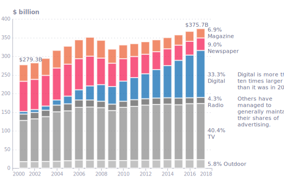
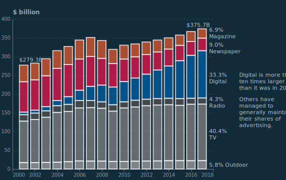

## Figure 1  

Data: [`csv`](data/fig1_ad_local.csv)  
GitHub: [fig1_ad_local](https://github.com/EconomicsObservatory/ECOvisualisations/tree/main/articles/twenty-years-of-facebook-how-has-it-shaped-economies-around-the-world)  

### Light theme  

Versions with data locally embedded into the `Vega-lite` specification file: [`png`](visualisation/fig1_ad_local_local.png) [`svg`](visualisation/fig1_ad_local_local.svg) [`json`](visualisation/fig1_ad_local_local.json)   
 (**Default**) Versions with data loaded from `GitHub`: [`png`](visualisation/fig1_ad_local.png) [`svg`](visualisation/fig1_ad_local.svg) [`json`](visualisation/fig1_ad_local.json)  
Versions (no ECO branding) with data locally embedded into the `Vega-lite` specification file: [`png`](visualisation/fig1_ad_local_local_no_branding.png) [`svg`](visualisation/fig1_ad_local_local_no_branding.svg) [`json`](visualisation/fig1_ad_local_local_no_branding.json)   
Versions (no ECO branding) with data loaded from `GitHub`: [`png`](visualisation/fig1_ad_local_no_branding.png) [`svg`](visualisation/fig1_ad_local_no_branding.svg) [`json`](visualisation/fig1_ad_local_no_branding.json)   

### Dark theme  

Versions with data locally embedded into the `Vega-lite` specification file: [`png`](visualisation/fig1_ad_local_local_dark.png) [`svg`](visualisation/fig1_ad_local_local_dark.svg) [`json`](visualisation/fig1_ad_local_local_dark.json)   
 Versions with data loaded from `GitHub`: [`png`](visualisation/fig1_ad_local_dark.png) [`svg`](visualisation/fig1_ad_local_dark.svg) [`json`](visualisation/fig1_ad_local_dark.json)  
Versions (no ECO branding) with data locally embedded into the `Vega-lite` specification file: [`png`](visualisation/fig1_ad_local_local_no_branding_dark.png) [`svg`](visualisation/fig1_ad_local_local_no_branding_dark.svg) [`json`](visualisation/fig1_ad_local_local_no_branding_dark.json)   
Versions (no ECO branding) with data loaded from `GitHub`: [`png`](visualisation/fig1_ad_local_no_branding_dark.png) [`svg`](visualisation/fig1_ad_local_no_branding_dark.svg) [`json`](visualisation/fig1_ad_local_no_branding_dark.json)   

  

