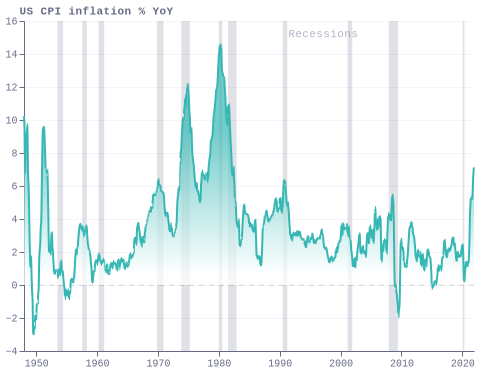
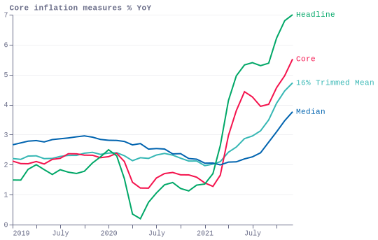
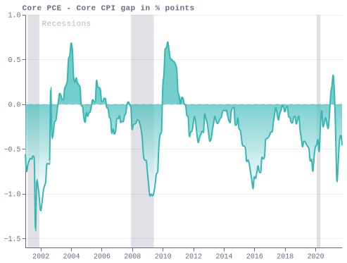
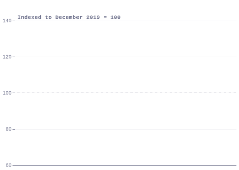
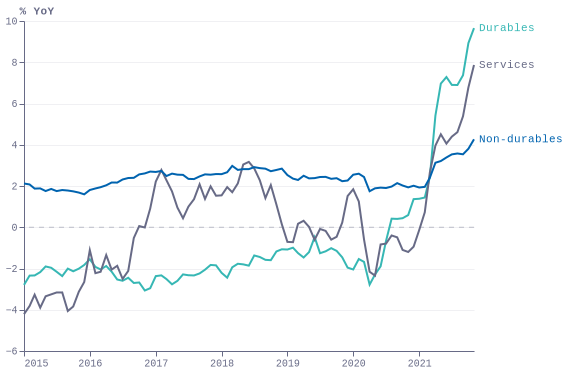
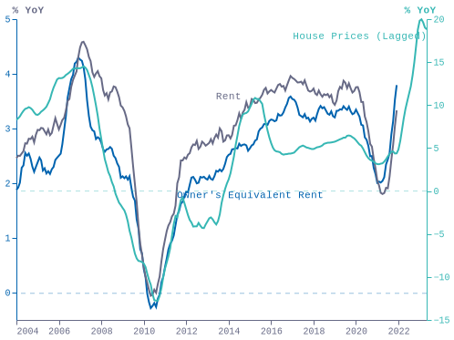
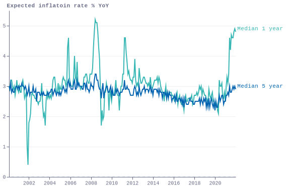
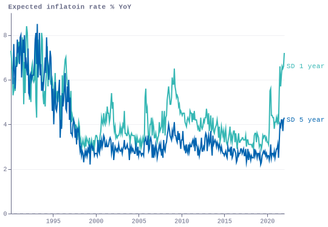
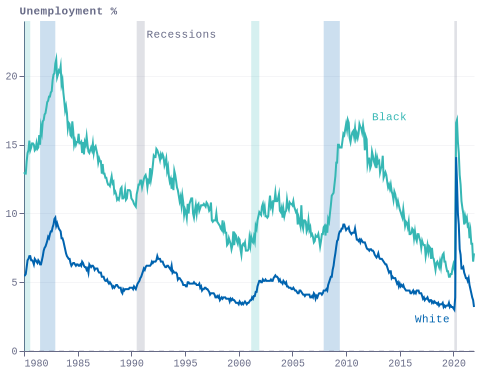

### fig1_cpi

### fig2_core_inflation_measures

### fig3_pce_core_cpi

### fig4_consumption_patterns

### fig5_pce_inflation

### fig6_house_prices

### fig7_michigan

### fig8_michigan_sd

### fig9_racial

