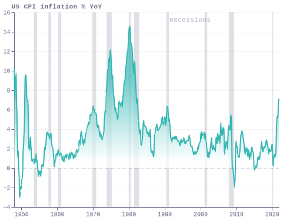
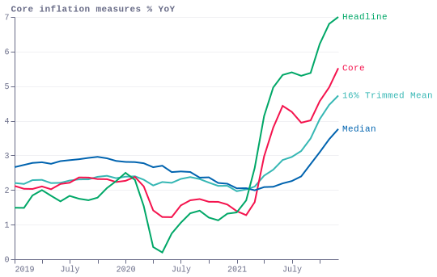
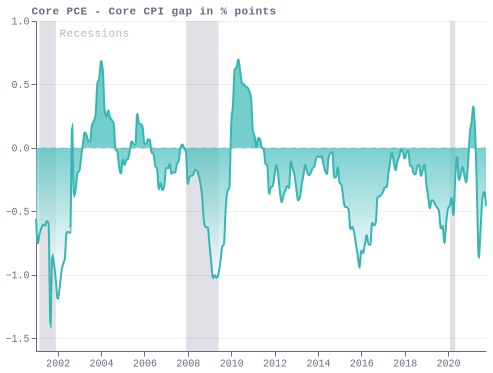
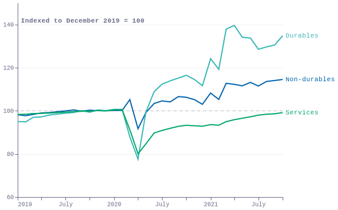
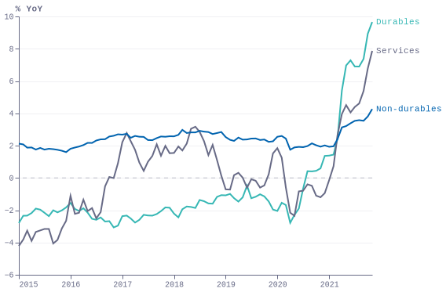
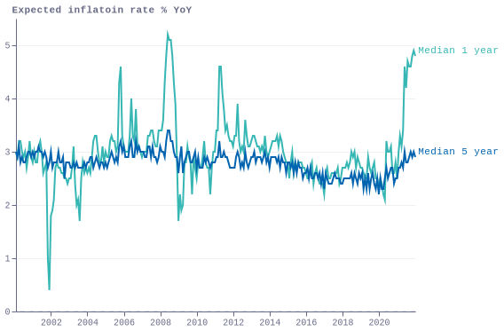
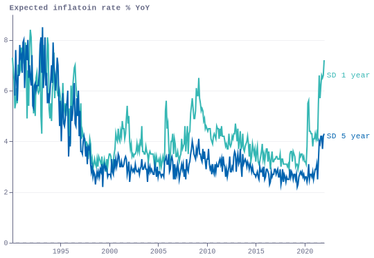
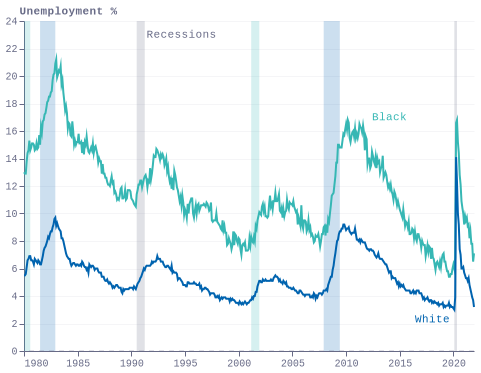

### fig1_cpi_local

### fig2_core_inflation_measures_local

### fig3_pce_core_cpi_local

### fig4_consumption patterns_local

### fig5_pce_inflation_local

### fig6_house_prices_local

### fig7_michigan_local

### fig8_michigan_sd_local

### fig9_racial_local

