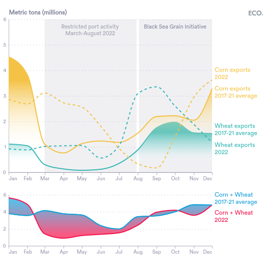
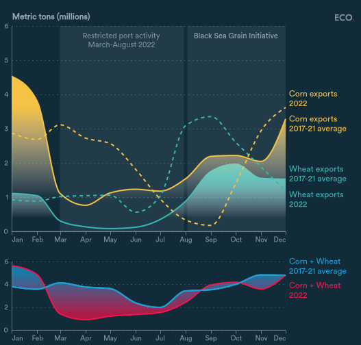
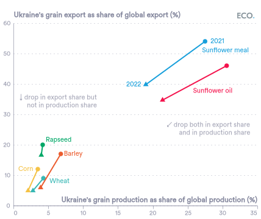
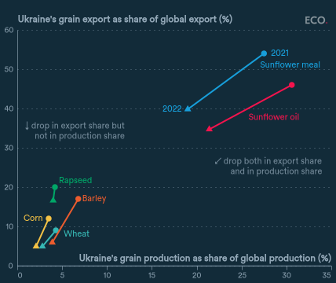
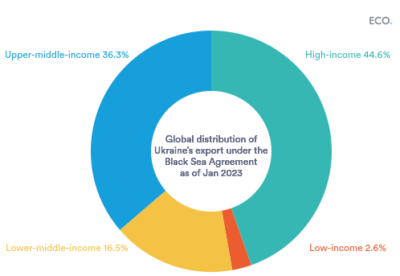
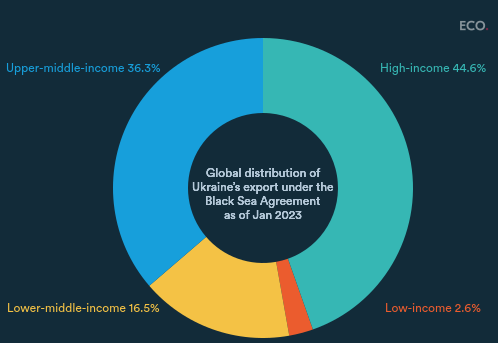
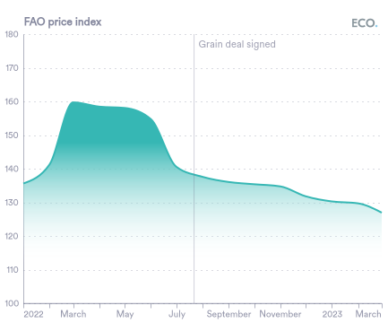
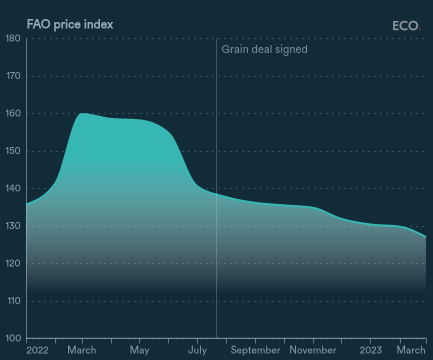

## Figure 1  

Data: [`csv`](data/fig1_wheat.csv)  
GitHub: [fig1_wheat](https://github.com/EconomicsObservatory/ECOvisualisations/tree/main/articles/war-in-ukraine-has-the-black-sea-grain-agreement-improved-global-food-security)  

### Light theme  

Versions with data locally embedded into the `Vega-lite` specification file: [`png`](visualisation/fig1_wheat_local.png) [`svg`](visualisation/fig1_wheat_local.svg) [`json`](visualisation/fig1_wheat_local.json)   
 (**Default**) Versions with data loaded from `GitHub`: [`png`](visualisation/fig1_wheat.png) [`svg`](visualisation/fig1_wheat.svg) [`json`](visualisation/fig1_wheat.json)  
Versions (no ECO branding) with data locally embedded into the `Vega-lite` specification file: [`png`](visualisation/fig1_wheat_local_no_branding.png) [`svg`](visualisation/fig1_wheat_local_no_branding.svg) [`json`](visualisation/fig1_wheat_local_no_branding.json)   
Versions (no ECO branding) with data loaded from `GitHub`: [`png`](visualisation/fig1_wheat_no_branding.png) [`svg`](visualisation/fig1_wheat_no_branding.svg) [`json`](visualisation/fig1_wheat_no_branding.json)   

### Dark theme  

Versions with data locally embedded into the `Vega-lite` specification file: [`png`](visualisation/fig1_wheat_local_dark.png) [`svg`](visualisation/fig1_wheat_local_dark.svg) [`json`](visualisation/fig1_wheat_local_dark.json)   
 Versions with data loaded from `GitHub`: [`png`](visualisation/fig1_wheat_dark.png) [`svg`](visualisation/fig1_wheat_dark.svg) [`json`](visualisation/fig1_wheat_dark.json)  
Versions (no ECO branding) with data locally embedded into the `Vega-lite` specification file: [`png`](visualisation/fig1_wheat_local_no_branding_dark.png) [`svg`](visualisation/fig1_wheat_local_no_branding_dark.svg) [`json`](visualisation/fig1_wheat_local_no_branding_dark.json)   
Versions (no ECO branding) with data loaded from `GitHub`: [`png`](visualisation/fig1_wheat_no_branding_dark.png) [`svg`](visualisation/fig1_wheat_no_branding_dark.svg) [`json`](visualisation/fig1_wheat_no_branding_dark.json)   

  

## Figure 2  

Data: [`csv`](data/fig2_global_shares.csv)  
GitHub: [fig2_global_shares](https://github.com/EconomicsObservatory/ECOvisualisations/tree/main/articles/war-in-ukraine-has-the-black-sea-grain-agreement-improved-global-food-security)  

### Light theme  

Versions with data locally embedded into the `Vega-lite` specification file: [`png`](visualisation/fig2_global_shares_local.png) [`svg`](visualisation/fig2_global_shares_local.svg) [`json`](visualisation/fig2_global_shares_local.json)   
 (**Default**) Versions with data loaded from `GitHub`: [`png`](visualisation/fig2_global_shares.png) [`svg`](visualisation/fig2_global_shares.svg) [`json`](visualisation/fig2_global_shares.json)  
Versions (no ECO branding) with data locally embedded into the `Vega-lite` specification file: [`png`](visualisation/fig2_global_shares_local_no_branding.png) [`svg`](visualisation/fig2_global_shares_local_no_branding.svg) [`json`](visualisation/fig2_global_shares_local_no_branding.json)   
Versions (no ECO branding) with data loaded from `GitHub`: [`png`](visualisation/fig2_global_shares_no_branding.png) [`svg`](visualisation/fig2_global_shares_no_branding.svg) [`json`](visualisation/fig2_global_shares_no_branding.json)   

### Dark theme  

Versions with data locally embedded into the `Vega-lite` specification file: [`png`](visualisation/fig2_global_shares_local_dark.png) [`svg`](visualisation/fig2_global_shares_local_dark.svg) [`json`](visualisation/fig2_global_shares_local_dark.json)   
 Versions with data loaded from `GitHub`: [`png`](visualisation/fig2_global_shares_dark.png) [`svg`](visualisation/fig2_global_shares_dark.svg) [`json`](visualisation/fig2_global_shares_dark.json)  
Versions (no ECO branding) with data locally embedded into the `Vega-lite` specification file: [`png`](visualisation/fig2_global_shares_local_no_branding_dark.png) [`svg`](visualisation/fig2_global_shares_local_no_branding_dark.svg) [`json`](visualisation/fig2_global_shares_local_no_branding_dark.json)   
Versions (no ECO branding) with data loaded from `GitHub`: [`png`](visualisation/fig2_global_shares_no_branding_dark.png) [`svg`](visualisation/fig2_global_shares_no_branding_dark.svg) [`json`](visualisation/fig2_global_shares_no_branding_dark.json)   

  

## Figure 3  

Data: [`csv`](data/fig3_distribution.csv)  
GitHub: [fig3_distribution](https://github.com/EconomicsObservatory/ECOvisualisations/tree/main/articles/war-in-ukraine-has-the-black-sea-grain-agreement-improved-global-food-security)  

### Light theme  

Versions with data locally embedded into the `Vega-lite` specification file: [`png`](visualisation/fig3_distribution_local.png) [`svg`](visualisation/fig3_distribution_local.svg) [`json`](visualisation/fig3_distribution_local.json)   
 (**Default**) Versions with data loaded from `GitHub`: [`png`](visualisation/fig3_distribution.png) [`svg`](visualisation/fig3_distribution.svg) [`json`](visualisation/fig3_distribution.json)  
Versions (no ECO branding) with data locally embedded into the `Vega-lite` specification file: [`png`](visualisation/fig3_distribution_local_no_branding.png) [`svg`](visualisation/fig3_distribution_local_no_branding.svg) [`json`](visualisation/fig3_distribution_local_no_branding.json)   
Versions (no ECO branding) with data loaded from `GitHub`: [`png`](visualisation/fig3_distribution_no_branding.png) [`svg`](visualisation/fig3_distribution_no_branding.svg) [`json`](visualisation/fig3_distribution_no_branding.json)   

### Dark theme  

Versions with data locally embedded into the `Vega-lite` specification file: [`png`](visualisation/fig3_distribution_local_dark.png) [`svg`](visualisation/fig3_distribution_local_dark.svg) [`json`](visualisation/fig3_distribution_local_dark.json)   
 Versions with data loaded from `GitHub`: [`png`](visualisation/fig3_distribution_dark.png) [`svg`](visualisation/fig3_distribution_dark.svg) [`json`](visualisation/fig3_distribution_dark.json)  
Versions (no ECO branding) with data locally embedded into the `Vega-lite` specification file: [`png`](visualisation/fig3_distribution_local_no_branding_dark.png) [`svg`](visualisation/fig3_distribution_local_no_branding_dark.svg) [`json`](visualisation/fig3_distribution_local_no_branding_dark.json)   
Versions (no ECO branding) with data loaded from `GitHub`: [`png`](visualisation/fig3_distribution_no_branding_dark.png) [`svg`](visualisation/fig3_distribution_no_branding_dark.svg) [`json`](visualisation/fig3_distribution_no_branding_dark.json)   

  

## Figure 4  

Data: [`csv`](data/fig4_price_index.csv)  
GitHub: [fig4_price_index](https://github.com/EconomicsObservatory/ECOvisualisations/tree/main/articles/war-in-ukraine-has-the-black-sea-grain-agreement-improved-global-food-security)  

### Light theme  

Versions with data locally embedded into the `Vega-lite` specification file: [`png`](visualisation/fig4_price_index_local.png) [`svg`](visualisation/fig4_price_index_local.svg) [`json`](visualisation/fig4_price_index_local.json)   
 (**Default**) Versions with data loaded from `GitHub`: [`png`](visualisation/fig4_price_index.png) [`svg`](visualisation/fig4_price_index.svg) [`json`](visualisation/fig4_price_index.json)  
Versions (no ECO branding) with data locally embedded into the `Vega-lite` specification file: [`png`](visualisation/fig4_price_index_local_no_branding.png) [`svg`](visualisation/fig4_price_index_local_no_branding.svg) [`json`](visualisation/fig4_price_index_local_no_branding.json)   
Versions (no ECO branding) with data loaded from `GitHub`: [`png`](visualisation/fig4_price_index_no_branding.png) [`svg`](visualisation/fig4_price_index_no_branding.svg) [`json`](visualisation/fig4_price_index_no_branding.json)   

### Dark theme  

Versions with data locally embedded into the `Vega-lite` specification file: [`png`](visualisation/fig4_price_index_local_dark.png) [`svg`](visualisation/fig4_price_index_local_dark.svg) [`json`](visualisation/fig4_price_index_local_dark.json)   
 Versions with data loaded from `GitHub`: [`png`](visualisation/fig4_price_index_dark.png) [`svg`](visualisation/fig4_price_index_dark.svg) [`json`](visualisation/fig4_price_index_dark.json)  
Versions (no ECO branding) with data locally embedded into the `Vega-lite` specification file: [`png`](visualisation/fig4_price_index_local_no_branding_dark.png) [`svg`](visualisation/fig4_price_index_local_no_branding_dark.svg) [`json`](visualisation/fig4_price_index_local_no_branding_dark.json)   
Versions (no ECO branding) with data loaded from `GitHub`: [`png`](visualisation/fig4_price_index_no_branding_dark.png) [`svg`](visualisation/fig4_price_index_no_branding_dark.svg) [`json`](visualisation/fig4_price_index_no_branding_dark.json)   

  

