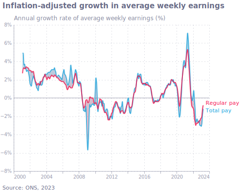
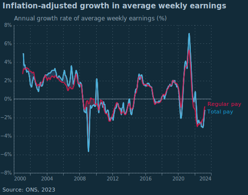
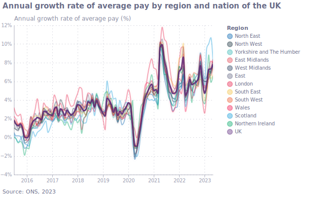
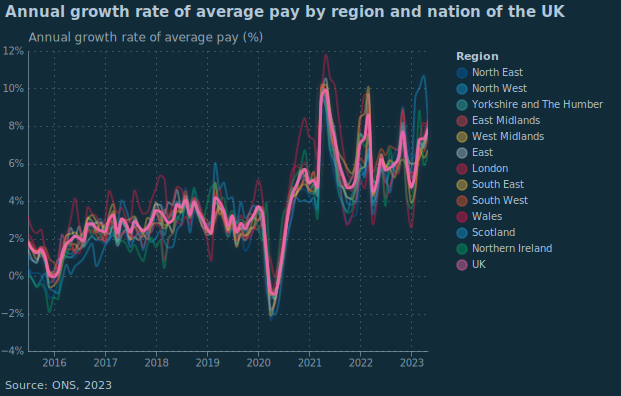
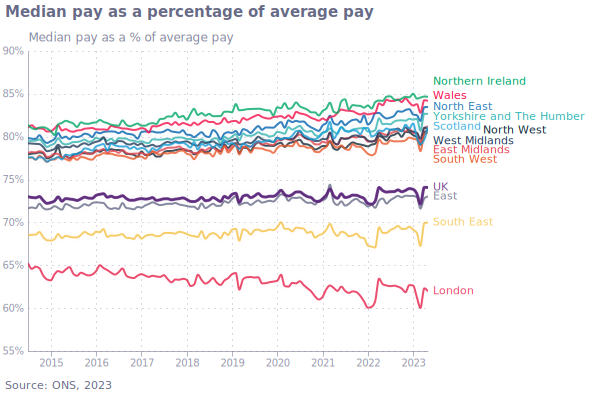
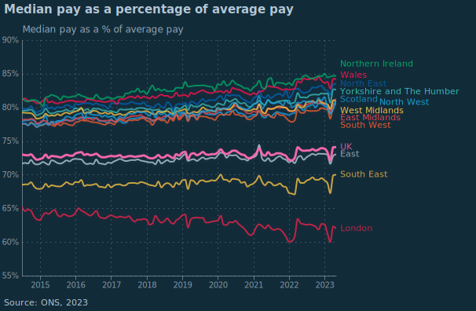
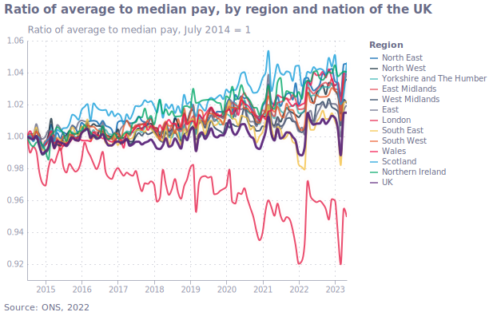
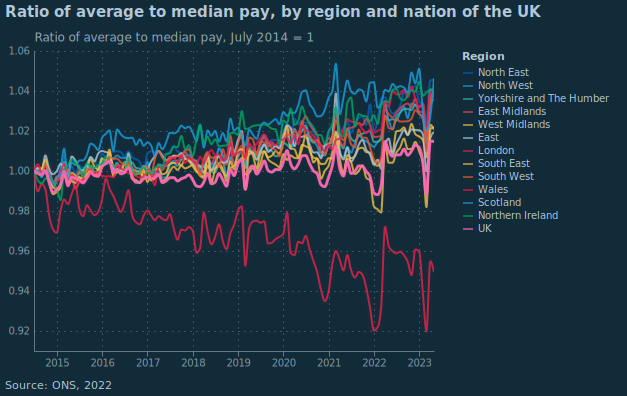
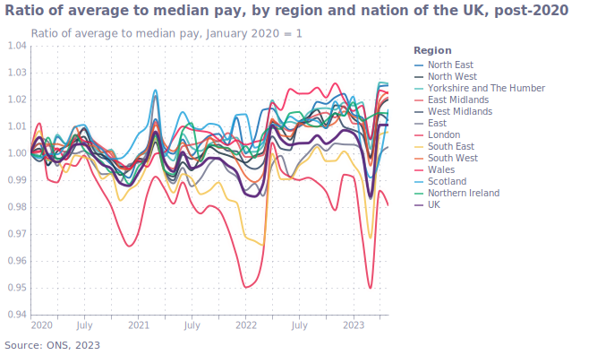
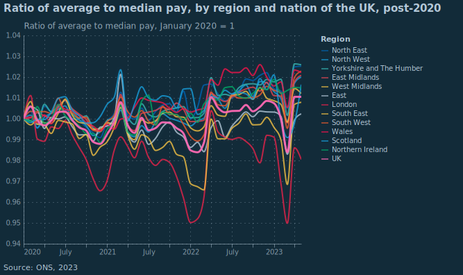

## Figure 1  

Data: [`csv`](data/fig1_wage.csv)  
GitHub: [fig1_wage](https://github.com/EconomicsObservatory/ECOvisualisations/tree/main/magazine/what-do-the-latest-data-tell-us-about-uk-wage-growth#figure-1)  

### Light theme  

Versions with data locally embedded into the `Vega-lite` specification file: [`png`](visualisation/fig1_wage_local.png) [`svg`](visualisation/fig1_wage.svg) [`json`](visualisation/fig1_wage.json)   

### Dark theme  

Versions with data locally embedded into the `Vega-lite` specification file: [`png`](visualisation/fig1_wage_local_dark.png) [`svg`](visualisation/fig1_wage_dark.svg) [`json`](visualisation/fig1_wage_dark.json)   

  

## Figure 2  

Data: [`csv`](data/fig2_wage-by-region.csv)  
GitHub: [fig2_wage-by-region](https://github.com/EconomicsObservatory/ECOvisualisations/tree/main/magazine/what-do-the-latest-data-tell-us-about-uk-wage-growth#figure-2)  

### Light theme  

Versions with data locally embedded into the `Vega-lite` specification file: [`png`](visualisation/fig2_wage-by-region_local.png) [`svg`](visualisation/fig2_wage-by-region.svg) [`json`](visualisation/fig2_wage-by-region.json)   

### Dark theme  

Versions with data locally embedded into the `Vega-lite` specification file: [`png`](visualisation/fig2_wage-by-region_local_dark.png) [`svg`](visualisation/fig2_wage-by-region_dark.svg) [`json`](visualisation/fig2_wage-by-region_dark.json)   

  

## Figure 3-median-pay  

Data: [`csv`](data/fig3-median-pay.csv)  
GitHub: [fig3-median-pay](https://github.com/EconomicsObservatory/ECOvisualisations/tree/main/magazine/what-do-the-latest-data-tell-us-about-uk-wage-growth#figure-3-median-pay)  

### Light theme  

Versions with data locally embedded into the `Vega-lite` specification file: [`png`](visualisation/fig3-median-pay_local.png) [`svg`](visualisation/fig3-median-pay.svg) [`json`](visualisation/fig3-median-pay.json)   

### Dark theme  

Versions with data locally embedded into the `Vega-lite` specification file: [`png`](visualisation/fig3-median-pay_local_dark.png) [`svg`](visualisation/fig3-median-pay_dark.svg) [`json`](visualisation/fig3-median-pay_dark.json)   

  

## Figure 4-ratio  

Data: [`csv`](data/fig4-ratio.csv)  
GitHub: [fig4-ratio](https://github.com/EconomicsObservatory/ECOvisualisations/tree/main/magazine/what-do-the-latest-data-tell-us-about-uk-wage-growth#figure-4-ratio)  

### Light theme  

Versions with data locally embedded into the `Vega-lite` specification file: [`png`](visualisation/fig4-ratio_local.png) [`svg`](visualisation/fig4-ratio.svg) [`json`](visualisation/fig4-ratio.json)   

### Dark theme  

Versions with data locally embedded into the `Vega-lite` specification file: [`png`](visualisation/fig4-ratio_local_dark.png) [`svg`](visualisation/fig4-ratio_dark.svg) [`json`](visualisation/fig4-ratio_dark.json)   

  

## Figure 5  

Data: [`csv`](data/fig5_ratio2020.csv)  
GitHub: [fig5_ratio2020](https://github.com/EconomicsObservatory/ECOvisualisations/tree/main/magazine/what-do-the-latest-data-tell-us-about-uk-wage-growth#figure-5)  

### Light theme  

Versions with data locally embedded into the `Vega-lite` specification file: [`png`](visualisation/fig5_ratio2020_local.png) [`svg`](visualisation/fig5_ratio2020.svg) [`json`](visualisation/fig5_ratio2020.json)   

### Dark theme  

Versions with data locally embedded into the `Vega-lite` specification file: [`png`](visualisation/fig5_ratio2020_local_dark.png) [`svg`](visualisation/fig5_ratio2020_dark.svg) [`json`](visualisation/fig5_ratio2020_dark.json)   

  

