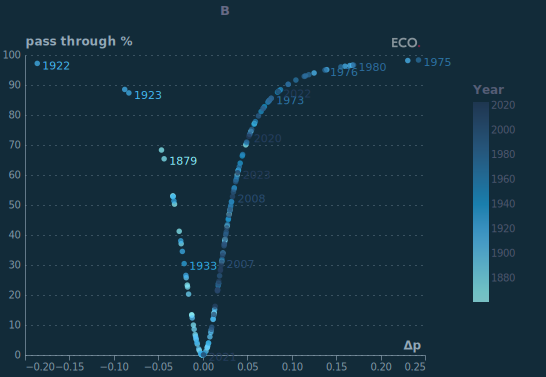

## Figure 1  

Data: [`csv`](data/fig1_cpi_local.csv)  
GitHub: [fig1_cpi_local](https://github.com/EconomicsObservatory/ECOvisualisations/tree/main/articles/why-did-the-bank-of-england-need-a-review-of-its-forecasting-record)  

### Light theme  

Versions with data locally embedded into the `Vega-lite` specification file: [`png`](visualisation/fig1_cpi_local_local.png) [`svg`](visualisation/fig1_cpi_local_local.svg) [`json`](visualisation/fig1_cpi_local_local.json)   
 (**Default**) Versions with data loaded from `GitHub`: [`png`](visualisation/fig1_cpi_local.png) [`svg`](visualisation/fig1_cpi_local.svg) [`json`](visualisation/fig1_cpi_local.json)  
Versions (no ECO branding) with data locally embedded into the `Vega-lite` specification file: [`png`](visualisation/fig1_cpi_local_local_no_branding.png) [`svg`](visualisation/fig1_cpi_local_local_no_branding.svg) [`json`](visualisation/fig1_cpi_local_local_no_branding.json)   
Versions (no ECO branding) with data loaded from `GitHub`: [`png`](visualisation/fig1_cpi_local_no_branding.png) [`svg`](visualisation/fig1_cpi_local_no_branding.svg) [`json`](visualisation/fig1_cpi_local_no_branding.json)   

### Dark theme  

Versions with data locally embedded into the `Vega-lite` specification file: [`png`](visualisation/fig1_cpi_local_local_dark.png) [`svg`](visualisation/fig1_cpi_local_local_dark.svg) [`json`](visualisation/fig1_cpi_local_local_dark.json)   
 Versions with data loaded from `GitHub`: [`png`](visualisation/fig1_cpi_local_dark.png) [`svg`](visualisation/fig1_cpi_local_dark.svg) [`json`](visualisation/fig1_cpi_local_dark.json)  
Versions (no ECO branding) with data locally embedded into the `Vega-lite` specification file: [`png`](visualisation/fig1_cpi_local_local_no_branding_dark.png) [`svg`](visualisation/fig1_cpi_local_local_no_branding_dark.svg) [`json`](visualisation/fig1_cpi_local_local_no_branding_dark.json)   
Versions (no ECO branding) with data loaded from `GitHub`: [`png`](visualisation/fig1_cpi_local_no_branding_dark.png) [`svg`](visualisation/fig1_cpi_local_no_branding_dark.svg) [`json`](visualisation/fig1_cpi_local_no_branding_dark.json)   

  

## Figure 2  

Data: [`csv`](data/fig2_ons_local.csv)  
GitHub: [fig2_ons_local](https://github.com/EconomicsObservatory/ECOvisualisations/tree/main/articles/why-did-the-bank-of-england-need-a-review-of-its-forecasting-record)  

### Light theme  

Versions with data locally embedded into the `Vega-lite` specification file: [`png`](visualisation/fig2_ons_local_local.png) [`svg`](visualisation/fig2_ons_local_local.svg) [`json`](visualisation/fig2_ons_local_local.json)   
 (**Default**) Versions with data loaded from `GitHub`: [`png`](visualisation/fig2_ons_local.png) [`svg`](visualisation/fig2_ons_local.svg) [`json`](visualisation/fig2_ons_local.json)  
Versions (no ECO branding) with data locally embedded into the `Vega-lite` specification file: [`png`](visualisation/fig2_ons_local_local_no_branding.png) [`svg`](visualisation/fig2_ons_local_local_no_branding.svg) [`json`](visualisation/fig2_ons_local_local_no_branding.json)   
Versions (no ECO branding) with data loaded from `GitHub`: [`png`](visualisation/fig2_ons_local_no_branding.png) [`svg`](visualisation/fig2_ons_local_no_branding.svg) [`json`](visualisation/fig2_ons_local_no_branding.json)   

### Dark theme  

Versions with data locally embedded into the `Vega-lite` specification file: [`png`](visualisation/fig2_ons_local_local_dark.png) [`svg`](visualisation/fig2_ons_local_local_dark.svg) [`json`](visualisation/fig2_ons_local_local_dark.json)   
 Versions with data loaded from `GitHub`: [`png`](visualisation/fig2_ons_local_dark.png) [`svg`](visualisation/fig2_ons_local_dark.svg) [`json`](visualisation/fig2_ons_local_dark.json)  
Versions (no ECO branding) with data locally embedded into the `Vega-lite` specification file: [`png`](visualisation/fig2_ons_local_local_no_branding_dark.png) [`svg`](visualisation/fig2_ons_local_local_no_branding_dark.svg) [`json`](visualisation/fig2_ons_local_local_no_branding_dark.json)   
Versions (no ECO branding) with data loaded from `GitHub`: [`png`](visualisation/fig2_ons_local_no_branding_dark.png) [`svg`](visualisation/fig2_ons_local_no_branding_dark.svg) [`json`](visualisation/fig2_ons_local_no_branding_dark.json)   

  

## Figure 2  

Data: [`csv`](data/fig2_ons_local.csv)  
GitHub: [fig2_ons_local](https://github.com/EconomicsObservatory/ECOvisualisations/tree/main/articles/why-did-the-bank-of-england-need-a-review-of-its-forecasting-record)  

### Light theme  

Versions with data locally embedded into the `Vega-lite` specification file: [`png`](visualisation/fig2_ons_local_local.png) [`svg`](visualisation/fig2_ons_local_local.svg) [`json`](visualisation/fig2_ons_local_local.json)   
 (**Default**) Versions with data loaded from `GitHub`: [`png`](visualisation/fig2_ons_local.png) [`svg`](visualisation/fig2_ons_local.svg) [`json`](visualisation/fig2_ons_local.json)  
Versions (no ECO branding) with data locally embedded into the `Vega-lite` specification file: [`png`](visualisation/fig2_ons_local_local_no_branding.png) [`svg`](visualisation/fig2_ons_local_local_no_branding.svg) [`json`](visualisation/fig2_ons_local_local_no_branding.json)   
Versions (no ECO branding) with data loaded from `GitHub`: [`png`](visualisation/fig2_ons_local_no_branding.png) [`svg`](visualisation/fig2_ons_local_no_branding.svg) [`json`](visualisation/fig2_ons_local_no_branding.json)   

### Dark theme  

Versions with data locally embedded into the `Vega-lite` specification file: [`png`](visualisation/fig2_ons_local_local_dark.png) [`svg`](visualisation/fig2_ons_local_local_dark.svg) [`json`](visualisation/fig2_ons_local_local_dark.json)   
 Versions with data loaded from `GitHub`: [`png`](visualisation/fig2_ons_local_dark.png) [`svg`](visualisation/fig2_ons_local_dark.svg) [`json`](visualisation/fig2_ons_local_dark.json)  
Versions (no ECO branding) with data locally embedded into the `Vega-lite` specification file: [`png`](visualisation/fig2_ons_local_local_no_branding_dark.png) [`svg`](visualisation/fig2_ons_local_local_no_branding_dark.svg) [`json`](visualisation/fig2_ons_local_local_no_branding_dark.json)   
Versions (no ECO branding) with data loaded from `GitHub`: [`png`](visualisation/fig2_ons_local_no_branding_dark.png) [`svg`](visualisation/fig2_ons_local_no_branding_dark.svg) [`json`](visualisation/fig2_ons_local_no_branding_dark.json)   

  

## Figure 3a  

Data: [`csv`](data/fig3a_pt_local.csv)  
GitHub: [fig3a_pt_local](https://github.com/EconomicsObservatory/ECOvisualisations/tree/main/articles/why-did-the-bank-of-england-need-a-review-of-its-forecasting-record)  

### Light theme  

Versions with data locally embedded into the `Vega-lite` specification file: [`png`](visualisation/fig3a_pt_local_local.png) [`svg`](visualisation/fig3a_pt_local_local.svg) [`json`](visualisation/fig3a_pt_local_local.json)   
 (**Default**) Versions with data loaded from `GitHub`: [`png`](visualisation/fig3a_pt_local.png) [`svg`](visualisation/fig3a_pt_local.svg) [`json`](visualisation/fig3a_pt_local.json)  
Versions (no ECO branding) with data locally embedded into the `Vega-lite` specification file: [`png`](visualisation/fig3a_pt_local_local_no_branding.png) [`svg`](visualisation/fig3a_pt_local_local_no_branding.svg) [`json`](visualisation/fig3a_pt_local_local_no_branding.json)   
Versions (no ECO branding) with data loaded from `GitHub`: [`png`](visualisation/fig3a_pt_local_no_branding.png) [`svg`](visualisation/fig3a_pt_local_no_branding.svg) [`json`](visualisation/fig3a_pt_local_no_branding.json)   

### Dark theme  

Versions with data locally embedded into the `Vega-lite` specification file: [`png`](visualisation/fig3a_pt_local_local_dark.png) [`svg`](visualisation/fig3a_pt_local_local_dark.svg) [`json`](visualisation/fig3a_pt_local_local_dark.json)   
 Versions with data loaded from `GitHub`: [`png`](visualisation/fig3a_pt_local_dark.png) [`svg`](visualisation/fig3a_pt_local_dark.svg) [`json`](visualisation/fig3a_pt_local_dark.json)  
Versions (no ECO branding) with data locally embedded into the `Vega-lite` specification file: [`png`](visualisation/fig3a_pt_local_local_no_branding_dark.png) [`svg`](visualisation/fig3a_pt_local_local_no_branding_dark.svg) [`json`](visualisation/fig3a_pt_local_local_no_branding_dark.json)   
Versions (no ECO branding) with data loaded from `GitHub`: [`png`](visualisation/fig3a_pt_local_no_branding_dark.png) [`svg`](visualisation/fig3a_pt_local_no_branding_dark.svg) [`json`](visualisation/fig3a_pt_local_no_branding_dark.json)   

  

## Figure 3b  

Data: [`csv`](data/fig3b_pt2_local.csv)  
GitHub: [fig3b_pt2_local](https://github.com/EconomicsObservatory/ECOvisualisations/tree/main/articles/why-did-the-bank-of-england-need-a-review-of-its-forecasting-record)  

### Light theme  

Versions with data locally embedded into the `Vega-lite` specification file: [`png`](visualisation/fig3b_pt2_local_local.png) [`svg`](visualisation/fig3b_pt2_local_local.svg) [`json`](visualisation/fig3b_pt2_local_local.json)   
 (**Default**) Versions with data loaded from `GitHub`: [`png`](visualisation/fig3b_pt2_local.png) [`svg`](visualisation/fig3b_pt2_local.svg) [`json`](visualisation/fig3b_pt2_local.json)  
Versions (no ECO branding) with data locally embedded into the `Vega-lite` specification file: [`png`](visualisation/fig3b_pt2_local_local_no_branding.png) [`svg`](visualisation/fig3b_pt2_local_local_no_branding.svg) [`json`](visualisation/fig3b_pt2_local_local_no_branding.json)   
Versions (no ECO branding) with data loaded from `GitHub`: [`png`](visualisation/fig3b_pt2_local_no_branding.png) [`svg`](visualisation/fig3b_pt2_local_no_branding.svg) [`json`](visualisation/fig3b_pt2_local_no_branding.json)   

### Dark theme  

Versions with data locally embedded into the `Vega-lite` specification file: [`png`](visualisation/fig3b_pt2_local_local_dark.png) [`svg`](visualisation/fig3b_pt2_local_local_dark.svg) [`json`](visualisation/fig3b_pt2_local_local_dark.json)   
 Versions with data loaded from `GitHub`: [`png`](visualisation/fig3b_pt2_local_dark.png) [`svg`](visualisation/fig3b_pt2_local_dark.svg) [`json`](visualisation/fig3b_pt2_local_dark.json)  
Versions (no ECO branding) with data locally embedded into the `Vega-lite` specification file: [`png`](visualisation/fig3b_pt2_local_local_no_branding_dark.png) [`svg`](visualisation/fig3b_pt2_local_local_no_branding_dark.svg) [`json`](visualisation/fig3b_pt2_local_local_no_branding_dark.json)   
Versions (no ECO branding) with data loaded from `GitHub`: [`png`](visualisation/fig3b_pt2_local_no_branding_dark.png) [`svg`](visualisation/fig3b_pt2_local_no_branding_dark.svg) [`json`](visualisation/fig3b_pt2_local_no_branding_dark.json)   

  

