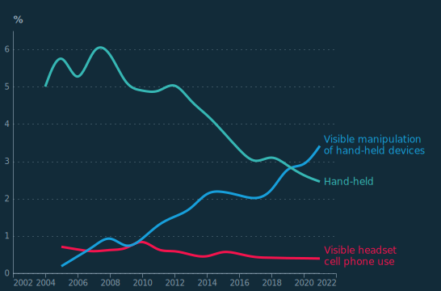

## Figure 1  

Data: [`csv`](data/fig1_rpi_local.csv)  
GitHub: [fig1_rpi_local](https://github.com/EconomicsObservatory/ECOvisualisations/tree/main/articles/why-have-insurance-premiums-gone-up-so-much)  

### Light theme  

Versions with data locally embedded into the `Vega-lite` specification file: [`png`](visualisation/fig1_rpi_local_local.png) [`svg`](visualisation/fig1_rpi_local_local.svg) [`json`](visualisation/fig1_rpi_local_local.json)   
 (**Default**) Versions with data loaded from `GitHub`: [`png`](visualisation/fig1_rpi_local.png) [`svg`](visualisation/fig1_rpi_local.svg) [`json`](visualisation/fig1_rpi_local.json)  
Versions (no ECO branding) with data locally embedded into the `Vega-lite` specification file: [`png`](visualisation/fig1_rpi_local_local_no_branding.png) [`svg`](visualisation/fig1_rpi_local_local_no_branding.svg) [`json`](visualisation/fig1_rpi_local_local_no_branding.json)   
Versions (no ECO branding) with data loaded from `GitHub`: [`png`](visualisation/fig1_rpi_local_no_branding.png) [`svg`](visualisation/fig1_rpi_local_no_branding.svg) [`json`](visualisation/fig1_rpi_local_no_branding.json)   

### Dark theme  

Versions with data locally embedded into the `Vega-lite` specification file: [`png`](visualisation/fig1_rpi_local_local_dark.png) [`svg`](visualisation/fig1_rpi_local_local_dark.svg) [`json`](visualisation/fig1_rpi_local_local_dark.json)   
 Versions with data loaded from `GitHub`: [`png`](visualisation/fig1_rpi_local_dark.png) [`svg`](visualisation/fig1_rpi_local_dark.svg) [`json`](visualisation/fig1_rpi_local_dark.json)  
Versions (no ECO branding) with data locally embedded into the `Vega-lite` specification file: [`png`](visualisation/fig1_rpi_local_local_no_branding_dark.png) [`svg`](visualisation/fig1_rpi_local_local_no_branding_dark.svg) [`json`](visualisation/fig1_rpi_local_local_no_branding_dark.json)   
Versions (no ECO branding) with data loaded from `GitHub`: [`png`](visualisation/fig1_rpi_local_no_branding_dark.png) [`svg`](visualisation/fig1_rpi_local_no_branding_dark.svg) [`json`](visualisation/fig1_rpi_local_no_branding_dark.json)   

  

## Figure 2  

Data: [`csv`](data/fig2_ins_local.csv)  
GitHub: [fig2_ins_local](https://github.com/EconomicsObservatory/ECOvisualisations/tree/main/articles/why-have-insurance-premiums-gone-up-so-much)  

### Light theme  

Versions with data locally embedded into the `Vega-lite` specification file: [`png`](visualisation/fig2_ins_local_local.png) [`svg`](visualisation/fig2_ins_local_local.svg) [`json`](visualisation/fig2_ins_local_local.json)   
 (**Default**) Versions with data loaded from `GitHub`: [`png`](visualisation/fig2_ins_local.png) [`svg`](visualisation/fig2_ins_local.svg) [`json`](visualisation/fig2_ins_local.json)  
Versions (no ECO branding) with data locally embedded into the `Vega-lite` specification file: [`png`](visualisation/fig2_ins_local_local_no_branding.png) [`svg`](visualisation/fig2_ins_local_local_no_branding.svg) [`json`](visualisation/fig2_ins_local_local_no_branding.json)   
Versions (no ECO branding) with data loaded from `GitHub`: [`png`](visualisation/fig2_ins_local_no_branding.png) [`svg`](visualisation/fig2_ins_local_no_branding.svg) [`json`](visualisation/fig2_ins_local_no_branding.json)   

### Dark theme  

Versions with data locally embedded into the `Vega-lite` specification file: [`png`](visualisation/fig2_ins_local_local_dark.png) [`svg`](visualisation/fig2_ins_local_local_dark.svg) [`json`](visualisation/fig2_ins_local_local_dark.json)   
 Versions with data loaded from `GitHub`: [`png`](visualisation/fig2_ins_local_dark.png) [`svg`](visualisation/fig2_ins_local_dark.svg) [`json`](visualisation/fig2_ins_local_dark.json)  
Versions (no ECO branding) with data locally embedded into the `Vega-lite` specification file: [`png`](visualisation/fig2_ins_local_local_no_branding_dark.png) [`svg`](visualisation/fig2_ins_local_local_no_branding_dark.svg) [`json`](visualisation/fig2_ins_local_local_no_branding_dark.json)   
Versions (no ECO branding) with data loaded from `GitHub`: [`png`](visualisation/fig2_ins_local_no_branding_dark.png) [`svg`](visualisation/fig2_ins_local_no_branding_dark.svg) [`json`](visualisation/fig2_ins_local_no_branding_dark.json)   

  

## Figure 4  

Data: [`csv`](data/fig4_tcor_local.csv)  
GitHub: [fig4_tcor_local](https://github.com/EconomicsObservatory/ECOvisualisations/tree/main/articles/why-have-insurance-premiums-gone-up-so-much)  

### Light theme  

Versions with data locally embedded into the `Vega-lite` specification file: [`png`](visualisation/fig4_tcor_local_local.png) [`svg`](visualisation/fig4_tcor_local_local.svg) [`json`](visualisation/fig4_tcor_local_local.json)   
 (**Default**) Versions with data loaded from `GitHub`: [`png`](visualisation/fig4_tcor_local.png) [`svg`](visualisation/fig4_tcor_local.svg) [`json`](visualisation/fig4_tcor_local.json)  
Versions (no ECO branding) with data locally embedded into the `Vega-lite` specification file: [`png`](visualisation/fig4_tcor_local_local_no_branding.png) [`svg`](visualisation/fig4_tcor_local_local_no_branding.svg) [`json`](visualisation/fig4_tcor_local_local_no_branding.json)   
Versions (no ECO branding) with data loaded from `GitHub`: [`png`](visualisation/fig4_tcor_local_no_branding.png) [`svg`](visualisation/fig4_tcor_local_no_branding.svg) [`json`](visualisation/fig4_tcor_local_no_branding.json)   

### Dark theme  

Versions with data locally embedded into the `Vega-lite` specification file: [`png`](visualisation/fig4_tcor_local_local_dark.png) [`svg`](visualisation/fig4_tcor_local_local_dark.svg) [`json`](visualisation/fig4_tcor_local_local_dark.json)   
 Versions with data loaded from `GitHub`: [`png`](visualisation/fig4_tcor_local_dark.png) [`svg`](visualisation/fig4_tcor_local_dark.svg) [`json`](visualisation/fig4_tcor_local_dark.json)  
Versions (no ECO branding) with data locally embedded into the `Vega-lite` specification file: [`png`](visualisation/fig4_tcor_local_local_no_branding_dark.png) [`svg`](visualisation/fig4_tcor_local_local_no_branding_dark.svg) [`json`](visualisation/fig4_tcor_local_local_no_branding_dark.json)   
Versions (no ECO branding) with data loaded from `GitHub`: [`png`](visualisation/fig4_tcor_local_no_branding_dark.png) [`svg`](visualisation/fig4_tcor_local_no_branding_dark.svg) [`json`](visualisation/fig4_tcor_local_no_branding_dark.json)   

  

## Figure 5  

Data: [`csv`](data/fig5_cell_local.csv)  
GitHub: [fig5_cell_local](https://github.com/EconomicsObservatory/ECOvisualisations/tree/main/articles/why-have-insurance-premiums-gone-up-so-much)  

### Light theme  

Versions with data locally embedded into the `Vega-lite` specification file: [`png`](visualisation/fig5_cell_local_local.png) [`svg`](visualisation/fig5_cell_local_local.svg) [`json`](visualisation/fig5_cell_local_local.json)   
 (**Default**) Versions with data loaded from `GitHub`: [`png`](visualisation/fig5_cell_local.png) [`svg`](visualisation/fig5_cell_local.svg) [`json`](visualisation/fig5_cell_local.json)  
Versions (no ECO branding) with data locally embedded into the `Vega-lite` specification file: [`png`](visualisation/fig5_cell_local_local_no_branding.png) [`svg`](visualisation/fig5_cell_local_local_no_branding.svg) [`json`](visualisation/fig5_cell_local_local_no_branding.json)   
Versions (no ECO branding) with data loaded from `GitHub`: [`png`](visualisation/fig5_cell_local_no_branding.png) [`svg`](visualisation/fig5_cell_local_no_branding.svg) [`json`](visualisation/fig5_cell_local_no_branding.json)   

### Dark theme  

Versions with data locally embedded into the `Vega-lite` specification file: [`png`](visualisation/fig5_cell_local_local_dark.png) [`svg`](visualisation/fig5_cell_local_local_dark.svg) [`json`](visualisation/fig5_cell_local_local_dark.json)   
 Versions with data loaded from `GitHub`: [`png`](visualisation/fig5_cell_local_dark.png) [`svg`](visualisation/fig5_cell_local_dark.svg) [`json`](visualisation/fig5_cell_local_dark.json)  
Versions (no ECO branding) with data locally embedded into the `Vega-lite` specification file: [`png`](visualisation/fig5_cell_local_local_no_branding_dark.png) [`svg`](visualisation/fig5_cell_local_local_no_branding_dark.svg) [`json`](visualisation/fig5_cell_local_local_no_branding_dark.json)   
Versions (no ECO branding) with data loaded from `GitHub`: [`png`](visualisation/fig5_cell_local_no_branding_dark.png) [`svg`](visualisation/fig5_cell_local_no_branding_dark.svg) [`json`](visualisation/fig5_cell_local_no_branding_dark.json)   

  

## Figure 6  

Data: [`csv`](data/fig6_theft_local.csv)  
GitHub: [fig6_theft_local](https://github.com/EconomicsObservatory/ECOvisualisations/tree/main/articles/why-have-insurance-premiums-gone-up-so-much)  

### Light theme  

Versions with data locally embedded into the `Vega-lite` specification file: [`png`](visualisation/fig6_theft_local_local.png) [`svg`](visualisation/fig6_theft_local_local.svg) [`json`](visualisation/fig6_theft_local_local.json)   
 (**Default**) Versions with data loaded from `GitHub`: [`png`](visualisation/fig6_theft_local.png) [`svg`](visualisation/fig6_theft_local.svg) [`json`](visualisation/fig6_theft_local.json)  
Versions (no ECO branding) with data locally embedded into the `Vega-lite` specification file: [`png`](visualisation/fig6_theft_local_local_no_branding.png) [`svg`](visualisation/fig6_theft_local_local_no_branding.svg) [`json`](visualisation/fig6_theft_local_local_no_branding.json)   
Versions (no ECO branding) with data loaded from `GitHub`: [`png`](visualisation/fig6_theft_local_no_branding.png) [`svg`](visualisation/fig6_theft_local_no_branding.svg) [`json`](visualisation/fig6_theft_local_no_branding.json)   

### Dark theme  

Versions with data locally embedded into the `Vega-lite` specification file: [`png`](visualisation/fig6_theft_local_local_dark.png) [`svg`](visualisation/fig6_theft_local_local_dark.svg) [`json`](visualisation/fig6_theft_local_local_dark.json)   
 Versions with data loaded from `GitHub`: [`png`](visualisation/fig6_theft_local_dark.png) [`svg`](visualisation/fig6_theft_local_dark.svg) [`json`](visualisation/fig6_theft_local_dark.json)  
Versions (no ECO branding) with data locally embedded into the `Vega-lite` specification file: [`png`](visualisation/fig6_theft_local_local_no_branding_dark.png) [`svg`](visualisation/fig6_theft_local_local_no_branding_dark.svg) [`json`](visualisation/fig6_theft_local_local_no_branding_dark.json)   
Versions (no ECO branding) with data loaded from `GitHub`: [`png`](visualisation/fig6_theft_local_no_branding_dark.png) [`svg`](visualisation/fig6_theft_local_no_branding_dark.svg) [`json`](visualisation/fig6_theft_local_no_branding_dark.json)   

  

## Figure 7  

Data: [`csv`](data/fig7_clim_local.csv)  
GitHub: [fig7_clim_local](https://github.com/EconomicsObservatory/ECOvisualisations/tree/main/articles/why-have-insurance-premiums-gone-up-so-much)  

### Light theme  

Versions with data locally embedded into the `Vega-lite` specification file: [`png`](visualisation/fig7_clim_local_local.png) [`svg`](visualisation/fig7_clim_local_local.svg) [`json`](visualisation/fig7_clim_local_local.json)   
 (**Default**) Versions with data loaded from `GitHub`: [`png`](visualisation/fig7_clim_local.png) [`svg`](visualisation/fig7_clim_local.svg) [`json`](visualisation/fig7_clim_local.json)  
Versions (no ECO branding) with data locally embedded into the `Vega-lite` specification file: [`png`](visualisation/fig7_clim_local_local_no_branding.png) [`svg`](visualisation/fig7_clim_local_local_no_branding.svg) [`json`](visualisation/fig7_clim_local_local_no_branding.json)   
Versions (no ECO branding) with data loaded from `GitHub`: [`png`](visualisation/fig7_clim_local_no_branding.png) [`svg`](visualisation/fig7_clim_local_no_branding.svg) [`json`](visualisation/fig7_clim_local_no_branding.json)   

### Dark theme  

Versions with data locally embedded into the `Vega-lite` specification file: [`png`](visualisation/fig7_clim_local_local_dark.png) [`svg`](visualisation/fig7_clim_local_local_dark.svg) [`json`](visualisation/fig7_clim_local_local_dark.json)   
 Versions with data loaded from `GitHub`: [`png`](visualisation/fig7_clim_local_dark.png) [`svg`](visualisation/fig7_clim_local_dark.svg) [`json`](visualisation/fig7_clim_local_dark.json)  
Versions (no ECO branding) with data locally embedded into the `Vega-lite` specification file: [`png`](visualisation/fig7_clim_local_local_no_branding_dark.png) [`svg`](visualisation/fig7_clim_local_local_no_branding_dark.svg) [`json`](visualisation/fig7_clim_local_local_no_branding_dark.json)   
Versions (no ECO branding) with data loaded from `GitHub`: [`png`](visualisation/fig7_clim_local_no_branding_dark.png) [`svg`](visualisation/fig7_clim_local_no_branding_dark.svg) [`json`](visualisation/fig7_clim_local_no_branding_dark.json)   

  

