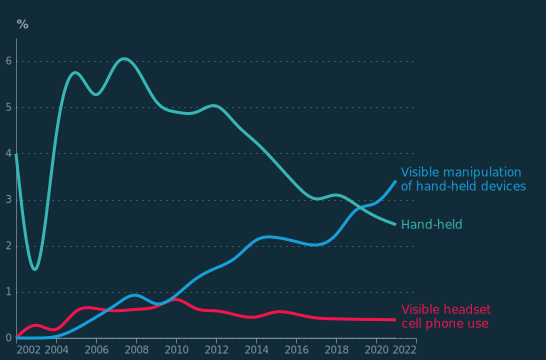

## Figure 1  

Data: [`csv`](data/fig1_rpi.csv)  
GitHub: [fig1_rpi](https://github.com/EconomicsObservatory/ECOvisualisations/tree/main/articles/why-have-insurance-premiums-gone-up-so-much)  

### Light theme  

Versions with data locally embedded into the `Vega-lite` specification file: [`png`](visualisation/fig1_rpi_local.png) [`svg`](visualisation/fig1_rpi_local.svg) [`json`](visualisation/fig1_rpi_local.json)   
 (**Default**) Versions with data loaded from `GitHub`: [`png`](visualisation/fig1_rpi.png) [`svg`](visualisation/fig1_rpi.svg) [`json`](visualisation/fig1_rpi.json)  
Versions (no ECO branding) with data locally embedded into the `Vega-lite` specification file: [`png`](visualisation/fig1_rpi_local_no_branding.png) [`svg`](visualisation/fig1_rpi_local_no_branding.svg) [`json`](visualisation/fig1_rpi_local_no_branding.json)   
Versions (no ECO branding) with data loaded from `GitHub`: [`png`](visualisation/fig1_rpi_no_branding.png) [`svg`](visualisation/fig1_rpi_no_branding.svg) [`json`](visualisation/fig1_rpi_no_branding.json)   

### Dark theme  

Versions with data locally embedded into the `Vega-lite` specification file: [`png`](visualisation/fig1_rpi_local_dark.png) [`svg`](visualisation/fig1_rpi_local_dark.svg) [`json`](visualisation/fig1_rpi_local_dark.json)   
 Versions with data loaded from `GitHub`: [`png`](visualisation/fig1_rpi_dark.png) [`svg`](visualisation/fig1_rpi_dark.svg) [`json`](visualisation/fig1_rpi_dark.json)  
Versions (no ECO branding) with data locally embedded into the `Vega-lite` specification file: [`png`](visualisation/fig1_rpi_local_no_branding_dark.png) [`svg`](visualisation/fig1_rpi_local_no_branding_dark.svg) [`json`](visualisation/fig1_rpi_local_no_branding_dark.json)   
Versions (no ECO branding) with data loaded from `GitHub`: [`png`](visualisation/fig1_rpi_no_branding_dark.png) [`svg`](visualisation/fig1_rpi_no_branding_dark.svg) [`json`](visualisation/fig1_rpi_no_branding_dark.json)   

  

## Figure 2  

Data: [`csv`](data/fig2_ins.csv)  
GitHub: [fig2_ins](https://github.com/EconomicsObservatory/ECOvisualisations/tree/main/articles/why-have-insurance-premiums-gone-up-so-much)  

### Light theme  

Versions with data locally embedded into the `Vega-lite` specification file: [`png`](visualisation/fig2_ins_local.png) [`svg`](visualisation/fig2_ins_local.svg) [`json`](visualisation/fig2_ins_local.json)   
 (**Default**) Versions with data loaded from `GitHub`: [`png`](visualisation/fig2_ins.png) [`svg`](visualisation/fig2_ins.svg) [`json`](visualisation/fig2_ins.json)  
Versions (no ECO branding) with data locally embedded into the `Vega-lite` specification file: [`png`](visualisation/fig2_ins_local_no_branding.png) [`svg`](visualisation/fig2_ins_local_no_branding.svg) [`json`](visualisation/fig2_ins_local_no_branding.json)   
Versions (no ECO branding) with data loaded from `GitHub`: [`png`](visualisation/fig2_ins_no_branding.png) [`svg`](visualisation/fig2_ins_no_branding.svg) [`json`](visualisation/fig2_ins_no_branding.json)   

### Dark theme  

Versions with data locally embedded into the `Vega-lite` specification file: [`png`](visualisation/fig2_ins_local_dark.png) [`svg`](visualisation/fig2_ins_local_dark.svg) [`json`](visualisation/fig2_ins_local_dark.json)   
 Versions with data loaded from `GitHub`: [`png`](visualisation/fig2_ins_dark.png) [`svg`](visualisation/fig2_ins_dark.svg) [`json`](visualisation/fig2_ins_dark.json)  
Versions (no ECO branding) with data locally embedded into the `Vega-lite` specification file: [`png`](visualisation/fig2_ins_local_no_branding_dark.png) [`svg`](visualisation/fig2_ins_local_no_branding_dark.svg) [`json`](visualisation/fig2_ins_local_no_branding_dark.json)   
Versions (no ECO branding) with data loaded from `GitHub`: [`png`](visualisation/fig2_ins_no_branding_dark.png) [`svg`](visualisation/fig2_ins_no_branding_dark.svg) [`json`](visualisation/fig2_ins_no_branding_dark.json)   

  

<<<<<<< Updated upstream
=======

## Figure 4  

Data: [`csv`](data/fig4_tcor.csv)  
GitHub: [fig4_tcor](https://github.com/EconomicsObservatory/ECOvisualisations/tree/main/articles/why-have-insurance-premiums-gone-up-so-much)  

### Light theme  

Versions with data locally embedded into the `Vega-lite` specification file: [`png`](visualisation/fig4_tcor_local.png) [`svg`](visualisation/fig4_tcor_local.svg) [`json`](visualisation/fig4_tcor_local.json)   
 (**Default**) Versions with data loaded from `GitHub`: [`png`](visualisation/fig4_tcor.png) [`svg`](visualisation/fig4_tcor.svg) [`json`](visualisation/fig4_tcor.json)  
Versions (no ECO branding) with data locally embedded into the `Vega-lite` specification file: [`png`](visualisation/fig4_tcor_local_no_branding.png) [`svg`](visualisation/fig4_tcor_local_no_branding.svg) [`json`](visualisation/fig4_tcor_local_no_branding.json)   
Versions (no ECO branding) with data loaded from `GitHub`: [`png`](visualisation/fig4_tcor_no_branding.png) [`svg`](visualisation/fig4_tcor_no_branding.svg) [`json`](visualisation/fig4_tcor_no_branding.json)   

### Dark theme  

Versions with data locally embedded into the `Vega-lite` specification file: [`png`](visualisation/fig4_tcor_local_dark.png) [`svg`](visualisation/fig4_tcor_local_dark.svg) [`json`](visualisation/fig4_tcor_local_dark.json)   
 Versions with data loaded from `GitHub`: [`png`](visualisation/fig4_tcor_dark.png) [`svg`](visualisation/fig4_tcor_dark.svg) [`json`](visualisation/fig4_tcor_dark.json)  
Versions (no ECO branding) with data locally embedded into the `Vega-lite` specification file: [`png`](visualisation/fig4_tcor_local_no_branding_dark.png) [`svg`](visualisation/fig4_tcor_local_no_branding_dark.svg) [`json`](visualisation/fig4_tcor_local_no_branding_dark.json)   
Versions (no ECO branding) with data loaded from `GitHub`: [`png`](visualisation/fig4_tcor_no_branding_dark.png) [`svg`](visualisation/fig4_tcor_no_branding_dark.svg) [`json`](visualisation/fig4_tcor_no_branding_dark.json)   

  

## Figure 5  

Data: [`csv`](data/fig5_cell.csv)  
GitHub: [fig5_cell](https://github.com/EconomicsObservatory/ECOvisualisations/tree/main/articles/why-have-insurance-premiums-gone-up-so-much)  

### Light theme  

Versions with data locally embedded into the `Vega-lite` specification file: [`png`](visualisation/fig5_cell_local.png) [`svg`](visualisation/fig5_cell_local.svg) [`json`](visualisation/fig5_cell_local.json)   
 (**Default**) Versions with data loaded from `GitHub`: [`png`](visualisation/fig5_cell.png) [`svg`](visualisation/fig5_cell.svg) [`json`](visualisation/fig5_cell.json)  
Versions (no ECO branding) with data locally embedded into the `Vega-lite` specification file: [`png`](visualisation/fig5_cell_local_no_branding.png) [`svg`](visualisation/fig5_cell_local_no_branding.svg) [`json`](visualisation/fig5_cell_local_no_branding.json)   
Versions (no ECO branding) with data loaded from `GitHub`: [`png`](visualisation/fig5_cell_no_branding.png) [`svg`](visualisation/fig5_cell_no_branding.svg) [`json`](visualisation/fig5_cell_no_branding.json)   

### Dark theme  

Versions with data locally embedded into the `Vega-lite` specification file: [`png`](visualisation/fig5_cell_local_dark.png) [`svg`](visualisation/fig5_cell_local_dark.svg) [`json`](visualisation/fig5_cell_local_dark.json)   
 Versions with data loaded from `GitHub`: [`png`](visualisation/fig5_cell_dark.png) [`svg`](visualisation/fig5_cell_dark.svg) [`json`](visualisation/fig5_cell_dark.json)  
Versions (no ECO branding) with data locally embedded into the `Vega-lite` specification file: [`png`](visualisation/fig5_cell_local_no_branding_dark.png) [`svg`](visualisation/fig5_cell_local_no_branding_dark.svg) [`json`](visualisation/fig5_cell_local_no_branding_dark.json)   
Versions (no ECO branding) with data loaded from `GitHub`: [`png`](visualisation/fig5_cell_no_branding_dark.png) [`svg`](visualisation/fig5_cell_no_branding_dark.svg) [`json`](visualisation/fig5_cell_no_branding_dark.json)   

  

>>>>>>> Stashed changes

