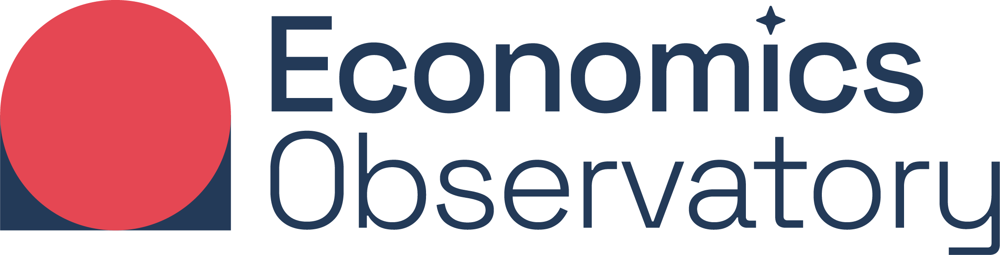
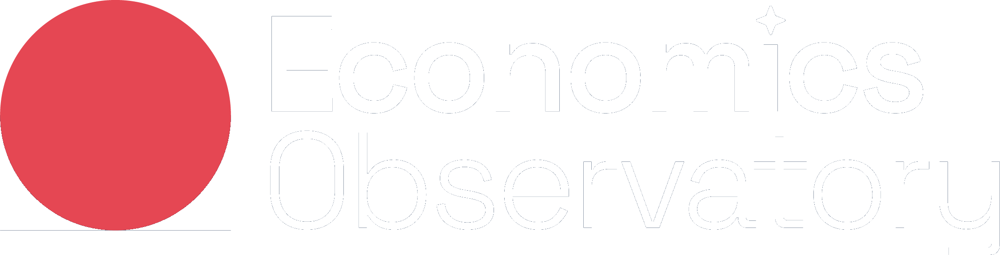
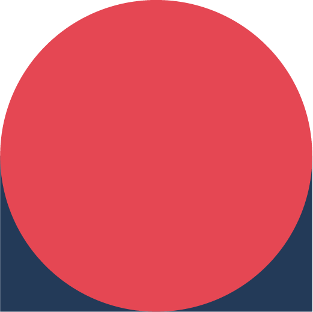
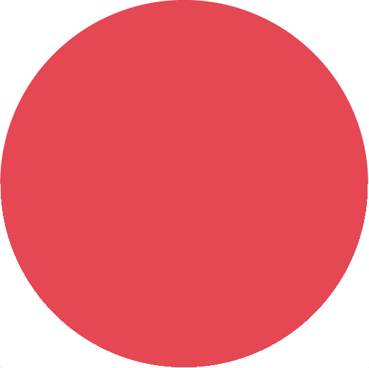

# Economics Observatory Visualisation Guidelines

[**Branding guidelines**](/guidelines#-branding-guidelines)
| [**Charting guidelines**](https://github.com/EconomicsObservatory/ecovisualisations)
| [**Coding guidelines**](https://github.com/EconomicsObservatory/ecodatahub)

At the **Observatory**, we strive to follow current best practices to stay up to date with recent developments of the rapidly-changing world of data visualisation. We maintain a set of guidelines that we use internally for designing our visualisations - but they are also free to share and please feel free to raise an [Issue](https://github.com/EconomicsObservatory/ECOvisualisations/issues) if you have any suggestions, everyone and everything is welcome! 💙

## 👓 Branding guidelines

### Logos

| [Full logo with title](./logos/eco-full-logo.png)                     |                   |
| :-------------------------------------------------------------------- | :------------------------------------------------------------ |
| [Full logo with title dark](./logos/eco-full-logo-dark.png)                 |              |
| [Square icon](./logos/eco-sqare-logo.png)                                   |                 |
| [Square icon dark](./logos/eco-sqare-logo-dark.png)                         |            |
| [Square icon with ECO text](./logos/eco-sqare-logo-with-text.jpg)           |       |
| [Square icon with ECO text dark](./logos/eco-sqare-logo-with-text-dark.png) |  |

You will find all logo source files in [this](./logos) folder.

### Fonts

| Primary     | [Spectral Light](https://fonts.google.com/specimen/Spectral), serif  |   |
| :---------- | :------------------------------------------------------------------- | :------------------------------------------------ |
| Secondary   | [Work Sans](https://fonts.google.com/specimen/Work+Sans), sans-serif |  |
| Title       | Spectral, serif                                                      |
| Subtitle    | Work Sans, sans-serif                                                |
| Headings    | Work Sans, sans-serif                                                |
| Subheadings | Spectral, sans-serif                                                 |

You will find all the font source files in [this](./fonts) folder.

### Colours

The two main colours we always use are the logo colors:
|
ECO red
|`#E54753`|`rgb(229,71,83)`|
|---|---|---|
|
ECO blue
|`#243B5A`|`rgb(36,59,90)`|

On top of this, we try to limit our color palette to the following 9 colors, in this order of preference:
|
ECO turquiose
|`#36B7B4`|`rgb(54,183,180)`|
|---|---|---|
|
ECO pink
|`#E6224B`|`rgb(230,34,75)`|
|
ECO yellow
|`#F4C245`|`rgb(244,194,69)`|
|
ECO mid-blue
|`#0063AF`|`rgb(0,99,175)`|
|
ECO green
|`#00A767`|`rgb(0,167,103)`|
|
ECO light-blue
|`#179FDB`|`rgb(23,159,219)`|
|
ECO orange
|`#EB5C2E`|`rgb(235,92,46)`|
|
ECO purple
|`#5C267B`|`rgb(92,38,123)`|
|
ECO dark-blue
|`#122B39`|`rgb(18,43,57)`|

On top of this, we have one service colour:
|
ECO gray
|`#676A86`|`rgb(103,106,134)`|
|---|---|---|

Axes, tick marks, tick labels, grids and axis labels are always drawn in `ECO gray`. Unless encoded to represent a data category, annotations also use `ECO gray`.

### Color scales

#### [Category](./colors/eco-category-color.json)

&nbsp;&nbsp;&nbsp;
&nbsp;&nbsp;&nbsp;
&nbsp;&nbsp;&nbsp;
&nbsp;&nbsp;&nbsp;
&nbsp;&nbsp;&nbsp;
&nbsp;&nbsp;&nbsp;
&nbsp;&nbsp;&nbsp;

#### [Single-hue](./colors/eco-single-hue-color.json)

&nbsp;&nbsp;&nbsp;&nbsp;&nbsp;&nbsp;&nbsp;&nbsp;&nbsp;&nbsp;&nbsp;&nbsp;

#### [Multi-hue](./colors/eco-multi-hue-color.json)

&nbsp;&nbsp;&nbsp;&nbsp;&nbsp;&nbsp;&nbsp;&nbsp;&nbsp;&nbsp;&nbsp;&nbsp;&nbsp;&nbsp;&nbsp;

#### [Diverging](./colors/eco-diverging-color.json)

&nbsp;&nbsp;&nbsp;&nbsp;&nbsp;&nbsp;&nbsp;&nbsp;&nbsp;&nbsp;&nbsp;&nbsp;&nbsp;&nbsp;&nbsp;

You will find `json` files for each of these color scales, as well as the `ECO` [color names](./colors/eco-colors.json) in [this](./colors/) folder.

### Opacity

If any chart needs custom colour opacity levels, the preferred way is to use the `rgba` codes from the color table, with an `alpha` value between `0.3` and `0.9`.

### Line style

Our preferred `line-style` is always `solid ▬ 2px`. Secondary lines are shown in `solid — 1px`, tertiary lines are shown in `dashed -- 1px`, while quaternary lines are `dotted ··· 1px`. It is always desirable to change the `color` attribute first to differentiate between nominal data categories, before turning to changing the `line-style`, unless otherwise defined by the visualisation conditions (e.g. monochrome chart).

## 🌌 Charting guidelines

For every chart we create, we try to prametrise as much as possible, loading the color schemes and styles directly from this guideline repository folder. This allows us to maintain a consistent style for our charts and, if needed, correct appearance bugs and update all charts created in the past with new styles. Learn more about how do we accomplish this in the [Code](#-coding-guidelines) section.

The aesthetic zens we follow are those of:

- [David McCandless](http://davidmccandless.com/) (and the charts presented in [Information is Beautiful](http://www.informationisbeautiful.net/books/) and [Knowledge is Beautiful](http://www.informationisbeautiful.net/books/), and more recently [Beautiful News](https://informationisbeautiful.net/beautifulnews/))
- [Nadieh `visualcinnamon` Bremer](https://www.visualcinnamon.com/) (and the charts presented in [Data Sketches](https://www.datasketch.es/), together with [Shirley Wu](https://shirleywu.studio/))
- [Lisa Charlotte Rost](https://lisacharlotterost.de/)
- [Maarten Lambrechts](http://www.maartenlambrechts.com/made.html)
- [Andy Kirk](https://www.visualisingdata.com/about/) (and the charts presented in [Data Visualisation](https://www.visualisingdata.com/book/))
- [Nathan Yau](https://flowingdata.com/)
- [The Pudding](https://pudding.cool/)

### Line plot

### Line plot with confidence bands

### ~~Column chart~~ Bar chart

### Scatter plot

### Dot plot

### Box plot/Violin plot

### Area chart

### ~~Piechart~~ Donut chart

### ~~3D Scatter~~ Heatmap

### Treemap

### Packed circles

### Parallel coordinates

### Sankey diagram

### Priestley diagram

### Network diagram

### Choropleth map

### Scatter map

### Arc map

### Dorling cartogram

## 👩‍💻 Coding guidelines

The coding zens we follow are those of:

- [Jeffrey Heer](https://homes.cs.washington.edu/~jheer/) of [idl](https://idl.cs.washington.edu/), the cradle of modern visualisation tools, such as [Vega](http://vega.github.io/), [D3.js](https://d3js.org/) and [Tableau](https://www.tableau.com/).
- [Datawheel](https://www.datawheel.us/), creators of [D3plus](http://d3plus.org/)
- [Mike Bostock](https://bost.ocks.org/mike/), [D3.js](https://d3js.org/) legend and creator of [Observable](https://observablehq.com)
- [Jake VanderPlas](http://vanderplas.com/), [Vega](http://vega.github.io/) guru and [Altair](https://altair-viz.github.io/) lead, and the lessons presented in the [Python Data Science Handbook](https://twitter.com/pydatasci)

### Python/Jupyter/Google Colab

### matplotlib

### Vega/Vega-lite/Voyager/Lyra

### D3.js/D3plus/NVD3

### eCharts

### Docker
