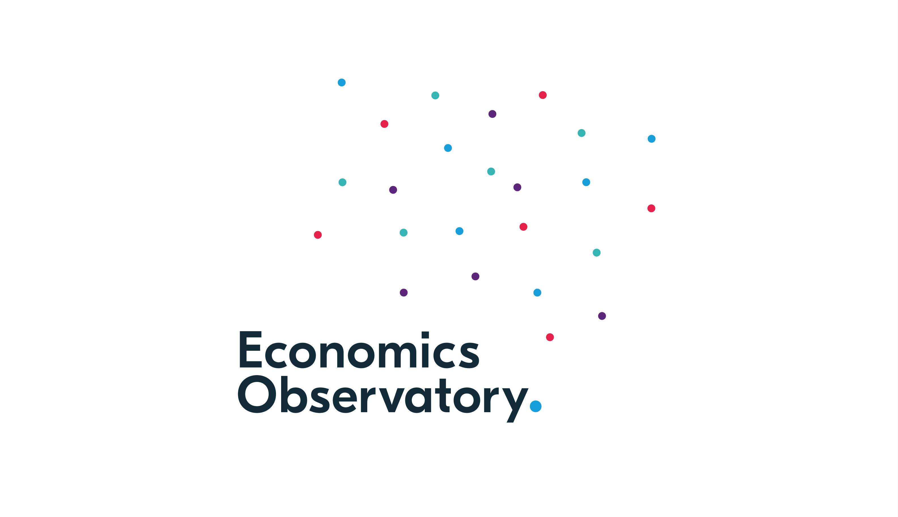
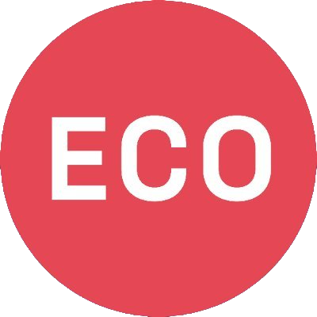
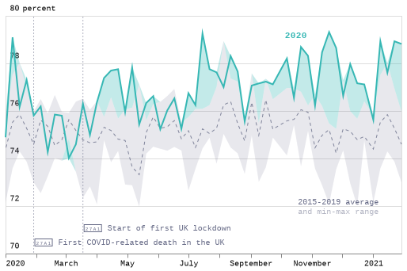

# Economics Observatory Visualisation Guidelines

[**Branding guidelines**](#-branding-guidelines)
| [**Charting guidelines**](#-charting-guidelines)
| [**Coding guidelines**](#-coding-guidelines)

At the **Observatory**, we strive to follow current best practices to stay up to date with recent developments of the rapidly-changing world of data visualisation. We maintain a set of guidelines that we use internally for designing our visualisations - but they are also free to share and please feel free to raise an [Issue](https://github.com/EconomicsObservatory/ECOvisualisations/issues) if you have any suggestions, everyone and everything is welcome! 💙 Why do we think this is important? - I'll let dataviz economist [Jonathan Schwabish](https://policyviz.com/further-thoughts-on-developing-a-style-guide-at-your-organization/), author of [Better Data Visualizations](https://cup.columbia.edu/book/better-data-visualizations/9780231193115) do the convincing.

## 👓 Branding guidelines

### Logos

| [Banner](./logos/eco-banner.png) |  |
| :-------------------------------------------------------------------- | :------------------------------------------------------------ |
| [Social header](./logos/eco-social-header.jpg) |  |
| [Square icon](./logos/eco-icon.jpg) |  |
| [Square brandmark](./logos/eco-square.png) |  |
| [Icon dark](./logos/eco-icon-dark.png) |  |
| [Icon light](./logos/eco-icon-light.png) |  |
| [Logo dark](./logos/eco-logo-dark.png) |  |
| [Logo light](./logos/eco-logo-light.png) |  |
| [Background dark](./logos/eco-bg-dark.png) |  |
| [Background light](./logos/eco-bg-light.png) |  |
| [Pattern dark](./logos/eco-pattern-dark.png) |  |
| [Pattern light](./logos/eco-pattern-light.png) |  |
<!-- | [Alternate full logo with title](./logos/eco-full-logo.png)                     |                   | -->
<!-- | [Alternate full logo with title dark](./logos/eco-full-logo-dark.png)                 |              | -->
<!-- | [Alternate square icon](./logos/eco-sqare-logo.png)                                   |                 | -->
<!-- | [Alternate square icon dark](./logos/eco-sqare-logo-dark.png)                         |            | -->
<!-- | [Alternate  square icon with ECO text](./logos/eco-sqare-logo-with-text.jpg)           |       | -->
<!-- | [Alternate  square icon with ECO text dark](./logos/eco-sqare-logo-with-text-dark.png) |  | -->

You will find all logo source files in [this](./logos) folder.

### Fonts

| Logo     | [Circular](https://fonts.google.com/specimen/Circular), sans-oserif  |   |
| :---------- | :------------------------------------------------------------------- | :------------------------------------------------ |
| Primary     | [Spectral Light](https://fonts.google.com/specimen/Spectral), serif  |   |
| Secondary   | [Work Sans](https://fonts.google.com/specimen/Work+Sans), sans-serif |  |
| Title       | Spectral, serif                                                      |
| Subtitle    | Work Sans, sans-serif                                                |
| Headings    | Work Sans, sans-serif                                                |
| Subheadings | Spectral, sans-serif                                                 |

You will find all the font source files in [this](./fonts) folder.

### Colors

The two main colors we always use are the logo colors:
|
ECO dot
|`#F4134D`|`rgb(244,19,77)`|
|:---|:---|:---|
|
ECO background
|`#122B39`|`rgb(18,43,57)`|

Legacy logo colors that we do not use anymore, but you may still find on some of our older charts:
|
ECO red
|`#E54753`|`rgb(229,71,83)`|
|:---|:---|:---|
|
ECO blue
|`#243B5A`|`rgb(36,59,90)`|

On top of this, we try to limit our color palette to the following 9 colors, in this order of preference:
|
ECO turquiose
|`#36B7B4`|`rgb(54,183,180)`|
|:---|:---|:---|
|
ECO pink
|`#E6224B`|`rgb(230,34,75)`|
|
ECO yellow
|`#F4C245`|`rgb(244,194,69)`|
|
ECO mid-blue
|`#0063AF`|`rgb(0,99,175)`|
|
ECO green
|`#00A767`|`rgb(0,167,103)`|
|
ECO light-blue
|`#179FDB`|`rgb(23,159,219)`|
|
ECO orange
|`#EB5C2E`|`rgb(235,92,46)`|
|
ECO purple
|`#5C267B`|`rgb(92,38,123)`|
|
ECO dark-blue
|`#122B39`|`rgb(18,43,57)`|

On top of this, we have one service colour:
|
ECO gray
|`#676A86`|`rgb(103,106,134)`|
|:---|:---|:---|

Axes, tick marks, tick labels, grids and axis labels are always drawn in `ECO gray`. Unless encoded to represent a data category, annotations also use `ECO gray`.

### Color scales

#### [Category](./colors/eco-category-color.json)

&nbsp;&nbsp;&nbsp;&nbsp;&nbsp;&nbsp;&nbsp;&nbsp;&nbsp;&nbsp;&nbsp;&nbsp;&nbsp;&nbsp;&nbsp;&nbsp;&nbsp;&nbsp;&nbsp;&nbsp;&nbsp;

#### [Single-hue](./colors/eco-single-hue-color.json)

&nbsp;&nbsp;&nbsp;&nbsp;&nbsp;&nbsp;&nbsp;&nbsp;&nbsp;&nbsp;&nbsp;&nbsp;

#### [Multi-hue](./colors/eco-multi-hue-color.json)

&nbsp;&nbsp;&nbsp;&nbsp;&nbsp;&nbsp;&nbsp;&nbsp;&nbsp;&nbsp;&nbsp;&nbsp;&nbsp;&nbsp;&nbsp;

#### [Diverging](./colors/eco-diverging-color.json)

&nbsp;&nbsp;&nbsp;&nbsp;&nbsp;&nbsp;&nbsp;&nbsp;&nbsp;&nbsp;&nbsp;&nbsp;&nbsp;&nbsp;&nbsp;

You will find `json` files for each of these color scales, as well as the `ECO` [color names](./colors/eco-colors.json) in [this](./colors/) folder.
If you are not an alien 👽 who can read hex codes natively, we prefer the [HSL](https://css-tricks.com/hsl-hsla-is-great-for-programmatic-color-control/), or *even better*, the [HCL](https://en.wikipedia.org/wiki/HCL_color_space) (sometimes called CIELuv) color space, for which [**hcl**wizard](https://hclwizard.org/) is a good and [HSLuv](https://www.hsluv.org/) is *even better* tool.  If we need to just quickly generate a custom but still beautiful color scale, the more generic tools we love are:

- The one and only [ColorBrewer](https://colorbrewer2.org/)
- [Colorcet](https://colorcet.holoviz.org/) in [Anaconda](https://www.anaconda.com/)'s [Holoviz](https://holoviz.org/) package
- [Coolors](http://coolors.co/) for generating beautiful 5-color palette quickly
- [Paletton](https://paletton.com/) for generating beautiful color palette scientifically
- [ColorSpace](https://mycolor.space/) for generating beautiful palettes from a seed color
- [Adobe Color](https://color.adobe.com/create/color-wheel)

### Opacity

If any chart needs custom colour opacity levels, the preferred way is to use the `rgba` codes from the color table, with an `alpha` value between `0.3` and `0.9`. 

- The default opacity for _bar charts_ is `0.8`. 
- The default opacity for _area charts_ is `0.8`. If possible, area charts will carry an opacity gradient between `0` and `0.9`, from base to peak, with a gradient angle of ~60-70 degrees.

### Line style

Our preferred `line-style` is always `solid ▬ 2px`. Secondary lines are shown in `solid — 1px`, tertiary lines are shown in `dashed -- 1px`, while quaternary lines are `dotted ··· 1px`. It is always desirable to change the `color` attribute first to differentiate between nominal data categories, before turning to changing the `line-style`, unless otherwise defined by the visualisation conditions (e.g. monochrome chart).

### Defaults

#### UK countries

|England|
ECO purple
|`#5C267B`|`rgb(92,38,123)`|
|:---|:---|:---|:---|
|Wales|
ECO pink
|`#E6224B`|`rgb(230,34,75)`|
|Scotland|
ECO mid-blue
|`#0063AF`|`rgb(0,99,175)`|
|Northern Ireland|
ECO green
|`#00A767`|`rgb(0,167,103)`|

## 🌌 Charting guidelines

For every chart we create, we try to prametrise as much as possible, loading the color schemes and styles directly from this guideline repository folder. This allows us to maintain a consistent style for our charts and, if needed, correct appearance bugs and update all charts created in the past with new styles. Learn more about how do we accomplish this in the [Code](#-coding-guidelines) section.

The aesthetic zens we follow are those of:

- [David McCandless](http://davidmccandless.com/) (and the charts presented in [Information is Beautiful](http://www.informationisbeautiful.net/books/) and [Knowledge is Beautiful](http://www.informationisbeautiful.net/books/), and more recently [Beautiful News](https://informationisbeautiful.net/beautifulnews/))
- [Nadieh `visualcinnamon` Bremer](https://www.visualcinnamon.com/) (and the charts presented in [Data Sketches](https://www.datasketch.es/), together with [Shirley Wu](https://shirleywu.studio/))
- [Lisa Charlotte Rost](https://lisacharlotterost.de/)
- [Maarten Lambrechts](http://www.maartenlambrechts.com/made.html)
- [Andy Kirk](https://www.visualisingdata.com/about/) (and the charts presented in [Data Visualisation](https://www.visualisingdata.com/book/))
- [Nathan Yau](https://flowingdata.com/)
- [The Pudding](https://pudding.cool/)

When creating charts, usually the first step is to envisage the type of chart that can accurately represent the underlying data, with all of its internal complexity. In order to help with this process, we can use a **visual vocabulary**. A few good ones are:  

- [Financial Times Visual Vocabulary](http://ft-interactive.github.io/visual-vocabulary/)
- [Tableau Visual Vocabulary](https://public.tableau.com/profile/andy.kriebel#!/vizhome/VisualVocabulary/VisualVocabulary)
- [Vega Edition](https://gramener.github.io/visual-vocabulary-vega/) of the Visual Vocabulary
- [PowerBI Edition](https://app.powerbi.com/view?r=eyJrIjoiMDA4YWIwZWEtMDE3ZS00YmFhLWE5YWMtODFlZWEzNTU1ODNiIiwidCI6IjZjMGE1YjljLTA4OWEtNDk0ZS1iMDVlLTcxNjEwOTgyOTA0NyIsImMiOjF9) of the Visual Vocabulary
- [Voyager](https://www.github.com/vega/voyager), powered by [CompassSQL](https://www.github.com/vega/compassql) 
- [Andy Kirks](https://www.visualisingdata.com/)'s [The Chartmaker Directory](http://chartmaker.visualisingdata.com/)
- [Christophe Viau](https://twitter.com/d3visualization)'s [D3.js Chart Gallery](https://christopheviau.com/d3list/gallery.html)
- The [D3 Graph Gallery](https://www.d3-graph-gallery.com/)
- The [Observable](https://observablehq.com/community) Community
- The [Data Visualisation Catalogue](https://datavizcatalogue.com/)
- The [Awesome-dataviz](https://github.com/fasouto/awesome-dataviz) list
- The [cube.js](https://cube.dev/blog/dataviz-ecosystem-2021/) list

### Line plot

Line plots are excellent for showing temporal changes in data.

Here are all the line plots that we have created:

### Line plot with confidence bands

||||
|---|---|---|
||||

### Area chart

### ~~Column chart~~ Bar chart

### Scatter plot

### Dot plot

### Box plot/Violin plot

### ~~Piechart~~ Donut chart

### ~~3D Scatter~~ Heatmap

### Treemap

### Packed circles
||||
|---|---|---|
|z|

### Parallel coordinates

### Sankey diagram

### Priestley diagram

### Network diagram

### Choropleth map

### Scatter map

### Arc map

### Dorling cartogram

## 👩‍💻 Coding guidelines

When creating explorable charts, interactives or **dashboards**, the tools we use are:

- [Panel](https://panel.holoviz.org/) in [Anaconda](https://www.anaconda.com/)'s [Holoviz](https://holoviz.org/) package (also known for [Bokeh](https://docs.bokeh.org/en/latest/)) for easy interactivity and mixed chart types
- [Grafana](http://grafana.net/) for something beautiful from streaming or lots of data 
- [Superset](https://superset.apache.org/) for an all-out open-source BI dashboard (albeit with a steep learning curve!)
- [PowerBI](https://powerbi.microsoft.com/en-us/) if open source is not so important

The coding zens we follow are those of:

- [Jeffrey Heer](https://homes.cs.washington.edu/~jheer/) of [idl](https://idl.cs.washington.edu/), the cradle of modern visualisation tools, such as [Vega](http://vega.github.io/), [D3.js](https://d3js.org/) and [Tableau](https://www.tableau.com/).
- [Datawheel](https://www.datawheel.us/), creators of [D3plus](http://d3plus.org/)
- [Mike Bostock](https://bost.ocks.org/mike/), [D3.js](https://d3js.org/) legend and creator of [Observable](https://observablehq.com)
- [Jake VanderPlas](http://vanderplas.com/), [Vega](http://vega.github.io/) guru and [Altair](https://altair-viz.github.io/) lead, and the lessons presented in the [Python Data Science Handbook](https://twitter.com/pydatasci)

### Python/Jupyter/Google Colab

### matplotlib

### Vega/Vega-lite/Voyager/Lyra

### D3.js/D3plus/NVD3

### eCharts

### Docker

## Make sure you check out the 📐[Data Guidelines ↗](https://github.com/EconomicsObservatory/ECOdataHUB/tree/main/guidelines) too!

Updated on 📆 2021-05-15 by [Dénes Csala](https://csaladen.es)
