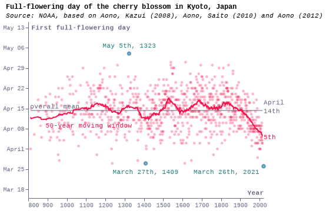
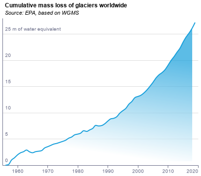

### fig1_climate_scenarios_local

### fig3_cherry_blossom_local

### fig3_cherry_blossom_local

### fig3_cherry_blossom_local

### fig3_cherry_blossom_local

### fig4a_ice_local

### fig4a_ice_local

### fig4b_glaciers_local

### fig4b_glaciers_local

### fig4b_glaciers_local

### fig4b_glaciers_local

### fig4b_glaciers_local

### fig4b_glaciers_local

### fig4b_glaciers_local

### fig4b_glaciers_local

### fig4b_glaciers_local

