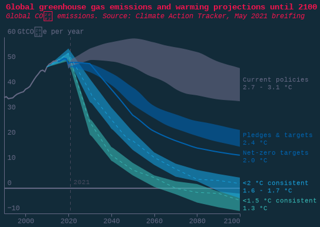
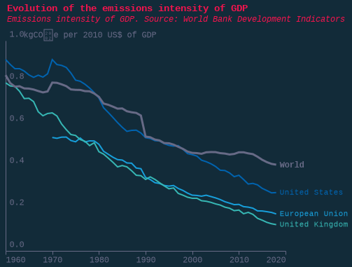
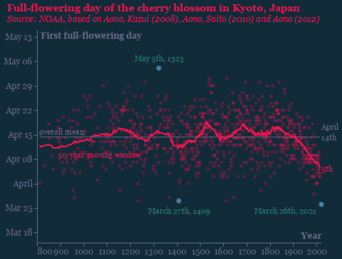
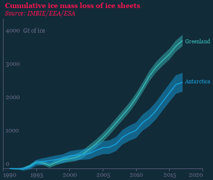
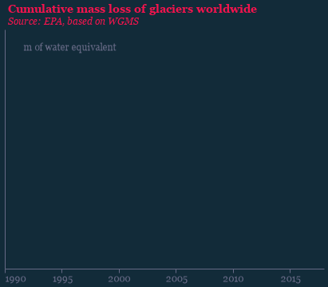

### fig1_climate_scenarios

### fig1_climate_scenarios_dark

### fig2_gdp_emissions_intensity

### fig2_gdp_emissions_intensity_dark

### fig3_cherry_blossom

### fig3_cherry_blossom_dark

### fig4a_ice_dark

### fig4a_ice_dark_dark

### fig4b_glaciers

### fig4b_glaciers_dark

