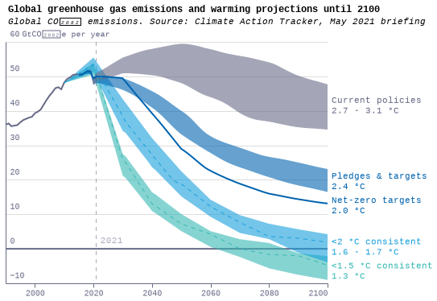
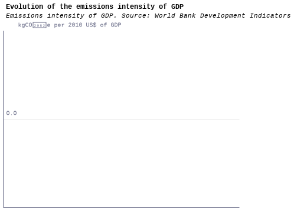
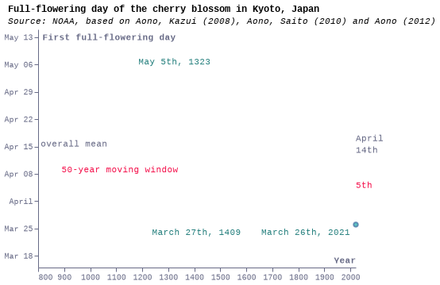
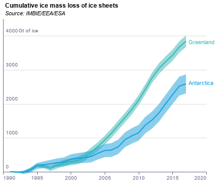
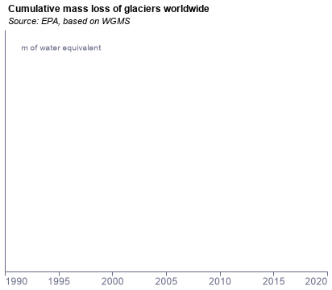

### fig1_climate_scenarios

### fig1_climate_scenarios

### fig2_gdp_emissions_intensity

### fig2_gdp_emissions_intensity

### fig3_cherry_blossom

### fig3_cherry_blossom

### fig4a_ice

### fig4a_ice

### fig4b_glaciers

### fig4b_glaciers

