### fig1_climate_scenarios_local

### fig1_climate_scenarios_local_dark
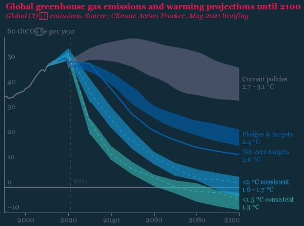

### fig2_gdp_emissions_intensity_local
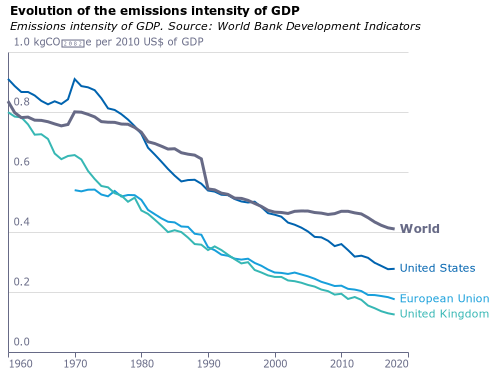

### fig2_gdp_emissions_intensity_local_dark
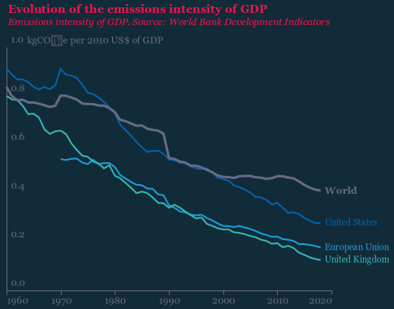

### fig3_cherry_blossom_local

### fig3_cherry_blossom_local_dark
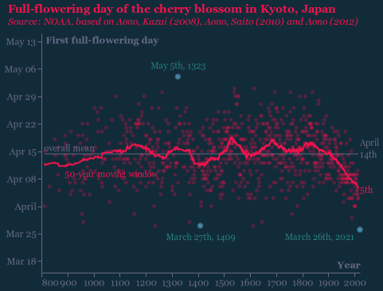

### fig4a_ice_local

### fig4a_ice_local_dark

### fig4b_glaciers_local

### fig4b_glaciers_local_dark
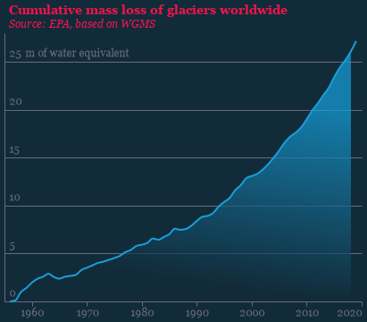

### fig6a_time-allocation_local
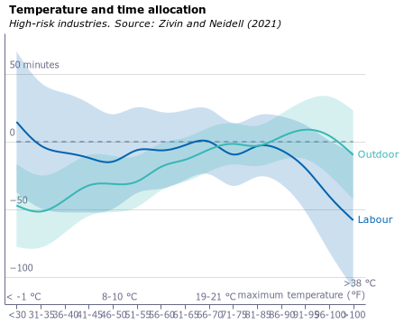

### fig6a_time-allocation_local_dark
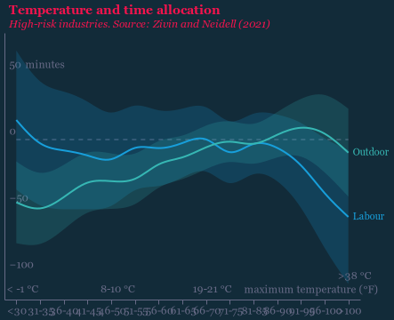

### fig6b_time-allocation-b_local
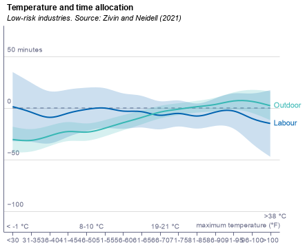

### fig6b_time-allocation-b_local_dark
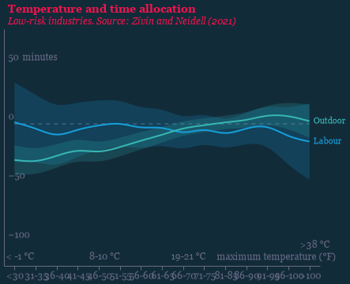

### fig7_policies_local
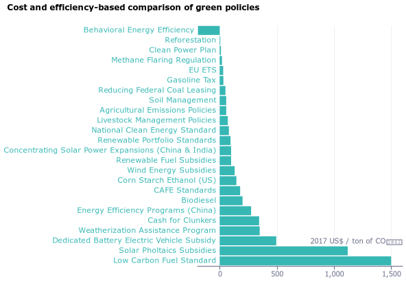

### fig7_policies_local_dark
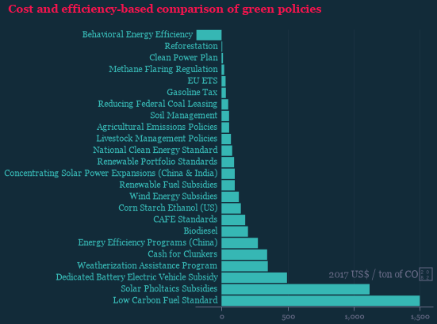

### fig8_co2targets_local_dark
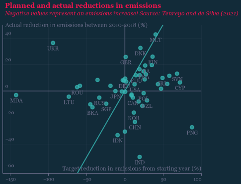

