# Article 4 

## Climate in numbers

### fig4-1_fossil-fuels_local --- [json](visualisation/fig4-1_fossil-fuels_local.json "fig4-1_fossil-fuels_local") [svg](visualisation/fig4-1_fossil-fuels_local.svg "fig4-1_fossil-fuels_local") [png](visualisation/fig4-1_fossil-fuels_local.png "fig4-1_fossil-fuels_local")

### fig4-1_fossil-fuels_local_dark --- [json](visualisation/fig4-1_fossil-fuels_local_dark.json "fig4-1_fossil-fuels_local_dark") [svg](visualisation/fig4-1_fossil-fuels_local_dark.svg "fig4-1_fossil-fuels_local_dark") [png](visualisation/fig4-1_fossil-fuels_local_dark.png "fig4-1_fossil-fuels_local_dark")

### fig4-2a_emissions_local --- [json](visualisation/fig4-2a_emissions_local.json "fig4-2a_emissions_local") [svg](visualisation/fig4-2a_emissions_local.svg "fig4-2a_emissions_local") [png](visualisation/fig4-2a_emissions_local.png "fig4-2a_emissions_local")

### fig4-2a_emissions_local_dark --- [json](visualisation/fig4-2a_emissions_local_dark.json "fig4-2a_emissions_local_dark") [svg](visualisation/fig4-2a_emissions_local_dark.svg "fig4-2a_emissions_local_dark") [png](visualisation/fig4-2a_emissions_local_dark.png "fig4-2a_emissions_local_dark")

### fig4-2b_emissions_local --- [json](visualisation/fig4-2b_emissions_local.json "fig4-2b_emissions_local") [svg](visualisation/fig4-2b_emissions_local.svg "fig4-2b_emissions_local") [png](visualisation/fig4-2b_emissions_local.png "fig4-2b_emissions_local")

### fig4-2b_emissions_local_dark --- [json](visualisation/fig4-2b_emissions_local_dark.json "fig4-2b_emissions_local_dark") [svg](visualisation/fig4-2b_emissions_local_dark.svg "fig4-2b_emissions_local_dark") [png](visualisation/fig4-2b_emissions_local_dark.png "fig4-2b_emissions_local_dark")

### fig4-3_climate-scenarios_local --- [json](visualisation/fig4-3_climate-scenarios_local.json "fig4-3_climate-scenarios_local") [svg](visualisation/fig4-3_climate-scenarios_local.svg "fig4-3_climate-scenarios_local") [png](visualisation/fig4-3_climate-scenarios_local.png "fig4-3_climate-scenarios_local")

### fig4-3_climate-scenarios_local_dark --- [json](visualisation/fig4-3_climate-scenarios_local_dark.json "fig4-3_climate-scenarios_local_dark") [svg](visualisation/fig4-3_climate-scenarios_local_dark.svg "fig4-3_climate-scenarios_local_dark") [png](visualisation/fig4-3_climate-scenarios_local_dark.png "fig4-3_climate-scenarios_local_dark")

### fig4-4_gdp-loss_local --- [json](visualisation/fig4-4_gdp-loss_local.json "fig4-4_gdp-loss_local") [svg](visualisation/fig4-4_gdp-loss_local.svg "fig4-4_gdp-loss_local") [png](visualisation/fig4-4_gdp-loss_local.png "fig4-4_gdp-loss_local")

### fig4-4_gdp-loss_local_dark --- [json](visualisation/fig4-4_gdp-loss_local_dark.json "fig4-4_gdp-loss_local_dark") [svg](visualisation/fig4-4_gdp-loss_local_dark.svg "fig4-4_gdp-loss_local_dark") [png](visualisation/fig4-4_gdp-loss_local_dark.png "fig4-4_gdp-loss_local_dark")
[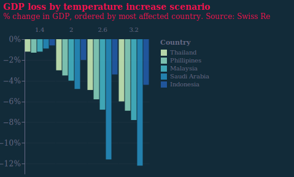](visualisation/fig4-4_gdp-loss_local_dark.svg "fig4-4_gdp-loss_local_dark")

### fig4-5_forest-area_local --- [json](visualisation/fig4-5_forest-area_local.json "fig4-5_forest-area_local") [svg](visualisation/fig4-5_forest-area_local.svg "fig4-5_forest-area_local") [png](visualisation/fig4-5_forest-area_local.png "fig4-5_forest-area_local")
[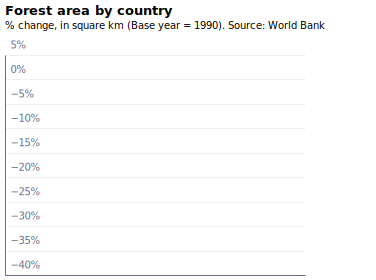](visualisation/fig4-5_forest-area_local.svg "fig4-5_forest-area_local")

### fig4-5_forest-area_local_dark --- [json](visualisation/fig4-5_forest-area_local_dark.json "fig4-5_forest-area_local_dark") [svg](visualisation/fig4-5_forest-area_local_dark.svg "fig4-5_forest-area_local_dark") [png](visualisation/fig4-5_forest-area_local_dark.png "fig4-5_forest-area_local_dark")

### fig4-6_endangered-species_local --- [json](visualisation/fig4-6_endangered-species_local.json "fig4-6_endangered-species_local") [svg](visualisation/fig4-6_endangered-species_local.svg "fig4-6_endangered-species_local") [png](visualisation/fig4-6_endangered-species_local.png "fig4-6_endangered-species_local")

### fig4-6_endangered-species_local_dark --- [json](visualisation/fig4-6_endangered-species_local_dark.json "fig4-6_endangered-species_local_dark") [svg](visualisation/fig4-6_endangered-species_local_dark.svg "fig4-6_endangered-species_local_dark") [png](visualisation/fig4-6_endangered-species_local_dark.png "fig4-6_endangered-species_local_dark")

# Article 5 

## Targets

Cloned from [is-the-uk-on-track-to-meet-its-climate-commitments](https://www.github.com/EconomicsObservatory/ECOvisualisations/tree/main/articles/is-the-uk-on-track-to-meet-its-climate-commitments/)

### fig1_projected-emissions --- [json](https://raw.githubusercontent.com/EconomicsObservatory/ECOvisualisations/main/articles/is-the-uk-on-track-to-meet-its-climate-commitments/visualisation/fig1_projected-emissions.json "fig1_projected-emissions") [svg](https://raw.githubusercontent.com/EconomicsObservatory/ECOvisualisations/main/articles/is-the-uk-on-track-to-meet-its-climate-commitments/visualisation/fig1_projected-emissions.svg "fig1_projected-emissions") [png](https://raw.githubusercontent.com/EconomicsObservatory/ECOvisualisations/main/articles/is-the-uk-on-track-to-meet-its-climate-commitments/visualisation/fig1_projected-emissions.png "fig1_projected-emissions")

### fig1_projected-emissions_dark --- [json](https://raw.githubusercontent.com/EconomicsObservatory/ECOvisualisations/main/articles/is-the-uk-on-track-to-meet-its-climate-commitments/visualisation/fig1_projected-emissions_dark.json "fig1_projected-emissions_dark") [svg](https://raw.githubusercontent.com/EconomicsObservatory/ECOvisualisations/main/articles/is-the-uk-on-track-to-meet-its-climate-commitments/visualisation/fig1_projected-emissions_dark.svg "fig1_projected-emissions_dark") [png](https://raw.githubusercontent.com/EconomicsObservatory/ECOvisualisations/main/articles/is-the-uk-on-track-to-meet-its-climate-commitments/visualisation/fig1_projected-emissions_dark.png "fig1_projected-emissions_dark")

### fig2_patents --- [json](https://raw.githubusercontent.com/EconomicsObservatory/ECOvisualisations/main/articles/is-the-uk-on-track-to-meet-its-climate-commitments/visualisation/fig2_patents.json "fig2_patents") [svg](https://raw.githubusercontent.com/EconomicsObservatory/ECOvisualisations/main/articles/is-the-uk-on-track-to-meet-its-climate-commitments/visualisation/fig2_patents.svg "fig2_patents") [png](https://raw.githubusercontent.com/EconomicsObservatory/ECOvisualisations/main/articles/is-the-uk-on-track-to-meet-its-climate-commitments/visualisation/fig2_patents.png "fig2_patents")

### fig2_patents_dark --- [json](https://raw.githubusercontent.com/EconomicsObservatory/ECOvisualisations/main/articles/is-the-uk-on-track-to-meet-its-climate-commitments/visualisation/fig2_patents_dark.json "fig2_patents_dark") [svg](https://raw.githubusercontent.com/EconomicsObservatory/ECOvisualisations/main/articles/is-the-uk-on-track-to-meet-its-climate-commitments/visualisation/fig2_patents_dark.svg "fig2_patents_dark") [png](https://raw.githubusercontent.com/EconomicsObservatory/ECOvisualisations/main/articles/is-the-uk-on-track-to-meet-its-climate-commitments/visualisation/fig2_patents_dark.png "fig2_patents_dark")

# Article 6 

## Weather

Cloned from [what-are-the-economic-effects-of-extreme-weather-caused-by-climate-change](https://www.github.com/EconomicsObservatory/ECOvisualisations/tree/main/articles/what-are-the-economic-effects-of-extreme-weather-caused-by-climate-change/)

### fig1a_extreme-events --- [json](https://raw.githubusercontent.com/EconomicsObservatory/ECOvisualisations/main/articles/what-are-the-economic-effects-of-extreme-weather-caused-by-climate-change/visualisation/fig1a_extreme-events.json "fig1a_extreme-events") [svg](https://raw.githubusercontent.com/EconomicsObservatory/ECOvisualisations/main/articles/what-are-the-economic-effects-of-extreme-weather-caused-by-climate-change/visualisation/fig1a_extreme-events.svg "fig1a_extreme-events") [png](https://raw.githubusercontent.com/EconomicsObservatory/ECOvisualisations/main/articles/what-are-the-economic-effects-of-extreme-weather-caused-by-climate-change/visualisation/fig1a_extreme-events.png "fig1a_extreme-events")

### fig1a_extreme-events_dark --- [json](https://raw.githubusercontent.com/EconomicsObservatory/ECOvisualisations/main/articles/what-are-the-economic-effects-of-extreme-weather-caused-by-climate-change/visualisation/fig1a_extreme-events_dark.json "fig1a_extreme-events_dark") [svg](https://raw.githubusercontent.com/EconomicsObservatory/ECOvisualisations/main/articles/what-are-the-economic-effects-of-extreme-weather-caused-by-climate-change/visualisation/fig1a_extreme-events_dark.svg "fig1a_extreme-events_dark") [png](https://raw.githubusercontent.com/EconomicsObservatory/ECOvisualisations/main/articles/what-are-the-economic-effects-of-extreme-weather-caused-by-climate-change/visualisation/fig1a_extreme-events_dark.png "fig1a_extreme-events_dark")

### fig1b_extreme-event-dotplot --- [json](https://raw.githubusercontent.com/EconomicsObservatory/ECOvisualisations/main/articles/what-are-the-economic-effects-of-extreme-weather-caused-by-climate-change/visualisation/fig1b_extreme-event-dotplot.json "fig1b_extreme-event-dotplot") [svg](https://raw.githubusercontent.com/EconomicsObservatory/ECOvisualisations/main/articles/what-are-the-economic-effects-of-extreme-weather-caused-by-climate-change/visualisation/fig1b_extreme-event-dotplot.svg "fig1b_extreme-event-dotplot") [png](https://raw.githubusercontent.com/EconomicsObservatory/ECOvisualisations/main/articles/what-are-the-economic-effects-of-extreme-weather-caused-by-climate-change/visualisation/fig1b_extreme-event-dotplot.png "fig1b_extreme-event-dotplot")

### fig1b_extreme-event-dotplot_dark --- [json](https://raw.githubusercontent.com/EconomicsObservatory/ECOvisualisations/main/articles/what-are-the-economic-effects-of-extreme-weather-caused-by-climate-change/visualisation/fig1b_extreme-event-dotplot_dark.json "fig1b_extreme-event-dotplot_dark") [svg](https://raw.githubusercontent.com/EconomicsObservatory/ECOvisualisations/main/articles/what-are-the-economic-effects-of-extreme-weather-caused-by-climate-change/visualisation/fig1b_extreme-event-dotplot_dark.svg "fig1b_extreme-event-dotplot_dark") [png](https://raw.githubusercontent.com/EconomicsObservatory/ECOvisualisations/main/articles/what-are-the-economic-effects-of-extreme-weather-caused-by-climate-change/visualisation/fig1b_extreme-event-dotplot_dark.png "fig1b_extreme-event-dotplot_dark")

# Article 7 

## Plastics

### fig7-1_ocean_local --- [json](visualisation/fig7-1_ocean_local.json "fig7-1_ocean_local") [svg](visualisation/fig7-1_ocean_local.svg "fig7-1_ocean_local") [png](visualisation/fig7-1_ocean_local.png "fig7-1_ocean_local")

### fig7-1_ocean_local_dark --- [json](visualisation/fig7-1_ocean_local_dark.json "fig7-1_ocean_local_dark") [svg](visualisation/fig7-1_ocean_local_dark.svg "fig7-1_ocean_local_dark") [png](visualisation/fig7-1_ocean_local_dark.png "fig7-1_ocean_local_dark")

### fig7-2_river_local --- [json](visualisation/fig7-2_river_local.json "fig7-2_river_local") [svg](visualisation/fig7-2_river_local.svg "fig7-2_river_local") [png](visualisation/fig7-2_river_local.png "fig7-2_river_local")
[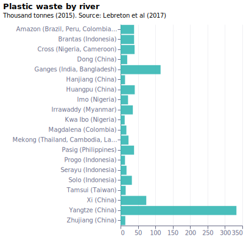](visualisation/fig7-2_river_local.svg "fig7-2_river_local")

### fig7-2_river_local_dark --- [json](visualisation/fig7-2_river_local_dark.json "fig7-2_river_local_dark") [svg](visualisation/fig7-2_river_local_dark.svg "fig7-2_river_local_dark") [png](visualisation/fig7-2_river_local_dark.png "fig7-2_river_local_dark")

# Article 8 

## JG interview

### fig8-1_east-africa-gdp_local --- [json](visualisation/fig8-1_east-africa-gdp_local.json "fig8-1_east-africa-gdp_local") [svg](visualisation/fig8-1_east-africa-gdp_local.svg "fig8-1_east-africa-gdp_local") [png](visualisation/fig8-1_east-africa-gdp_local.png "fig8-1_east-africa-gdp_local")
[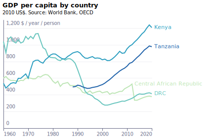](visualisation/fig8-1_east-africa-gdp_local.svg "fig8-1_east-africa-gdp_local")

### fig8-1_east-africa-gdp_local_dark --- [json](visualisation/fig8-1_east-africa-gdp_local_dark.json "fig8-1_east-africa-gdp_local_dark") [svg](visualisation/fig8-1_east-africa-gdp_local_dark.svg "fig8-1_east-africa-gdp_local_dark") [png](visualisation/fig8-1_east-africa-gdp_local_dark.png "fig8-1_east-africa-gdp_local_dark")
[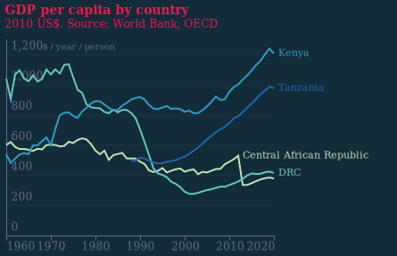](visualisation/fig8-1_east-africa-gdp_local_dark.svg "fig8-1_east-africa-gdp_local_dark")

### fig8-2/map --- [html](visualisation/fig8-2/index.html "fig8-2/map") [svg](visualisation/fig8-2/map.svg "fig8-2/map") [png](visualisation/fig8-2/map.png "fig8-2/map")

### fig8-2/map_dark --- [html](visualisation/fig8-2/index_dark.html "fig8-2/map_dark") [svg](visualisation/fig8-2/map_dark.svg "fig8-2/map_dark") [png](visualisation/fig8-2/map_dark.png "fig8-2/map_dark")

# Article 9 

## Transition

Cloned from [what-are-the-likely-costs-of-the-transition-to-a-sustainable-economy](https://www.github.com/EconomicsObservatory/ECOvisualisations/tree/main/articles/what-are-the-likely-costs-of-the-transition-to-a-sustainable-economy/)

### fig1_lcoe --- [json](https://raw.githubusercontent.com/EconomicsObservatory/ECOvisualisations/main/articles/what-are-the-likely-costs-of-the-transition-to-a-sustainable-economy/visualisation/fig1_lcoe.json "fig1_lcoe") [svg](https://raw.githubusercontent.com/EconomicsObservatory/ECOvisualisations/main/articles/what-are-the-likely-costs-of-the-transition-to-a-sustainable-economy/visualisation/fig1_lcoe.svg "fig1_lcoe") [png](https://raw.githubusercontent.com/EconomicsObservatory/ECOvisualisations/main/articles/what-are-the-likely-costs-of-the-transition-to-a-sustainable-economy/visualisation/fig1_lcoe.png "fig1_lcoe")

### fig1_lcoe_dark --- [json](https://raw.githubusercontent.com/EconomicsObservatory/ECOvisualisations/main/articles/what-are-the-likely-costs-of-the-transition-to-a-sustainable-economy/visualisation/fig1_lcoe_dark.json "fig1_lcoe_dark") [svg](https://raw.githubusercontent.com/EconomicsObservatory/ECOvisualisations/main/articles/what-are-the-likely-costs-of-the-transition-to-a-sustainable-economy/visualisation/fig1_lcoe_dark.svg "fig1_lcoe_dark") [png](https://raw.githubusercontent.com/EconomicsObservatory/ECOvisualisations/main/articles/what-are-the-likely-costs-of-the-transition-to-a-sustainable-economy/visualisation/fig1_lcoe_dark.png "fig1_lcoe_dark")

### fig2_energy-investment --- [json](https://raw.githubusercontent.com/EconomicsObservatory/ECOvisualisations/main/articles/what-are-the-likely-costs-of-the-transition-to-a-sustainable-economy/visualisation/fig2_energy-investment.json "fig2_energy-investment") [svg](https://raw.githubusercontent.com/EconomicsObservatory/ECOvisualisations/main/articles/what-are-the-likely-costs-of-the-transition-to-a-sustainable-economy/visualisation/fig2_energy-investment.svg "fig2_energy-investment") [png](https://raw.githubusercontent.com/EconomicsObservatory/ECOvisualisations/main/articles/what-are-the-likely-costs-of-the-transition-to-a-sustainable-economy/visualisation/fig2_energy-investment.png "fig2_energy-investment")

### fig2_energy-investment_dark --- [json](https://raw.githubusercontent.com/EconomicsObservatory/ECOvisualisations/main/articles/what-are-the-likely-costs-of-the-transition-to-a-sustainable-economy/visualisation/fig2_energy-investment_dark.json "fig2_energy-investment_dark") [svg](https://raw.githubusercontent.com/EconomicsObservatory/ECOvisualisations/main/articles/what-are-the-likely-costs-of-the-transition-to-a-sustainable-economy/visualisation/fig2_energy-investment_dark.svg "fig2_energy-investment_dark") [png](https://raw.githubusercontent.com/EconomicsObservatory/ECOvisualisations/main/articles/what-are-the-likely-costs-of-the-transition-to-a-sustainable-economy/visualisation/fig2_energy-investment_dark.png "fig2_energy-investment_dark")

### fig3_investment --- [json](https://raw.githubusercontent.com/EconomicsObservatory/ECOvisualisations/main/articles/what-are-the-likely-costs-of-the-transition-to-a-sustainable-economy/visualisation/fig3_investment.json "fig3_investment") [svg](https://raw.githubusercontent.com/EconomicsObservatory/ECOvisualisations/main/articles/what-are-the-likely-costs-of-the-transition-to-a-sustainable-economy/visualisation/fig3_investment.svg "fig3_investment") [png](https://raw.githubusercontent.com/EconomicsObservatory/ECOvisualisations/main/articles/what-are-the-likely-costs-of-the-transition-to-a-sustainable-economy/visualisation/fig3_investment.png "fig3_investment")

### fig3_investment_dark --- [json](https://raw.githubusercontent.com/EconomicsObservatory/ECOvisualisations/main/articles/what-are-the-likely-costs-of-the-transition-to-a-sustainable-economy/visualisation/fig3_investment_dark.json "fig3_investment_dark") [svg](https://raw.githubusercontent.com/EconomicsObservatory/ECOvisualisations/main/articles/what-are-the-likely-costs-of-the-transition-to-a-sustainable-economy/visualisation/fig3_investment_dark.svg "fig3_investment_dark") [png](https://raw.githubusercontent.com/EconomicsObservatory/ECOvisualisations/main/articles/what-are-the-likely-costs-of-the-transition-to-a-sustainable-economy/visualisation/fig3_investment_dark.png "fig3_investment_dark")

# Article 11 

## Post-growth

### fig11-1_gdp-emissions-intensity_local --- [json](visualisation/fig11-1_gdp-emissions-intensity_local.json "fig11-1_gdp-emissions-intensity_local") [svg](visualisation/fig11-1_gdp-emissions-intensity_local.svg "fig11-1_gdp-emissions-intensity_local") [png](visualisation/fig11-1_gdp-emissions-intensity_local.png "fig11-1_gdp-emissions-intensity_local")
[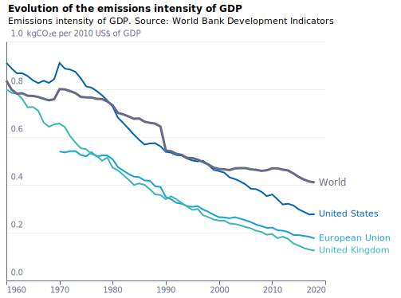](visualisation/fig11-1_gdp-emissions-intensity_local.svg "fig11-1_gdp-emissions-intensity_local")

### fig11-1_gdp-emissions-intensity_local_dark --- [json](visualisation/fig11-1_gdp-emissions-intensity_local_dark.json "fig11-1_gdp-emissions-intensity_local_dark") [svg](visualisation/fig11-1_gdp-emissions-intensity_local_dark.svg "fig11-1_gdp-emissions-intensity_local_dark") [png](visualisation/fig11-1_gdp-emissions-intensity_local_dark.png "fig11-1_gdp-emissions-intensity_local_dark")

# Article 12 

## Centre page

### fig12-1_cherry-blossom_local --- [json](visualisation/fig12-1_cherry-blossom_local.json "fig12-1_cherry-blossom_local") [svg](visualisation/fig12-1_cherry-blossom_local.svg "fig12-1_cherry-blossom_local") [png](visualisation/fig12-1_cherry-blossom_local.png "fig12-1_cherry-blossom_local")

### fig12-1_cherry-blossom_local_dark --- [json](visualisation/fig12-1_cherry-blossom_local_dark.json "fig12-1_cherry-blossom_local_dark") [svg](visualisation/fig12-1_cherry-blossom_local_dark.svg "fig12-1_cherry-blossom_local_dark") [png](visualisation/fig12-1_cherry-blossom_local_dark.png "fig12-1_cherry-blossom_local_dark")

### fig12-2a_ice_local --- [json](visualisation/fig12-2a_ice_local.json "fig12-2a_ice_local") [svg](visualisation/fig12-2a_ice_local.svg "fig12-2a_ice_local") [png](visualisation/fig12-2a_ice_local.png "fig12-2a_ice_local")
[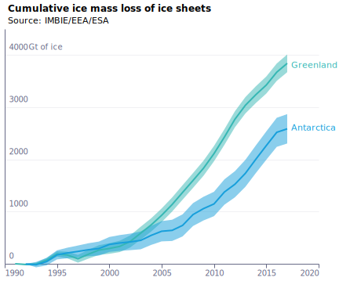](visualisation/fig12-2a_ice_local.svg "fig12-2a_ice_local")

### fig12-2a_ice_local_dark --- [json](visualisation/fig12-2a_ice_local_dark.json "fig12-2a_ice_local_dark") [svg](visualisation/fig12-2a_ice_local_dark.svg "fig12-2a_ice_local_dark") [png](visualisation/fig12-2a_ice_local_dark.png "fig12-2a_ice_local_dark")
[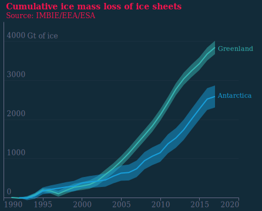](visualisation/fig12-2a_ice_local_dark.svg "fig12-2a_ice_local_dark")

### fig12-2b_glaciers_local --- [json](visualisation/fig12-2b_glaciers_local.json "fig12-2b_glaciers_local") [svg](visualisation/fig12-2b_glaciers_local.svg "fig12-2b_glaciers_local") [png](visualisation/fig12-2b_glaciers_local.png "fig12-2b_glaciers_local")

### fig12-2b_glaciers_local_dark --- [json](visualisation/fig12-2b_glaciers_local_dark.json "fig12-2b_glaciers_local_dark") [svg](visualisation/fig12-2b_glaciers_local_dark.svg "fig12-2b_glaciers_local_dark") [png](visualisation/fig12-2b_glaciers_local_dark.png "fig12-2b_glaciers_local_dark")

# Article 13 

## Promises

### fig13-1_co2targets_local --- [json](visualisation/fig13-1_co2targets_local.json "fig13-1_co2targets_local") [svg](visualisation/fig13-1_co2targets_local.svg "fig13-1_co2targets_local") [png](visualisation/fig13-1_co2targets_local.png "fig13-1_co2targets_local")
[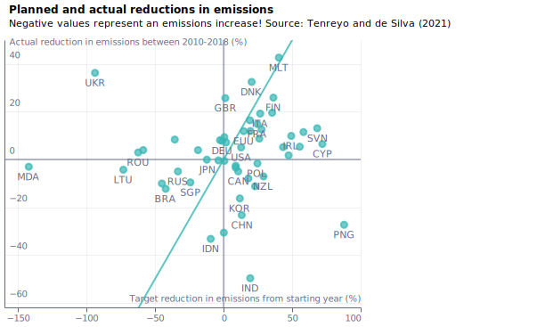](visualisation/fig13-1_co2targets_local.svg "fig13-1_co2targets_local")

### fig13-1_co2targets_local_dark --- [json](visualisation/fig13-1_co2targets_local_dark.json "fig13-1_co2targets_local_dark") [svg](visualisation/fig13-1_co2targets_local_dark.svg "fig13-1_co2targets_local_dark") [png](visualisation/fig13-1_co2targets_local_dark.png "fig13-1_co2targets_local_dark")

### fig13-2a_emissions-by-region_local --- [json](visualisation/fig13-2a_emissions-by-region_local.json "fig13-2a_emissions-by-region_local") [svg](visualisation/fig13-2a_emissions-by-region_local.svg "fig13-2a_emissions-by-region_local") [png](visualisation/fig13-2a_emissions-by-region_local.png "fig13-2a_emissions-by-region_local")

### fig13-2a_emissions-by-region_local_dark --- [json](visualisation/fig13-2a_emissions-by-region_local_dark.json "fig13-2a_emissions-by-region_local_dark") [svg](visualisation/fig13-2a_emissions-by-region_local_dark.svg "fig13-2a_emissions-by-region_local_dark") [png](visualisation/fig13-2a_emissions-by-region_local_dark.png "fig13-2a_emissions-by-region_local_dark")
[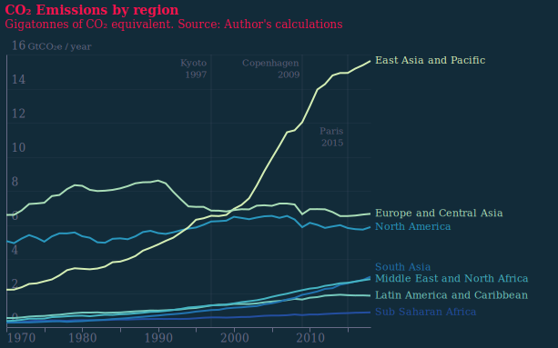](visualisation/fig13-2a_emissions-by-region_local_dark.svg "fig13-2a_emissions-by-region_local_dark")

### fig13-2b_emissions-per-capita-by-region_local --- [json](visualisation/fig13-2b_emissions-per-capita-by-region_local.json "fig13-2b_emissions-per-capita-by-region_local") [svg](visualisation/fig13-2b_emissions-per-capita-by-region_local.svg "fig13-2b_emissions-per-capita-by-region_local") [png](visualisation/fig13-2b_emissions-per-capita-by-region_local.png "fig13-2b_emissions-per-capita-by-region_local")

### fig13-2b_emissions-per-capita-by-region_local_dark --- [json](visualisation/fig13-2b_emissions-per-capita-by-region_local_dark.json "fig13-2b_emissions-per-capita-by-region_local_dark") [svg](visualisation/fig13-2b_emissions-per-capita-by-region_local_dark.svg "fig13-2b_emissions-per-capita-by-region_local_dark") [png](visualisation/fig13-2b_emissions-per-capita-by-region_local_dark.png "fig13-2b_emissions-per-capita-by-region_local_dark")

# Article 17 

## Historic pollution

Cloned from [what-are-the-long-term-economic-effects-of-air-pollution](https://www.github.com/EconomicsObservatory/ECOvisualisations/tree/main/articles/what-are-the-long-term-economic-effects-of-air-pollution/)

### fig1_coal --- [json](https://raw.githubusercontent.com/EconomicsObservatory/ECOvisualisations/main/articles/what-are-the-long-term-economic-effects-of-air-pollution/visualisation/fig1_coal.json "fig1_coal") [svg](https://raw.githubusercontent.com/EconomicsObservatory/ECOvisualisations/main/articles/what-are-the-long-term-economic-effects-of-air-pollution/visualisation/fig1_coal.svg "fig1_coal") [png](https://raw.githubusercontent.com/EconomicsObservatory/ECOvisualisations/main/articles/what-are-the-long-term-economic-effects-of-air-pollution/visualisation/fig1_coal.png "fig1_coal")

### fig1_coal_dark --- [json](https://raw.githubusercontent.com/EconomicsObservatory/ECOvisualisations/main/articles/what-are-the-long-term-economic-effects-of-air-pollution/visualisation/fig1_coal_dark.json "fig1_coal_dark") [svg](https://raw.githubusercontent.com/EconomicsObservatory/ECOvisualisations/main/articles/what-are-the-long-term-economic-effects-of-air-pollution/visualisation/fig1_coal_dark.svg "fig1_coal_dark") [png](https://raw.githubusercontent.com/EconomicsObservatory/ECOvisualisations/main/articles/what-are-the-long-term-economic-effects-of-air-pollution/visualisation/fig1_coal_dark.png "fig1_coal_dark")

### Fig 17-2 Ordnance survey map

### fig3_pollution --- [json](https://raw.githubusercontent.com/EconomicsObservatory/ECOvisualisations/main/articles/what-are-the-long-term-economic-effects-of-air-pollution/visualisation/fig3_pollution.json "fig3_pollution") [svg](https://raw.githubusercontent.com/EconomicsObservatory/ECOvisualisations/main/articles/what-are-the-long-term-economic-effects-of-air-pollution/visualisation/fig3_pollution.svg "fig3_pollution") [png](https://raw.githubusercontent.com/EconomicsObservatory/ECOvisualisations/main/articles/what-are-the-long-term-economic-effects-of-air-pollution/visualisation/fig3_pollution.png "fig3_pollution")

### fig3_pollution_dark --- [json](https://raw.githubusercontent.com/EconomicsObservatory/ECOvisualisations/main/articles/what-are-the-long-term-economic-effects-of-air-pollution/visualisation/fig3_pollution_dark.json "fig3_pollution_dark") [svg](https://raw.githubusercontent.com/EconomicsObservatory/ECOvisualisations/main/articles/what-are-the-long-term-economic-effects-of-air-pollution/visualisation/fig3_pollution_dark.svg "fig3_pollution_dark") [png](https://raw.githubusercontent.com/EconomicsObservatory/ECOvisualisations/main/articles/what-are-the-long-term-economic-effects-of-air-pollution/visualisation/fig3_pollution_dark.png "fig3_pollution_dark")

# Article 18 

## Productivity

### fig18-1a_time-allocation_local --- [json](visualisation/fig18-1a_time-allocation_local.json "fig18-1a_time-allocation_local") [svg](visualisation/fig18-1a_time-allocation_local.svg "fig18-1a_time-allocation_local") [png](visualisation/fig18-1a_time-allocation_local.png "fig18-1a_time-allocation_local")

### fig18-1a_time-allocation_local_dark --- [json](visualisation/fig18-1a_time-allocation_local_dark.json "fig18-1a_time-allocation_local_dark") [svg](visualisation/fig18-1a_time-allocation_local_dark.svg "fig18-1a_time-allocation_local_dark") [png](visualisation/fig18-1a_time-allocation_local_dark.png "fig18-1a_time-allocation_local_dark")

### fig18-1b_time-allocation-b_local --- [json](visualisation/fig18-1b_time-allocation-b_local.json "fig18-1b_time-allocation-b_local") [svg](visualisation/fig18-1b_time-allocation-b_local.svg "fig18-1b_time-allocation-b_local") [png](visualisation/fig18-1b_time-allocation-b_local.png "fig18-1b_time-allocation-b_local")
[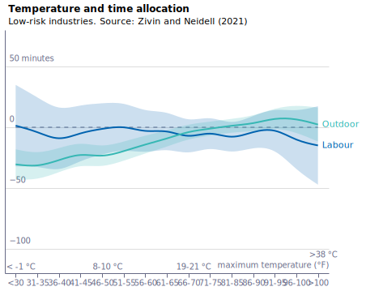](visualisation/fig18-1b_time-allocation-b_local.svg "fig18-1b_time-allocation-b_local")

### fig18-1b_time-allocation-b_local_dark --- [json](visualisation/fig18-1b_time-allocation-b_local_dark.json "fig18-1b_time-allocation-b_local_dark") [svg](visualisation/fig18-1b_time-allocation-b_local_dark.svg "fig18-1b_time-allocation-b_local_dark") [png](visualisation/fig18-1b_time-allocation-b_local_dark.png "fig18-1b_time-allocation-b_local_dark")

# Article 19 

## Coal

### Fig 19-1 through 4: several charts in the article, but no specs or data

# Article 21 

## Inequality

Cloned from [what-are-the-implications-of-decarbonisation-for-inequality](https://www.github.com/EconomicsObservatory/ECOvisualisations/tree/main/articles/what-are-the-implications-of-decarbonisation-for-inequality/)

### fig1_outcomes --- [json](https://raw.githubusercontent.com/EconomicsObservatory/ECOvisualisations/main/articles/what-are-the-implications-of-decarbonisation-for-inequality/visualisation/fig1_outcomes.json "fig1_outcomes") [svg](https://raw.githubusercontent.com/EconomicsObservatory/ECOvisualisations/main/articles/what-are-the-implications-of-decarbonisation-for-inequality/visualisation/fig1_outcomes.svg "fig1_outcomes") [png](https://raw.githubusercontent.com/EconomicsObservatory/ECOvisualisations/main/articles/what-are-the-implications-of-decarbonisation-for-inequality/visualisation/fig1_outcomes.png "fig1_outcomes")

### fig1_outcomes_dark --- [json](https://raw.githubusercontent.com/EconomicsObservatory/ECOvisualisations/main/articles/what-are-the-implications-of-decarbonisation-for-inequality/visualisation/fig1_outcomes_dark.json "fig1_outcomes_dark") [svg](https://raw.githubusercontent.com/EconomicsObservatory/ECOvisualisations/main/articles/what-are-the-implications-of-decarbonisation-for-inequality/visualisation/fig1_outcomes_dark.svg "fig1_outcomes_dark") [png](https://raw.githubusercontent.com/EconomicsObservatory/ECOvisualisations/main/articles/what-are-the-implications-of-decarbonisation-for-inequality/visualisation/fig1_outcomes_dark.png "fig1_outcomes_dark")

### Fig 21-2 polar chart

### fig2_polar --- [pdf](https://raw.githubusercontent.com/EconomicsObservatory/ECOvisualisations/main/articles/what-are-the-implications-of-decarbonisation-for-inequality/visualisation/fig2_polar.pdf "fig2_polar") [svg](https://raw.githubusercontent.com/EconomicsObservatory/ECOvisualisations/main/articles/what-are-the-implications-of-decarbonisation-for-inequality/visualisation/fig2_polar.svg "fig2_polar") [png](https://raw.githubusercontent.com/EconomicsObservatory/ECOvisualisations/main/articles/what-are-the-implications-of-decarbonisation-for-inequality/visualisation/fig2_polar.png "fig2_polar")

# Article 22 

## Agriculture

Cloned from [how-are-agricultural-economies-affected-by-climate-change](https://www.github.com/EconomicsObservatory/ECOvisualisations/tree/main/articles/how-are-agricultural-economies-affected-by-climate-change/)

### fig1_productivity --- [json](https://raw.githubusercontent.com/EconomicsObservatory/ECOvisualisations/main/articles/how-are-agricultural-economies-affected-by-climate-change/visualisation/fig1_productivity.json "fig1_productivity") [svg](https://raw.githubusercontent.com/EconomicsObservatory/ECOvisualisations/main/articles/how-are-agricultural-economies-affected-by-climate-change/visualisation/fig1_productivity.svg "fig1_productivity") [png](https://raw.githubusercontent.com/EconomicsObservatory/ECOvisualisations/main/articles/how-are-agricultural-economies-affected-by-climate-change/visualisation/fig1_productivity.png "fig1_productivity")

### fig1_productivity_dark --- [json](https://raw.githubusercontent.com/EconomicsObservatory/ECOvisualisations/main/articles/how-are-agricultural-economies-affected-by-climate-change/visualisation/fig1_productivity_dark.json "fig1_productivity_dark") [svg](https://raw.githubusercontent.com/EconomicsObservatory/ECOvisualisations/main/articles/how-are-agricultural-economies-affected-by-climate-change/visualisation/fig1_productivity_dark.svg "fig1_productivity_dark") [png](https://raw.githubusercontent.com/EconomicsObservatory/ECOvisualisations/main/articles/how-are-agricultural-economies-affected-by-climate-change/visualisation/fig1_productivity_dark.png "fig1_productivity_dark")

### fig2_yield --- [json](https://raw.githubusercontent.com/EconomicsObservatory/ECOvisualisations/main/articles/how-are-agricultural-economies-affected-by-climate-change/visualisation/fig2_yield.json "fig2_yield") [svg](https://raw.githubusercontent.com/EconomicsObservatory/ECOvisualisations/main/articles/how-are-agricultural-economies-affected-by-climate-change/visualisation/fig2_yield.svg "fig2_yield") [png](https://raw.githubusercontent.com/EconomicsObservatory/ECOvisualisations/main/articles/how-are-agricultural-economies-affected-by-climate-change/visualisation/fig2_yield.png "fig2_yield")

### fig2_yield_dark --- [json](https://raw.githubusercontent.com/EconomicsObservatory/ECOvisualisations/main/articles/how-are-agricultural-economies-affected-by-climate-change/visualisation/fig2_yield_dark.json "fig2_yield_dark") [svg](https://raw.githubusercontent.com/EconomicsObservatory/ECOvisualisations/main/articles/how-are-agricultural-economies-affected-by-climate-change/visualisation/fig2_yield_dark.svg "fig2_yield_dark") [png](https://raw.githubusercontent.com/EconomicsObservatory/ECOvisualisations/main/articles/how-are-agricultural-economies-affected-by-climate-change/visualisation/fig2_yield_dark.png "fig2_yield_dark")

### fig3_africa --- [json](https://raw.githubusercontent.com/EconomicsObservatory/ECOvisualisations/main/articles/how-are-agricultural-economies-affected-by-climate-change/visualisation/fig3_africa.json "fig3_africa") [svg](https://raw.githubusercontent.com/EconomicsObservatory/ECOvisualisations/main/articles/how-are-agricultural-economies-affected-by-climate-change/visualisation/fig3_africa.svg "fig3_africa") [png](https://raw.githubusercontent.com/EconomicsObservatory/ECOvisualisations/main/articles/how-are-agricultural-economies-affected-by-climate-change/visualisation/fig3_africa.png "fig3_africa")

### fig3_africa_dark --- [json](https://raw.githubusercontent.com/EconomicsObservatory/ECOvisualisations/main/articles/how-are-agricultural-economies-affected-by-climate-change/visualisation/fig3_africa_dark.json "fig3_africa_dark") [svg](https://raw.githubusercontent.com/EconomicsObservatory/ECOvisualisations/main/articles/how-are-agricultural-economies-affected-by-climate-change/visualisation/fig3_africa_dark.svg "fig3_africa_dark") [png](https://raw.githubusercontent.com/EconomicsObservatory/ECOvisualisations/main/articles/how-are-agricultural-economies-affected-by-climate-change/visualisation/fig3_africa_dark.png "fig3_africa_dark")

### Fig 22-4a World map of warming scenario 1.5

### Fig 22-4b World map of warming scenario 2

# Article 23 

## Firms, competition

### fig23-1_policies_local --- [json](visualisation/fig23-1_policies_local.json "fig23-1_policies_local") [svg](visualisation/fig23-1_policies_local.svg "fig23-1_policies_local") [png](visualisation/fig23-1_policies_local.png "fig23-1_policies_local")

### fig23-1_policies_local_dark --- [json](visualisation/fig23-1_policies_local_dark.json "fig23-1_policies_local_dark") [svg](visualisation/fig23-1_policies_local_dark.svg "fig23-1_policies_local_dark") [png](visualisation/fig23-1_policies_local_dark.png "fig23-1_policies_local_dark")
[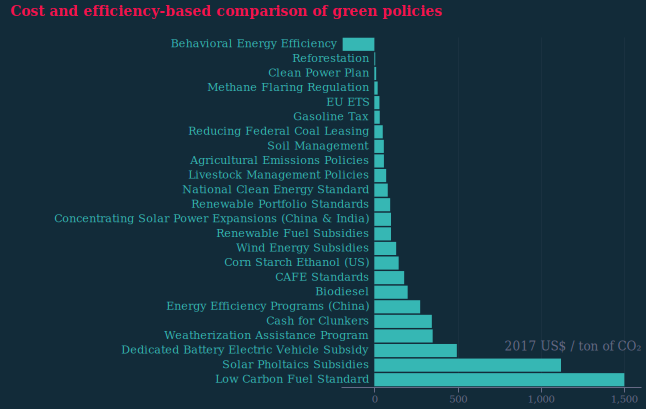](visualisation/fig23-1_policies_local_dark.svg "fig23-1_policies_local_dark")

# Article 24 

## Public debt

### fig24-1_debt_local --- [json](visualisation/fig24-1_debt_local.json "fig24-1_debt_local") [svg](visualisation/fig24-1_debt_local.svg "fig24-1_debt_local") [png](visualisation/fig24-1_debt_local.png "fig24-1_debt_local")

### fig24-1_debt_local_dark --- [json](visualisation/fig24-1_debt_local_dark.json "fig24-1_debt_local_dark") [svg](visualisation/fig24-1_debt_local_dark.svg "fig24-1_debt_local_dark") [png](visualisation/fig24-1_debt_local_dark.png "fig24-1_debt_local_dark")

