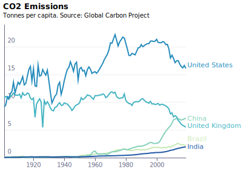
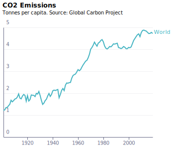
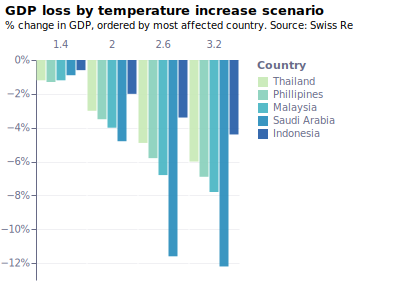
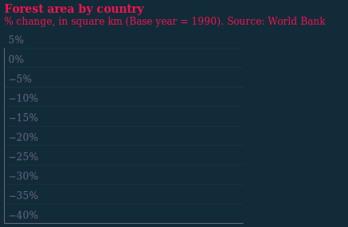

# Article 4 

## Climate in numbers

### fig4-1_fossil-fuels_local --- [json](visualisation/fig4-1_fossil-fuels_local.json "fig4-1_fossil-fuels_local") [svg](visualisation/fig4-1_fossil-fuels_local.svg "fig4-1_fossil-fuels_local") [png](visualisation/fig4-1_fossil-fuels_local.png "fig4-1_fossil-fuels_local")

### fig4-1_fossil-fuels_local_dark --- [json](visualisation/fig4-1_fossil-fuels_local_dark.json "fig4-1_fossil-fuels_local_dark") [svg](visualisation/fig4-1_fossil-fuels_local_dark.svg "fig4-1_fossil-fuels_local_dark") [png](visualisation/fig4-1_fossil-fuels_local_dark.png "fig4-1_fossil-fuels_local_dark")

### fig4-2a_emissions_local --- [json](visualisation/fig4-2a_emissions_local.json "fig4-2a_emissions_local") [svg](visualisation/fig4-2a_emissions_local.svg "fig4-2a_emissions_local") [png](visualisation/fig4-2a_emissions_local.png "fig4-2a_emissions_local")

### fig4-2a_emissions_local_dark --- [json](visualisation/fig4-2a_emissions_local_dark.json "fig4-2a_emissions_local_dark") [svg](visualisation/fig4-2a_emissions_local_dark.svg "fig4-2a_emissions_local_dark") [png](visualisation/fig4-2a_emissions_local_dark.png "fig4-2a_emissions_local_dark")

### fig4-2b_emissions_local --- [json](visualisation/fig4-2b_emissions_local.json "fig4-2b_emissions_local") [svg](visualisation/fig4-2b_emissions_local.svg "fig4-2b_emissions_local") [png](visualisation/fig4-2b_emissions_local.png "fig4-2b_emissions_local")

### fig4-2b_emissions_local_dark --- [json](visualisation/fig4-2b_emissions_local_dark.json "fig4-2b_emissions_local_dark") [svg](visualisation/fig4-2b_emissions_local_dark.svg "fig4-2b_emissions_local_dark") [png](visualisation/fig4-2b_emissions_local_dark.png "fig4-2b_emissions_local_dark")

### fig4-3_climate-scenarios_local --- [json](visualisation/fig4-3_climate-scenarios_local.json "fig4-3_climate-scenarios_local") [svg](visualisation/fig4-3_climate-scenarios_local.svg "fig4-3_climate-scenarios_local") [png](visualisation/fig4-3_climate-scenarios_local.png "fig4-3_climate-scenarios_local")

### fig4-3_climate-scenarios_local_dark --- [json](visualisation/fig4-3_climate-scenarios_local_dark.json "fig4-3_climate-scenarios_local_dark") [svg](visualisation/fig4-3_climate-scenarios_local_dark.svg "fig4-3_climate-scenarios_local_dark") [png](visualisation/fig4-3_climate-scenarios_local_dark.png "fig4-3_climate-scenarios_local_dark")

### fig4-4_gdp-loss_local --- [json](visualisation/fig4-4_gdp-loss_local.json "fig4-4_gdp-loss_local") [svg](visualisation/fig4-4_gdp-loss_local.svg "fig4-4_gdp-loss_local") [png](visualisation/fig4-4_gdp-loss_local.png "fig4-4_gdp-loss_local")

### fig4-4_gdp-loss_local_dark --- [json](visualisation/fig4-4_gdp-loss_local_dark.json "fig4-4_gdp-loss_local_dark") [svg](visualisation/fig4-4_gdp-loss_local_dark.svg "fig4-4_gdp-loss_local_dark") [png](visualisation/fig4-4_gdp-loss_local_dark.png "fig4-4_gdp-loss_local_dark")

### fig4-5_forest-area_local --- [json](visualisation/fig4-5_forest-area_local.json "fig4-5_forest-area_local") [svg](visualisation/fig4-5_forest-area_local.svg "fig4-5_forest-area_local") [png](visualisation/fig4-5_forest-area_local.png "fig4-5_forest-area_local")

### fig4-5_forest-area_local_dark --- [json](visualisation/fig4-5_forest-area_local_dark.json "fig4-5_forest-area_local_dark") [svg](visualisation/fig4-5_forest-area_local_dark.svg "fig4-5_forest-area_local_dark") [png](visualisation/fig4-5_forest-area_local_dark.png "fig4-5_forest-area_local_dark")

### fig4-6_endangered-species_local --- [json](visualisation/fig4-6_endangered-species_local.json "fig4-6_endangered-species_local") [svg](visualisation/fig4-6_endangered-species_local.svg "fig4-6_endangered-species_local") [png](visualisation/fig4-6_endangered-species_local.png "fig4-6_endangered-species_local")

### fig4-6_endangered-species_local_dark --- [json](visualisation/fig4-6_endangered-species_local_dark.json "fig4-6_endangered-species_local_dark") [svg](visualisation/fig4-6_endangered-species_local_dark.svg "fig4-6_endangered-species_local_dark") [png](visualisation/fig4-6_endangered-species_local_dark.png "fig4-6_endangered-species_local_dark")

# Article 5 

## Targets

Cloned from [is-the-uk-on-track-to-meet-its-climate-commitments](https://raw.githubusercontent.com/EconomicsObservatory/ECOvisualisations/tree/main/articles/is-the-uk-on-track-to-meet-its-climate-commitments/)

### fig1_projected-emissions --- [json](https://raw.githubusercontent.com/EconomicsObservatory/ECOvisualisations/tree/main/articles/is-the-uk-on-track-to-meet-its-climate-commitments/visualisation/fig1_projected-emissions.json "fig1_projected-emissions") [svg](https://raw.githubusercontent.com/EconomicsObservatory/ECOvisualisations/tree/main/articles/is-the-uk-on-track-to-meet-its-climate-commitments/visualisation/fig1_projected-emissions.svg "fig1_projected-emissions") [png](https://raw.githubusercontent.com/EconomicsObservatory/ECOvisualisations/tree/main/articles/is-the-uk-on-track-to-meet-its-climate-commitments/visualisation/fig1_projected-emissions.png "fig1_projected-emissions")

