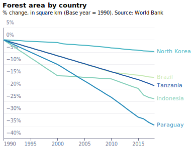
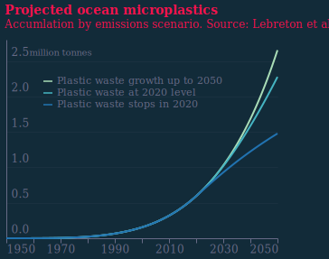
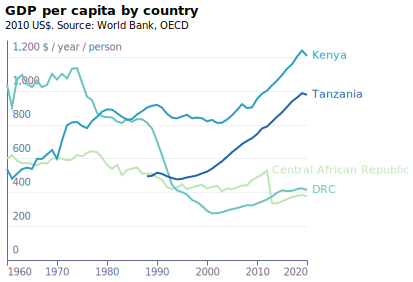
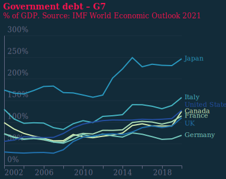

# Article 4 

## Climate in numbers

### fig4-1_fossil-fuels --- [json](visualisation/fig4-1_fossil-fuels.json "fig4-1_fossil-fuels") [svg](visualisation/fig4-1_fossil-fuels.svg "fig4-1_fossil-fuels") [png](visualisation/fig4-1_fossil-fuels.png "fig4-1_fossil-fuels")

### fig4-1_fossil-fuels_dark --- [json](visualisation/fig4-1_fossil-fuels_dark.json "fig4-1_fossil-fuels_dark") [svg](visualisation/fig4-1_fossil-fuels_dark.svg "fig4-1_fossil-fuels_dark") [png](visualisation/fig4-1_fossil-fuels_dark.png "fig4-1_fossil-fuels_dark")

### fig4-2a_emissions --- [json](visualisation/fig4-2a_emissions.json "fig4-2a_emissions") [svg](visualisation/fig4-2a_emissions.svg "fig4-2a_emissions") [png](visualisation/fig4-2a_emissions.png "fig4-2a_emissions")

### fig4-2a_emissions_dark --- [json](visualisation/fig4-2a_emissions_dark.json "fig4-2a_emissions_dark") [svg](visualisation/fig4-2a_emissions_dark.svg "fig4-2a_emissions_dark") [png](visualisation/fig4-2a_emissions_dark.png "fig4-2a_emissions_dark")

### fig4-2b_emissions --- [json](visualisation/fig4-2b_emissions.json "fig4-2b_emissions") [svg](visualisation/fig4-2b_emissions.svg "fig4-2b_emissions") [png](visualisation/fig4-2b_emissions.png "fig4-2b_emissions")

### fig4-2b_emissions_dark --- [json](visualisation/fig4-2b_emissions_dark.json "fig4-2b_emissions_dark") [svg](visualisation/fig4-2b_emissions_dark.svg "fig4-2b_emissions_dark") [png](visualisation/fig4-2b_emissions_dark.png "fig4-2b_emissions_dark")

### fig4-3_climate-scenarios --- [json](visualisation/fig4-3_climate-scenarios.json "fig4-3_climate-scenarios") [svg](visualisation/fig4-3_climate-scenarios.svg "fig4-3_climate-scenarios") [png](visualisation/fig4-3_climate-scenarios.png "fig4-3_climate-scenarios")

### fig4-3_climate-scenarios_dark --- [json](visualisation/fig4-3_climate-scenarios_dark.json "fig4-3_climate-scenarios_dark") [svg](visualisation/fig4-3_climate-scenarios_dark.svg "fig4-3_climate-scenarios_dark") [png](visualisation/fig4-3_climate-scenarios_dark.png "fig4-3_climate-scenarios_dark")

### fig4-4_gdp-loss --- [json](visualisation/fig4-4_gdp-loss.json "fig4-4_gdp-loss") [svg](visualisation/fig4-4_gdp-loss.svg "fig4-4_gdp-loss") [png](visualisation/fig4-4_gdp-loss.png "fig4-4_gdp-loss")

### fig4-4_gdp-loss_dark --- [json](visualisation/fig4-4_gdp-loss_dark.json "fig4-4_gdp-loss_dark") [svg](visualisation/fig4-4_gdp-loss_dark.svg "fig4-4_gdp-loss_dark") [png](visualisation/fig4-4_gdp-loss_dark.png "fig4-4_gdp-loss_dark")

### fig4-5_forest-area --- [json](visualisation/fig4-5_forest-area.json "fig4-5_forest-area") [svg](visualisation/fig4-5_forest-area.svg "fig4-5_forest-area") [png](visualisation/fig4-5_forest-area.png "fig4-5_forest-area")

### fig4-5_forest-area_dark --- [json](visualisation/fig4-5_forest-area_dark.json "fig4-5_forest-area_dark") [svg](visualisation/fig4-5_forest-area_dark.svg "fig4-5_forest-area_dark") [png](visualisation/fig4-5_forest-area_dark.png "fig4-5_forest-area_dark")

### fig4-6_endangered-species --- [json](visualisation/fig4-6_endangered-species.json "fig4-6_endangered-species") [svg](visualisation/fig4-6_endangered-species.svg "fig4-6_endangered-species") [png](visualisation/fig4-6_endangered-species.png "fig4-6_endangered-species")

### fig4-6_endangered-species_dark --- [json](visualisation/fig4-6_endangered-species_dark.json "fig4-6_endangered-species_dark") [svg](visualisation/fig4-6_endangered-species_dark.svg "fig4-6_endangered-species_dark") [png](visualisation/fig4-6_endangered-species_dark.png "fig4-6_endangered-species_dark")

# Article 5 

## Targets

Cloned from [is-the-uk-on-track-to-meet-its-climate-commitments](https://raw.githubusercontent.com/EconomicsObservatory/ECOvisualisations/main/articles/is-the-uk-on-track-to-meet-its-climate-commitments/)

### fig1_projected-emissions --- [json](https://raw.githubusercontent.com/EconomicsObservatory/ECOvisualisations/main/articles/is-the-uk-on-track-to-meet-its-climate-commitments/visualisation/fig1_projected-emissions.json "fig1_projected-emissions") [svg](https://raw.githubusercontent.com/EconomicsObservatory/ECOvisualisations/main/articles/is-the-uk-on-track-to-meet-its-climate-commitments/visualisation/fig1_projected-emissions.svg "fig1_projected-emissions") [png](https://raw.githubusercontent.com/EconomicsObservatory/ECOvisualisations/main/articles/is-the-uk-on-track-to-meet-its-climate-commitments/visualisation/fig1_projected-emissions.png "fig1_projected-emissions")

### fig1_projected-emissions_dark --- [json](https://raw.githubusercontent.com/EconomicsObservatory/ECOvisualisations/main/articles/is-the-uk-on-track-to-meet-its-climate-commitments/visualisation/fig1_projected-emissions_dark.json "fig1_projected-emissions_dark") [svg](https://raw.githubusercontent.com/EconomicsObservatory/ECOvisualisations/main/articles/is-the-uk-on-track-to-meet-its-climate-commitments/visualisation/fig1_projected-emissions_dark.svg "fig1_projected-emissions_dark") [png](https://raw.githubusercontent.com/EconomicsObservatory/ECOvisualisations/main/articles/is-the-uk-on-track-to-meet-its-climate-commitments/visualisation/fig1_projected-emissions_dark.png "fig1_projected-emissions_dark")

# Article 6 

## Weather

Cloned from [what-are-the-economic-effects-of-extreme-weather-caused-by-climate-change](https://raw.githubusercontent.com/EconomicsObservatory/ECOvisualisations/main/articles/what-are-the-economic-effects-of-extreme-weather-caused-by-climate-change/)

### fig1a_extreme-events --- [json](https://raw.githubusercontent.com/EconomicsObservatory/ECOvisualisations/main/articles/what-are-the-economic-effects-of-extreme-weather-caused-by-climate-change/visualisation/fig1a_extreme-events.json "fig1a_extreme-events") [svg](https://raw.githubusercontent.com/EconomicsObservatory/ECOvisualisations/main/articles/what-are-the-economic-effects-of-extreme-weather-caused-by-climate-change/visualisation/fig1a_extreme-events.svg "fig1a_extreme-events") [png](https://raw.githubusercontent.com/EconomicsObservatory/ECOvisualisations/main/articles/what-are-the-economic-effects-of-extreme-weather-caused-by-climate-change/visualisation/fig1a_extreme-events.png "fig1a_extreme-events")

### fig1a_extreme-events_dark --- [json](https://raw.githubusercontent.com/EconomicsObservatory/ECOvisualisations/main/articles/what-are-the-economic-effects-of-extreme-weather-caused-by-climate-change/visualisation/fig1a_extreme-events_dark.json "fig1a_extreme-events_dark") [svg](https://raw.githubusercontent.com/EconomicsObservatory/ECOvisualisations/main/articles/what-are-the-economic-effects-of-extreme-weather-caused-by-climate-change/visualisation/fig1a_extreme-events_dark.svg "fig1a_extreme-events_dark") [png](https://raw.githubusercontent.com/EconomicsObservatory/ECOvisualisations/main/articles/what-are-the-economic-effects-of-extreme-weather-caused-by-climate-change/visualisation/fig1a_extreme-events_dark.png "fig1a_extreme-events_dark")

### fig1b_extreme-event-dotplot --- [json](https://raw.githubusercontent.com/EconomicsObservatory/ECOvisualisations/main/articles/what-are-the-economic-effects-of-extreme-weather-caused-by-climate-change/visualisation/fig1b_extreme-event-dotplot.json "fig1b_extreme-event-dotplot") [svg](https://raw.githubusercontent.com/EconomicsObservatory/ECOvisualisations/main/articles/what-are-the-economic-effects-of-extreme-weather-caused-by-climate-change/visualisation/fig1b_extreme-event-dotplot.svg "fig1b_extreme-event-dotplot") [png](https://raw.githubusercontent.com/EconomicsObservatory/ECOvisualisations/main/articles/what-are-the-economic-effects-of-extreme-weather-caused-by-climate-change/visualisation/fig1b_extreme-event-dotplot.png "fig1b_extreme-event-dotplot")

### fig1b_extreme-event-dotplot_dark --- [json](https://raw.githubusercontent.com/EconomicsObservatory/ECOvisualisations/main/articles/what-are-the-economic-effects-of-extreme-weather-caused-by-climate-change/visualisation/fig1b_extreme-event-dotplot_dark.json "fig1b_extreme-event-dotplot_dark") [svg](https://raw.githubusercontent.com/EconomicsObservatory/ECOvisualisations/main/articles/what-are-the-economic-effects-of-extreme-weather-caused-by-climate-change/visualisation/fig1b_extreme-event-dotplot_dark.svg "fig1b_extreme-event-dotplot_dark") [png](https://raw.githubusercontent.com/EconomicsObservatory/ECOvisualisations/main/articles/what-are-the-economic-effects-of-extreme-weather-caused-by-climate-change/visualisation/fig1b_extreme-event-dotplot_dark.png "fig1b_extreme-event-dotplot_dark")

# Article 7 

## Plastics

### fig7-1_ocean --- [json](visualisation/fig7-1_ocean.json "fig7-1_ocean") [svg](visualisation/fig7-1_ocean.svg "fig7-1_ocean") [png](visualisation/fig7-1_ocean.png "fig7-1_ocean")

### fig7-1_ocean_dark --- [json](visualisation/fig7-1_ocean_dark.json "fig7-1_ocean_dark") [svg](visualisation/fig7-1_ocean_dark.svg "fig7-1_ocean_dark") [png](visualisation/fig7-1_ocean_dark.png "fig7-1_ocean_dark")

### fig7-2_river --- [json](visualisation/fig7-2_river.json "fig7-2_river") [svg](visualisation/fig7-2_river.svg "fig7-2_river") [png](visualisation/fig7-2_river.png "fig7-2_river")

### fig7-2_river_dark --- [json](visualisation/fig7-2_river_dark.json "fig7-2_river_dark") [svg](visualisation/fig7-2_river_dark.svg "fig7-2_river_dark") [png](visualisation/fig7-2_river_dark.png "fig7-2_river_dark")

# Article 8 

## JG interview

### fig8-1_east-africa-gdp --- [json](visualisation/fig8-1_east-africa-gdp.json "fig8-1_east-africa-gdp") [svg](visualisation/fig8-1_east-africa-gdp.svg "fig8-1_east-africa-gdp") [png](visualisation/fig8-1_east-africa-gdp.png "fig8-1_east-africa-gdp")

### fig8-1_east-africa-gdp_dark --- [json](visualisation/fig8-1_east-africa-gdp_dark.json "fig8-1_east-africa-gdp_dark") [svg](visualisation/fig8-1_east-africa-gdp_dark.svg "fig8-1_east-africa-gdp_dark") [png](visualisation/fig8-1_east-africa-gdp_dark.png "fig8-1_east-africa-gdp_dark")

### Fig 8-2 map of Africa with locations of JG 

# Article 9 

## Transition

Cloned from [what-are-the-likely-costs-of-the-transition-to-a-sustainable-economy](https://raw.githubusercontent.com/EconomicsObservatory/ECOvisualisations/main/articles/what-are-the-likely-costs-of-the-transition-to-a-sustainable-economy/)

### fig1_lcoe --- [json](https://raw.githubusercontent.com/EconomicsObservatory/ECOvisualisations/main/articles/what-are-the-likely-costs-of-the-transition-to-a-sustainable-economy/visualisation/fig1_lcoe.json "fig1_lcoe") [svg](https://raw.githubusercontent.com/EconomicsObservatory/ECOvisualisations/main/articles/what-are-the-likely-costs-of-the-transition-to-a-sustainable-economy/visualisation/fig1_lcoe.svg "fig1_lcoe") [png](https://raw.githubusercontent.com/EconomicsObservatory/ECOvisualisations/main/articles/what-are-the-likely-costs-of-the-transition-to-a-sustainable-economy/visualisation/fig1_lcoe.png "fig1_lcoe")

### fig1_lcoe_dark --- [json](https://raw.githubusercontent.com/EconomicsObservatory/ECOvisualisations/main/articles/what-are-the-likely-costs-of-the-transition-to-a-sustainable-economy/visualisation/fig1_lcoe_dark.json "fig1_lcoe_dark") [svg](https://raw.githubusercontent.com/EconomicsObservatory/ECOvisualisations/main/articles/what-are-the-likely-costs-of-the-transition-to-a-sustainable-economy/visualisation/fig1_lcoe_dark.svg "fig1_lcoe_dark") [png](https://raw.githubusercontent.com/EconomicsObservatory/ECOvisualisations/main/articles/what-are-the-likely-costs-of-the-transition-to-a-sustainable-economy/visualisation/fig1_lcoe_dark.png "fig1_lcoe_dark")

### fig2_energy-investment --- [json](https://raw.githubusercontent.com/EconomicsObservatory/ECOvisualisations/main/articles/what-are-the-likely-costs-of-the-transition-to-a-sustainable-economy/visualisation/fig2_energy-investment.json "fig2_energy-investment") [svg](https://raw.githubusercontent.com/EconomicsObservatory/ECOvisualisations/main/articles/what-are-the-likely-costs-of-the-transition-to-a-sustainable-economy/visualisation/fig2_energy-investment.svg "fig2_energy-investment") [png](https://raw.githubusercontent.com/EconomicsObservatory/ECOvisualisations/main/articles/what-are-the-likely-costs-of-the-transition-to-a-sustainable-economy/visualisation/fig2_energy-investment.png "fig2_energy-investment")

### fig2_energy-investment_dark --- [json](https://raw.githubusercontent.com/EconomicsObservatory/ECOvisualisations/main/articles/what-are-the-likely-costs-of-the-transition-to-a-sustainable-economy/visualisation/fig2_energy-investment_dark.json "fig2_energy-investment_dark") [svg](https://raw.githubusercontent.com/EconomicsObservatory/ECOvisualisations/main/articles/what-are-the-likely-costs-of-the-transition-to-a-sustainable-economy/visualisation/fig2_energy-investment_dark.svg "fig2_energy-investment_dark") [png](https://raw.githubusercontent.com/EconomicsObservatory/ECOvisualisations/main/articles/what-are-the-likely-costs-of-the-transition-to-a-sustainable-economy/visualisation/fig2_energy-investment_dark.png "fig2_energy-investment_dark")

### fig3_investment --- [json](https://raw.githubusercontent.com/EconomicsObservatory/ECOvisualisations/main/articles/what-are-the-likely-costs-of-the-transition-to-a-sustainable-economy/visualisation/fig3_investment.json "fig3_investment") [svg](https://raw.githubusercontent.com/EconomicsObservatory/ECOvisualisations/main/articles/what-are-the-likely-costs-of-the-transition-to-a-sustainable-economy/visualisation/fig3_investment.svg "fig3_investment") [png](https://raw.githubusercontent.com/EconomicsObservatory/ECOvisualisations/main/articles/what-are-the-likely-costs-of-the-transition-to-a-sustainable-economy/visualisation/fig3_investment.png "fig3_investment")

### fig3_investment_dark --- [json](https://raw.githubusercontent.com/EconomicsObservatory/ECOvisualisations/main/articles/what-are-the-likely-costs-of-the-transition-to-a-sustainable-economy/visualisation/fig3_investment_dark.json "fig3_investment_dark") [svg](https://raw.githubusercontent.com/EconomicsObservatory/ECOvisualisations/main/articles/what-are-the-likely-costs-of-the-transition-to-a-sustainable-economy/visualisation/fig3_investment_dark.svg "fig3_investment_dark") [png](https://raw.githubusercontent.com/EconomicsObservatory/ECOvisualisations/main/articles/what-are-the-likely-costs-of-the-transition-to-a-sustainable-economy/visualisation/fig3_investment_dark.png "fig3_investment_dark")

# Article 11 

## Post-growth

### fig11-1_gdp-emissions-intensity --- [json](visualisation/fig11-1_gdp-emissions-intensity.json "fig11-1_gdp-emissions-intensity") [svg](visualisation/fig11-1_gdp-emissions-intensity.svg "fig11-1_gdp-emissions-intensity") [png](visualisation/fig11-1_gdp-emissions-intensity.png "fig11-1_gdp-emissions-intensity")

### fig11-1_gdp-emissions-intensity_dark --- [json](visualisation/fig11-1_gdp-emissions-intensity_dark.json "fig11-1_gdp-emissions-intensity_dark") [svg](visualisation/fig11-1_gdp-emissions-intensity_dark.svg "fig11-1_gdp-emissions-intensity_dark") [png](visualisation/fig11-1_gdp-emissions-intensity_dark.png "fig11-1_gdp-emissions-intensity_dark")

# Article 12 

## Centre page

### fig12-1_cherry-blossom --- [json](visualisation/fig12-1_cherry-blossom.json "fig12-1_cherry-blossom") [svg](visualisation/fig12-1_cherry-blossom.svg "fig12-1_cherry-blossom") [png](visualisation/fig12-1_cherry-blossom.png "fig12-1_cherry-blossom")

### fig12-1_cherry-blossom_dark --- [json](visualisation/fig12-1_cherry-blossom_dark.json "fig12-1_cherry-blossom_dark") [svg](visualisation/fig12-1_cherry-blossom_dark.svg "fig12-1_cherry-blossom_dark") [png](visualisation/fig12-1_cherry-blossom_dark.png "fig12-1_cherry-blossom_dark")

### fig12-2a_ice --- [json](visualisation/fig12-2a_ice.json "fig12-2a_ice") [svg](visualisation/fig12-2a_ice.svg "fig12-2a_ice") [png](visualisation/fig12-2a_ice.png "fig12-2a_ice")

### fig12-2a_ice_dark --- [json](visualisation/fig12-2a_ice_dark.json "fig12-2a_ice_dark") [svg](visualisation/fig12-2a_ice_dark.svg "fig12-2a_ice_dark") [png](visualisation/fig12-2a_ice_dark.png "fig12-2a_ice_dark")

### fig12-2b_glaciers --- [json](visualisation/fig12-2b_glaciers.json "fig12-2b_glaciers") [svg](visualisation/fig12-2b_glaciers.svg "fig12-2b_glaciers") [png](visualisation/fig12-2b_glaciers.png "fig12-2b_glaciers")

### fig12-2b_glaciers_dark --- [json](visualisation/fig12-2b_glaciers_dark.json "fig12-2b_glaciers_dark") [svg](visualisation/fig12-2b_glaciers_dark.svg "fig12-2b_glaciers_dark") [png](visualisation/fig12-2b_glaciers_dark.png "fig12-2b_glaciers_dark")

# Article 13 

## Promises

### fig13-1_co2targets --- [json](visualisation/fig13-1_co2targets.json "fig13-1_co2targets") [svg](visualisation/fig13-1_co2targets.svg "fig13-1_co2targets") [png](visualisation/fig13-1_co2targets.png "fig13-1_co2targets")

### fig13-1_co2targets_dark --- [json](visualisation/fig13-1_co2targets_dark.json "fig13-1_co2targets_dark") [svg](visualisation/fig13-1_co2targets_dark.svg "fig13-1_co2targets_dark") [png](visualisation/fig13-1_co2targets_dark.png "fig13-1_co2targets_dark")

# Article 17 

## Historic pollution

Cloned from [what-are-the-long-term-economic-effects-of-air-pollution](https://raw.githubusercontent.com/EconomicsObservatory/ECOvisualisations/main/articles/what-are-the-long-term-economic-effects-of-air-pollution/)

### fig1_coal --- [json](https://raw.githubusercontent.com/EconomicsObservatory/ECOvisualisations/main/articles/what-are-the-long-term-economic-effects-of-air-pollution/visualisation/fig1_coal.json "fig1_coal") [svg](https://raw.githubusercontent.com/EconomicsObservatory/ECOvisualisations/main/articles/what-are-the-long-term-economic-effects-of-air-pollution/visualisation/fig1_coal.svg "fig1_coal") [png](https://raw.githubusercontent.com/EconomicsObservatory/ECOvisualisations/main/articles/what-are-the-long-term-economic-effects-of-air-pollution/visualisation/fig1_coal.png "fig1_coal")

### fig1_coal_dark --- [json](https://raw.githubusercontent.com/EconomicsObservatory/ECOvisualisations/main/articles/what-are-the-long-term-economic-effects-of-air-pollution/visualisation/fig1_coal_dark.json "fig1_coal_dark") [svg](https://raw.githubusercontent.com/EconomicsObservatory/ECOvisualisations/main/articles/what-are-the-long-term-economic-effects-of-air-pollution/visualisation/fig1_coal_dark.svg "fig1_coal_dark") [png](https://raw.githubusercontent.com/EconomicsObservatory/ECOvisualisations/main/articles/what-are-the-long-term-economic-effects-of-air-pollution/visualisation/fig1_coal_dark.png "fig1_coal_dark")

### Fig 17-2 Ordnance survey map

### fig3_pollution --- [json](https://raw.githubusercontent.com/EconomicsObservatory/ECOvisualisations/main/articles/what-are-the-long-term-economic-effects-of-air-pollution/visualisation/fig3_pollution.json "fig3_pollution") [svg](https://raw.githubusercontent.com/EconomicsObservatory/ECOvisualisations/main/articles/what-are-the-long-term-economic-effects-of-air-pollution/visualisation/fig3_pollution.svg "fig3_pollution") [png](https://raw.githubusercontent.com/EconomicsObservatory/ECOvisualisations/main/articles/what-are-the-long-term-economic-effects-of-air-pollution/visualisation/fig3_pollution.png "fig3_pollution")

### fig3_pollution_dark --- [json](https://raw.githubusercontent.com/EconomicsObservatory/ECOvisualisations/main/articles/what-are-the-long-term-economic-effects-of-air-pollution/visualisation/fig3_pollution_dark.json "fig3_pollution_dark") [svg](https://raw.githubusercontent.com/EconomicsObservatory/ECOvisualisations/main/articles/what-are-the-long-term-economic-effects-of-air-pollution/visualisation/fig3_pollution_dark.svg "fig3_pollution_dark") [png](https://raw.githubusercontent.com/EconomicsObservatory/ECOvisualisations/main/articles/what-are-the-long-term-economic-effects-of-air-pollution/visualisation/fig3_pollution_dark.png "fig3_pollution_dark")

# Article 18 

## Productivity

### fig18-1a_time-allocation --- [json](visualisation/fig18-1a_time-allocation.json "fig18-1a_time-allocation") [svg](visualisation/fig18-1a_time-allocation.svg "fig18-1a_time-allocation") [png](visualisation/fig18-1a_time-allocation.png "fig18-1a_time-allocation")

### fig18-1a_time-allocation_dark --- [json](visualisation/fig18-1a_time-allocation_dark.json "fig18-1a_time-allocation_dark") [svg](visualisation/fig18-1a_time-allocation_dark.svg "fig18-1a_time-allocation_dark") [png](visualisation/fig18-1a_time-allocation_dark.png "fig18-1a_time-allocation_dark")

### fig18-1b_time-allocation-b --- [json](visualisation/fig18-1b_time-allocation-b.json "fig18-1b_time-allocation-b") [svg](visualisation/fig18-1b_time-allocation-b.svg "fig18-1b_time-allocation-b") [png](visualisation/fig18-1b_time-allocation-b.png "fig18-1b_time-allocation-b")

### fig18-1b_time-allocation-b_dark --- [json](visualisation/fig18-1b_time-allocation-b_dark.json "fig18-1b_time-allocation-b_dark") [svg](visualisation/fig18-1b_time-allocation-b_dark.svg "fig18-1b_time-allocation-b_dark") [png](visualisation/fig18-1b_time-allocation-b_dark.png "fig18-1b_time-allocation-b_dark")

# Article 19 

## Coal

### Fig 19-1 through 4: several charts in the article, but no specs or data

# Article 21 

## Inequality

Cloned from [what-are-the-implications-of-decarbonisation-for-inequality](https://raw.githubusercontent.com/EconomicsObservatory/ECOvisualisations/main/articles/what-are-the-implications-of-decarbonisation-for-inequality/)

### fig1_outcomes --- [json](https://raw.githubusercontent.com/EconomicsObservatory/ECOvisualisations/main/articles/what-are-the-implications-of-decarbonisation-for-inequality/visualisation/fig1_outcomes.json "fig1_outcomes") [svg](https://raw.githubusercontent.com/EconomicsObservatory/ECOvisualisations/main/articles/what-are-the-implications-of-decarbonisation-for-inequality/visualisation/fig1_outcomes.svg "fig1_outcomes") [png](https://raw.githubusercontent.com/EconomicsObservatory/ECOvisualisations/main/articles/what-are-the-implications-of-decarbonisation-for-inequality/visualisation/fig1_outcomes.png "fig1_outcomes")

### fig1_outcomes_dark --- [json](https://raw.githubusercontent.com/EconomicsObservatory/ECOvisualisations/main/articles/what-are-the-implications-of-decarbonisation-for-inequality/visualisation/fig1_outcomes_dark.json "fig1_outcomes_dark") [svg](https://raw.githubusercontent.com/EconomicsObservatory/ECOvisualisations/main/articles/what-are-the-implications-of-decarbonisation-for-inequality/visualisation/fig1_outcomes_dark.svg "fig1_outcomes_dark") [png](https://raw.githubusercontent.com/EconomicsObservatory/ECOvisualisations/main/articles/what-are-the-implications-of-decarbonisation-for-inequality/visualisation/fig1_outcomes_dark.png "fig1_outcomes_dark")

### Fig 21-2 polar chart

# Article 22 

## Agriculture

Cloned from [how-are-agricultural-economies-affected-by-climate-change](https://raw.githubusercontent.com/EconomicsObservatory/ECOvisualisations/main/articles/how-are-agricultural-economies-affected-by-climate-change/)

### fig1_productivity --- [json](https://raw.githubusercontent.com/EconomicsObservatory/ECOvisualisations/main/articles/how-are-agricultural-economies-affected-by-climate-change/visualisation/fig1_productivity.json "fig1_productivity") [svg](https://raw.githubusercontent.com/EconomicsObservatory/ECOvisualisations/main/articles/how-are-agricultural-economies-affected-by-climate-change/visualisation/fig1_productivity.svg "fig1_productivity") [png](https://raw.githubusercontent.com/EconomicsObservatory/ECOvisualisations/main/articles/how-are-agricultural-economies-affected-by-climate-change/visualisation/fig1_productivity.png "fig1_productivity")

### fig1_productivity_dark --- [json](https://raw.githubusercontent.com/EconomicsObservatory/ECOvisualisations/main/articles/how-are-agricultural-economies-affected-by-climate-change/visualisation/fig1_productivity_dark.json "fig1_productivity_dark") [svg](https://raw.githubusercontent.com/EconomicsObservatory/ECOvisualisations/main/articles/how-are-agricultural-economies-affected-by-climate-change/visualisation/fig1_productivity_dark.svg "fig1_productivity_dark") [png](https://raw.githubusercontent.com/EconomicsObservatory/ECOvisualisations/main/articles/how-are-agricultural-economies-affected-by-climate-change/visualisation/fig1_productivity_dark.png "fig1_productivity_dark")

### fig2_yield --- [json](https://raw.githubusercontent.com/EconomicsObservatory/ECOvisualisations/main/articles/how-are-agricultural-economies-affected-by-climate-change/visualisation/fig2_yield.json "fig2_yield") [svg](https://raw.githubusercontent.com/EconomicsObservatory/ECOvisualisations/main/articles/how-are-agricultural-economies-affected-by-climate-change/visualisation/fig2_yield.svg "fig2_yield") [png](https://raw.githubusercontent.com/EconomicsObservatory/ECOvisualisations/main/articles/how-are-agricultural-economies-affected-by-climate-change/visualisation/fig2_yield.png "fig2_yield")

### fig2_yield_dark --- [json](https://raw.githubusercontent.com/EconomicsObservatory/ECOvisualisations/main/articles/how-are-agricultural-economies-affected-by-climate-change/visualisation/fig2_yield_dark.json "fig2_yield_dark") [svg](https://raw.githubusercontent.com/EconomicsObservatory/ECOvisualisations/main/articles/how-are-agricultural-economies-affected-by-climate-change/visualisation/fig2_yield_dark.svg "fig2_yield_dark") [png](https://raw.githubusercontent.com/EconomicsObservatory/ECOvisualisations/main/articles/how-are-agricultural-economies-affected-by-climate-change/visualisation/fig2_yield_dark.png "fig2_yield_dark")

### fig3_africa --- [json](https://raw.githubusercontent.com/EconomicsObservatory/ECOvisualisations/main/articles/how-are-agricultural-economies-affected-by-climate-change/visualisation/fig3_africa.json "fig3_africa") [svg](https://raw.githubusercontent.com/EconomicsObservatory/ECOvisualisations/main/articles/how-are-agricultural-economies-affected-by-climate-change/visualisation/fig3_africa.svg "fig3_africa") [png](https://raw.githubusercontent.com/EconomicsObservatory/ECOvisualisations/main/articles/how-are-agricultural-economies-affected-by-climate-change/visualisation/fig3_africa.png "fig3_africa")

### fig3_africa_dark --- [json](https://raw.githubusercontent.com/EconomicsObservatory/ECOvisualisations/main/articles/how-are-agricultural-economies-affected-by-climate-change/visualisation/fig3_africa_dark.json "fig3_africa_dark") [svg](https://raw.githubusercontent.com/EconomicsObservatory/ECOvisualisations/main/articles/how-are-agricultural-economies-affected-by-climate-change/visualisation/fig3_africa_dark.svg "fig3_africa_dark") [png](https://raw.githubusercontent.com/EconomicsObservatory/ECOvisualisations/main/articles/how-are-agricultural-economies-affected-by-climate-change/visualisation/fig3_africa_dark.png "fig3_africa_dark")

### Fig 22-4a World map of warming scenario 1.5

### Fig 22-4b World map of warming scenario 2

# Article 23 

## Firms, competition

### fig23-1_policies --- [json](visualisation/fig23-1_policies.json "fig23-1_policies") [svg](visualisation/fig23-1_policies.svg "fig23-1_policies") [png](visualisation/fig23-1_policies.png "fig23-1_policies")

### fig23-1_policies_dark --- [json](visualisation/fig23-1_policies_dark.json "fig23-1_policies_dark") [svg](visualisation/fig23-1_policies_dark.svg "fig23-1_policies_dark") [png](visualisation/fig23-1_policies_dark.png "fig23-1_policies_dark")

# Article 24 

## Public debt

### fig24-1_debt --- [json](visualisation/fig24-1_debt.json "fig24-1_debt") [svg](visualisation/fig24-1_debt.svg "fig24-1_debt") [png](visualisation/fig24-1_debt.png "fig24-1_debt")

### fig24-1_debt_dark --- [json](visualisation/fig24-1_debt_dark.json "fig24-1_debt_dark") [svg](visualisation/fig24-1_debt_dark.svg "fig24-1_debt_dark") [png](visualisation/fig24-1_debt_dark.png "fig24-1_debt_dark")

# Article 5 

## Targets

Cloned from [is-the-uk-on-track-to-meet-its-climate-commitments](https://raw.githubusercontent.com/EconomicsObservatory/ECOvisualisations/main/articles/is-the-uk-on-track-to-meet-its-climate-commitments/)

### fig1_projected-emissions --- [json](https://raw.githubusercontent.com/EconomicsObservatory/ECOvisualisations/main/articles/is-the-uk-on-track-to-meet-its-climate-commitments/visualisation/fig1_projected-emissions.json "fig1_projected-emissions") [svg](https://raw.githubusercontent.com/EconomicsObservatory/ECOvisualisations/main/articles/is-the-uk-on-track-to-meet-its-climate-commitments/visualisation/fig1_projected-emissions.svg "fig1_projected-emissions") [png](https://raw.githubusercontent.com/EconomicsObservatory/ECOvisualisations/main/articles/is-the-uk-on-track-to-meet-its-climate-commitments/visualisation/fig1_projected-emissions.png "fig1_projected-emissions")

### fig1_projected-emissions_dark --- [json](https://raw.githubusercontent.com/EconomicsObservatory/ECOvisualisations/main/articles/is-the-uk-on-track-to-meet-its-climate-commitments/visualisation/fig1_projected-emissions_dark.json "fig1_projected-emissions_dark") [svg](https://raw.githubusercontent.com/EconomicsObservatory/ECOvisualisations/main/articles/is-the-uk-on-track-to-meet-its-climate-commitments/visualisation/fig1_projected-emissions_dark.svg "fig1_projected-emissions_dark") [png](https://raw.githubusercontent.com/EconomicsObservatory/ECOvisualisations/main/articles/is-the-uk-on-track-to-meet-its-climate-commitments/visualisation/fig1_projected-emissions_dark.png "fig1_projected-emissions_dark")

### fig2_patents --- [json](https://raw.githubusercontent.com/EconomicsObservatory/ECOvisualisations/main/articles/is-the-uk-on-track-to-meet-its-climate-commitments/visualisation/fig2_patents.json "fig2_patents") [svg](https://raw.githubusercontent.com/EconomicsObservatory/ECOvisualisations/main/articles/is-the-uk-on-track-to-meet-its-climate-commitments/visualisation/fig2_patents.svg "fig2_patents") [png](https://raw.githubusercontent.com/EconomicsObservatory/ECOvisualisations/main/articles/is-the-uk-on-track-to-meet-its-climate-commitments/visualisation/fig2_patents.png "fig2_patents")

