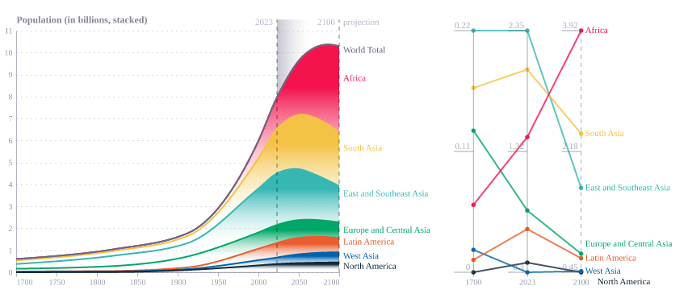
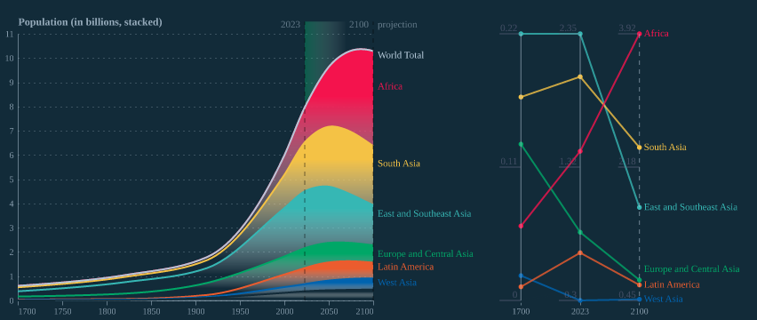
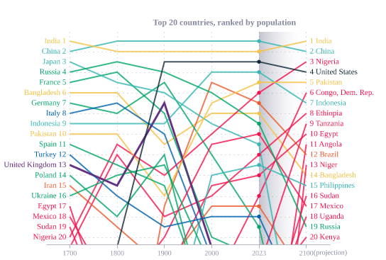
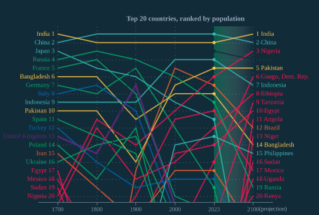
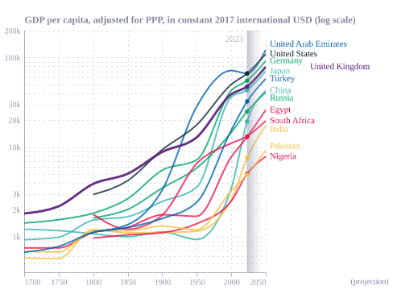
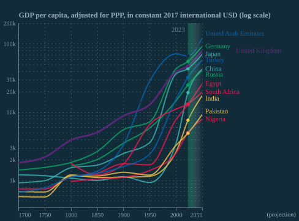

## Figure 1a  

Data: [`csv`](data/fig1a_pop_local.csv)  
GitHub: [fig1a_pop_local](https://github.com/EconomicsObservatory/ECOvisualisations/tree/main/articles/issue-3)  

### Light theme  

Versions with data locally embedded into the `Vega-lite` specification file: [`png`](visualisation/fig1a_pop_local_local.png) [`svg`](visualisation/fig1a_pop_local_local.svg) [`json`](visualisation/fig1a_pop_local_local.json)   
 (**Default**) Versions with data loaded from `GitHub`: [`png`](visualisation/fig1a_pop_local.png) [`svg`](visualisation/fig1a_pop_local.svg) [`json`](visualisation/fig1a_pop_local.json)  
Versions (no ECO branding) with data locally embedded into the `Vega-lite` specification file: [`png`](visualisation/fig1a_pop_local_local_no_branding.png) [`svg`](visualisation/fig1a_pop_local_local_no_branding.svg) [`json`](visualisation/fig1a_pop_local_local_no_branding.json)   
Versions (no ECO branding) with data loaded from `GitHub`: [`png`](visualisation/fig1a_pop_local_no_branding.png) [`svg`](visualisation/fig1a_pop_local_no_branding.svg) [`json`](visualisation/fig1a_pop_local_no_branding.json)   

### Dark theme  

Versions with data locally embedded into the `Vega-lite` specification file: [`png`](visualisation/fig1a_pop_local_local_dark.png) [`svg`](visualisation/fig1a_pop_local_local_dark.svg) [`json`](visualisation/fig1a_pop_local_local_dark.json)   
 Versions with data loaded from `GitHub`: [`png`](visualisation/fig1a_pop_local_dark.png) [`svg`](visualisation/fig1a_pop_local_dark.svg) [`json`](visualisation/fig1a_pop_local_dark.json)  
Versions (no ECO branding) with data locally embedded into the `Vega-lite` specification file: [`png`](visualisation/fig1a_pop_local_local_no_branding_dark.png) [`svg`](visualisation/fig1a_pop_local_local_no_branding_dark.svg) [`json`](visualisation/fig1a_pop_local_local_no_branding_dark.json)   
Versions (no ECO branding) with data loaded from `GitHub`: [`png`](visualisation/fig1a_pop_local_no_branding_dark.png) [`svg`](visualisation/fig1a_pop_local_no_branding_dark.svg) [`json`](visualisation/fig1a_pop_local_no_branding_dark.json)   

  

## Figure 1b  

Data: [`csv`](data/fig1b_pop_country_local.csv)  
GitHub: [fig1b_pop_country_local](https://github.com/EconomicsObservatory/ECOvisualisations/tree/main/articles/issue-3)  

### Light theme  

Versions with data locally embedded into the `Vega-lite` specification file: [`png`](visualisation/fig1b_pop_country_local_local.png) [`svg`](visualisation/fig1b_pop_country_local_local.svg) [`json`](visualisation/fig1b_pop_country_local_local.json)   
 (**Default**) Versions with data loaded from `GitHub`: [`png`](visualisation/fig1b_pop_country_local.png) [`svg`](visualisation/fig1b_pop_country_local.svg) [`json`](visualisation/fig1b_pop_country_local.json)  
Versions (no ECO branding) with data locally embedded into the `Vega-lite` specification file: [`png`](visualisation/fig1b_pop_country_local_local_no_branding.png) [`svg`](visualisation/fig1b_pop_country_local_local_no_branding.svg) [`json`](visualisation/fig1b_pop_country_local_local_no_branding.json)   
Versions (no ECO branding) with data loaded from `GitHub`: [`png`](visualisation/fig1b_pop_country_local_no_branding.png) [`svg`](visualisation/fig1b_pop_country_local_no_branding.svg) [`json`](visualisation/fig1b_pop_country_local_no_branding.json)   

### Dark theme  

Versions with data locally embedded into the `Vega-lite` specification file: [`png`](visualisation/fig1b_pop_country_local_local_dark.png) [`svg`](visualisation/fig1b_pop_country_local_local_dark.svg) [`json`](visualisation/fig1b_pop_country_local_local_dark.json)   
 Versions with data loaded from `GitHub`: [`png`](visualisation/fig1b_pop_country_local_dark.png) [`svg`](visualisation/fig1b_pop_country_local_dark.svg) [`json`](visualisation/fig1b_pop_country_local_dark.json)  
Versions (no ECO branding) with data locally embedded into the `Vega-lite` specification file: [`png`](visualisation/fig1b_pop_country_local_local_no_branding_dark.png) [`svg`](visualisation/fig1b_pop_country_local_local_no_branding_dark.svg) [`json`](visualisation/fig1b_pop_country_local_local_no_branding_dark.json)   
Versions (no ECO branding) with data loaded from `GitHub`: [`png`](visualisation/fig1b_pop_country_local_no_branding_dark.png) [`svg`](visualisation/fig1b_pop_country_local_no_branding_dark.svg) [`json`](visualisation/fig1b_pop_country_local_no_branding_dark.json)   

  

## Figure 1b  

Data: [`csv`](data/fig1b_pop_country_local.csv)  
GitHub: [fig1b_pop_country_local](https://github.com/EconomicsObservatory/ECOvisualisations/tree/main/articles/issue-3)  

### Light theme  

Versions with data locally embedded into the `Vega-lite` specification file: [`png`](visualisation/fig1b_pop_country_local_local.png) [`svg`](visualisation/fig1b_pop_country_local_local.svg) [`json`](visualisation/fig1b_pop_country_local_local.json)   
 (**Default**) Versions with data loaded from `GitHub`: [`png`](visualisation/fig1b_pop_country_local.png) [`svg`](visualisation/fig1b_pop_country_local.svg) [`json`](visualisation/fig1b_pop_country_local.json)  
Versions (no ECO branding) with data locally embedded into the `Vega-lite` specification file: [`png`](visualisation/fig1b_pop_country_local_local_no_branding.png) [`svg`](visualisation/fig1b_pop_country_local_local_no_branding.svg) [`json`](visualisation/fig1b_pop_country_local_local_no_branding.json)   
Versions (no ECO branding) with data loaded from `GitHub`: [`png`](visualisation/fig1b_pop_country_local_no_branding.png) [`svg`](visualisation/fig1b_pop_country_local_no_branding.svg) [`json`](visualisation/fig1b_pop_country_local_no_branding.json)   

### Dark theme  

Versions with data locally embedded into the `Vega-lite` specification file: [`png`](visualisation/fig1b_pop_country_local_local_dark.png) [`svg`](visualisation/fig1b_pop_country_local_local_dark.svg) [`json`](visualisation/fig1b_pop_country_local_local_dark.json)   
 Versions with data loaded from `GitHub`: [`png`](visualisation/fig1b_pop_country_local_dark.png) [`svg`](visualisation/fig1b_pop_country_local_dark.svg) [`json`](visualisation/fig1b_pop_country_local_dark.json)  
Versions (no ECO branding) with data locally embedded into the `Vega-lite` specification file: [`png`](visualisation/fig1b_pop_country_local_local_no_branding_dark.png) [`svg`](visualisation/fig1b_pop_country_local_local_no_branding_dark.svg) [`json`](visualisation/fig1b_pop_country_local_local_no_branding_dark.json)   
Versions (no ECO branding) with data loaded from `GitHub`: [`png`](visualisation/fig1b_pop_country_local_no_branding_dark.png) [`svg`](visualisation/fig1b_pop_country_local_no_branding_dark.svg) [`json`](visualisation/fig1b_pop_country_local_no_branding_dark.json)   

  

## Figure 1b  

Data: [`csv`](data/fig1b_pop_country_local.csv)  
GitHub: [fig1b_pop_country_local](https://github.com/EconomicsObservatory/ECOvisualisations/tree/main/articles/issue-3)  

### Light theme  

Versions with data locally embedded into the `Vega-lite` specification file: [`png`](visualisation/fig1b_pop_country_local_local.png) [`svg`](visualisation/fig1b_pop_country_local_local.svg) [`json`](visualisation/fig1b_pop_country_local_local.json)   
 (**Default**) Versions with data loaded from `GitHub`: [`png`](visualisation/fig1b_pop_country_local.png) [`svg`](visualisation/fig1b_pop_country_local.svg) [`json`](visualisation/fig1b_pop_country_local.json)  
Versions (no ECO branding) with data locally embedded into the `Vega-lite` specification file: [`png`](visualisation/fig1b_pop_country_local_local_no_branding.png) [`svg`](visualisation/fig1b_pop_country_local_local_no_branding.svg) [`json`](visualisation/fig1b_pop_country_local_local_no_branding.json)   
Versions (no ECO branding) with data loaded from `GitHub`: [`png`](visualisation/fig1b_pop_country_local_no_branding.png) [`svg`](visualisation/fig1b_pop_country_local_no_branding.svg) [`json`](visualisation/fig1b_pop_country_local_no_branding.json)   

### Dark theme  

Versions with data locally embedded into the `Vega-lite` specification file: [`png`](visualisation/fig1b_pop_country_local_local_dark.png) [`svg`](visualisation/fig1b_pop_country_local_local_dark.svg) [`json`](visualisation/fig1b_pop_country_local_local_dark.json)   
 Versions with data loaded from `GitHub`: [`png`](visualisation/fig1b_pop_country_local_dark.png) [`svg`](visualisation/fig1b_pop_country_local_dark.svg) [`json`](visualisation/fig1b_pop_country_local_dark.json)  
Versions (no ECO branding) with data locally embedded into the `Vega-lite` specification file: [`png`](visualisation/fig1b_pop_country_local_local_no_branding_dark.png) [`svg`](visualisation/fig1b_pop_country_local_local_no_branding_dark.svg) [`json`](visualisation/fig1b_pop_country_local_local_no_branding_dark.json)   
Versions (no ECO branding) with data loaded from `GitHub`: [`png`](visualisation/fig1b_pop_country_local_no_branding_dark.png) [`svg`](visualisation/fig1b_pop_country_local_no_branding_dark.svg) [`json`](visualisation/fig1b_pop_country_local_no_branding_dark.json)   

  

## Figure 1b  

Data: [`csv`](data/fig1b_pop_country_local.csv)  
GitHub: [fig1b_pop_country_local](https://github.com/EconomicsObservatory/ECOvisualisations/tree/main/articles/issue-3)  

### Light theme  

Versions with data locally embedded into the `Vega-lite` specification file: [`png`](visualisation/fig1b_pop_country_local_local.png) [`svg`](visualisation/fig1b_pop_country_local_local.svg) [`json`](visualisation/fig1b_pop_country_local_local.json)   
 (**Default**) Versions with data loaded from `GitHub`: [`png`](visualisation/fig1b_pop_country_local.png) [`svg`](visualisation/fig1b_pop_country_local.svg) [`json`](visualisation/fig1b_pop_country_local.json)  
Versions (no ECO branding) with data locally embedded into the `Vega-lite` specification file: [`png`](visualisation/fig1b_pop_country_local_local_no_branding.png) [`svg`](visualisation/fig1b_pop_country_local_local_no_branding.svg) [`json`](visualisation/fig1b_pop_country_local_local_no_branding.json)   
Versions (no ECO branding) with data loaded from `GitHub`: [`png`](visualisation/fig1b_pop_country_local_no_branding.png) [`svg`](visualisation/fig1b_pop_country_local_no_branding.svg) [`json`](visualisation/fig1b_pop_country_local_no_branding.json)   

### Dark theme  

Versions with data locally embedded into the `Vega-lite` specification file: [`png`](visualisation/fig1b_pop_country_local_local_dark.png) [`svg`](visualisation/fig1b_pop_country_local_local_dark.svg) [`json`](visualisation/fig1b_pop_country_local_local_dark.json)   
 Versions with data loaded from `GitHub`: [`png`](visualisation/fig1b_pop_country_local_dark.png) [`svg`](visualisation/fig1b_pop_country_local_dark.svg) [`json`](visualisation/fig1b_pop_country_local_dark.json)  
Versions (no ECO branding) with data locally embedded into the `Vega-lite` specification file: [`png`](visualisation/fig1b_pop_country_local_local_no_branding_dark.png) [`svg`](visualisation/fig1b_pop_country_local_local_no_branding_dark.svg) [`json`](visualisation/fig1b_pop_country_local_local_no_branding_dark.json)   
Versions (no ECO branding) with data loaded from `GitHub`: [`png`](visualisation/fig1b_pop_country_local_no_branding_dark.png) [`svg`](visualisation/fig1b_pop_country_local_no_branding_dark.svg) [`json`](visualisation/fig1b_pop_country_local_no_branding_dark.json)   

  

## Figure 1b  

Data: [`csv`](data/fig1b_pop_country_local.csv)  
GitHub: [fig1b_pop_country_local](https://github.com/EconomicsObservatory/ECOvisualisations/tree/main/articles/issue-3)  

### Light theme  

Versions with data locally embedded into the `Vega-lite` specification file: [`png`](visualisation/fig1b_pop_country_local_local.png) [`svg`](visualisation/fig1b_pop_country_local_local.svg) [`json`](visualisation/fig1b_pop_country_local_local.json)   
 (**Default**) Versions with data loaded from `GitHub`: [`png`](visualisation/fig1b_pop_country_local.png) [`svg`](visualisation/fig1b_pop_country_local.svg) [`json`](visualisation/fig1b_pop_country_local.json)  
Versions (no ECO branding) with data locally embedded into the `Vega-lite` specification file: [`png`](visualisation/fig1b_pop_country_local_local_no_branding.png) [`svg`](visualisation/fig1b_pop_country_local_local_no_branding.svg) [`json`](visualisation/fig1b_pop_country_local_local_no_branding.json)   
Versions (no ECO branding) with data loaded from `GitHub`: [`png`](visualisation/fig1b_pop_country_local_no_branding.png) [`svg`](visualisation/fig1b_pop_country_local_no_branding.svg) [`json`](visualisation/fig1b_pop_country_local_no_branding.json)   

### Dark theme  

Versions with data locally embedded into the `Vega-lite` specification file: [`png`](visualisation/fig1b_pop_country_local_local_dark.png) [`svg`](visualisation/fig1b_pop_country_local_local_dark.svg) [`json`](visualisation/fig1b_pop_country_local_local_dark.json)   
 Versions with data loaded from `GitHub`: [`png`](visualisation/fig1b_pop_country_local_dark.png) [`svg`](visualisation/fig1b_pop_country_local_dark.svg) [`json`](visualisation/fig1b_pop_country_local_dark.json)  
Versions (no ECO branding) with data locally embedded into the `Vega-lite` specification file: [`png`](visualisation/fig1b_pop_country_local_local_no_branding_dark.png) [`svg`](visualisation/fig1b_pop_country_local_local_no_branding_dark.svg) [`json`](visualisation/fig1b_pop_country_local_local_no_branding_dark.json)   
Versions (no ECO branding) with data loaded from `GitHub`: [`png`](visualisation/fig1b_pop_country_local_no_branding_dark.png) [`svg`](visualisation/fig1b_pop_country_local_no_branding_dark.svg) [`json`](visualisation/fig1b_pop_country_local_no_branding_dark.json)   

  

## Figure 1b  

Data: [`csv`](data/fig1b_pop_country_local.csv)  
GitHub: [fig1b_pop_country_local](https://github.com/EconomicsObservatory/ECOvisualisations/tree/main/articles/issue-3)  

### Light theme  

Versions with data locally embedded into the `Vega-lite` specification file: [`png`](visualisation/fig1b_pop_country_local_local.png) [`svg`](visualisation/fig1b_pop_country_local_local.svg) [`json`](visualisation/fig1b_pop_country_local_local.json)   
 (**Default**) Versions with data loaded from `GitHub`: [`png`](visualisation/fig1b_pop_country_local.png) [`svg`](visualisation/fig1b_pop_country_local.svg) [`json`](visualisation/fig1b_pop_country_local.json)  
Versions (no ECO branding) with data locally embedded into the `Vega-lite` specification file: [`png`](visualisation/fig1b_pop_country_local_local_no_branding.png) [`svg`](visualisation/fig1b_pop_country_local_local_no_branding.svg) [`json`](visualisation/fig1b_pop_country_local_local_no_branding.json)   
Versions (no ECO branding) with data loaded from `GitHub`: [`png`](visualisation/fig1b_pop_country_local_no_branding.png) [`svg`](visualisation/fig1b_pop_country_local_no_branding.svg) [`json`](visualisation/fig1b_pop_country_local_no_branding.json)   

### Dark theme  

Versions with data locally embedded into the `Vega-lite` specification file: [`png`](visualisation/fig1b_pop_country_local_local_dark.png) [`svg`](visualisation/fig1b_pop_country_local_local_dark.svg) [`json`](visualisation/fig1b_pop_country_local_local_dark.json)   
 Versions with data loaded from `GitHub`: [`png`](visualisation/fig1b_pop_country_local_dark.png) [`svg`](visualisation/fig1b_pop_country_local_dark.svg) [`json`](visualisation/fig1b_pop_country_local_dark.json)  
Versions (no ECO branding) with data locally embedded into the `Vega-lite` specification file: [`png`](visualisation/fig1b_pop_country_local_local_no_branding_dark.png) [`svg`](visualisation/fig1b_pop_country_local_local_no_branding_dark.svg) [`json`](visualisation/fig1b_pop_country_local_local_no_branding_dark.json)   
Versions (no ECO branding) with data loaded from `GitHub`: [`png`](visualisation/fig1b_pop_country_local_no_branding_dark.png) [`svg`](visualisation/fig1b_pop_country_local_no_branding_dark.svg) [`json`](visualisation/fig1b_pop_country_local_no_branding_dark.json)   

  

## Figure 1b  

Data: [`csv`](data/fig1b_pop_country_local.csv)  
GitHub: [fig1b_pop_country_local](https://github.com/EconomicsObservatory/ECOvisualisations/tree/main/articles/issue-3)  

### Light theme  

Versions with data locally embedded into the `Vega-lite` specification file: [`png`](visualisation/fig1b_pop_country_local_local.png) [`svg`](visualisation/fig1b_pop_country_local_local.svg) [`json`](visualisation/fig1b_pop_country_local_local.json)   
 (**Default**) Versions with data loaded from `GitHub`: [`png`](visualisation/fig1b_pop_country_local.png) [`svg`](visualisation/fig1b_pop_country_local.svg) [`json`](visualisation/fig1b_pop_country_local.json)  
Versions (no ECO branding) with data locally embedded into the `Vega-lite` specification file: [`png`](visualisation/fig1b_pop_country_local_local_no_branding.png) [`svg`](visualisation/fig1b_pop_country_local_local_no_branding.svg) [`json`](visualisation/fig1b_pop_country_local_local_no_branding.json)   
Versions (no ECO branding) with data loaded from `GitHub`: [`png`](visualisation/fig1b_pop_country_local_no_branding.png) [`svg`](visualisation/fig1b_pop_country_local_no_branding.svg) [`json`](visualisation/fig1b_pop_country_local_no_branding.json)   

### Dark theme  

Versions with data locally embedded into the `Vega-lite` specification file: [`png`](visualisation/fig1b_pop_country_local_local_dark.png) [`svg`](visualisation/fig1b_pop_country_local_local_dark.svg) [`json`](visualisation/fig1b_pop_country_local_local_dark.json)   
 Versions with data loaded from `GitHub`: [`png`](visualisation/fig1b_pop_country_local_dark.png) [`svg`](visualisation/fig1b_pop_country_local_dark.svg) [`json`](visualisation/fig1b_pop_country_local_dark.json)  
Versions (no ECO branding) with data locally embedded into the `Vega-lite` specification file: [`png`](visualisation/fig1b_pop_country_local_local_no_branding_dark.png) [`svg`](visualisation/fig1b_pop_country_local_local_no_branding_dark.svg) [`json`](visualisation/fig1b_pop_country_local_local_no_branding_dark.json)   
Versions (no ECO branding) with data loaded from `GitHub`: [`png`](visualisation/fig1b_pop_country_local_no_branding_dark.png) [`svg`](visualisation/fig1b_pop_country_local_no_branding_dark.svg) [`json`](visualisation/fig1b_pop_country_local_no_branding_dark.json)   

  

## Figure 2  

Data: [`csv`](data/fig2_global_shares_local.csv)  
GitHub: [fig2_global_shares_local](https://github.com/EconomicsObservatory/ECOvisualisations/tree/main/articles/issue-3)  

### Light theme  

Versions with data locally embedded into the `Vega-lite` specification file: [`png`](visualisation/fig2_global_shares_local_local.png) [`svg`](visualisation/fig2_global_shares_local_local.svg) [`json`](visualisation/fig2_global_shares_local_local.json)   
 (**Default**) Versions with data loaded from `GitHub`: [`png`](visualisation/fig2_global_shares_local.png) [`svg`](visualisation/fig2_global_shares_local.svg) [`json`](visualisation/fig2_global_shares_local.json)  
Versions (no ECO branding) with data locally embedded into the `Vega-lite` specification file: [`png`](visualisation/fig2_global_shares_local_local_no_branding.png) [`svg`](visualisation/fig2_global_shares_local_local_no_branding.svg) [`json`](visualisation/fig2_global_shares_local_local_no_branding.json)   
Versions (no ECO branding) with data loaded from `GitHub`: [`png`](visualisation/fig2_global_shares_local_no_branding.png) [`svg`](visualisation/fig2_global_shares_local_no_branding.svg) [`json`](visualisation/fig2_global_shares_local_no_branding.json)   

### Dark theme  

Versions with data locally embedded into the `Vega-lite` specification file: [`png`](visualisation/fig2_global_shares_local_local_dark.png) [`svg`](visualisation/fig2_global_shares_local_local_dark.svg) [`json`](visualisation/fig2_global_shares_local_local_dark.json)   
 Versions with data loaded from `GitHub`: [`png`](visualisation/fig2_global_shares_local_dark.png) [`svg`](visualisation/fig2_global_shares_local_dark.svg) [`json`](visualisation/fig2_global_shares_local_dark.json)  
Versions (no ECO branding) with data locally embedded into the `Vega-lite` specification file: [`png`](visualisation/fig2_global_shares_local_local_no_branding_dark.png) [`svg`](visualisation/fig2_global_shares_local_local_no_branding_dark.svg) [`json`](visualisation/fig2_global_shares_local_local_no_branding_dark.json)   
Versions (no ECO branding) with data loaded from `GitHub`: [`png`](visualisation/fig2_global_shares_local_no_branding_dark.png) [`svg`](visualisation/fig2_global_shares_local_no_branding_dark.svg) [`json`](visualisation/fig2_global_shares_local_no_branding_dark.json)   

  

