## Figure 1-1  

Data: [`csv`](data/fig1-1_pop_local.csv)  
GitHub: [fig1-1_pop_local](https://github.com/EconomicsObservatory/ECOvisualisations/tree/main/articles/issue-3)  

### Light theme  

Versions with data locally embedded into the `Vega-lite` specification file: [`png`](visualisation/fig1-1_pop_local_local.png) [`svg`](visualisation/fig1-1_pop_local_local.svg) [`json`](visualisation/fig1-1_pop_local_local.json)   
 (**Default**) Versions with data loaded from `GitHub`: [`png`](visualisation/fig1-1_pop_local.png) [`svg`](visualisation/fig1-1_pop_local.svg) [`json`](visualisation/fig1-1_pop_local.json)  
Versions (no ECO branding) with data locally embedded into the `Vega-lite` specification file: [`png`](visualisation/fig1-1_pop_local_local_no_branding.png) [`svg`](visualisation/fig1-1_pop_local_local_no_branding.svg) [`json`](visualisation/fig1-1_pop_local_local_no_branding.json)   
Versions (no ECO branding) with data loaded from `GitHub`: [`png`](visualisation/fig1-1_pop_local_no_branding.png) [`svg`](visualisation/fig1-1_pop_local_no_branding.svg) [`json`](visualisation/fig1-1_pop_local_no_branding.json)   

### Dark theme  

Versions with data locally embedded into the `Vega-lite` specification file: [`png`](visualisation/fig1-1_pop_local_local_dark.png) [`svg`](visualisation/fig1-1_pop_local_local_dark.svg) [`json`](visualisation/fig1-1_pop_local_local_dark.json)   
 Versions with data loaded from `GitHub`: [`png`](visualisation/fig1-1_pop_local_dark.png) [`svg`](visualisation/fig1-1_pop_local_dark.svg) [`json`](visualisation/fig1-1_pop_local_dark.json)  
Versions (no ECO branding) with data locally embedded into the `Vega-lite` specification file: [`png`](visualisation/fig1-1_pop_local_local_no_branding_dark.png) [`svg`](visualisation/fig1-1_pop_local_local_no_branding_dark.svg) [`json`](visualisation/fig1-1_pop_local_local_no_branding_dark.json)   
Versions (no ECO branding) with data loaded from `GitHub`: [`png`](visualisation/fig1-1_pop_local_no_branding_dark.png) [`svg`](visualisation/fig1-1_pop_local_no_branding_dark.svg) [`json`](visualisation/fig1-1_pop_local_no_branding_dark.json)   

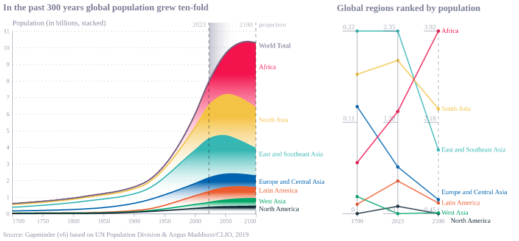

  

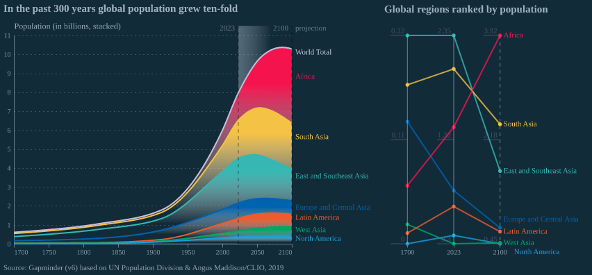

## Figure 1-2  

Data: [`csv`](data/fig1-2_life_expectancy_local.csv)  
GitHub: [fig1-2_life_expectancy_local](https://github.com/EconomicsObservatory/ECOvisualisations/tree/main/articles/issue-3)  

### Light theme  

Versions with data locally embedded into the `Vega-lite` specification file: [`png`](visualisation/fig1-2_life_expectancy_local_local.png) [`svg`](visualisation/fig1-2_life_expectancy_local_local.svg) [`json`](visualisation/fig1-2_life_expectancy_local_local.json)   
 (**Default**) Versions with data loaded from `GitHub`: [`png`](visualisation/fig1-2_life_expectancy_local.png) [`svg`](visualisation/fig1-2_life_expectancy_local.svg) [`json`](visualisation/fig1-2_life_expectancy_local.json)  
Versions (no ECO branding) with data locally embedded into the `Vega-lite` specification file: [`png`](visualisation/fig1-2_life_expectancy_local_local_no_branding.png) [`svg`](visualisation/fig1-2_life_expectancy_local_local_no_branding.svg) [`json`](visualisation/fig1-2_life_expectancy_local_local_no_branding.json)   
Versions (no ECO branding) with data loaded from `GitHub`: [`png`](visualisation/fig1-2_life_expectancy_local_no_branding.png) [`svg`](visualisation/fig1-2_life_expectancy_local_no_branding.svg) [`json`](visualisation/fig1-2_life_expectancy_local_no_branding.json)   

### Dark theme  

Versions with data locally embedded into the `Vega-lite` specification file: [`png`](visualisation/fig1-2_life_expectancy_local_local_dark.png) [`svg`](visualisation/fig1-2_life_expectancy_local_local_dark.svg) [`json`](visualisation/fig1-2_life_expectancy_local_local_dark.json)   
 Versions with data loaded from `GitHub`: [`png`](visualisation/fig1-2_life_expectancy_local_dark.png) [`svg`](visualisation/fig1-2_life_expectancy_local_dark.svg) [`json`](visualisation/fig1-2_life_expectancy_local_dark.json)  
Versions (no ECO branding) with data locally embedded into the `Vega-lite` specification file: [`png`](visualisation/fig1-2_life_expectancy_local_local_no_branding_dark.png) [`svg`](visualisation/fig1-2_life_expectancy_local_local_no_branding_dark.svg) [`json`](visualisation/fig1-2_life_expectancy_local_local_no_branding_dark.json)   
Versions (no ECO branding) with data loaded from `GitHub`: [`png`](visualisation/fig1-2_life_expectancy_local_no_branding_dark.png) [`svg`](visualisation/fig1-2_life_expectancy_local_no_branding_dark.svg) [`json`](visualisation/fig1-2_life_expectancy_local_no_branding_dark.json)   

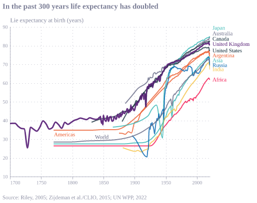

  

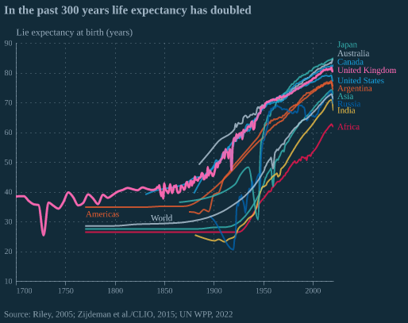

## Figure 1-3  

Data: [`csv`](data/fig1-3_gdp_local.csv)  
GitHub: [fig1-3_gdp_local](https://github.com/EconomicsObservatory/ECOvisualisations/tree/main/articles/issue-3)  

### Light theme  

Versions with data locally embedded into the `Vega-lite` specification file: [`png`](visualisation/fig1-3_gdp_local_local.png) [`svg`](visualisation/fig1-3_gdp_local_local.svg) [`json`](visualisation/fig1-3_gdp_local_local.json)   
 (**Default**) Versions with data loaded from `GitHub`: [`png`](visualisation/fig1-3_gdp_local.png) [`svg`](visualisation/fig1-3_gdp_local.svg) [`json`](visualisation/fig1-3_gdp_local.json)  
Versions (no ECO branding) with data locally embedded into the `Vega-lite` specification file: [`png`](visualisation/fig1-3_gdp_local_local_no_branding.png) [`svg`](visualisation/fig1-3_gdp_local_local_no_branding.svg) [`json`](visualisation/fig1-3_gdp_local_local_no_branding.json)   
Versions (no ECO branding) with data loaded from `GitHub`: [`png`](visualisation/fig1-3_gdp_local_no_branding.png) [`svg`](visualisation/fig1-3_gdp_local_no_branding.svg) [`json`](visualisation/fig1-3_gdp_local_no_branding.json)   

### Dark theme  

Versions with data locally embedded into the `Vega-lite` specification file: [`png`](visualisation/fig1-3_gdp_local_local_dark.png) [`svg`](visualisation/fig1-3_gdp_local_local_dark.svg) [`json`](visualisation/fig1-3_gdp_local_local_dark.json)   
 Versions with data loaded from `GitHub`: [`png`](visualisation/fig1-3_gdp_local_dark.png) [`svg`](visualisation/fig1-3_gdp_local_dark.svg) [`json`](visualisation/fig1-3_gdp_local_dark.json)  
Versions (no ECO branding) with data locally embedded into the `Vega-lite` specification file: [`png`](visualisation/fig1-3_gdp_local_local_no_branding_dark.png) [`svg`](visualisation/fig1-3_gdp_local_local_no_branding_dark.svg) [`json`](visualisation/fig1-3_gdp_local_local_no_branding_dark.json)   
Versions (no ECO branding) with data loaded from `GitHub`: [`png`](visualisation/fig1-3_gdp_local_no_branding_dark.png) [`svg`](visualisation/fig1-3_gdp_local_no_branding_dark.svg) [`json`](visualisation/fig1-3_gdp_local_no_branding_dark.json)   

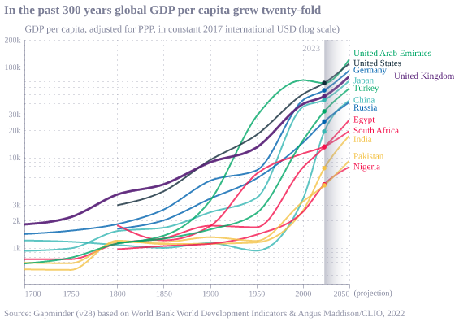

  

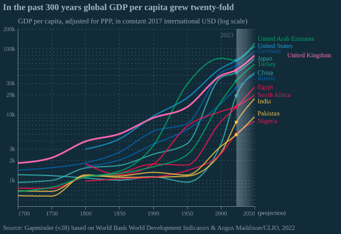

## Figure 1-4  

Data: [`csv`](data/fig1-4_emissions_local.csv)  
GitHub: [fig1-4_emissions_local](https://github.com/EconomicsObservatory/ECOvisualisations/tree/main/articles/issue-3)  

### Light theme  

Versions with data locally embedded into the `Vega-lite` specification file: [`png`](visualisation/fig1-4_emissions_local_local.png) [`svg`](visualisation/fig1-4_emissions_local_local.svg) [`json`](visualisation/fig1-4_emissions_local_local.json)   
 (**Default**) Versions with data loaded from `GitHub`: [`png`](visualisation/fig1-4_emissions_local.png) [`svg`](visualisation/fig1-4_emissions_local.svg) [`json`](visualisation/fig1-4_emissions_local.json)  
Versions (no ECO branding) with data locally embedded into the `Vega-lite` specification file: [`png`](visualisation/fig1-4_emissions_local_local_no_branding.png) [`svg`](visualisation/fig1-4_emissions_local_local_no_branding.svg) [`json`](visualisation/fig1-4_emissions_local_local_no_branding.json)   
Versions (no ECO branding) with data loaded from `GitHub`: [`png`](visualisation/fig1-4_emissions_local_no_branding.png) [`svg`](visualisation/fig1-4_emissions_local_no_branding.svg) [`json`](visualisation/fig1-4_emissions_local_no_branding.json)   

### Dark theme  

Versions with data locally embedded into the `Vega-lite` specification file: [`png`](visualisation/fig1-4_emissions_local_local_dark.png) [`svg`](visualisation/fig1-4_emissions_local_local_dark.svg) [`json`](visualisation/fig1-4_emissions_local_local_dark.json)   
 Versions with data loaded from `GitHub`: [`png`](visualisation/fig1-4_emissions_local_dark.png) [`svg`](visualisation/fig1-4_emissions_local_dark.svg) [`json`](visualisation/fig1-4_emissions_local_dark.json)  
Versions (no ECO branding) with data locally embedded into the `Vega-lite` specification file: [`png`](visualisation/fig1-4_emissions_local_local_no_branding_dark.png) [`svg`](visualisation/fig1-4_emissions_local_local_no_branding_dark.svg) [`json`](visualisation/fig1-4_emissions_local_local_no_branding_dark.json)   
Versions (no ECO branding) with data loaded from `GitHub`: [`png`](visualisation/fig1-4_emissions_local_no_branding_dark.png) [`svg`](visualisation/fig1-4_emissions_local_no_branding_dark.svg) [`json`](visualisation/fig1-4_emissions_local_no_branding_dark.json)   

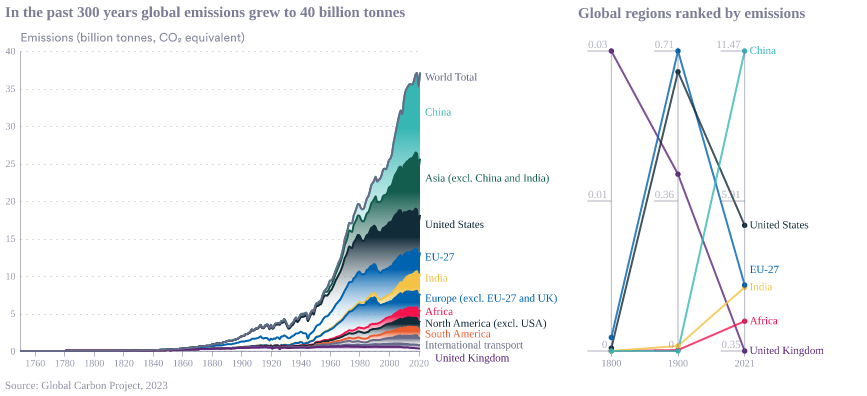

  

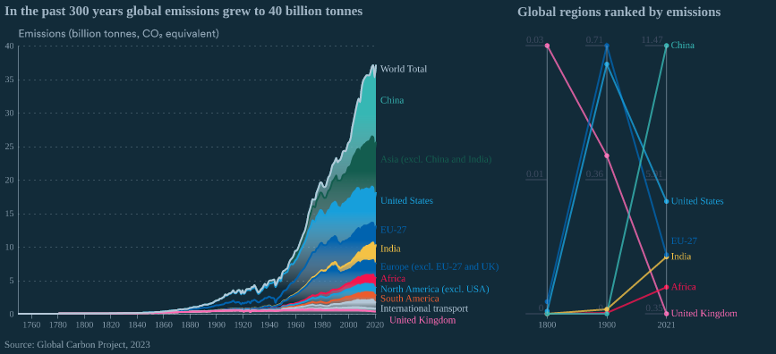

## Figure 1-5  

Data: [`csv`](data/fig1-5_moore_local.csv)  
GitHub: [fig1-5_moore_local](https://github.com/EconomicsObservatory/ECOvisualisations/tree/main/articles/issue-3)  

### Light theme  

Versions with data locally embedded into the `Vega-lite` specification file: [`png`](visualisation/fig1-5_moore_local_local.png) [`svg`](visualisation/fig1-5_moore_local_local.svg) [`json`](visualisation/fig1-5_moore_local_local.json)   
 (**Default**) Versions with data loaded from `GitHub`: [`png`](visualisation/fig1-5_moore_local.png) [`svg`](visualisation/fig1-5_moore_local.svg) [`json`](visualisation/fig1-5_moore_local.json)  
Versions (no ECO branding) with data locally embedded into the `Vega-lite` specification file: [`png`](visualisation/fig1-5_moore_local_local_no_branding.png) [`svg`](visualisation/fig1-5_moore_local_local_no_branding.svg) [`json`](visualisation/fig1-5_moore_local_local_no_branding.json)   
Versions (no ECO branding) with data loaded from `GitHub`: [`png`](visualisation/fig1-5_moore_local_no_branding.png) [`svg`](visualisation/fig1-5_moore_local_no_branding.svg) [`json`](visualisation/fig1-5_moore_local_no_branding.json)   

### Dark theme  

Versions with data locally embedded into the `Vega-lite` specification file: [`png`](visualisation/fig1-5_moore_local_local_dark.png) [`svg`](visualisation/fig1-5_moore_local_local_dark.svg) [`json`](visualisation/fig1-5_moore_local_local_dark.json)   
 Versions with data loaded from `GitHub`: [`png`](visualisation/fig1-5_moore_local_dark.png) [`svg`](visualisation/fig1-5_moore_local_dark.svg) [`json`](visualisation/fig1-5_moore_local_dark.json)  
Versions (no ECO branding) with data locally embedded into the `Vega-lite` specification file: [`png`](visualisation/fig1-5_moore_local_local_no_branding_dark.png) [`svg`](visualisation/fig1-5_moore_local_local_no_branding_dark.svg) [`json`](visualisation/fig1-5_moore_local_local_no_branding_dark.json)   
Versions (no ECO branding) with data loaded from `GitHub`: [`png`](visualisation/fig1-5_moore_local_no_branding_dark.png) [`svg`](visualisation/fig1-5_moore_local_no_branding_dark.svg) [`json`](visualisation/fig1-5_moore_local_no_branding_dark.json)   

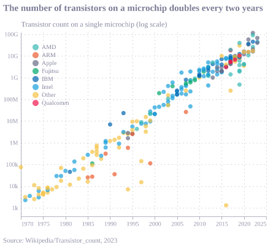

  

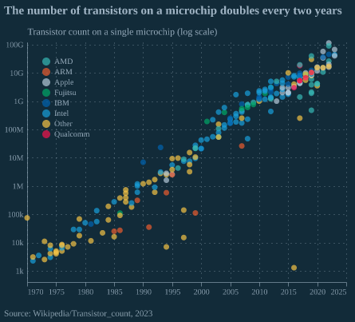

## Figure 1-5  

Data: [`csv`](data/fig1-5_moore_local.csv)  
GitHub: [fig1-5_moore_local](https://github.com/EconomicsObservatory/ECOvisualisations/tree/main/articles/issue-3)  

### Light theme  

Versions with data locally embedded into the `Vega-lite` specification file: [`png`](visualisation/fig1-5_moore_local_local.png) [`svg`](visualisation/fig1-5_moore_local_local.svg) [`json`](visualisation/fig1-5_moore_local_local.json)   
 (**Default**) Versions with data loaded from `GitHub`: [`png`](visualisation/fig1-5_moore_local.png) [`svg`](visualisation/fig1-5_moore_local.svg) [`json`](visualisation/fig1-5_moore_local.json)  
Versions (no ECO branding) with data locally embedded into the `Vega-lite` specification file: [`png`](visualisation/fig1-5_moore_local_local_no_branding.png) [`svg`](visualisation/fig1-5_moore_local_local_no_branding.svg) [`json`](visualisation/fig1-5_moore_local_local_no_branding.json)   
Versions (no ECO branding) with data loaded from `GitHub`: [`png`](visualisation/fig1-5_moore_local_no_branding.png) [`svg`](visualisation/fig1-5_moore_local_no_branding.svg) [`json`](visualisation/fig1-5_moore_local_no_branding.json)   

### Dark theme  

Versions with data locally embedded into the `Vega-lite` specification file: [`png`](visualisation/fig1-5_moore_local_local_dark.png) [`svg`](visualisation/fig1-5_moore_local_local_dark.svg) [`json`](visualisation/fig1-5_moore_local_local_dark.json)   
 Versions with data loaded from `GitHub`: [`png`](visualisation/fig1-5_moore_local_dark.png) [`svg`](visualisation/fig1-5_moore_local_dark.svg) [`json`](visualisation/fig1-5_moore_local_dark.json)  
Versions (no ECO branding) with data locally embedded into the `Vega-lite` specification file: [`png`](visualisation/fig1-5_moore_local_local_no_branding_dark.png) [`svg`](visualisation/fig1-5_moore_local_local_no_branding_dark.svg) [`json`](visualisation/fig1-5_moore_local_local_no_branding_dark.json)   
Versions (no ECO branding) with data loaded from `GitHub`: [`png`](visualisation/fig1-5_moore_local_no_branding_dark.png) [`svg`](visualisation/fig1-5_moore_local_no_branding_dark.svg) [`json`](visualisation/fig1-5_moore_local_no_branding_dark.json)   

  

## Figure 1-6  

Data: [`csv`](data/fig1-6_hours_worked_local.csv)  
GitHub: [fig1-6_hours_worked_local](https://github.com/EconomicsObservatory/ECOvisualisations/tree/main/articles/issue-3)  

### Light theme  

Versions with data locally embedded into the `Vega-lite` specification file: [`png`](visualisation/fig1-6_hours_worked_local_local.png) [`svg`](visualisation/fig1-6_hours_worked_local_local.svg) [`json`](visualisation/fig1-6_hours_worked_local_local.json)   
 (**Default**) Versions with data loaded from `GitHub`: [`png`](visualisation/fig1-6_hours_worked_local.png) [`svg`](visualisation/fig1-6_hours_worked_local.svg) [`json`](visualisation/fig1-6_hours_worked_local.json)  
Versions (no ECO branding) with data locally embedded into the `Vega-lite` specification file: [`png`](visualisation/fig1-6_hours_worked_local_local_no_branding.png) [`svg`](visualisation/fig1-6_hours_worked_local_local_no_branding.svg) [`json`](visualisation/fig1-6_hours_worked_local_local_no_branding.json)   
Versions (no ECO branding) with data loaded from `GitHub`: [`png`](visualisation/fig1-6_hours_worked_local_no_branding.png) [`svg`](visualisation/fig1-6_hours_worked_local_no_branding.svg) [`json`](visualisation/fig1-6_hours_worked_local_no_branding.json)   

### Dark theme  

Versions with data locally embedded into the `Vega-lite` specification file: [`png`](visualisation/fig1-6_hours_worked_local_local_dark.png) [`svg`](visualisation/fig1-6_hours_worked_local_local_dark.svg) [`json`](visualisation/fig1-6_hours_worked_local_local_dark.json)   
 Versions with data loaded from `GitHub`: [`png`](visualisation/fig1-6_hours_worked_local_dark.png) [`svg`](visualisation/fig1-6_hours_worked_local_dark.svg) [`json`](visualisation/fig1-6_hours_worked_local_dark.json)  
Versions (no ECO branding) with data locally embedded into the `Vega-lite` specification file: [`png`](visualisation/fig1-6_hours_worked_local_local_no_branding_dark.png) [`svg`](visualisation/fig1-6_hours_worked_local_local_no_branding_dark.svg) [`json`](visualisation/fig1-6_hours_worked_local_local_no_branding_dark.json)   
Versions (no ECO branding) with data loaded from `GitHub`: [`png`](visualisation/fig1-6_hours_worked_local_no_branding_dark.png) [`svg`](visualisation/fig1-6_hours_worked_local_no_branding_dark.svg) [`json`](visualisation/fig1-6_hours_worked_local_no_branding_dark.json)   

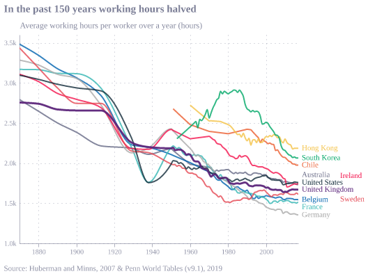

  

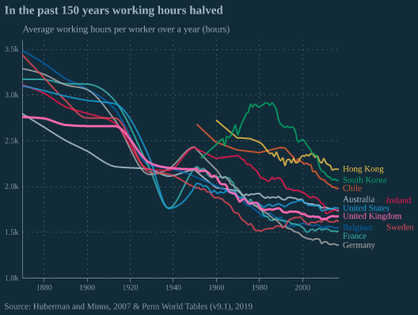

