## Figure 1-1  

Data: [`csv`](data/fig1-1_pop.csv)  
GitHub: [fig1-1_pop](https://github.com/EconomicsObservatory/ECOvisualisations/tree/main/magazine/issue-3#figure-1-1)  

### Light theme  

Versions with data locally embedded into the `Vega-lite` specification file: [`png`](visualisation/fig1-1_pop_local.png) [`svg`](visualisation/fig1-1_pop.svg) [`json`](visualisation/fig1-1_pop.json)   

### Dark theme  

Versions with data locally embedded into the `Vega-lite` specification file: [`png`](visualisation/fig1-1_pop_local_dark.png) [`svg`](visualisation/fig1-1_pop_dark.svg) [`json`](visualisation/fig1-1_pop_dark.json)   

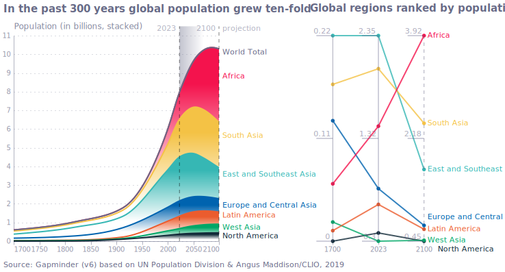

  

## Figure 1-2  

Data: [`csv`](data/fig1-2_life_expectancy.csv)  
GitHub: [fig1-2_life_expectancy](https://github.com/EconomicsObservatory/ECOvisualisations/tree/main/magazine/issue-3#figure-1-2)  

### Light theme  

Versions with data locally embedded into the `Vega-lite` specification file: [`png`](visualisation/fig1-2_life_expectancy_local.png) [`svg`](visualisation/fig1-2_life_expectancy.svg) [`json`](visualisation/fig1-2_life_expectancy.json)   

### Dark theme  

Versions with data locally embedded into the `Vega-lite` specification file: [`png`](visualisation/fig1-2_life_expectancy_local_dark.png) [`svg`](visualisation/fig1-2_life_expectancy_dark.svg) [`json`](visualisation/fig1-2_life_expectancy_dark.json)   

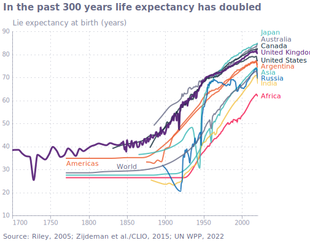

  

## Figure 1-3  

Data: [`csv`](data/fig1-3_gdp.csv)  
GitHub: [fig1-3_gdp](https://github.com/EconomicsObservatory/ECOvisualisations/tree/main/magazine/issue-3#figure-1-3)  

### Light theme  

Versions with data locally embedded into the `Vega-lite` specification file: [`png`](visualisation/fig1-3_gdp_local.png) [`svg`](visualisation/fig1-3_gdp.svg) [`json`](visualisation/fig1-3_gdp.json)   

### Dark theme  

Versions with data locally embedded into the `Vega-lite` specification file: [`png`](visualisation/fig1-3_gdp_local_dark.png) [`svg`](visualisation/fig1-3_gdp_dark.svg) [`json`](visualisation/fig1-3_gdp_dark.json)   

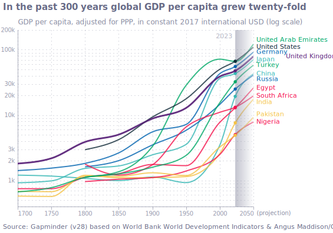

  

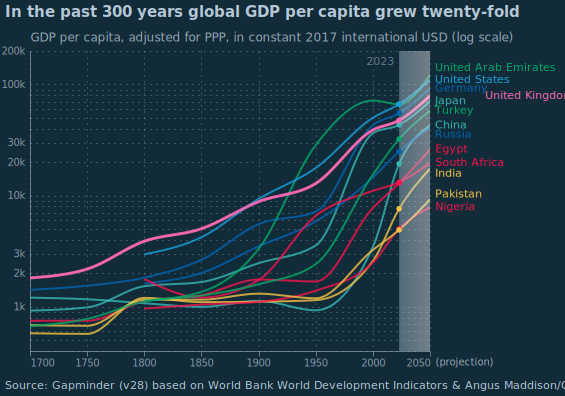

## Figure 1-4  

Data: [`csv`](data/fig1-4_emissions.csv)  
GitHub: [fig1-4_emissions](https://github.com/EconomicsObservatory/ECOvisualisations/tree/main/magazine/issue-3#figure-1-4)  

### Light theme  

Versions with data locally embedded into the `Vega-lite` specification file: [`png`](visualisation/fig1-4_emissions_local.png) [`svg`](visualisation/fig1-4_emissions.svg) [`json`](visualisation/fig1-4_emissions.json)   

### Dark theme  

Versions with data locally embedded into the `Vega-lite` specification file: [`png`](visualisation/fig1-4_emissions_local_dark.png) [`svg`](visualisation/fig1-4_emissions_dark.svg) [`json`](visualisation/fig1-4_emissions_dark.json)   

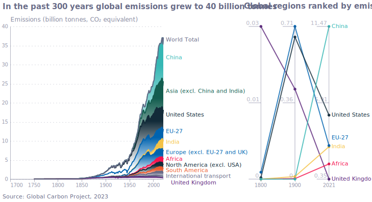

  

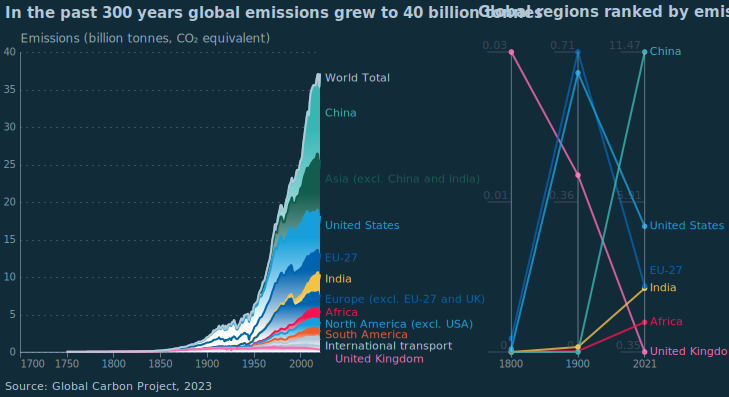

## Figure 1-5  

Data: [`csv`](data/fig1-5_moore.csv)  
GitHub: [fig1-5_moore](https://github.com/EconomicsObservatory/ECOvisualisations/tree/main/magazine/issue-3#figure-1-5)  

### Light theme  

Versions with data locally embedded into the `Vega-lite` specification file: [`png`](visualisation/fig1-5_moore_local.png) [`svg`](visualisation/fig1-5_moore.svg) [`json`](visualisation/fig1-5_moore.json)   

### Dark theme  

Versions with data locally embedded into the `Vega-lite` specification file: [`png`](visualisation/fig1-5_moore_local_dark.png) [`svg`](visualisation/fig1-5_moore_dark.svg) [`json`](visualisation/fig1-5_moore_dark.json)   

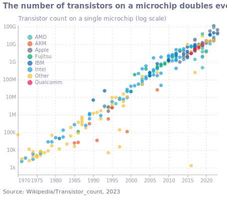

  

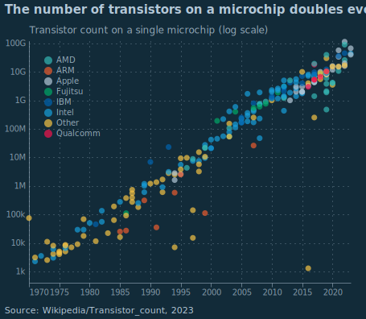

## Figure 1-6  

Data: [`csv`](data/fig1-6_hours_worked.csv)  
GitHub: [fig1-6_hours_worked](https://github.com/EconomicsObservatory/ECOvisualisations/tree/main/magazine/issue-3#figure-1-6)  

### Light theme  

Versions with data locally embedded into the `Vega-lite` specification file: [`png`](visualisation/fig1-6_hours_worked_local.png) [`svg`](visualisation/fig1-6_hours_worked.svg) [`json`](visualisation/fig1-6_hours_worked.json)   

### Dark theme  

Versions with data locally embedded into the `Vega-lite` specification file: [`png`](visualisation/fig1-6_hours_worked_local_dark.png) [`svg`](visualisation/fig1-6_hours_worked_dark.svg) [`json`](visualisation/fig1-6_hours_worked_dark.json)   

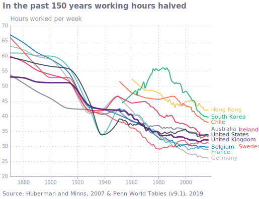

  

## Figure 7-1  

Data: [`csv`](data/fig7-1_map_historical_shipping.csv)  
GitHub: [fig7-1_map_historical_shipping](https://github.com/EconomicsObservatory/ECOvisualisations/tree/main/magazine/issue-3#figure-7-1)  

### Light theme  

Versions with data locally embedded into the `Vega-lite` specification file: [`png`](visualisation/fig7-1_map_historical_shipping_local.png) [`svg`](visualisation/fig7-1_map_historical_shipping.svg) [`json`](visualisation/fig7-1_map_historical_shipping.json)   

### Dark theme  

Versions with data locally embedded into the `Vega-lite` specification file: [`png`](visualisation/fig7-1_map_historical_shipping_local_dark.png) [`svg`](visualisation/fig7-1_map_historical_shipping_dark.svg) [`json`](visualisation/fig7-1_map_historical_shipping_dark.json)   

  

## Figure 7-2  

Data: [`csv`](data/fig7-2_map_current_shipping.csv)  
GitHub: [fig7-2_map_current_shipping](https://github.com/EconomicsObservatory/ECOvisualisations/tree/main/magazine/issue-3#figure-7-2)  

### Light theme  

Versions with data locally embedded into the `Vega-lite` specification file: [`png`](visualisation/fig7-2_map_current_shipping_local.png) [`svg`](visualisation/fig7-2_map_current_shipping.svg) [`json`](visualisation/fig7-2_map_current_shipping.json)   

### Dark theme  

Versions with data locally embedded into the `Vega-lite` specification file: [`png`](visualisation/fig7-2_map_current_shipping_local_dark.png) [`svg`](visualisation/fig7-2_map_current_shipping_dark.svg) [`json`](visualisation/fig7-2_map_current_shipping_dark.json)   

  

## Figure 13-1  

Data: [`csv`](data/fig13-1_stripes.csv)  
GitHub: [fig13-1_stripes](https://github.com/EconomicsObservatory/ECOvisualisations/tree/main/magazine/issue-3#figure-13-1)  

### Light theme  

Versions with data locally embedded into the `Vega-lite` specification file: [`png`](visualisation/fig13-1_stripes_local.png) [`svg`](visualisation/fig13-1_stripes.svg) [`json`](visualisation/fig13-1_stripes.json)   

### Dark theme  

Versions with data locally embedded into the `Vega-lite` specification file: [`png`](visualisation/fig13-1_stripes_local_dark.png) [`svg`](visualisation/fig13-1_stripes_dark.svg) [`json`](visualisation/fig13-1_stripes_dark.json)   

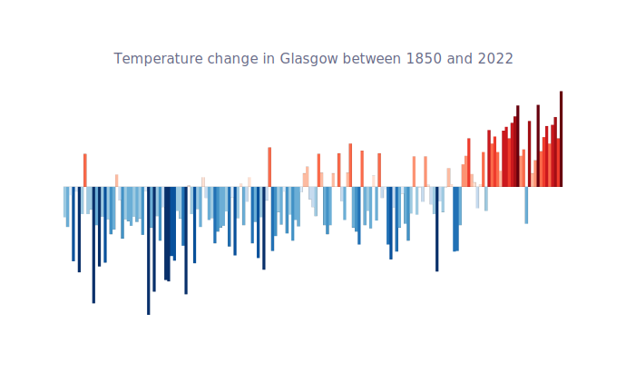

  

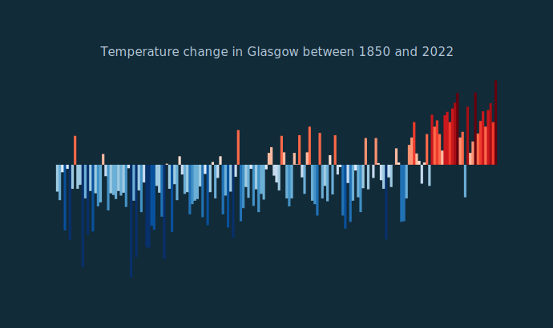

## Figure 16-1  

Data: [`csv`](data/fig16-1_goods.csv)  
GitHub: [fig16-1_goods](https://github.com/EconomicsObservatory/ECOvisualisations/tree/main/magazine/issue-3#figure-16-1)  

### Light theme  

Versions with data locally embedded into the `Vega-lite` specification file: [`png`](visualisation/fig16-1_goods_local.png) [`svg`](visualisation/fig16-1_goods.svg) [`json`](visualisation/fig16-1_goods.json)   

### Dark theme  

Versions with data locally embedded into the `Vega-lite` specification file: [`png`](visualisation/fig16-1_goods_local_dark.png) [`svg`](visualisation/fig16-1_goods_dark.svg) [`json`](visualisation/fig16-1_goods_dark.json)   

  

## Figure 16-2  

Data: [`csv`](data/fig16-2_productivity.csv)  
GitHub: [fig16-2_productivity](https://github.com/EconomicsObservatory/ECOvisualisations/tree/main/magazine/issue-3#figure-16-2)  

### Light theme  

Versions with data locally embedded into the `Vega-lite` specification file: [`png`](visualisation/fig16-2_productivity_local.png) [`svg`](visualisation/fig16-2_productivity.svg) [`json`](visualisation/fig16-2_productivity.json)   

### Dark theme  

Versions with data locally embedded into the `Vega-lite` specification file: [`png`](visualisation/fig16-2_productivity_local_dark.png) [`svg`](visualisation/fig16-2_productivity_dark.svg) [`json`](visualisation/fig16-2_productivity_dark.json)   

  

## Figure 16-3  

Data: [`csv`](data/fig16-3_rnd.csv)  
GitHub: [fig16-3_rnd](https://github.com/EconomicsObservatory/ECOvisualisations/tree/main/magazine/issue-3#figure-16-3)  

### Light theme  

Versions with data locally embedded into the `Vega-lite` specification file: [`png`](visualisation/fig16-3_rnd_local.png) [`svg`](visualisation/fig16-3_rnd.svg) [`json`](visualisation/fig16-3_rnd.json)   

### Dark theme  

Versions with data locally embedded into the `Vega-lite` specification file: [`png`](visualisation/fig16-3_rnd_local_dark.png) [`svg`](visualisation/fig16-3_rnd_dark.svg) [`json`](visualisation/fig16-3_rnd_dark.json)   

  

## Figure 20-1  

Data: [`csv`](data/fig20-1_gender-pay-gap.csv)  
GitHub: [fig20-1_gender-pay-gap](https://github.com/EconomicsObservatory/ECOvisualisations/tree/main/magazine/issue-3#figure-20-1)  

### Light theme  

Versions with data locally embedded into the `Vega-lite` specification file: [`png`](visualisation/fig20-1_gender-pay-gap_local.png) [`svg`](visualisation/fig20-1_gender-pay-gap.svg) [`json`](visualisation/fig20-1_gender-pay-gap.json)   

### Dark theme  

Versions with data locally embedded into the `Vega-lite` specification file: [`png`](visualisation/fig20-1_gender-pay-gap_local_dark.png) [`svg`](visualisation/fig20-1_gender-pay-gap_dark.svg) [`json`](visualisation/fig20-1_gender-pay-gap_dark.json)   

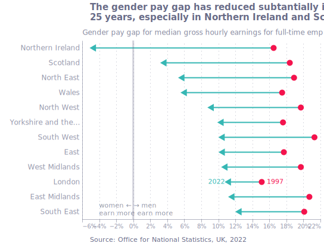

  

