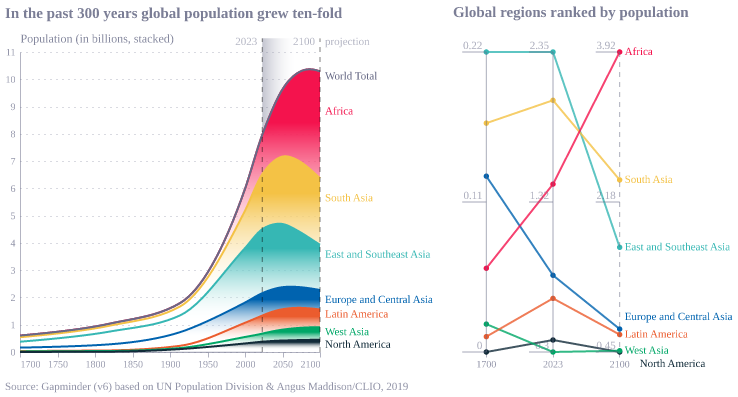
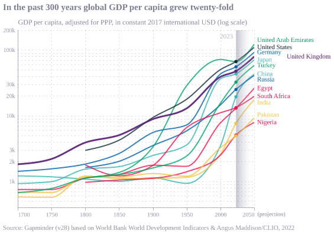
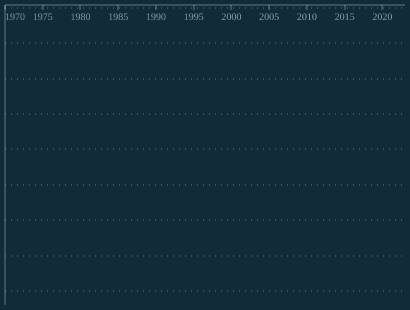
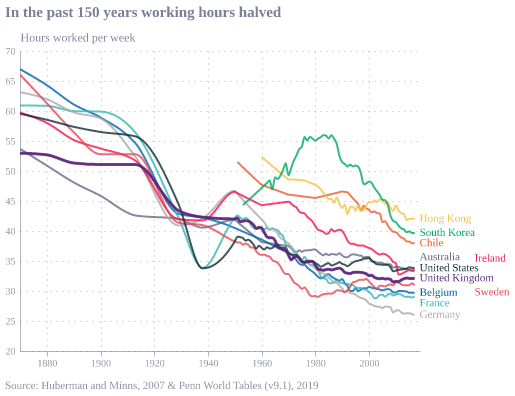

## Figure 1-1  

Data: [`csv`](data/fig1-1_pop.csv)  
GitHub: [fig1-1_pop](https://github.com/EconomicsObservatory/ECOvisualisations/tree/main/magazine/issue-3)  

### Light theme  

Versions with data locally embedded into the `Vega-lite` specification file: [`png`](visualisation/fig1-1_pop_local.png) [`svg`](visualisation/fig1-1_pop_local.svg) [`json`](visualisation/fig1-1_pop_local.json)   
 (**Default**) Versions with data loaded from `GitHub`: [`png`](visualisation/fig1-1_pop.png) [`svg`](visualisation/fig1-1_pop.svg) [`json`](visualisation/fig1-1_pop.json)  
Versions (no ECO branding) with data locally embedded into the `Vega-lite` specification file: [`png`](visualisation/fig1-1_pop_local_no_branding.png) [`svg`](visualisation/fig1-1_pop_local_no_branding.svg) [`json`](visualisation/fig1-1_pop_local_no_branding.json)   
Versions (no ECO branding) with data loaded from `GitHub`: [`png`](visualisation/fig1-1_pop_no_branding.png) [`svg`](visualisation/fig1-1_pop_no_branding.svg) [`json`](visualisation/fig1-1_pop_no_branding.json)   

### Dark theme  

Versions with data locally embedded into the `Vega-lite` specification file: [`png`](visualisation/fig1-1_pop_local_dark.png) [`svg`](visualisation/fig1-1_pop_local_dark.svg) [`json`](visualisation/fig1-1_pop_local_dark.json)   
 Versions with data loaded from `GitHub`: [`png`](visualisation/fig1-1_pop_dark.png) [`svg`](visualisation/fig1-1_pop_dark.svg) [`json`](visualisation/fig1-1_pop_dark.json)  
Versions (no ECO branding) with data locally embedded into the `Vega-lite` specification file: [`png`](visualisation/fig1-1_pop_local_no_branding_dark.png) [`svg`](visualisation/fig1-1_pop_local_no_branding_dark.svg) [`json`](visualisation/fig1-1_pop_local_no_branding_dark.json)   
Versions (no ECO branding) with data loaded from `GitHub`: [`png`](visualisation/fig1-1_pop_no_branding_dark.png) [`svg`](visualisation/fig1-1_pop_no_branding_dark.svg) [`json`](visualisation/fig1-1_pop_no_branding_dark.json)   

  

## Figure 1-2  

Data: [`csv`](data/fig1-2_life_expectancy.csv)  
GitHub: [fig1-2_life_expectancy](https://github.com/EconomicsObservatory/ECOvisualisations/tree/main/magazine/issue-3)  

### Light theme  

Versions with data locally embedded into the `Vega-lite` specification file: [`png`](visualisation/fig1-2_life_expectancy_local.png) [`svg`](visualisation/fig1-2_life_expectancy_local.svg) [`json`](visualisation/fig1-2_life_expectancy_local.json)   
 (**Default**) Versions with data loaded from `GitHub`: [`png`](visualisation/fig1-2_life_expectancy.png) [`svg`](visualisation/fig1-2_life_expectancy.svg) [`json`](visualisation/fig1-2_life_expectancy.json)  
Versions (no ECO branding) with data locally embedded into the `Vega-lite` specification file: [`png`](visualisation/fig1-2_life_expectancy_local_no_branding.png) [`svg`](visualisation/fig1-2_life_expectancy_local_no_branding.svg) [`json`](visualisation/fig1-2_life_expectancy_local_no_branding.json)   
Versions (no ECO branding) with data loaded from `GitHub`: [`png`](visualisation/fig1-2_life_expectancy_no_branding.png) [`svg`](visualisation/fig1-2_life_expectancy_no_branding.svg) [`json`](visualisation/fig1-2_life_expectancy_no_branding.json)   

### Dark theme  

Versions with data locally embedded into the `Vega-lite` specification file: [`png`](visualisation/fig1-2_life_expectancy_local_dark.png) [`svg`](visualisation/fig1-2_life_expectancy_local_dark.svg) [`json`](visualisation/fig1-2_life_expectancy_local_dark.json)   
 Versions with data loaded from `GitHub`: [`png`](visualisation/fig1-2_life_expectancy_dark.png) [`svg`](visualisation/fig1-2_life_expectancy_dark.svg) [`json`](visualisation/fig1-2_life_expectancy_dark.json)  
Versions (no ECO branding) with data locally embedded into the `Vega-lite` specification file: [`png`](visualisation/fig1-2_life_expectancy_local_no_branding_dark.png) [`svg`](visualisation/fig1-2_life_expectancy_local_no_branding_dark.svg) [`json`](visualisation/fig1-2_life_expectancy_local_no_branding_dark.json)   
Versions (no ECO branding) with data loaded from `GitHub`: [`png`](visualisation/fig1-2_life_expectancy_no_branding_dark.png) [`svg`](visualisation/fig1-2_life_expectancy_no_branding_dark.svg) [`json`](visualisation/fig1-2_life_expectancy_no_branding_dark.json)   

  

## Figure 1-3  

Data: [`csv`](data/fig1-3_gdp.csv)  
GitHub: [fig1-3_gdp](https://github.com/EconomicsObservatory/ECOvisualisations/tree/main/magazine/issue-3)  

### Light theme  

Versions with data locally embedded into the `Vega-lite` specification file: [`png`](visualisation/fig1-3_gdp_local.png) [`svg`](visualisation/fig1-3_gdp_local.svg) [`json`](visualisation/fig1-3_gdp_local.json)   
 (**Default**) Versions with data loaded from `GitHub`: [`png`](visualisation/fig1-3_gdp.png) [`svg`](visualisation/fig1-3_gdp.svg) [`json`](visualisation/fig1-3_gdp.json)  
Versions (no ECO branding) with data locally embedded into the `Vega-lite` specification file: [`png`](visualisation/fig1-3_gdp_local_no_branding.png) [`svg`](visualisation/fig1-3_gdp_local_no_branding.svg) [`json`](visualisation/fig1-3_gdp_local_no_branding.json)   
Versions (no ECO branding) with data loaded from `GitHub`: [`png`](visualisation/fig1-3_gdp_no_branding.png) [`svg`](visualisation/fig1-3_gdp_no_branding.svg) [`json`](visualisation/fig1-3_gdp_no_branding.json)   

### Dark theme  

Versions with data locally embedded into the `Vega-lite` specification file: [`png`](visualisation/fig1-3_gdp_local_dark.png) [`svg`](visualisation/fig1-3_gdp_local_dark.svg) [`json`](visualisation/fig1-3_gdp_local_dark.json)   
 Versions with data loaded from `GitHub`: [`png`](visualisation/fig1-3_gdp_dark.png) [`svg`](visualisation/fig1-3_gdp_dark.svg) [`json`](visualisation/fig1-3_gdp_dark.json)  
Versions (no ECO branding) with data locally embedded into the `Vega-lite` specification file: [`png`](visualisation/fig1-3_gdp_local_no_branding_dark.png) [`svg`](visualisation/fig1-3_gdp_local_no_branding_dark.svg) [`json`](visualisation/fig1-3_gdp_local_no_branding_dark.json)   
Versions (no ECO branding) with data loaded from `GitHub`: [`png`](visualisation/fig1-3_gdp_no_branding_dark.png) [`svg`](visualisation/fig1-3_gdp_no_branding_dark.svg) [`json`](visualisation/fig1-3_gdp_no_branding_dark.json)   

  

## Figure 1-4  

Data: [`csv`](data/fig1-4_emissions.csv)  
GitHub: [fig1-4_emissions](https://github.com/EconomicsObservatory/ECOvisualisations/tree/main/magazine/issue-3)  

### Light theme  

Versions with data locally embedded into the `Vega-lite` specification file: [`png`](visualisation/fig1-4_emissions_local.png) [`svg`](visualisation/fig1-4_emissions_local.svg) [`json`](visualisation/fig1-4_emissions_local.json)   
 (**Default**) Versions with data loaded from `GitHub`: [`png`](visualisation/fig1-4_emissions.png) [`svg`](visualisation/fig1-4_emissions.svg) [`json`](visualisation/fig1-4_emissions.json)  
Versions (no ECO branding) with data locally embedded into the `Vega-lite` specification file: [`png`](visualisation/fig1-4_emissions_local_no_branding.png) [`svg`](visualisation/fig1-4_emissions_local_no_branding.svg) [`json`](visualisation/fig1-4_emissions_local_no_branding.json)   
Versions (no ECO branding) with data loaded from `GitHub`: [`png`](visualisation/fig1-4_emissions_no_branding.png) [`svg`](visualisation/fig1-4_emissions_no_branding.svg) [`json`](visualisation/fig1-4_emissions_no_branding.json)   

### Dark theme  

Versions with data locally embedded into the `Vega-lite` specification file: [`png`](visualisation/fig1-4_emissions_local_dark.png) [`svg`](visualisation/fig1-4_emissions_local_dark.svg) [`json`](visualisation/fig1-4_emissions_local_dark.json)   
 Versions with data loaded from `GitHub`: [`png`](visualisation/fig1-4_emissions_dark.png) [`svg`](visualisation/fig1-4_emissions_dark.svg) [`json`](visualisation/fig1-4_emissions_dark.json)  
Versions (no ECO branding) with data locally embedded into the `Vega-lite` specification file: [`png`](visualisation/fig1-4_emissions_local_no_branding_dark.png) [`svg`](visualisation/fig1-4_emissions_local_no_branding_dark.svg) [`json`](visualisation/fig1-4_emissions_local_no_branding_dark.json)   
Versions (no ECO branding) with data loaded from `GitHub`: [`png`](visualisation/fig1-4_emissions_no_branding_dark.png) [`svg`](visualisation/fig1-4_emissions_no_branding_dark.svg) [`json`](visualisation/fig1-4_emissions_no_branding_dark.json)   

  

## Figure 1-5  

Data: [`csv`](data/fig1-5_moore.csv)  
GitHub: [fig1-5_moore](https://github.com/EconomicsObservatory/ECOvisualisations/tree/main/magazine/issue-3)  

### Light theme  

Versions with data locally embedded into the `Vega-lite` specification file: [`png`](visualisation/fig1-5_moore_local.png) [`svg`](visualisation/fig1-5_moore_local.svg) [`json`](visualisation/fig1-5_moore_local.json)   
 (**Default**) Versions with data loaded from `GitHub`: [`png`](visualisation/fig1-5_moore.png) [`svg`](visualisation/fig1-5_moore.svg) [`json`](visualisation/fig1-5_moore.json)  
Versions (no ECO branding) with data locally embedded into the `Vega-lite` specification file: [`png`](visualisation/fig1-5_moore_local_no_branding.png) [`svg`](visualisation/fig1-5_moore_local_no_branding.svg) [`json`](visualisation/fig1-5_moore_local_no_branding.json)   
Versions (no ECO branding) with data loaded from `GitHub`: [`png`](visualisation/fig1-5_moore_no_branding.png) [`svg`](visualisation/fig1-5_moore_no_branding.svg) [`json`](visualisation/fig1-5_moore_no_branding.json)   

### Dark theme  

Versions with data locally embedded into the `Vega-lite` specification file: [`png`](visualisation/fig1-5_moore_local_dark.png) [`svg`](visualisation/fig1-5_moore_local_dark.svg) [`json`](visualisation/fig1-5_moore_local_dark.json)   
 Versions with data loaded from `GitHub`: [`png`](visualisation/fig1-5_moore_dark.png) [`svg`](visualisation/fig1-5_moore_dark.svg) [`json`](visualisation/fig1-5_moore_dark.json)  
Versions (no ECO branding) with data locally embedded into the `Vega-lite` specification file: [`png`](visualisation/fig1-5_moore_local_no_branding_dark.png) [`svg`](visualisation/fig1-5_moore_local_no_branding_dark.svg) [`json`](visualisation/fig1-5_moore_local_no_branding_dark.json)   
Versions (no ECO branding) with data loaded from `GitHub`: [`png`](visualisation/fig1-5_moore_no_branding_dark.png) [`svg`](visualisation/fig1-5_moore_no_branding_dark.svg) [`json`](visualisation/fig1-5_moore_no_branding_dark.json)   

  

## Figure 1-6  

Data: [`csv`](data/fig1-6_hours_worked.csv)  
GitHub: [fig1-6_hours_worked](https://github.com/EconomicsObservatory/ECOvisualisations/tree/main/magazine/issue-3)  

### Light theme  

Versions with data locally embedded into the `Vega-lite` specification file: [`png`](visualisation/fig1-6_hours_worked_local.png) [`svg`](visualisation/fig1-6_hours_worked_local.svg) [`json`](visualisation/fig1-6_hours_worked_local.json)   
 (**Default**) Versions with data loaded from `GitHub`: [`png`](visualisation/fig1-6_hours_worked.png) [`svg`](visualisation/fig1-6_hours_worked.svg) [`json`](visualisation/fig1-6_hours_worked.json)  
Versions (no ECO branding) with data locally embedded into the `Vega-lite` specification file: [`png`](visualisation/fig1-6_hours_worked_local_no_branding.png) [`svg`](visualisation/fig1-6_hours_worked_local_no_branding.svg) [`json`](visualisation/fig1-6_hours_worked_local_no_branding.json)   
Versions (no ECO branding) with data loaded from `GitHub`: [`png`](visualisation/fig1-6_hours_worked_no_branding.png) [`svg`](visualisation/fig1-6_hours_worked_no_branding.svg) [`json`](visualisation/fig1-6_hours_worked_no_branding.json)   

### Dark theme  

Versions with data locally embedded into the `Vega-lite` specification file: [`png`](visualisation/fig1-6_hours_worked_local_dark.png) [`svg`](visualisation/fig1-6_hours_worked_local_dark.svg) [`json`](visualisation/fig1-6_hours_worked_local_dark.json)   
 Versions with data loaded from `GitHub`: [`png`](visualisation/fig1-6_hours_worked_dark.png) [`svg`](visualisation/fig1-6_hours_worked_dark.svg) [`json`](visualisation/fig1-6_hours_worked_dark.json)  
Versions (no ECO branding) with data locally embedded into the `Vega-lite` specification file: [`png`](visualisation/fig1-6_hours_worked_local_no_branding_dark.png) [`svg`](visualisation/fig1-6_hours_worked_local_no_branding_dark.svg) [`json`](visualisation/fig1-6_hours_worked_local_no_branding_dark.json)   
Versions (no ECO branding) with data loaded from `GitHub`: [`png`](visualisation/fig1-6_hours_worked_no_branding_dark.png) [`svg`](visualisation/fig1-6_hours_worked_no_branding_dark.svg) [`json`](visualisation/fig1-6_hours_worked_no_branding_dark.json)   

  

